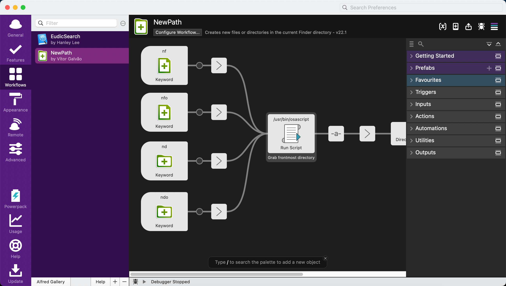

# Alfred

- [Alfred 简介](https://www.dreamxu.com/books/software/alfred/)

## 功能

### [File Search](https://www.alfredapp.com/help/features/file-search/)

**应用搜索**

**文件或目录搜索**

-   `find`
-   `open`

**文本内容搜索**

-   `in`

**标记搜索**

-   `tags`

### [Dictionary](https://www.alfredapp.com/help/features/dictionary/)

**actions**

-   `define` - `df`
-   `spell`

### [System Commands](https://www.alfredapp.com/help/features/system/)

### [Terminal / Shell](https://www.alfredapp.com/help/features/terminal/)

### [Large Type](https://www.alfredapp.com/help/features/large-type/)

## Workflows

- [Collection of Alfred workflows](https://github.com/vitorgalvao/alfred-workflows)

### NewPath

Creates new files or directories in the current Finder directory.

## Supplemental materials

-   [程序员的macOS系列：高效Alfred进阶](https://ihtcboy.com/2020/02/09/2020-02-09_%E7%A8%8B%E5%BA%8F%E5%91%98%E7%9A%84macOS%E7%B3%BB%E5%88%97%EF%BC%9A%E9%AB%98%E6%95%88Alfred%E8%BF%9B%E9%98%B6/)