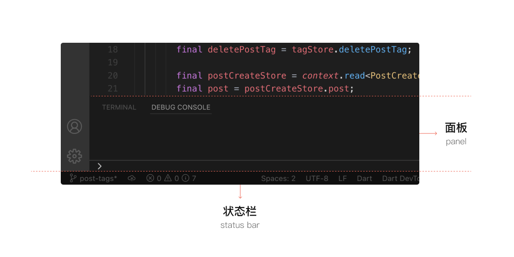
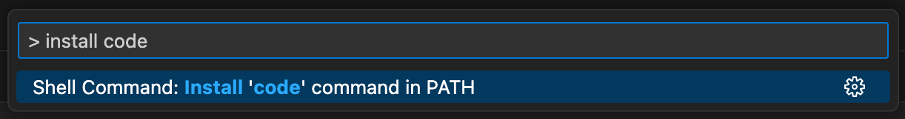

# Visual Studio Code

## VSCode

Visual Studio Code，简称 VSCode 。

VSCode 是一款代码编辑器，开源、免费、跨平台、可定制、可扩展。

-   官方网站：<https://code.visualstudio.com/>
-   下载地址：<https://code.visualstudio.com/Download>

### 安装

#### macOS

**Homebrew**

``` bash
$ brew install visual-studio-code
```




-   activity bar
-   side bar
-   editor
-   panel
-   status bar

### 使用

#### Command Palette 命令面板

**打开 Command Palette 的快捷键**

-   :simple-apple: macOS:  ++command+shift+p++
-   :simple-windows: Windows:  ++ctrl+shift+p++

#### `code` 命令



## Extensions 扩展

-   打开 the extensions manager (Extensions Tab in the activity bar ) 的快捷键： ++shift+command+x++

### 语言

1.   安装语言包，如：[Chinese (Simplified) (简体中文) Language Pack for Visual Studio Code](https://marketplace.visualstudio.com/items?itemName=MS-CEINTL.vscode-language-pack-zh-hans)
2.   使用 ++command+shift+p++ 打开 Command Palette，输入 `> display language` 后即可切换显示语言，或安装其他语言


### 主题

-   界面颜色主题
-   文件图标主题
    -   Material Icon Theme


### Prettier

-   官方网站：<https://prettier.io/>

### Natizyskunk SFTP

*   安装链接：<https://marketplace.visualstudio.com/items?itemName=Natizyskunk.sftp>


``` json title="./.vscode/sftp.json"
{
    "name": "My Server",
    "host": "localhost",
    "protocol": "sftp",
    "port": 22,
    "username": "username",
    "remotePath": "/",
    "uploadOnSave": false,
    "useTempFile": false,
    "openSsh": false
}
```

``` json title="example"
{
    "name": "CSE-CS102",
    "host": "106.14.165.94",
    "protocol": "sftp",
    "port": 22,
    "username": "YourName",
    "password": "YourPassword",
    "remotePath": "/home/YourName/ProjectName",
    "uploadOnSave": true,
    "useTempFile": true,
    "openSsh": true,
  	"downloadOnOpen": true,
  	"ignore": [
        ".vscode",
        ".git",
        ".DS_Store",
        "admin"
    ]
}
```


**SFTP Port Number**

<figure markdown>
  
  <figcaption>SFTP Port Number</figcaption>
</figure>

## 配置

## Snippets 代码片段


-   配置路径：`.vscode/*.code-snippets`

``` json
{
	Place your global snippets here. Each snippet is defined under a snippet name and has a scope, prefix, body and 
	description. Add comma separated ids of the languages where the snippet is applicable in the scope field. If scope 
	is left empty or omitted, the snippet gets applied to all languages. The prefix is what is 
	used to trigger the snippet and the body will be expanded and inserted. Possible variables are: 
	$1, $2 for tab stops, $0 for the final cursor position, and ${1:label}, ${2:another} for placeholders. 
	Placeholders with the same ids are connected.
	Example:
	"Print to console": {
		"scope": "javascript,typescript",
		"prefix": "log",
		"body": [
			"console.log('$1');",
			"$2"
		],
		"description": "Log output to console"
	}
}
```


## Study & Practice

-   [代码编辑器 @ninghao.co](https://ninghao.co/docs/tools/vscode/)
-   [VSCode Guide @cs.cmu.edu/~15122/](https://www.cs.cmu.edu/~15122/handouts/gts/vscode.pdf)

