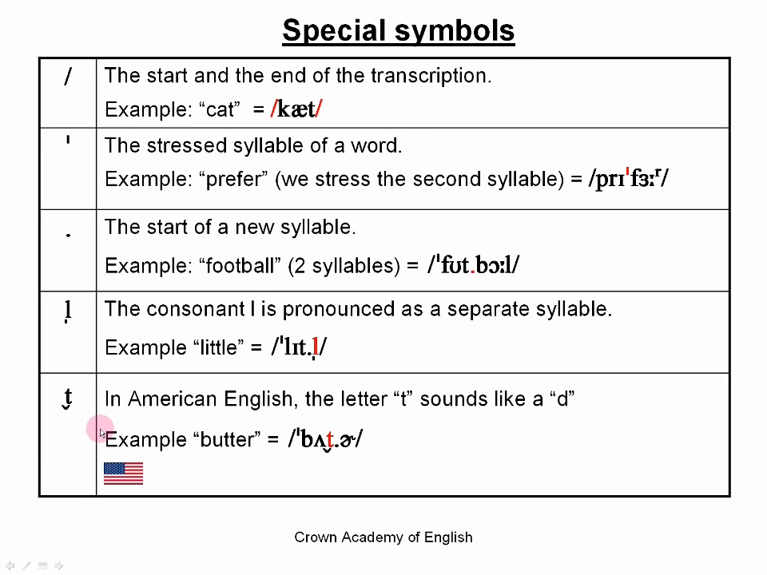
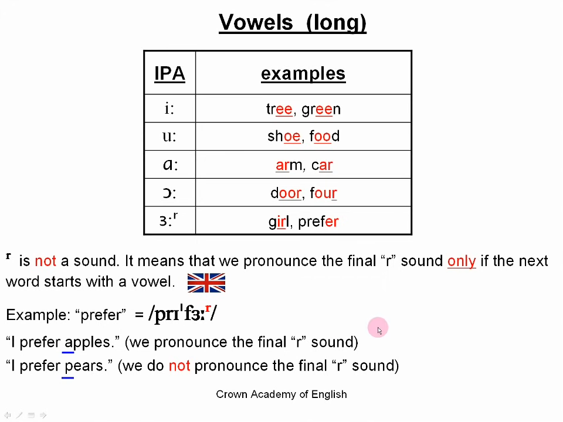
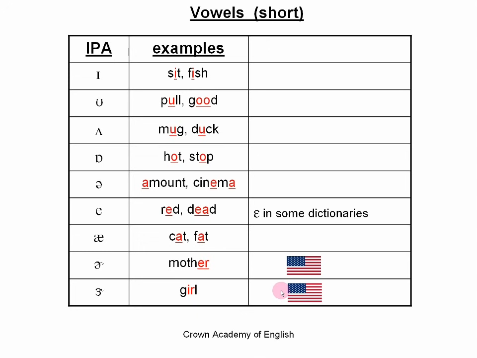
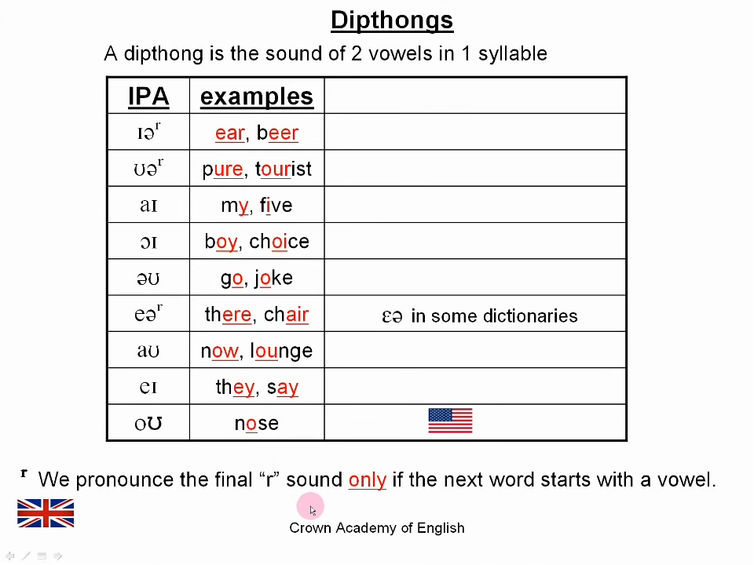
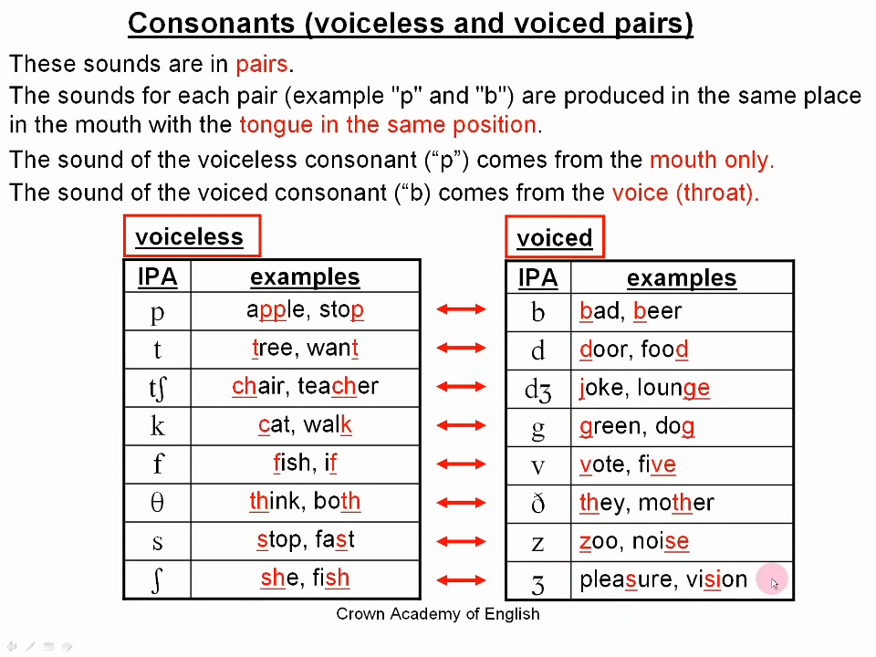
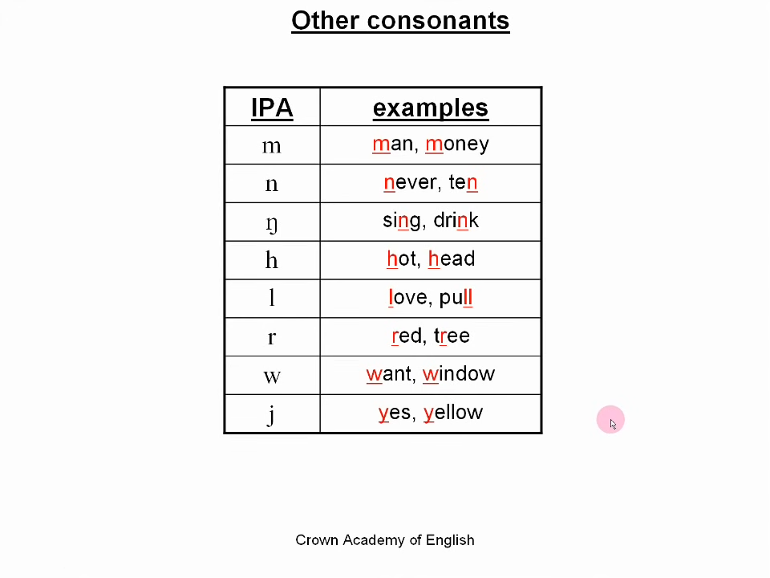

# Note 1

-   [x] [International Phonetic Alphabet (IPA) | English Pronunciation](https://www.youtube.com/watch?v=o8KppNXfx2k)  - IPA 发音教程，Youtube
    -   [x] [PDF](./assets/IPA-reference-for-English.pdf)

---

-   [Cambridge Dictionary](https://dictionary.cambridge.org/)

## Intro

**lamp**: /læm/

| Symbol | Sound(in bold) |
| ------ | -------------- |
| l      | **l**eg        |
| æ      | c**a**t        |
| m      | **m**other     |

---

|      | **c**ar | ri**c**e |
| ---- | ------- | -------- |
| `c`  | /k/     | /s/      |

## IPA Symbols

## Vowels (long)

| IPA  | examples                          |
| ---- | --------------------------------- |
| iː   | tr<u>**ee**</u>, gr<u>**ee**</u>n |
| uː   | sh<u>**oe**</u>, f<u>**oo**</u>d  |
| ɑː   | **<u>ar</u>**m, c<u>**ar**</u>    |
| ɔː   | d<u>**oor**</u>, f**ou<u>r</u>**  |
| ɜːr  | g<u>**ir**</u>l, pref**er**       |

-   $^r$ is **NOT** a sound. It means that we pronounce the final "r" sound **ONLY** if the next word starts with a vowel. 🇬🇧
    -   Example: prefer = /prɪˈfɜːr/
        -   "I prefer apples." (we pronounce the final "r" sound)
        -   "I prefer pears." (we do **NOT** pronounce the final "r" sound)

## Vowels (short)

## Dipthongs

## Consonants

