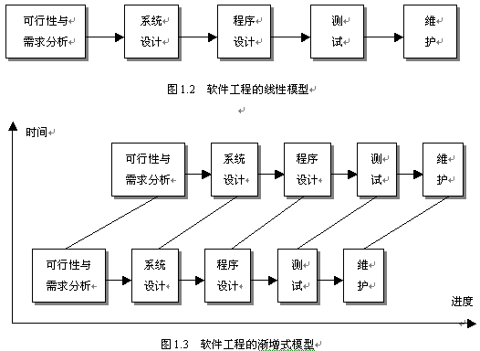
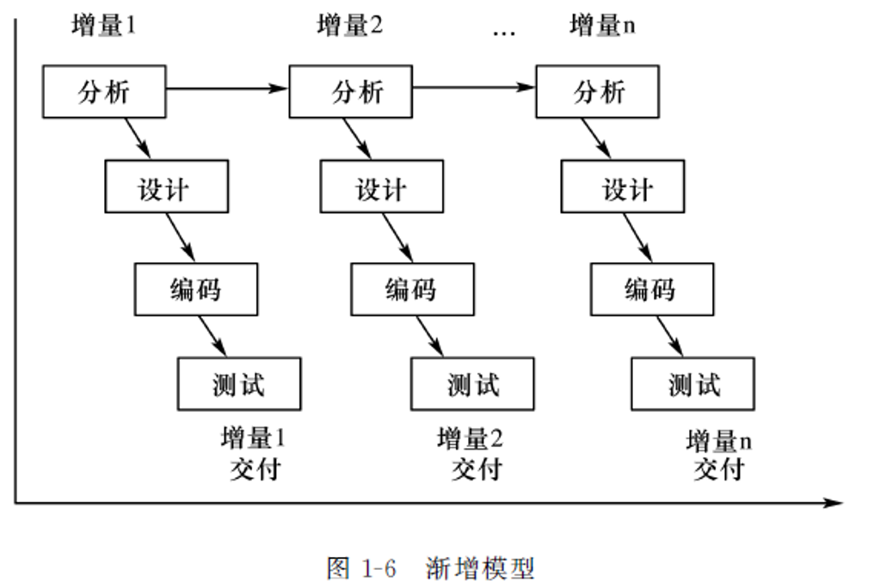
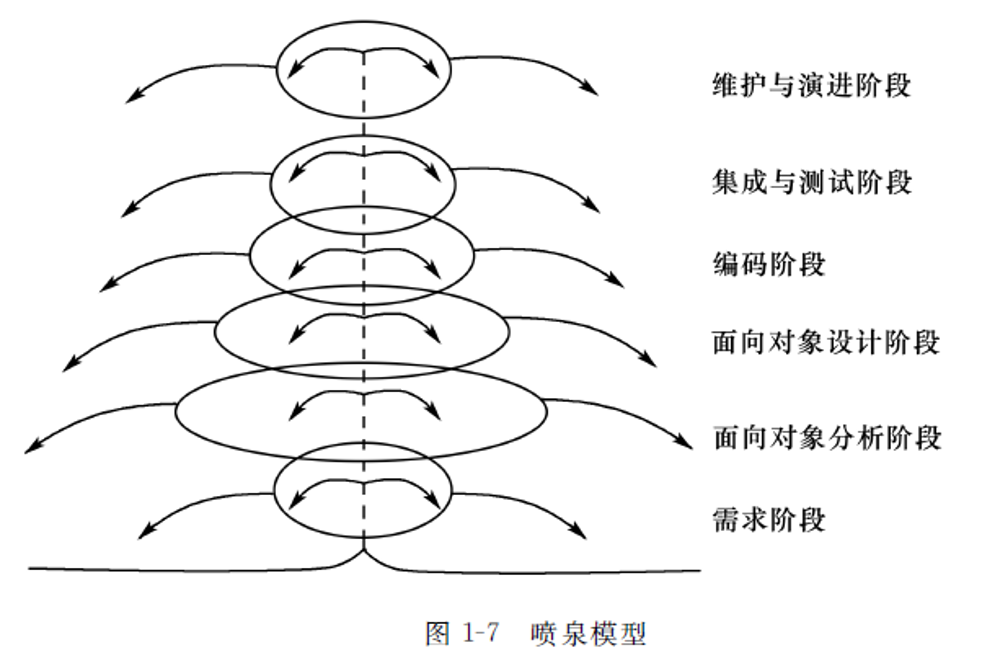

# Chapter 1 - 软件工程学概述

## 1.1 软件工程学 P5

迄今为止，人们仍然没有彻底摆脱“**软件危机**”的困扰，软件已经成为限制计算机系统发展的瓶颈。软件工程概念的提出是为了解决**软件危机**。
{ .annotate }

软件工程的诞生：1968 年北大西洋公约组织召开国际会议，提出“软件工程”概念和术语。

软件工程的目标：创造“**足够好**”的软件。

工程化的开发思想：分阶段、阶段评审。

??? question
    **软件工程的出现主要是由于({++软件危机的出现++})。** {==为什么会出现软件工程？是为了解决软件危机。软件工程 => 软件危机。==}

    A. 程序设计方法学的影响
    
    B. 其它工程科学的影响
    
    {++C. 软件危机的出现++}
    
    D. 计算机的发展

## 1.2 软件的特点

软件是一种**逻辑产品**。

软件包括：

1. 为实现设计的功能和性能要求的**指令集**；
2. 使程序能正常运行的**数据**；
3. 与程序开发、维护和使用有关的**文档**。

## 1.3 软件危机 P4

> 软件危机 是指在计算机软件开发和维护过程中遇到的一系列严重问题。这些问题主要体现在如何开发软件以满足用户日益增长的需求和如何对已有的软件进行维护。

**软件危机 是一系列严重问题，发生在计算机软件的开发、维护过程中。**

软件危机就是指在软件开发和软件维护过程中所存在的一系列**严重问题**。

软件危机会造成严重后果。

??? question
    **软件危机 是指 ( {++软件开发和维护中出现的一系列问题++} )。**

    A. 计算机病毒的出现
    
    B. 利用计算机进行经济犯罪活动
    
    {++C. 软件开发和维护中出现的一系列问题++}
    
    D. 人们过分迷恋计算机系统

产生软件危机的原因：软件具有**复杂性**、**演化性**、**服从性**、**不可见性**。

??? question
    **软件的复杂性是 ( {++固有的++} )，它引起人员通信困难、开发费用超支、开发时间超时等问题。**

    {++A. 固有的++}
    
    B. 人为的
    
    C. 可消除的
    
    D. 不可降低的

### 1.3.1 软件危机 的主要表现 P4

1. 软件不能满足用户的**需求**。
2. 软件开发**成本**严重超标，开发**周期**大大超过规定日期。
3. 软件**质量**难于保证，可靠性差。
4. 软件难于**维护**。
5. 软件开发**速度**跟不上计算机发展速度。

## 1.4 SDLC: Software Development Life Cycle 软件生存/生命周期 P6

### 1.4.1 什么是软件生命周期？

软件生命周期指一个软件**从提出开发要求开始直到不再使用(报废)为止**的整个时期。

!!! question
    **什么是软件生命周期？**
    
    SDLC：Software Development LifeCycle [软件/系统开发][生命/生存]周期
    
    **早期观点**：「软件从计划、需求开始，经历分析设计、实现、部署、维护，直到最后逐渐消亡的过程」。
    
    **现在观点**：一个软件的产生（从提出开发要求开始），直到成熟，然后报废（不再使用）为止的全部过程（整个时期）。
    
    SDLC 内有问题定义、可行性分析、总体描述、系统设计、编码、调试和测试、验收与运行、维护升级到废弃等阶段，这种{==按时间分程==}的思想方法是软件工程中的一种思想原则，即按部就班、逐步推进，每个阶段都要有定义、工作、审查、形成文档以供交流或备查，以提高软件的质量。

### 1.4.2 划分方式 1

三大时期：**计划** ⇒ **开发** ⇒ **运行**：

1. **计划时期 Analysis**
    * 问题定义
    * 可行性研究
        可行性任务的研究不包括环境政治可行性。
2. **开发时期 Design & Implementation & Testing**
    1. **需求分析**
    2. 软件/系统设计 Design
        1. 总体设计
        2. 详细设计
    3. 编码 Implementation
    4. **软件测试 Testing**
        1. 单元测试
        2. 集成测试
        3. 确认测试
        4. 系统测试
3. **运行时期 Maintenance**
    1. 运行与维护

??? question
    软件生命周期可以分为计划时期、{++开发时期++} 和 {++运行时期++}。 

??? question
    软件生命周期中开发时期包括 {++需求分析++}、系统设计、编码和 {++软件测试++}。 

### 1.4.2 划分方式 2

软件生存周期阶段划分为三个时期：软件定义、软件开发、软件使用和维护。

软件定义时期：问题定义、可行性研究、需求分析。

软件开发时期：概要设计、详细设计、编码及单元测试、综合测试。

软件维护时期：改正性维护、适应性维护、完善性维护、预防性维护。

??? question
    **软件定义期问题定义阶段涉及的人员有 ( {++系统分析员、软件开发人员、用户、使用部门负责人++} ) **
    
    A. 用户、使用部门负责人
    
    B. 软件开发人员、用户、使用部门负责人
    
    C. 系统分析员、软件开发人员
    
    {++D. 系统分析员、软件开发人员、用户、使用部门负责人++}

??? question
    **随着软硬件环境变化而修改软件的过程是 ( {++B. 适应性维护++} )。**

    A. 校正性维护
    
    {++B. 适应性维护++}
    
    C. 完善性维护
    
    D. 预防性维护

??? question
    **以下不属于软件维护困难表现的是 ( {++源程序及相关文档的错误或丢失++} )。 **
    
    A. 读懂别人的程序是困难的。
    
    B. 文档的不一致性。
    
    {++C. 源程序及相关文档的错误或丢失++}
    
    D. 软件开发和软件维护在人员和时间上的差异。

## 1.5 软件工程方法学

软件工程方法学的三要素：

1. {==**过程**==}
2. **方法**
3. **工具**

??? question
    **软件工程的基本要素包括方法、工具和( {++过程++} )。** 

    {++A. 过程++}
    
    B. 软件系统
    
    C. 硬件环境
    
    D. 人员

??? question
    **软件工程方法学的目的是：使软件生产规范化和工程化，而软件工程方法得以实施的主要保证是 (  ) **

    A. 硬件环境
    
    B. 软件开发的环境
    
    {++C. 软件开发工具和软件开发的环境++}
    
    D. 开发人员的素质
    
    *软件工程方法得以实施的主要保证是：软件开发中要有良好的软件开发工具和支撑环境，才能支持好的软件开发方法学得以应用，因此方法与工具的结合以及配套的软件和软件开发环境是软件工程方法学得以实施的重要保证。*

## 1.6 软件过程/软件开发模型 P7

### 1.6.1 瀑布模型

加入迭代过程的瀑布模型
{: .caption }

瀑布模型也称经典生命周期模型，开发阶段严格按照线性方式进行，每一个阶段具有相关的里程碑和交付产品，且需要确认和验证。

瀑布模型适用于**系统需求明确且稳定、技术成熟、工程管理较严格**的场合。如军工、航天、医疗。

??? question
    **瀑布模型把软件生命周期划分为八个阶段：问题的定义、可行性研究、软件需求分析、系统总体设计、详细设计、编码、测试和运行、维护。八个阶段又可归纳为三个大的阶段：计划阶段、开发阶段和 ( {++运行阶段++} )。**

    A. 详细计划
    
    B. 可行性分析
    
    {++C. 运行阶段++}
    
    D. 测试与排错

??? question
    **从结构化的瀑布模型看，在它的生命周期中的八个阶段中，下面的几个选项中哪个环节出错，对软件的影响最大 ( {++需求分析阶段++} )。**

    A. 详细设计阶段
    
    B. 概要设计阶段
    
    {++C. 需求分析阶段++}
    
    D. 测试和运行阶段

??? question
    **以下不是瀑布模型的特点的是 ( {++需求改变频繁++} )。**

    A. 顺序性和依赖性
    
    B. 文档驱动
    
    C. 自上而下
    
    {++D. 需求改变频繁++}

### 1.6.2 快速原型模型

快速原型是快速构建一个可运行的软件原型，用户和开发人员通过对原型的检查来决定原型是否合适和恰当。

快速原型模型适用于**客户不清楚系统的具体输入输出，开发者不确定算法效率、计算机交互的方式**等场合。

### 1.6.3 渐增/增量模型

### 1.6.4 Rational 统一过程模型

### 1.6.5 敏捷开发过程

### 1.6.6 螺旋模型 Spiral model

> 螺旋模型（Spiral model）是一种演化软件开发过程模型，它兼顾了**{==快速原型==}的迭代的特征**以及**{==瀑布模型==}的系统化与严格监控**。 螺旋模型最大的特点在于引入了其他模型不具备的**{==风险分析==}**，使软件在无法排除重大风险时有机会停止，以减小损失。 同时，在每个迭代阶段构建原型是螺旋模型用以减小风险的途径。

??? question
    **具有风险分析的软件生命周期模型是 ( {++螺旋模型++} )。**

    A. 瀑布模型
    
    B. 喷泉模型
    
    {++C. 螺旋模型++}
    
    D. 增量模型

??? question
    螺旋模型是将瀑布模型和 {++快速原型模型++} 结合起来的软件开发模型。 
    
#### 1.6.7 喷泉模型

> 喷泉模型是对象驱动的过程，对象是所有活动作用的主体，也是项目管理的基本内容。
> {==喷泉模型适用于**面对对象**==}的软件开发。

??? question
    **支持面向对象技术的软件生存周期模型是 ( {++喷泉模型++} )。**

    {++A. 喷泉模型++}
    
    B. 螺旋模型
    
    C. 增量模型
    
    D. 瀑布模型