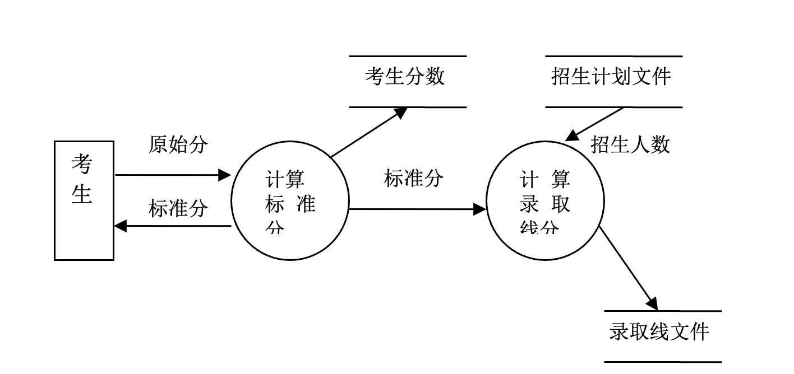

# Chapter 6 - 面对对象

## 面对对象的特点、概念 P118

1. 继承
2. 封装
3. 多态

### 继承

### 封装

??? question
    **( {++封装++}  ) 是把对象的属性和操作结合在一起，构成一个独立的对象，其内部信息对外界是隐蔽的，外界只能通过有限的接口与对象发生联系。**

    A. 多态性
    
    B. 继承
    
    {++C. 封装++}
    
    D. 消息

### 多态

??? question
    不同对象对同一操作产生不同的结果，是指面向对象的{++多态性++}。

## UML P123 应用题 - 15 分

??? question
    **面向对象的开发方法中，( {++UML语言++} )将是面向对象技术领域内占主导地位的标准建模语言。**

    A. Booch方法
    
    B. Coad方法
    
    {++C. UML语言++}
    
    D. OMT方法

??? question
    **UML 是软件开发中的一个重要工具，它主要应用于哪种软件开发方法 ( {++基于对象的面向对象的方法++} )**

    A. 基于瀑布模型的结构化方法
    
    B. 基于需求动态定义的原型化方法
    
    {++C. 基于对象的面向对象的方法++}
    
    D. 基于数据的数据流开发方法

## 面对对象分析

### 7.1 面向对象分析的三种模型 P142

1. **对象模型**
2. 动态模型
3. 功能模型

> 其中，**对象模型**是最重要、最基本、最核心的，无论解决什么问题，首先要在问题域中提取和定义出对象模型。

??? question
    **面向对象分析阶段建立的三个模型中,核心模型是 ( {++C. 对象++} )模型。**

    A. 功能
    
    B. 动态
    
    {++C. 对象++}
    
    D. 分析

### 7.2 OOA 和 OOD 的关系 P148

OOD 是对 OOA 的补充和优化

面向对象设计（Object Oriented Design，OOD）是根据面向对象分析中确定的类和对象设计软件系统。

从OOA到OOD是**一个逐步建立和扩充对象模型**的过程。

OOA是分析用户需求并建立问题域模型的过程，是解决系统“做什么”问题的；OOD则是根据OOA得到的需求模型，建立求解域模型的过程，是解决系统“怎么做”问题的。

OOA主要是模拟问题域和系统任务，而OOD则是对OOA的扩充，主要是增加各种组成部分。具体来说，OOA识别和定义类和对象。这些类和对象直接反映问题域和系统任务。而OOD识别和定义其他附加类和对象，它们反映需求的一种实现，当然，也可以交替进行这两个阶段的工作。

**从 OOA 到 OOD 是一个逐渐扩充模型的过程**，分析和设计活动是一个多次反复迭代的过程。

## 应用题（60分）

## 1. 数据流图

订货报表题目等等。。。

P42-43，15分

P62 应用题 2. 录取统分子系统

考生原始分 （流向） -> 录取统分子系统 -> 录取分（流向） + ｜录取分文件｜

---

*[OOA]: Object Oriented Analysis
*[OOD]: Object Oriented Design
*[软件危机]: 软件危机是一系列严重问题，发生在计算机软件的开发、维护过程中。
*[SDLC]: Software Development Life Cycle, 软件生存/生命周期

## 其他

### 结构图 SC P77

DFD => SC