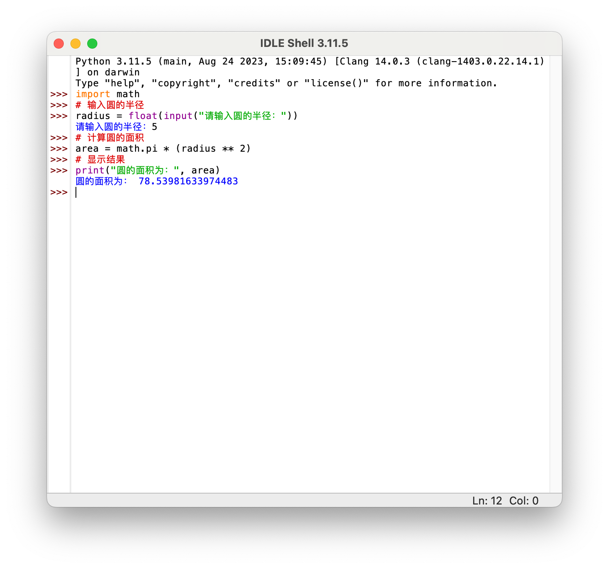
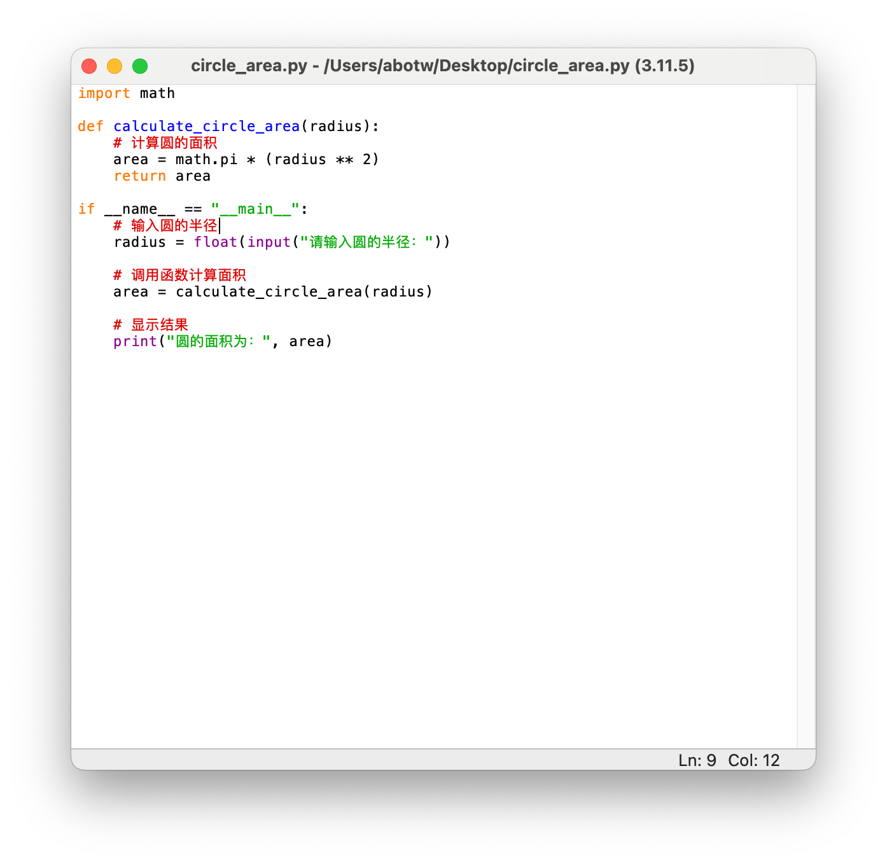
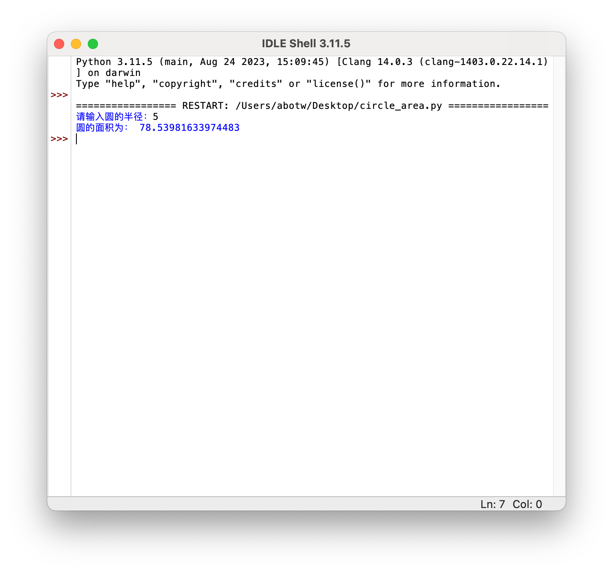
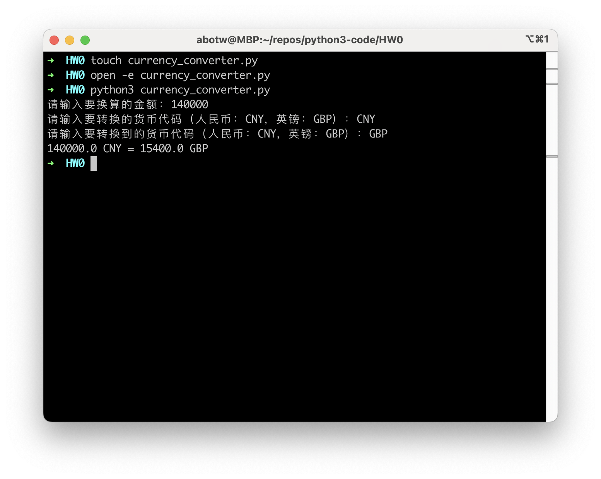

# Assign 1. 通关攻略

## 1. 计算圆的面积

=== "Python  code"

    ``` py title="with IDLE"
    import math
    
    # 输入圆的半径
    radius = float(input("请输入圆的半径："))
    
    # 计算圆的面积
    area = math.pi * (radius ** 2)
    
    # 显示结果
    print("圆的面积为：", area)
    ```
    
    ``` py title="circle_area_calculator.py"
    import math
    
    def calculate_circle_area(radius):
        # 计算圆的面积
        area = math.pi * (radius ** 2)
        return area
    
    if __name__ == "__main__":
        # 输入圆的半径
        radius = float(input("请输入圆的半径："))
    
        # 调用函数计算面积
        area = calculate_circle_area(radius)
    
        # 显示结果
        print("圆的面积为：", area)
    ```

=== "Python IDLE"

    
    
    
    
    

## 2. temperature_converter.py

编写 Python 程序实现温度的转换。

1.   将用户摄氏温度，转换为华氏温度；

2.   或将用户输入的华氏温度转换为摄氏温度。 

**输入输出格式设计：**用户输入的温度要带有标记，`f `或者 `F` 表示华氏温度，`c` 或者 `C` 表示摄氏温度。输出也要带标记。 

利用如下转换公式进行转换 $C = ( F – 32 ) / 1.8$，$F = C * 1.8 + 32$。

注意观察 Python 程序的语法元素、书写规范等。

---

-   fahrenheit /ˈfærənˌhaɪt/ 华氏温度
-   celsius /ˈsɛlsɪəs/ 摄氏温度

``` py title="temperature_converter.py"
input_str = input("Please input: ")

temprature = float(input_str[:-1])
unit = input_str[-1].lower()

if unit == 'f':
    celsius = (temprature - 32) / 1.8
    print(f"{temprature:.2f} 华氏度 = {celsius:.2f} 摄氏度")
elif unit == 'c':
    fahrenheit = temprature * 1.8 + 32
    print(f"{temprature:.2f} 摄氏度 = {fahrenheit:.2f} 华氏度")
else:
    print("INPUT ERROR!")
    exit()
```


## 3. currency_converter.py

设计开发一个货币转换或长度转换或重量转换等程序。

``` py title="currency_converter.py" linenums="1"
# 汇率数据，这里使用固定的汇率
exchange_rates = { # 字典数据结构：`exchange_rates`是一个字典，用于存储汇率数据。
    'CNY_TO_GBP': 0.11,  # 1人民币 = 0.11英镑
    'GBP_TO_CNY': 9.16,  # 1英镑 = 9.16人民币
}

# 函数定义：使用`def`关键字定义了一个函数，名为`convert_currency`，用于执行货币换算。
def convert_currency(amount, from_currency, to_currency):
    # 相同货币不需要换算
    if from_currency == to_currency: # 使用`if`语句来检查货币是否相同
        return amount

    # 确保输入的货币代码都是大写
    from_currency = from_currency.upper() # 字符串操作：使用字符串的方法来处理货币代码的大小写转换，如`upper()`。
    to_currency = to_currency.upper()

    # 检查汇率是否存在
    if f'{from_currency}_TO_{to_currency}' in exchange_rates: # 使用`if`语句来检查汇率是否存在； & 字符串格式化：使用f-string来格式化输出。
        rate = exchange_rates[f'{from_currency}_TO_{to_currency}'] # 字典访问：使用字典来查找汇率信息。
        converted_amount = amount * rate
        return converted_amount
    else:
        return "无效的货币代码或不支持的汇率转换"
      
if __name__ == "__main__":
    try: # 异常处理：使用`try`和`except`来处理用户可能输入的无效数据。
        amount = float(input("请输入要换算的金额：")) # # 用户输入：使用input()函数来获取用户输入; & 浮点数转换：使用`float()`函数将用户输入的字符串转换为浮点数。
        from_currency = input("请输入要转换的货币代码（人民币：CNY，英镑：GBP）：")
        to_currency = input("请输入要转换到的货币代码（人民币：CNY，英镑：GBP）：")

        converted_amount = convert_currency(amount, from_currency, to_currency)
        if isinstance(converted_amount, float): # 类型检查：使用`isinstance()`函数来检查变量的类型。
            print(f"{amount} {from_currency} = {converted_amount} {to_currency}")
        else:
            print(converted_amount)
    except ValueError:
        print("无效的金额输入")
```



## 4. conditional_string_printing.py

获得用户输入的一个整数，参考该整数值，打印输出"Hello World"。

**要求**：

-   如果输入值是 0，直接输出"Hello World"；
-   如果输入值大于 0，以两个字符一行方式输出"Hello World"（空格也是字符）；
-    如果输入值小于 0，以一个字符一行输出"Hello World"。

``` py title="conditional_string_printing.py" linenums="1"
str = "Hello World"

# 从用户输入获取一个整数值
num = int(input("Please enter an integer: "))

# 基于输入值，使用特定格式打印 "Hello World"
if num == 0:
    print(str)
elif num > 0:
    for i in range(0, len(str), 2):
        print(str[i:i+2])
else:
    for i in range(len(str)):
        print(str[i])    
```

