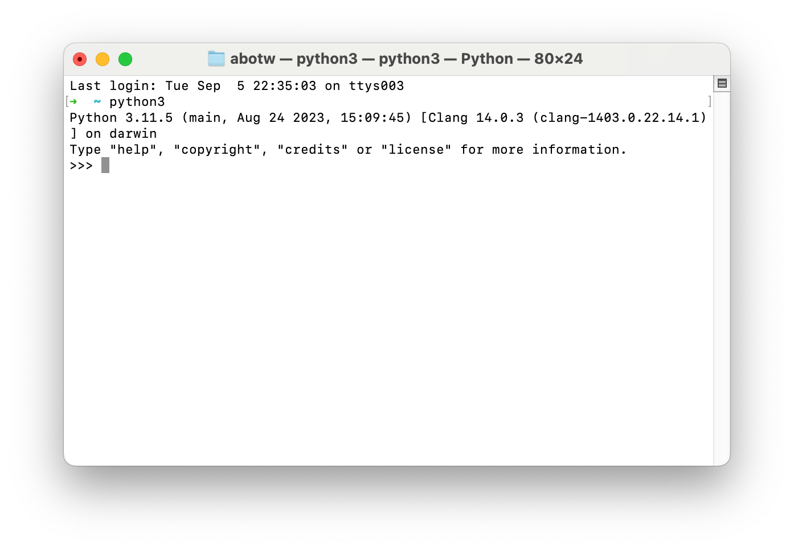

# Note 1.

## Python 简介

-   [Guido van Rossum 吉多·范罗苏姆](https://en.wikipedia.org/wiki/Guido_van_Rossum)
-   [Python (programming language)](https://en.wikipedia.org/wiki/Python_(programming_language))
-   [IPO model](https://en.wikipedia.org/wiki/IPO_model)

**1991, Python 0.9.0**

>   [Guido van Rossum](https://en.wikipedia.org/wiki/Guido_van_Rossum) began working on Python in the late 1980s as a successor to the [ABC programming language](https://en.wikipedia.org/wiki/ABC_(programming_language)) and first released it in 1991 as Python 0.9.0.

## Python 开发环境 & 开发工具软件

### macOS 开发环境配置

#### 安装

``` sh
$ brew install python3
```

#### The Python Interactive Interpreter Prompt



***How to Quit the Interpreter Prompt?***

-   windows: ++ctrl+z+enter++
-   macOS or GNU/Linux
    -   ++ctrl+d+enter++
    -   `exit()` + ++enter++

***Getting Help***

``` py
help() # Type help() for interactive help
```

**Quit**: `quit`

To quit this help utility and return to the interpreter, just type "quit".

### IDEs

#### IDLE

``` shell
$ python3 -m idlelib.idle
** IDLE can't import Tkinter.
Your Python may not be configured for Tk. **
$ python3 --version
Python 3.11.5
$ brew install python-tk
$ idle3
```

`-m`

: **Option**: module-name (详见：[https://docs.python.org/3/using/cmdline.html#cmdoption-m](https://docs.python.org/3/using/cmdline.html#cmdoption-m))

## Basic

-   comments
-   literal constants

### Numbers

`52.3E-4`

-   The `E` notation indicates powers of 10. 
-   In this case, `52.3E-4` means `52.3 * 10^-4^`.

### Strings

-   single quotes
-   double quotes
-   triple quotes

``` py
'''This is a multi-line string. This is the first line.
This is the second line.
"What's your name?," I asked.
He said "Bond, James Bond."
'''
```

### The format method

-   `format()`

``` py title="str_format.py"
age = 20
name = 'Swaroop'

print('{0} was {1} years old when he wrote this book'.format(name, age))
print('Why is {0} playing with that python?'.format(name))
```

### Escape Sequences

### Raw String

### Variable

### Identifier Naming

### Data Types

### Object

### Indentation

## Study & Practice

-   [ ] [Finding the Perfect Python Code Editor @ Real Python](https://realpython.com/courses/finding-perfect-python-code-editor/)
-   [ ] [Quick start guide @ PyCharm](https://www.jetbrains.com/help/pycharm/quick-start-guide.html)

*[IDLE]: Integrated Development and Learning Environment
