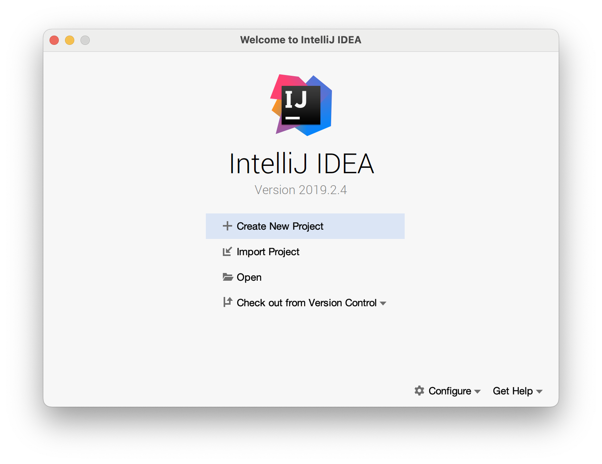
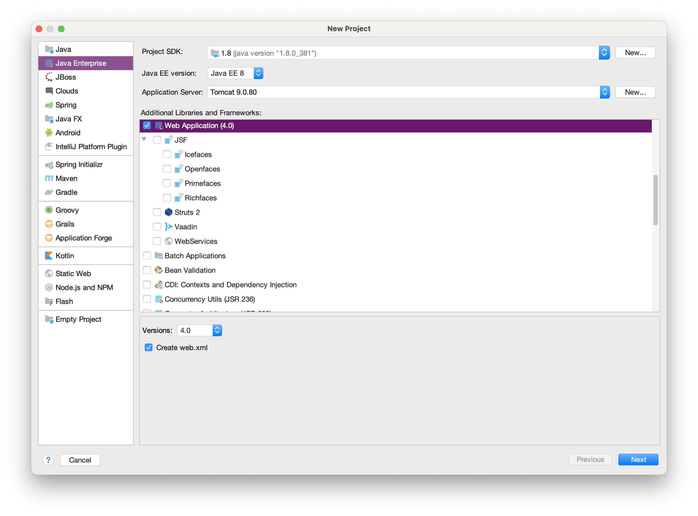
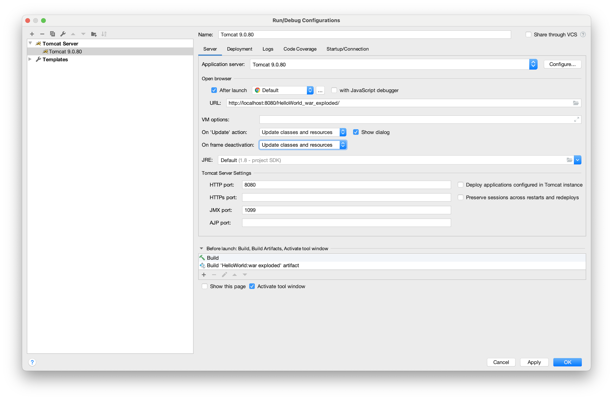

# Notes 2023-09-04

```  java
out.print("");
System.out.println("");
```

``` jsp
new cat.val
.var
```

---

``` html
<form action="doForm.jsp" method="post">
		
</form>
```


TODO：https://juejin.cn/post/7208099384072224827


---


``` jsp
request.getParameter();
request.getParameterValues();
```

``` java
String.join();
```

---

## Java

-   JDK 在 macOS 上的默认安装目录：`/Library/Java/JavaVirtualMachines`

```sh title="set_java_env.sh" linenums="1"
# Set Java Environment Variables

# Check if JAVA_HOME is not already set
if [ -z "$JAVA_HOME" ]; then
  # Replace this path with your actual Java installation path
  JAVA_HOME=/Library/Java/JavaVirtualMachines/jdk-1.8.jdk/Contents/Home

  # Add JAVA_HOME to the PATH
  export PATH=$PATH:$JAVA_HOME

  # Export JAVA_HOME so other applications can use it
  export JAVA_HOME
fi
```

`export`

: Command to mark shell variables in the current environment to be exported with any newly forked child processes.

``` sh
# To show current shell attributes:
export
# Set a new environment variable:
export VARIABLE=value
# Remove an environment variable:
export -n VARIABLE
# Append something to the PATH variable:
export PATH=$PATH:path/to/append
```

``` sh
$ java -version
java version "1.8.0_381"
Java(TM) SE Runtime Environment (build 1.8.0_381-b09)
Java HotSpot(TM) 64-Bit Server VM (build 25.381-b09, mixed mode)
```

## IntelliJ IDEA Ultimate 2019.2.4

!!! abstract

		***参见：<https://www.cnblogs.com/beast-king/p/14458378.html>***



### 1. New Java Enterprise Project



### 2. Tomcat configurations

On frame deactivation: Update class and resources



## Java Webapps Tutorial

!!! abstract
    ***参见：<https://cs.lmu.edu/~ray/notes/jw/>{:target=_blank}***

    1.   Get Tomcat
    2.   Start Tomcat
    3.   Write a trivial webapp of your own

### 1. Get Tomcat

``` sh
apache-tomcat-10.1.13 $ tree -d -L 1
.
├── bin		# Scripts, including startup and shutdown
├── conf	# Config files for tomcat (that you can tweak!)
├── lib		# Libraries used when Tomcat is running
├── logs	# Tomcat writes its logs here (empty on fresh install)
├── temp	# Tomcat writes stuff here
├── webapps		# Put your webapps under here
|     |__ ... # (each subdirectory is a webapp)
└── work	# Tomcat writes stuff here (empty on fresh install)

8 directories

apache-tomcat-10.1.13/bin $ ls
bootstrap.jar                migrate.bat
catalina-tasks.xml           migrate.sh
catalina.bat                 setclasspath.bat
catalina.sh                  setclasspath.sh
ciphers.bat                  shutdown.bat
ciphers.sh                   shutdown.sh
commons-daemon-native.tar.gz startup.bat
commons-daemon.jar           startup.sh
configtest.bat               tomcat-juli.jar
configtest.sh                tomcat-native.tar.gz
daemon.sh                    tool-wrapper.bat
digest.bat                   tool-wrapper.sh
digest.sh                    version.bat
makebase.bat                 version.sh
makebase.sh

apache-tomcat-10.1.13/bin $ ./version.sh
Using CATALINA_BASE:   /Users/username/Environment/apache-tomcat-10.1.13
Using CATALINA_HOME:   /Users/username/Environment/apache-tomcat-10.1.13
Using CATALINA_TMPDIR: /Users/username/Environment/apache-tomcat-10.1.13/temp
Using JRE_HOME:        /Library/Java/JavaVirtualMachines/jdk-17.0.2.jdk/Contents/Home
Using CLASSPATH:       /Users/username/Environment/apache-tomcat-10.1.13/bin/bootstrap.jar:/Users/username/Environment/apache-tomcat-10.1.13/bin/tomcat-juli.jar
Using CATALINA_OPTS:
Server version: Apache Tomcat/10.1.13
Server built:   Aug 23 2023 21:34:59 UTC
Server number:  10.1.13.0
OS Name:        Mac OS X
OS Version:     14.0
Architecture:   aarch64
JVM Version:    17.0.2+8-LTS-86
JVM Vendor:     Oracle Corporation
```

### 2. Start Tomcat

``` sh
# Unix or macOS
$ $CATALINA_HOME/bin/startup.sh
# Windows
%CATALINA_HOME%\bin\startup.bat
```

``` sh
apache-tomcat-10.1.13/webapps $ tree -d -L 1
$CATALINA_HOME
├── ROOT
├── docs
├── examples
├── host-manager
└── manager

6 directories
```

### 3. Write a trivial webapp of your own

*[GBK]: Chinese Internal Code Specification 汉字内码扩展规范

*[servlet]: 