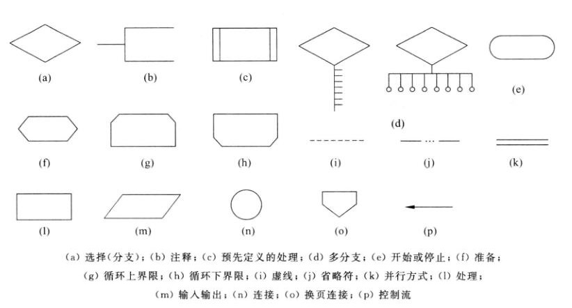
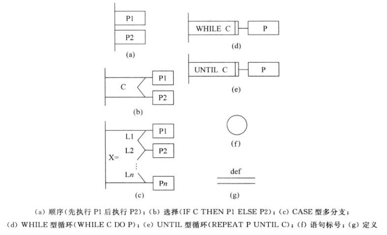
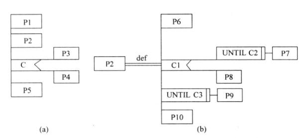
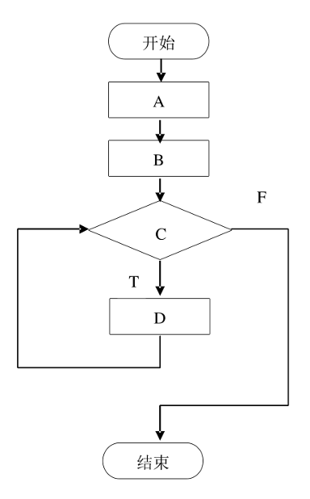

# Chapter 4 - 详细设计

## 4.0 复习内容

1. 了解结构程序设计的要求
2. 掌握详细设计工具（程序流程图、盒图、PAD图）

## 4.1 结构程序设计的要求

**结构程序的经典定义**：{==一个程序的代码块仅仅通过**顺序**、**选择**和**循环**这三种基本控制结构连接==}，并且{==每个代码块只有**一个入口**和**一个出口**==}。 

**结构程序设计更全面的定义**：结构程序设计是尽可能少用 `go to` 语句的程序设计方法。最好仅在检测出错误时才使用 `go to` 语句，而且应该总是使用前向 `go to` 语句。 

理论上只用上述 3 种基本控制结构就可以实现任何**单入口单出口**的程序，但为了实际使用方便，还允许使用 `do-until` 和 `do-case` 两种控制结构。 

**经典的结构程序设计**：只允许使用顺序、`if_then_else` 型分支和 `do_while` 型循环这三种基本控制结构。

**扩展的结构程序设计**：除上述三种基本控制结构外，还允许使用 `do-until` 型循环结构和 `do-case` 型多分支结构。 

**修正的结构程序设计**：再允许使用 `break(leave)` 结构。

??? question
    **程序的三种基本结构是 ( {++顺序、选择和循环++} )**

    A. 过程、子过程和子程序
    
    B. 递归、堆栈和队列
    
    {++C. 顺序、选择和循环++}
    
    D. 调用、返回和转移

??? question
    **程序的三种基本控制结构的共同特点是 ( {++单入口，单出口++} )**

    A. 只能用来描述简单程序
    
    B. 不能嵌套使用
    
    {++C. 单入口，单出口++}
    
    D. 仅用于自动控制系统
    
    *程序的特点就是从一个入口开始，最终以一个出口结束，其间可以用顺序、选择和循环方式对程序的流向进行控制。三种结构可以写出非常复杂的程序，而且选择和循环都可以嵌套设计。*

## 4.2 详细设计工具 P93

* 详细设计工具
    * 图形
        * 系统/程序流程图
        * N-S (盒图)
        * PAD 图
    * 表格：判定表、判定树
    * 语言：PDL 语言 (过程设计语言)

### 4.2.1 PFD: Process Flow Diagram, 程序/系统流程图 P22

??? question
    **程序流程图 (PDF) 中的箭头代表的是 ( {++控制流++} )**

    A. 数据流
    
    {++B. 控制流++}
    
    C. 调用关系
    
    D. 组成关系

### 4.2.2 盒图 (N-S 图)

### 4.2.3 PAD 图

#### PAD 图例

#### PAD 图

??? question
    **某算法设计程序流程图如下所示，试将该图转换为 PAD 图**
    

     

---

## 题目

### 1. 概要设计和详细设计的关系

??? question
    **软件设计一般分为概要设计和详细设计，它们之间的关系是 ( {++全局和局部++} )。**

    {++A. 全局和局部++}
    
    B. 抽象和具体
    
    C. 总体和层次
    
    D. 功能和结构

### 2. 详细设计的任务

!!! abstract
    详细设计的任务：

    1. 算法设计
    2. 数据结构设计
    3. 确定模块接口细节
    4. 测试用例设计
    5. 数据库物理设计
    6. 数据代码设计
    7. 其他设计
    8. 文档编写与评审

??? question
    **软件详细设计的主要任务是确定每个模块的 ( {++算法和使用的数据结构++} )。**

    {++A. 算法和使用的数据结构++}
    
    B. 外部接口
    
    C. 功能
    
    D. 编程
    
    软件详细设计的任务，是为软件结构图中的每一个模块确定实现算法和局部数据结构，用某种选定的表达工具表示算法和数据结构的细节。
    
    本题考查结构化设计方法的详细设计。从软件开发的工程化观点来看，在使用程序设计语言编制程序以前，需要对所采用算法的逻辑关系进行分析，设计出全部必要的过程细节，并给予清晰的表达。详细设计的任务就是要确定各个模块的实现算法，并精确地表达这些算法。
    
    详细设计阶段就是为每个模块完成的功能进行具体的描述，要把功能描述转变为精确的、结构化的过程描述。详细设计的主要任务就是实现函数功能，而函数主要由算法和数据结构组成。
    
### 详细设计和测试的关系

!!! question
    **单元测试的测试用例主要根据 ( ) 的结果来设计。**
    
    A. 需求分析
    
    B. 源程序
    
    C. 概要设计
    
    D. 详细设计

### 应用题 P113

