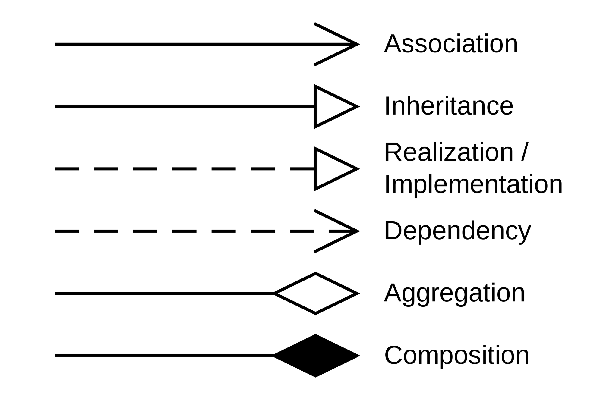
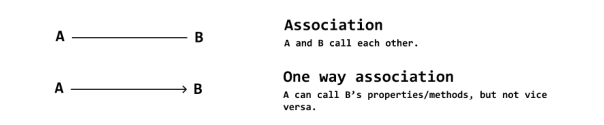
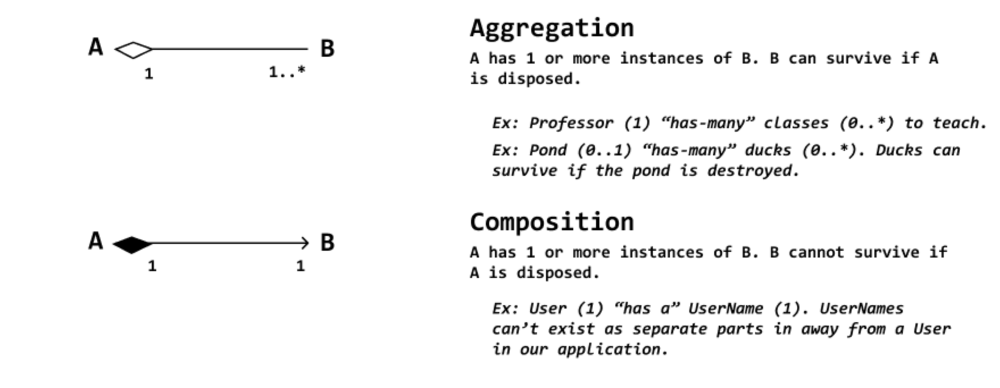
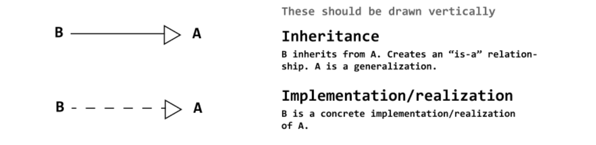

# Relationship 关系

## 学习要求

1. 理解表达关系的术语。

1. 关联
   1. 一般关联
   2. 聚集
   3. 组合
2. 依赖
3. 泛化
4. 实现

## UML Relations Notation

| Meaning                      | Notation  |
| ---------------------------- | --------- |
| Association                  | `————>`   |
| Generalization / Inheritance | `————|>`  |
| Realization / Implementation | `----|>`  |
| Dependency                   | `---->`   |
| Aggregation                  | `————<>`  |
| Composition                  | `————<+>` |

## 关联 Association

* Association

  * Association Name 关联名

  * Direction
  * Role Name 关联端名，角色名

* 二元关联
* N 元关联

* 单向关联 One way association
  A can call B's properties/methods, but not vice versa.
* 双向关联
  * 无箭头实线
  * 双箭头实线

### 多重性 Multiplicity

### 聚合 Aggregation

* **特点**：表达一种“整体/部分”的关系
* **举例**：
  * `部分：Departments * ————<> 整体：Company 1`

### 组合 Composition

* **特点**：
  * “整体/部分”的关系中多了一层很强的“属于”关系。
  * 具有相同生存期、生命周期的聚合。
* **举例**：脑死亡 = 人死亡

## 泛化 Generalization / Inheritance, is-a-kind-of

* **多态**：实现子类操作的同时，覆盖了父类的同一操作。
  * **要求**：子类操作、父类操作具有相同的名字、参数。
  * **抽象**：`子类 ————|> 超类/父类`
    * **举例**：`Bird ————|> Animal`
* **类**
  * 根类/基类：没有父类且至少有一个子类的类
  * 叶子类：没有子类的类
* **继承**
  * 单继承：一个类只有一个父类
  * 多继承：一个类有多个父类

## 细化/实现 Realization / Implementation

* **表示**：`----|>`

### 用况和实现用况的协作之间的关系

`管理订单 ----|> [下订单]`

### 类 实现自 接口

一个类实现了某个接口的功能。

`Class:商品 ----|> <<interface>> 销售`

雁 Realization / Implementation From 飞翔

`Class:WildGoose ----|> <<interface>> Fly`

## 依赖 Dependency

* **定义**：依赖是一种使用关系，用于描述一个事物使用另一事物的信息和服务。
  * 使用依赖来描述一个类使用另一个类的操作，一个类的实现必须依赖于另一个类的协助。
  * 人必须依赖于空气才能生存。
    * `人 ----> 空气`

* **表示**：一条有向虚线。

*[基本关系构造块]: 用来表达类目之间的关系。

