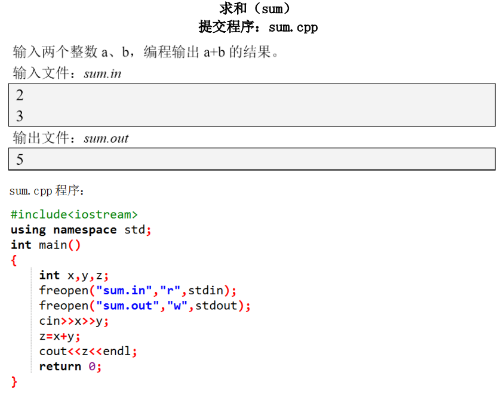

# freopen

Reassign a stream.

## References

- [**freopen.c File Reference**](http://www.ethernut.de/api/freopen_8c.html)

## Functions

| 返回值   | 函数原型                                                     |
| -------- | ------------------------------------------------------------ |
| `FILE *` | `freopen (CONST char *name, CONST char *mode, FILE *stream)` |

## Usage

### EX 1



### EX 2

```title="input.txt"
3
12 23
23 34
34 45
```

``` cpp title="main.cpp" linenums="1"
#include <iostream>
using namespace std;

int main()
{
    freopen("input.txt", "r", stdin);
    freopen("output.txt", "w", stdout);
    int lines;
    cin >> lines;
    for (int i = 0; i < lines; i ++ )
    {
        int a, b;
        cin >> a >> b;
        cout << a + b << '\n';
    }
    return 0;
}

```

```title="output.txt"
35
57
79
```

