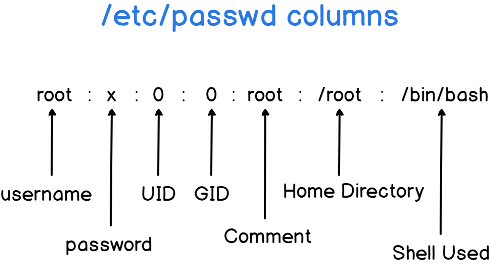

# User Management

## 用户相关的配置/日志文件

**为了记录而非操作**：管理员和特权用户可以使用这些文件进行用户和组的管理和配置。然而，在更高级的配置和管理任务中，通常会使用专门的工具和命令来进行操作，而不是直接修改这些文件。

### 配置文件作用

1. 存储用户和组的**身份验证信息**；
2. 管理**访问权限**；
3. 管理**用户与组之间的关系**。

### 配置文件内容

1. `/etc/passwd`：该文件包含了系统上所有**用户账户的基本信息**。每一行代表一个用户账户，字段之间使用冒号（:）进行分隔。通常，每行包含用户名、加密的密码（现在一般是存放在`/etc/shadow`中）、用户ID（UID）、组ID（GID）、用户描述信息、主目录和默认Shell等。
2. `/etc/shadow`：该文件保存了系统上用户账户的加密密码信息。为了安全考虑，Linux系统通常将密码哈希值存储在`/etc/shadow`中，而不是`/etc/passwd`。只有具有特定权限的用户（如root）才能访问该文件。`/etc/shadow`文件的格式也是用冒号分隔的字段，包含了用户名、加密密码、密码上次修改时间、密码过期时间等。
3. `/etc/group`：该文件记录了系统上所有**用户组的信息**。每一行代表一个用户组，字段之间也是用冒号进行分隔。一般来说，每行包含组名、组密码（现在一般为空，密码信息存放在`/etc/gshadow`中）、组ID（GID）以及该组所包含的用户列表。
4. `/etc/gshadow`：该文件类似于`/etc/shadow`，但是用于存储用户组的加密密码信息。这个文件的访问权限也比较严格，只有特定的用户（如root）能够读取和修改它。一般情况下，普通用户不需要直接操作该文件。

### `/etc/passwd`

<figure markdown>
  { width="300" }
  <figcaption>/etc/passwd columns</figcaption>
</figure>

<figure markdown>
  .jpg)
  <figcaption>a-visual-display-of-etcpasswd-andetcshadow</figcaption>
</figure>

- User accounts are defined in the `/etc/passwd` file
  - the `/etc/passwd` file defines the user (login) name, uid, gid, the account’s real name, home directory, and login shell.

``` 
root:x:0:0:root:/root:/bin/bash
me:x:1000:1000:Matt L.:/home/me:/bin/bash
# Contents:
<user_login_name>:<password>:<uid>:<gid>:<account_real_name>:<path_to_home_directory>:<path_to_login_shell/used_shell>
```

* superuser (uid 0)

### `/etc/shadow`

<figure markdown>
  .jpg)
  <figcaption></figcaption>
</figure>

- `/etc/shadow` which holds information about the user’s password

### `/etc/sudoers`

- /etc/sudoers: a configuration file which used by an administrator to set up and to define specific commands that particular users are permitted to execute under an assumed identity

/etc/sudoers 是一个系统文件，用于配置 sudo（Superuser Do）命令的权限。sudo 是一种在类Unix操作系统中允许普通用户以超级用户（root）权限执行特定命令的工具。

在 Linux 和其他类Unix操作系统中，sudoers 文件定义了哪些用户、用户组或主机可以通过 sudo 命令来执行特定的命令。只有在 sudoers 文件中明确授权的用户才能使用 sudo 运行以 root 用户权限运行的命令。

/etc/sudoers 文件通常需要使用特殊的编辑器（如 visudo）进行修改，以确保修改过程正确无误。这是因为该文件的格式和语法很重要，错误的修改可能导致系统安全问题或导致 sudo 命令无法正常工作。

sudoers 文件的每一行描述了一个特定的授权规则。每行由以下几个部分组成：

用户或用户组：指定谁可以使用 sudo 命令。可以使用用户名或用户组名。
主机：指定在哪些主机上可以使用 sudo 命令。可以是主机名、IP地址或特殊的通配符。
3.=(等号)：表示精确匹配，后面的命令规则必须完全匹配。
(ALL)：表示适用于所有主机。
命令：指定允许执行的命令。可以是单个命令、命令别名、以及使用通配符描述的命令模式。
sudoers 文件中的注释以 # 开头，可以用来提供说明或禁用特定的授权规则。

重要提示：对于 /etc/sudoers 文件的修改需要小心操作，以免造成系统安全风险。如果不确定如何修改该文件，请咨询系统管理员或查阅相关文档。

### `/etc/group`

<figure markdown>
  { width="300" }
  <figcaption>/etc/group columns</figcaption>
</figure>

- groups are defined in the `/etc/group` file.

## 用户和用户组

- 系统安全
- 权限控制/管理
- 访问控制

### 用户（User）

- 用户是系统中的个体，可以是**实际的人**或者**一个服务账号**。
- 每个用户都有一个唯一的用户名和一个对应的用户ID（UID）。
- 用户可以登录系统，并拥有一定的**权限和访问控制**。

- Linux is a multi-user and multi-task system.
- In Linux, there are two types of users:
    1. **system users**
    2. **regular users**
- `**/etc/passwd**` file contains information about all users.
- **superuser**: like windows system administrator, there is a **superuser** or root **user** in Linux.
    - Superuser has the rights to access anything on its own server. Must be kept secure.
    - None-root users with “superuser rights” has the `**sudo**` privileges for system administration tasks.

### 用户组（Group）

- 用户组是一组用户的集合，可以将多个用户归属到同一个组中。
    - Groups are collections of zero or more users.
    - A user belongs to **a default group** and can also be a member of any of the other groups on a server.
    - `**/etc/group**` file contains all the information about groups and their members
- 每个用户组都有一个唯一的组名和一个对应的组ID（GID）。
- 通过将用户组分配给用户，可以方便地管理用户的**权限和访问控制**。

### 主用户组

- 主用户组是一个用户默认所属的用户组，用于管理用户的**基本权限**和**资源访问**。

- 每个用户只能有一个主用户组（Primary Group），也称为初始用户组（Initial Group）：在 Linux 系统中，每个用户只能被指定为一个主用户组。这个主用户组通常**在用户创建时自动分配**，基于系统的默认设置。

- 主用户组的组ID（GID）与用户ID（UID）相关联：每个用户组都有一个唯一的组ID（GID），与用户ID（UID）相对应。主用户组的组ID通常与用户的UID相同。

- 用户可以属于其他附加用户组：除了主用户组之外，用户还可以属于多个附加用户组（Supplementary Groups）。附加用户组为用户提供了对其他共享资源的访问权限。

主用户组可以更改：管理员可以使用特定的命令（例如usermod）来更改用户的主用户组。

### 用户和用户组之间的关系

- 用户和用户组是管理和组织**系统访问和权限**的重要概念。

以下是用户和用户组之间的关系和作用：

- 用户可以属于一个或多个用户组。这样，当用户组的权限发生变化时，属于该组的用户也会受到相应的影响。
- 用户组可以在文件和目录的权限设置中使用。通过为文件和目录分配所属用户组和相应的权限，可以方便地控制多个用户对文件的访问权限。
- 用户组可以用来共享文件和目录。通过将文件或目录的所属用户组设置为共享用户组，组内的用户可以共享对文件的访问权限。
- 用户组也可以用于管理进程的权限。通过为进程分配用户组，可以限制它们的权限和访问资源的范围。

## 常用命令

### 用户的详细信息

#### `id`

??? id
    ``` sh linenums="1" hl_lines="4 7-8 10-11 16-17"
    $ curl cheat.sh/
    id
    # id
    # Display current user and group identity.
    # More information: <https://www.gnu.org/software/coreutils/id>.

    # Display current user's ID (UID), group ID (GID) and groups to which they belong:
    id
    
    # Display the current user identity as a number:
    id -u
    
    # Display the current group identity as a number:
    id -g
    
    # Display an arbitrary user's ID (UID), group ID (GID) and groups to which they belong:
    id username
    
    $
    ```

#### `finger`

??? finger
    ``` sh linenums="1" hl_lines="15 21-22 24-25 27-28"
    $ curl cheat.sh/
    finger
    cheat.sheets:finger 
    # Produces a multi-line format displaying all of the information described for
    # the -s option as well as the user's home directory, home phone number, login
    # shell, mail status, and the contents of the files “.plan”, “.project”,
    # “.pgpkey” and “.forward” from the user's home directory.
    finger -s username

    # weather report in console (for Nuremberg in this case)
    finger nuremberg@graph.no
    
    tldr:finger 
    # finger
    # User information lookup program.
    # More information: <https://manned.org/finger>.
    
    # Display information about currently logged in users:
    finger
    
    # Display information about a specific user:
    finger username
    
    # Display the user's login name, real name, terminal name, and other information:
    finger -s
    
    # Produce multiline output format displaying same information as `-s` as well as user's home directory, home phone number, login shell, mail status, etc.:
    finger -l
    
    # Prevent matching against user's names and only use login names:
    finger -m
    
    $
    ```

#### `passwd` - to change a user's password


??? passwd
    ``` sh linenums="1" hl_lines="4 7-8 10-11"
    $ curl cheat.sh/
    passwd
    # passwd
    # Passwd is a tool used to change a user's password.
    # More information: <https://manned.org/passwd>.

    # Change the password of the current user interactively:
    passwd
    
    # Change the password of a specific user:
    passwd username
    
    # Get the current status of the user:
    passwd -S # Only root can do that.
    
    # Make the password of the account blank (it will set the named account passwordless):
    passwd -d
    
    $
    ```

### 超级用户

#### `su` - To switch shell to another user account

??? su
    ``` sh linenums="1" hl_lines="12-14 16-17 19-20 22-23"
    $ curl cheat.sh/
    su
    cheat:su 
    # To switch to another user account:
    su <user>

    tldr:su 
    # su
    # Switch shell to another user.
    # More information: <https://manned.org/su>.
    
    # Switch to superuser (requires the root password):
    su
    su -
    
    # Switch to a given user (requires the user's password):
    su username
    
    # Switch to a given user and simulate a full login shell:
    su - username # (1)
    
    # Execute a command as another user:
    su - username -c "command"
    
    $
    
    # Return to the previous shell
    exit
    ```
    
    1. the `-l` may be abbreviated `-`. If the `-l` option is included, the resulting shell session is a login shell for the specified user. This means that the user’s environment is loaded and the working directory is changed to the user’s home directory.

#### `sudo` - 权利让渡

* `su` v.s. `sudo`
  
    One important difference between `su` and `sudo` is that `sudo` **does not start a new shell, nor does it load another user’s environment**.

??? sudo
    ``` sh linenums="1" hl_lines="5 38-39 75 99-100"
    $ curl cheat.sh/
    sudo
    cheat.sheets:sudo 
    # sudo
    # Execute a command as another user

    # List contents of directory to which the user otherwise wouldn't have access.
    sudo ls /usr/local/scrt
    
    # Edit the given file as the `www` user. This is a great example of why sudo(8)
    # is or was often, and more accurately, referred to as "substitute user do".
    sudo -u www vi /var/www/index.html
    
    # Shut down (halt) the machine when 10 minutes have passed. The quoted text is
    # messaged to the terminal of all applicable users, known as a 'wall message'.
    sudo shutdown -h +10 "Cya soon!"
    # Note, that the above is the old method. On machines with SystemD, the below
    # command can instead be used.
    sudo systemctl reboot
    
    # In Bash, `!!` (bang, bang) is an event designator, as described in bash(1), -
    # and is used to refer to the previous command, synonymous for `!-1`.
    #
    # In this case, the user is able to prefix the entirety of the previous command
    # with `sudo`, being most useful when forgetting that `root` access is needed.
    sudo !!
    
    # For use in the vim(1) modal text editor, this command allows the user to save
    # the currently opened file as the `root` user, despite having not previously
    # opened it with such privileges.
    :w !sudo tee > /dev/null %
    
    # Reset the current user's sudo(8) timestamp, resulting in the user having to
    # once again enter his or her password when next using sudo(8). Use of this
    # flag does not actually require `root` privileges.
    sudo -K
    
    # List the current user's sudo(8) privileges.
    sudo -l
    
    # Add a line to a file using sudo(8). This is especially useful when making
    # changes to a kernel parameter file, like the `/proc/sys/vm/swappiness` file.
    echo "foo bar" | sudo tee -a /path/to/some/file
    
    # Begin a shell session as the system's `root` user.
    sudo -i
    
    # To disable password for sudo(8) for the `superuser` user, add the below line
    # to the `/etc/sudoers` file, preferably by using the visudo(8) executable.
    #
    #     superuser ALL=(ALL) NOPASSWD: ALL
    #
    # This would result in the aforementioned user not needing to enter in a
    # password when using `sudo`, otherwise he or she would be required to do so.
    #
    # Likewise, the below can be entered if this is wished for an entire group, -
    # which in this case would be the `special` group.
    #
    #     %special ALL=(ALL) NOPASSWD: ALL
    #
    # Do note that neither of these configurations are at all recommended and can
    # pose a massive security risk.
    
    # Run `CMD` as the `root` user, but maintain the current user's environment. In
    # systems like Ubuntu, this is assumed, but systems like Debian would require
    # that the user make use of this flag when wanting to keep their environment.
    sudo -E [CMD]
    
    cheat:sudo 
    # Preserve user environment when running command
    sudo -E <cmd>
    
    tldr:sudo 
    # sudo
    # Executes a single command as the superuser or another user.
    # More information: <https://www.sudo.ws/sudo.html>.
    
    # Run a command as the superuser:
    sudo less /var/log/syslog
    
    # Edit a file as the superuser with your default editor:
    sudo --edit /etc/fstab
    
    # Run a command as another user and/or group:
    sudo --user=user --group=group id -a
    
    # Repeat the last command prefixed with `sudo` (only in `bash`, `zsh`, etc.):
    sudo !!
    
    # Launch the default shell with superuser privileges and run login-specific files (`.profile`, `.bash_profile`, etc.):
    sudo --login
    
    # Launch the default shell with superuser privileges without changing the environment:
    sudo --shell
    
    # Launch the default shell as the specified user, loading the user's environment and reading login-specific files (`.profile`, `.bash_profile`, etc.):
    sudo --login --user=user
    
    # List the allowed (and forbidden) commands for the invoking user:
    sudo --list
    
    $
    ```

### 用户的增删改查

- 批量管理用户的解决方案：shell 编程

#### `useradd`

??? useradd
    ``` sh linenums="1" hl_lines="1"
    $ curl cheat.sh/
    useradd
    # useradd
    # Create a new user.
    # See also: `users`, `userdel`, `usermod`.
    # More information: <https://manned.org/useradd>.

    # Create a new standard user:
    sudo useradd username # Automatically creates a home directory and sets the default group, shell, etc.
    
    # Create a new user with the specified user id:
    sudo useradd --uid id username
    
    # Create a new user with the specified shell:
    sudo useradd --shell path/to/shell username
    
    # Create a new user belonging to additional groups (mind the lack of whitespace):
    sudo useradd --groups group1,group2,... username
    
    # Create a new user with the default home directory:
    sudo useradd --create-home username
    
    # Create a new user with the home directory filled by template directory files:
    sudo useradd --skel path/to/template_directory --create-home username
    
    # Create a new system user without the home directory:
    sudo useradd --system username
    
    $
    ```

#### `userdel`

??? userdel
    ``` sh linenums="1" hl_lines="4 8-9"
    $ curl cheat.sh/
    userdel
    # userdel
    # Remove a user account or remove a user from a group.
    # See also: `users`, `useradd`, `usermod`.
    # More information: <https://manned.org/userdel>.

    # Remove a user:
    sudo userdel username
    
    # Remove a user in other root directory:
    sudo userdel --root path/to/other/root username
    
    # Remove a user along with the home directory and mail spool:
    sudo userdel --remove username
    
    $
    ```

#### `usermod`

??? usermod
    ``` sh linenums="1" hl_lines="1"
    $ curl cheat.sh/
    usermod
    cheat:usermod 
    # Add user to sudo group
    sudo usermod -aG sudo <username>

    tldr:usermod 
    # usermod
    # Modifies a user account.
    # See also: `users`, `useradd`, `userdel`.
    # More information: <https://manned.org/usermod>.
    
    # Change a username:
    sudo usermod --login new_username username
    
    # Change a user id:
    sudo usermod --uid id username
    
    # Change a user shell:
    sudo usermod --shell path/to/shell username
    
    # Add a user to supplementary groups (mind the lack of whitespace):
    sudo usermod --append --groups group1,group2,... username
    
    # Change a user home directory:
    sudo usermod --move-home --home path/to/new_home username
    
    $
    
    # 锁定账号
    usermod -L <username> # 1
    
    # 解除对 user 的锁定
    usermod -U <username> # 2
    ```
    
    1. -L: 锁定用户密码，使密码无效。
    2. -U: 解除密码锁定。

### `adduser`

??? adduser
    ``` sh linenums="1" hl_lines="1"
    $ curl cheat.sh/
    adduser
    # adduser
    # User addition utility.
    # More information: <https://manpages.debian.org/latest/adduser/adduser.html>.

    # Create a new user with a default home directory and prompt the user to set a password:
    adduser username
    
    # Create a new user without a home directory:
    adduser --no-create-home username
    
    # Create a new user with a home directory at the specified path:
    adduser --home path/to/home username
    
    # Create a new user with the specified shell set as the login shell:
    adduser --shell path/to/shell username
    
    # Create a new user belonging to the specified group:
    adduser --ingroup group username
    
    $
    ```

### 用户组的增删改查

#### `groupadd`

??? note
    ``` sh linenums="1" hl_lines="1"
    $ curl cheat.sh/
    groupadd
    # groupadd
    # Add user groups to the system.
    # See also: `groups`, `groupdel`, `groupmod`.
    # More information: <https://manned.org/groupadd>.

    # Create a new group:
    sudo groupadd group_name
    
    # Create a new system group:
    sudo groupadd --system group_name
    
    # Create a new group with the specific groupid:
    sudo groupadd --gid id group_name
    
    $
    ```

#### `groupdel`

??? groupdel
    ``` sh linenums="1" hl_lines="1"
    $ curl cheat.sh/
    groupdel
    # groupdel
    # Delete existing user groups from the system.
    # See also: `groups`, `groupadd`, `groupmod`.
    # More information: <https://manned.org/groupdel>.

    # Delete an existing group:
    sudo groupdel group_name
    
    $
    ```

#### `groupmod`

??? groupmod
    ``` sh linenums="1" hl_lines="1"
    $ curl cheat.sh/
    groupmod
    # groupmod
    # Modify existing user groups in the system.
    # See also: `groups`, `groupadd`, `groupdel`.
    # More information: <https://manned.org/groupmod>.

    # Change the group name:
    sudo groupmod --new-name new_group group_name
    
    # Change the group id:
    sudo groupmod --gid new_id group_name
    
    $
    ```

