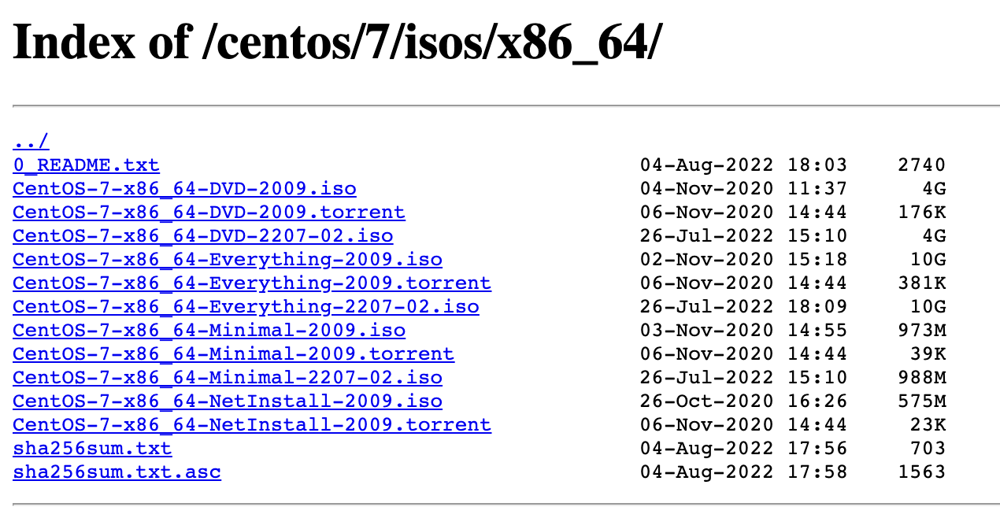
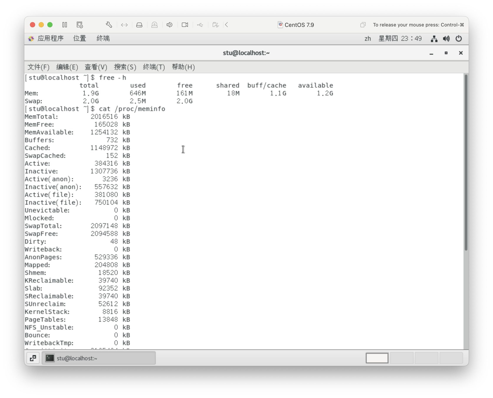
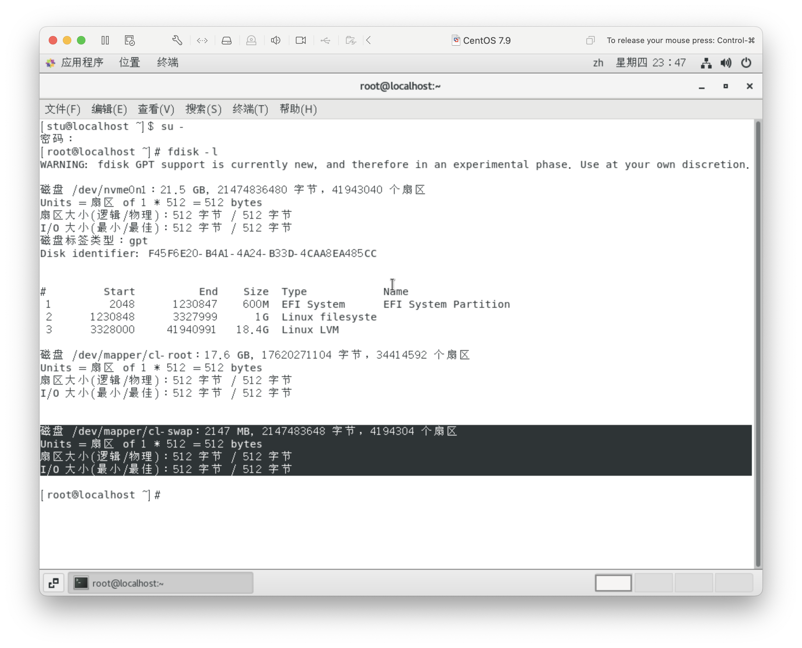
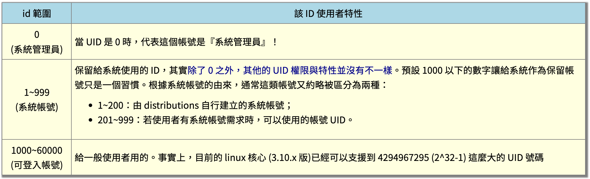
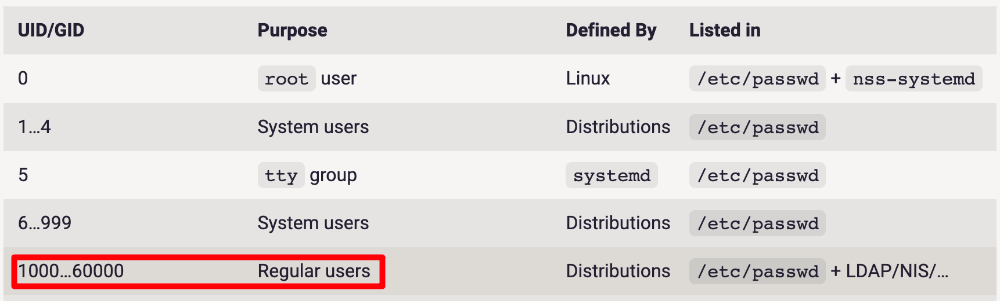
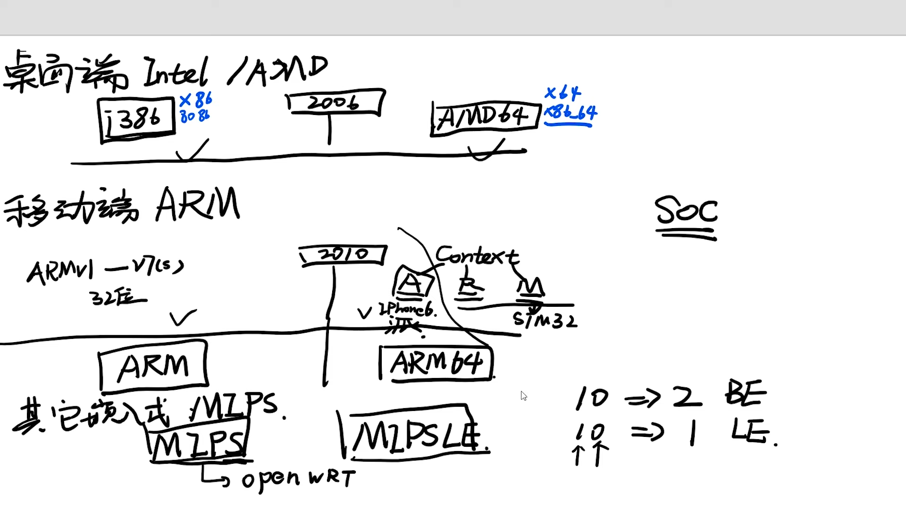

# Linux 期末复习题目 - 2306

## Points

### Linux Distributions Linux 发行版本

> 目前 Linux 主流发行版本有：
>
> 1. RHEL: Red Hat Enterprise Linux
> 2. CentOS
> 3. Fedora
> 4. Ubuntu
> 5. SUSE
> 6. Debian

### CentOS 镜像

* [CentOS官方镜像站点](https://mirrors.kernel.org/centos/7/isos/x86_64/)

* [the status of CentOS mirrors](https://mirror-status.centos.org/#cn)


* DVD - 标准
* NetInstall - 网络
* Everything - 完整



### 交换分区

- [ ] [Linux 创建交换（swap）分区](http://kuanghy.github.io/2019/11/16/linux-swap)
- [x] [14.2. 推荐的系统 swap 空间](https://access.redhat.com/documentation/zh-cn/red_hat_enterprise_linux/8/html/managing_storage_devices/recommended-system-swap-space_getting-started-with-swap)
- [ ] [陈涛•Linux存储管理（06）交换分区](https://www.youtube.com/watch?v=gds9nT7OxsI)
- [ ] [Swap - ArchWiki](https://wiki.archlinuxcn.org/zh-hans/Swap)

**表 14.1. 推荐的 swap 空间**

| 系统中的 RAM 量 | 推荐的 swap 空间            | 如果允许休眠则推荐使用 swap 空间 |
| :-------------- | :-------------------------- | :------------------------------- |
| ⩽ 2 GB          | RAM 量的 2 倍 ( 0 - 4GB )   | RAM 量的 3 倍                    |
| > 2 GB – 8 GB   | 与 RAM 量相等 ( 2GB - 8GB ) | RAM 量的 2 倍                    |
| > 8 GB – 64 GB  | 至少 4 GB ( >= 4GB)         | RAM 量的 1.5 倍                  |
| > 64 GB         | 至少 4 GB (>= 4GB)          | 不推荐休眠                       |

- 一般建议将交换分区 (swap) 设置为物理内存 (RAM) 的两倍，交换分区的大小一般为：2GB - 4GB

``` sh
# 确认物理内存的大小
$ free -h
$ cat /proc/meminfo
```





### UID

- [ ] [Users, Groups, UIDs and GIDs on systemd Systems](https://systemd.io/UIDS-GIDS/)
- [ ] [第 10 堂課：使用者管理與 ACL 權限設定](https://linux.vbird.org/linux_basic_train/centos7/unit10.php)

#### ROOT 用户的 UID

``` sh
$ id -u root
0
```





### 验证系统日志文件存放目录

``` sh
$ ls -l /var | grep log
$ ls /var/log
```

### 文件系统

### 系统架构

* [x] [【系统构架科普】x86 x64你知道多少，还有别的什么构架吗？](https://www.youtube.com/watch?v=hRyjHj7KZaM)



### 进程

- [x] [【linux】信号-进程间通信的方式signal](https://www.youtube.com/watch?v=PqyC6IsS0TU)

### RPM 软件包

- [ ] [RPM: RedHat Package Manager](https://docs.rockylinux.org/books/admin_guide/13-softwares/#rpm-redhat-package-manager)


* `Python-2.7.5-69.el7_5.x86_64`

  * Python - Package Name

  * 2.7.5-69 - Release Version

  * el7_5 - Distribution

  * x86_64 - Architecture

**常见的系统架构代码**

| 架构           | 适用机器                   |
| -------------- | -------------------------- |
| i386/i586/i686 | 适用于 32 位兼容架构的系统 |
| x86_64         | 适用于 64 位兼容架构的系统 |
| ppc            | 适用于 PowerPC 系统        |
| noarch         | 适用于所有架构             |

## 题目

3. 下面哪个选项不是Linux操作系统的特点？ A. 开源 B. 多用户 C. 图形界面 D. 命令行界面

22. 以下哪项文件系统均可用在Linux和Windows操作系统中？
    1. FAT32、NTFS（Windows）和ext4（Linux）文件系统均可用在Linux和Windows操作系统中。


29. 以下哪个选项正确描述了父进程和子进程的关系？
