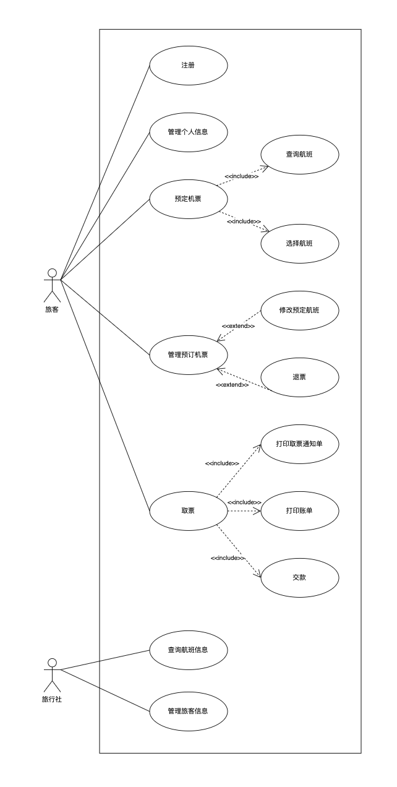
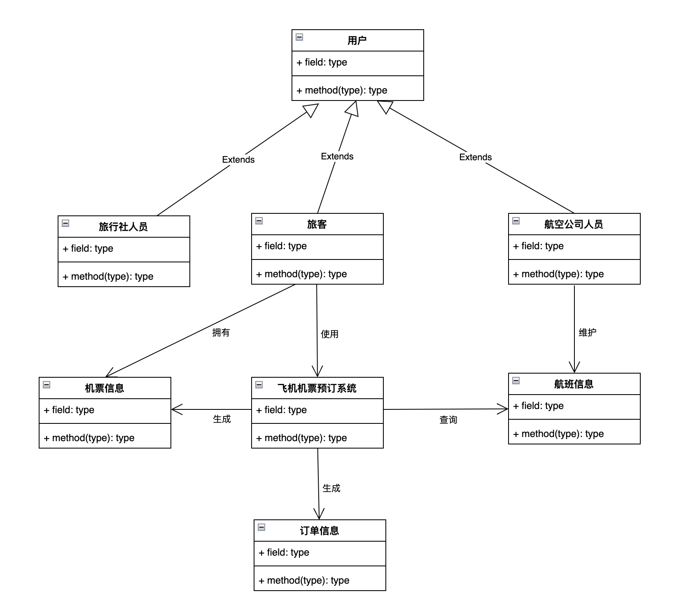
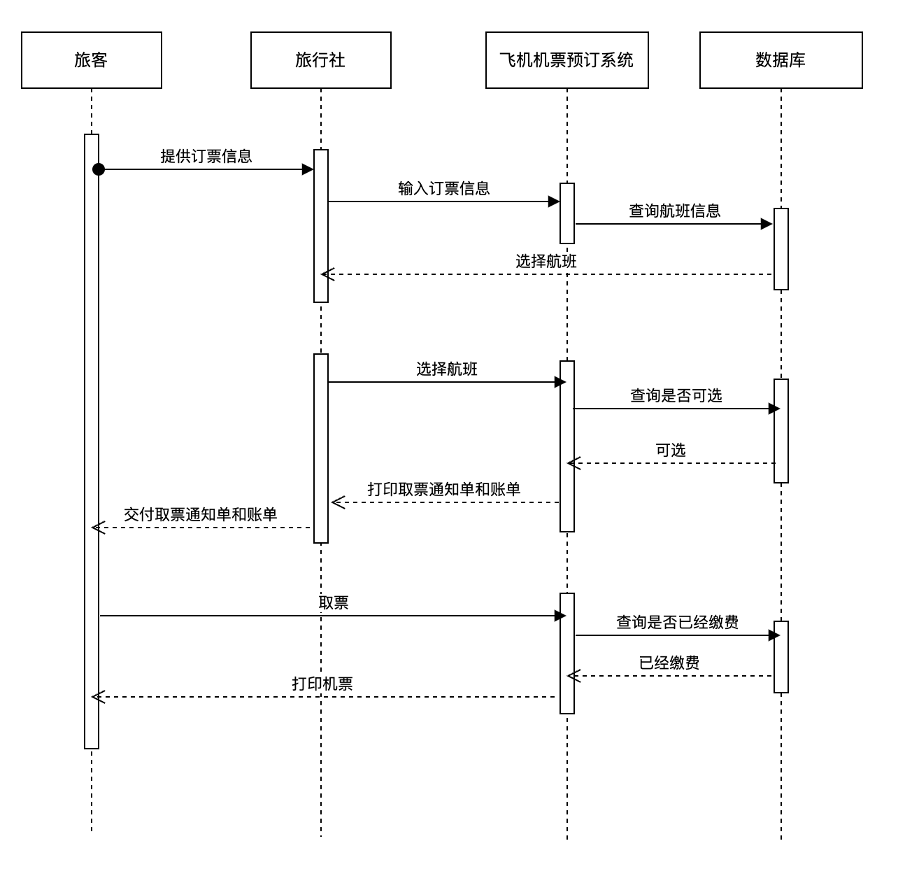
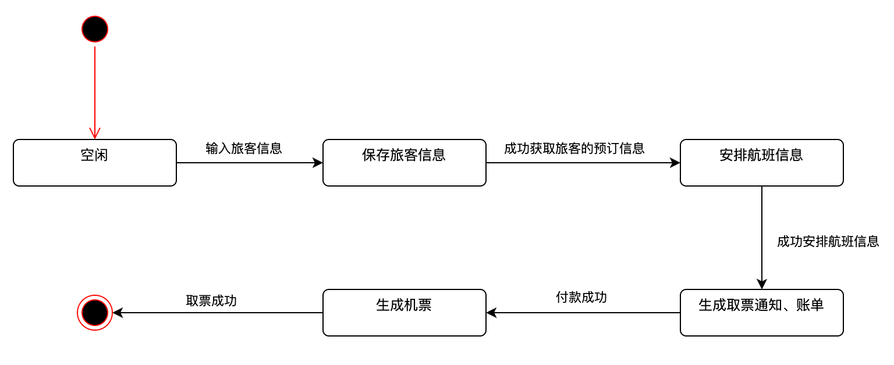

# HW - 面向对象分析与设计

## 1. 飞机机票预订系统

面向对象方法分析研究机票预订系统，试建立它的对象模型（类图)、动态模型（时序图+状态图）和功能模型（用例图）

飞机机票预订系统的功能是：

1. 旅行社把预订机票的**旅客**信息 (姓名、年龄、单位、身份证号码、旅行时间、目的地等)输入**机票预订系统**。
2. 系统查询**航班信息**之后为旅客安排航班，打印出取票通知单(附有应交的账款)。
3. 旅客在飞机起飞的前一天凭取票通知单交款取票，系统检验无误，输出机票给旅客。

### 1.1 功能模型 (用例图)

### 1.2 对象模型 (类图)

### 1.3 动态模型

#### 1.3.1 时序图

#### 1.3.2 状态图

## 2、内容回顾

某**运动会管理系统**的功能为：

1. 接受来自**运动员**的**报名单**，记录报名信息，打印**运动员号码单**发送给**运动员**、打印**参赛人员报表**发送给**裁判**。
2. 接受来自**裁判**的**比赛项目及成绩**，产生**比赛结果报表**发送给**发布台**。

用分层数据流图表示上述系统的功能。(画出顶层、0层数据流图)

### 顶层数据流图

### 0层数据流图

