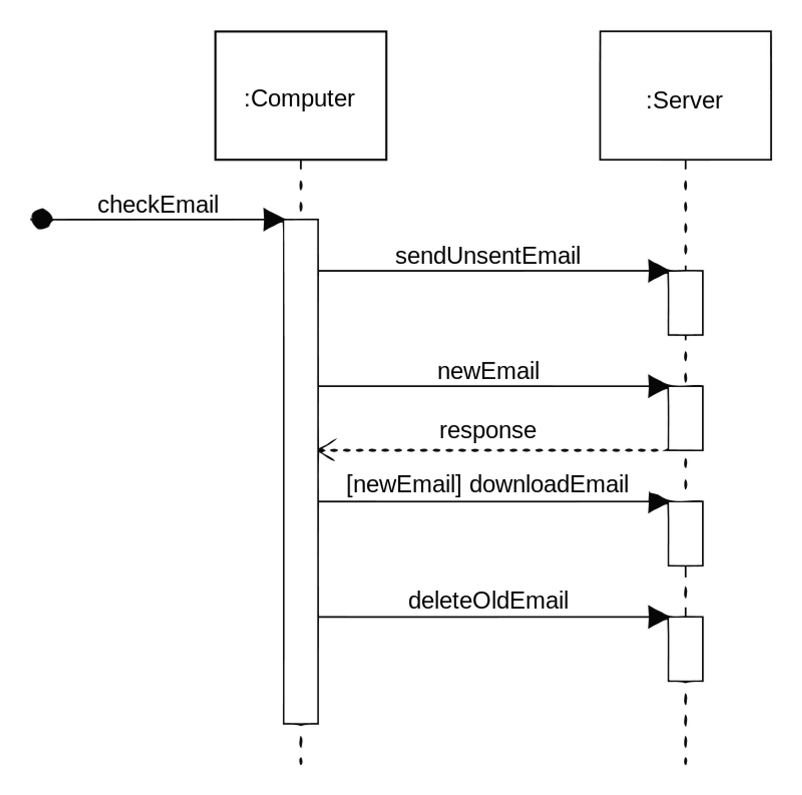
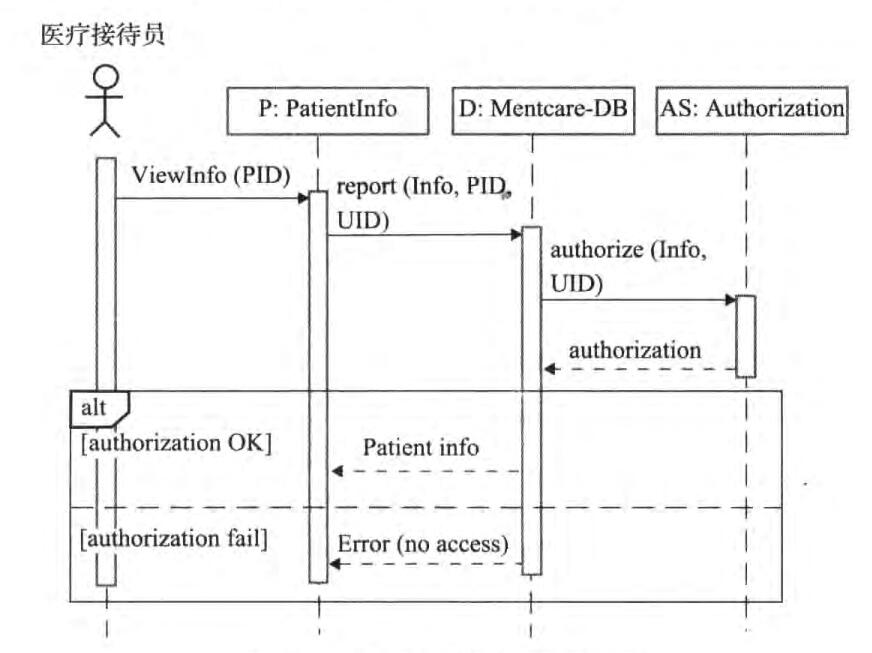
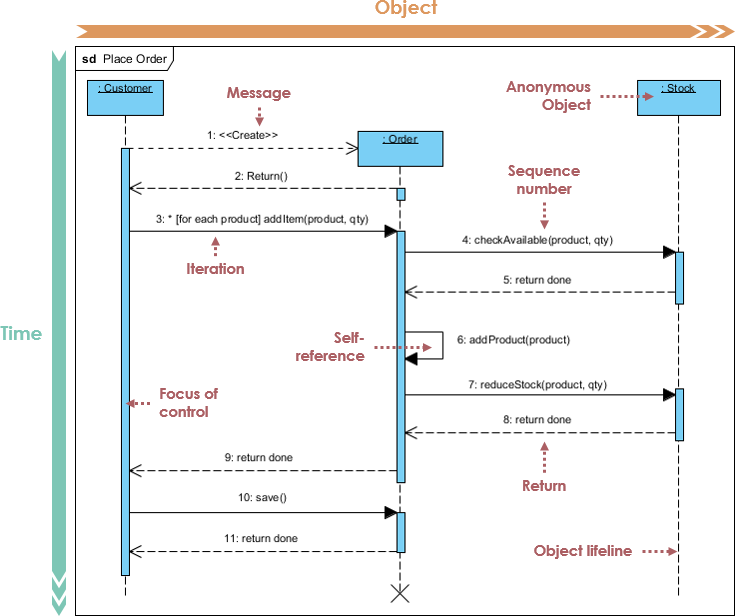

# 时序图/顺序图/序列图 Sequence Diagram

!!! abstract
    * 强调**消息传递**的**时间顺序**

    * 时序图
        * 对象：矩形，生命线（虚线）
        * 消息
            * 请求消息：实线
            * 返回消息：虚线
        * 消息时序

顺序图是强调**消息时间顺序**的**交互图**，描述了对象之间传送消息的时间顺序。顺序图阐明用例中的行为顺序，即说明对象如何通过交互来执行全部或部分用例的行为。

* **对象 Object**：类的实例，系统的参与者或者任何有效的系统对象。使用**显示对象名和类名的矩形框**来标记。

* **生命线 Object Lifeline**：每个对象有自己的生命线，表示在该用例中一个对象在一段时间内的存在。 即在生命线所代表的时间内，对象是可以被访问的。生命线位于每个对象的底部中心位 置，使用**垂直的虚线**表示。交互过程中被销毁的对象，其生命线在接收到销毁对象消息时 或在自身最后的返回消息之后结束，同时用一个 `X` 标记表明生命线的结束。

* **激活 Activation, Focus of control**：表示对象执行一个动作所经历的时间段，也可表示对象在这段时间内不空闲， 正在完成某个任务，或正被占用。激活在 UML 中用一个**细长的矩形**表示，显示在生命线上。矩形的顶部表示对象所执行动作的开始，底部表示动作的结束。对象在激活条的顶部被激活，在完成自己的工作后被去激活。去激活指对象处于空闲状态、在等待消息。

* **消息 Message, Returned message**：面向对象方法中，消息是对象间交互信息的主要方式。消息是用来说明顺序图中不同活动对象之间的通信。消息表示为从一个对象的生命线指向另一个对象的生命线的**带箭头的实线**，箭头上还可表明要发送的消息名及序号。顺序图中消息编号可显示，也可不显示。协作图中必须显示。**反身消息 Self Reference** 是一个对象将一个消息发送给它自己。**返回消息**表示控制流从过程调用的返回，用**带箭头的虚线**表示。

顺序图的主要用途之一是把用例表达的要求转化为更进一步的精细表达。

## 图示

## 图例

|                      |                              |          |
| -------------------- | ---------------------------- | -------- |
| 对象                 | Object                       | 矩形框   |
| 生命线               | Lifeline                     | 竖直虚线 |
| 消息                 | Message                      | 实线箭头 |
| 返回消息             | Return, Reply Message        | 虚线箭头 |
| 反身消息，自关联消息 | Self Reference               |          |
| 激活，控制焦点       | Activation, Focus of Control |          |

## References

* [ ] [What is Sequence Diagram - ArchiMetric](https://www.archimetric.com/what-is-sequence-diagram/)
* [ ] [Create UML sequence diagrams in draw.io](https://drawio-app.com/blog/create-uml-sequence-diagrams-in-draw-io/)

- [Sequence Diagram Examples - Software Ideas Modeler](https://www.softwareideas.net/c/1064/sequence-diagrams)
- [UML序列图总结](https://jarsonfang.github.io/Programming/设计模式/uml-sequence-diagram/)
- [顺序图 - 软件工程(北京大学，孙艳春) - Coursera](https://www.coursera.org/learn/ruanjian-gongcheng/lecture/V24qh/shun-xu-tu)
- [电脑网站支付接口（统一收单下单并支付页面接口）的时序图](https://opendocs.alipay.com/open/270/105899)
