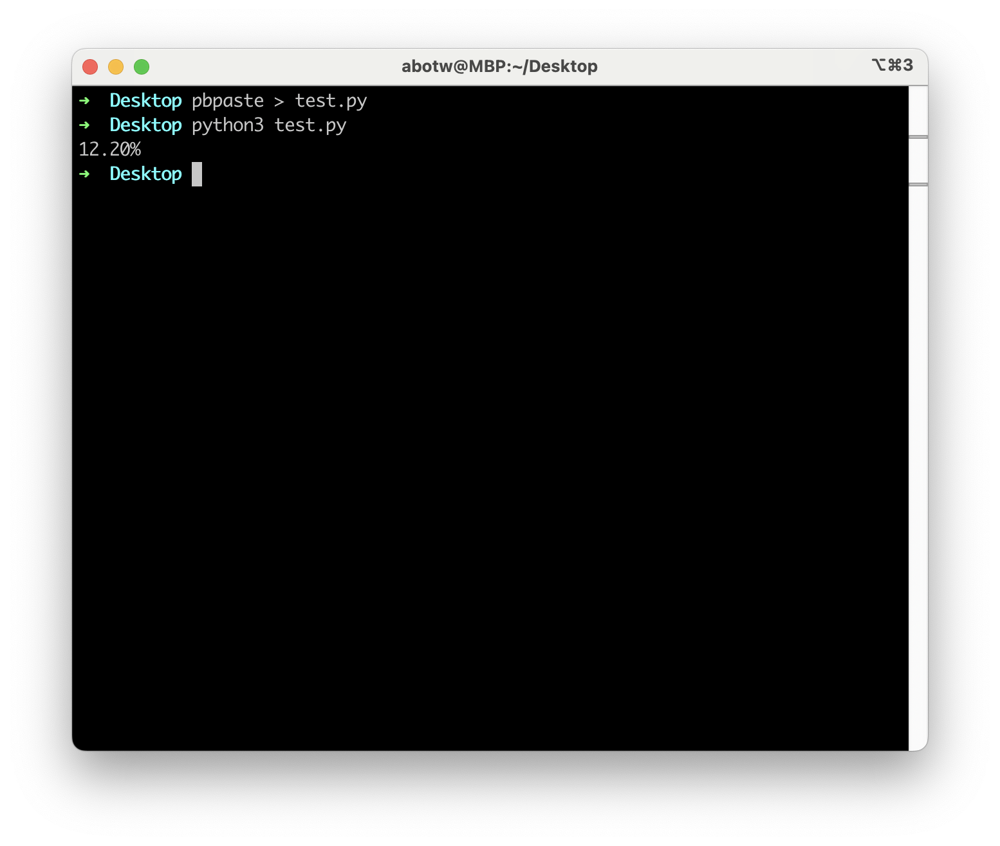

# Assign 3

## H3 天天向上的力量改进

工作日模式要努力到什么水平，才能与每天努力 1%一样呢？

A 君：一年 365 天，每天进步 1%，不停歇

B 君：一年 365 天，每周工作 5 天，休息 2 天，休息日下降 1%，那么工作日要努力多少才能达到 A 君努力的水平? 因为计算机的运算速度快，可以采用“笨办法”——试错。

设 B 君工作日的努力值为 X (初始值可以从 1%)，计算出来看是否达到 A 君的努力值，如果没有达到，继续增加努力值(每次增加千分之一)，直到达到 A 君的努力值。

``` python title="improved_daily_progress.py" linenums="1"
# 初始值和增长率的设置
a_initial_value = 1.0          # a的初始值
a_progress_rate = 0.01         # a的增长率
days_in_year = 365             # 一年的天数

# 使用复利计算a的总进展
a_total_progress = a_initial_value * ((1 + a_progress_rate) ** days_in_year)

# 输出a的总进展
# print(f"{a_total_progress}")

# 初始值和进展/退步率的设置
b_initial_value = 1.0          # b的初始值
b_progress_rate = 0.01         # b的进展率
b_regress_rate = 0.01          # b的退步率
b_total_progress = 0           # b的总进展初始化为0
day = 1                         # 初始化日期
increase = 0.001               # 增加b的进展率的增量

# 当b的总进展小于a的总进展时，执行循环
while b_total_progress < a_total_progress:
    b_total_progress = 0       # 重置b的总进展为0
    b_progress_rate += increase  # 增加b的进展率

    # 计算一年内的每一天
    for day in range(days_in_year + 1):
        if day % 7 <= 5:
            # 如果是工作日（星期一到星期五），增加b的总进展
            b_total_progress += b_initial_value * b_progress_rate
        else:
            # 如果是周末（星期六和星期日），减少b的总进展
            b_total_progress -= b_initial_value * b_regress_rate

# 输出最终的b的进展率，并以百分比形式显示
print(f"{b_progress_rate * 100:.2f}%")
```

