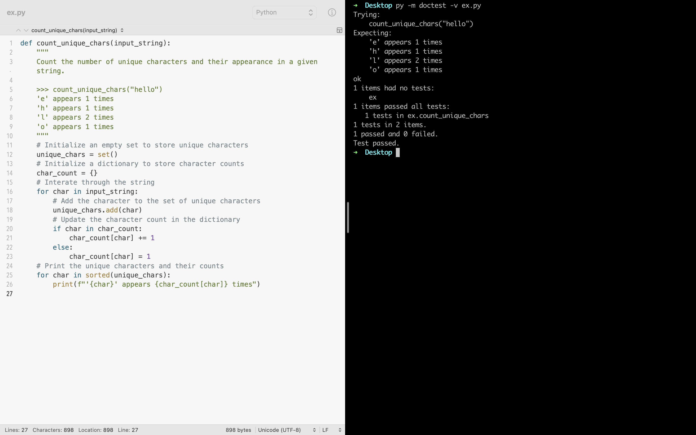

# Assign 5. 通关攻略

**实训目的**

1.   掌握集合的定义及应用：`set`
2.   掌握序列类型的基本操作，包括字符串、元组和列表的索引、切片、拼接和复制 `sequence`
3.   掌握序列类型的基本函数应用 `len`、`max` 等。
4.   掌握列表的增删改查操作：`list`
5.   掌握序列类型的排序操作等 `sorted`

## 1. Count Unique Characters

编写一个程序，要求用户输入一个字符串，返回字符串中出现的不同字符的个数。

*提示：可以利用集合*

```python title="count_unique_characters.py" linenums="1"
def count_unique_characters(input_string):
    """
    Count the number of unique characters in a given string using `set`.

    >>> count_unique_characters("hello")
    4
    >>> count_unique_characters("python")
    6
    """
    unique_characters = set()

    for char in input_string:
        unique_characters.add(char)

    return len(unique_characters)

# Run doctests
if __name__ == "__main__":
    import doctest
    doctest.testmod()
```

总结：

``` python
set()

for variable in iterable:
    # ...
    
length = len(iterable)

import doctest
doctest.testmod()
```


>   `doctest.testmod()` is a function provided by the Python `doctest` module, which is used for testing and documenting Python code through docstrings. This function is primarily used to automate the process of finding, running, and checking test cases that are embedded within docstrings.

``` python title="count_unique_chars.py" linenums="1"
def count_unique_chars(input_string):
    """
    Count the number of unique characters and their appearance in a given string.

    >>> count_unique_chars("hello")
    'e' appears 1 times
    'h' appears 1 times
    'l' appears 2 times
    'o' appears 1 times
    """
    # Initialize an empty set to store unique characters
    unique_chars = set()
    # Initialize a dictionary to store character counts
    char_count = {}
    # Interate through the string
    for char in input_string:
        # Add the character to the set of unique characters
        unique_chars.add(char)
        # Update the character count in the dictionary
        if char in char_count:
            char_count[char] += 1
        else:
            char_count[char] = 1
    # Print the unique characters and their counts
    for char in sorted(unique_chars):
        print(f"'{char}' appears {char_count[char]} times")

```

总结：

``` python
set() # Initialize an empty set to store unique characters

{} # Initialize a dictionary

set.add() # Add an element to the set

dict['key']

"""
In Python, the sorted() function is used to sort a sequence (such as a list, tuple, or string) or an iterable (such as a dictionary or set) into a new sorted list. It takes an iterable as its primary argument and returns a new list containing the elements from the input iterable arranged in ascending order by default. The original input iterable remains unchanged.
"""
sorted(iterable, key=None, reverse=False)

"""
In Python, an f-string, also known as a formatted string literal, is a way to create strings that include expressions inside them. F-strings are introduced by prefixing a string literal with the letter "f" or "F." Inside an f-string, you can include expressions enclosed in curly braces {}. These expressions are evaluated at runtime and their values are formatted and inserted into the string.
"""
f'string text {expression}'

for variable in iterable:
    # ...
```




## 2. Operations on `list`

1.   产生 20 个 100 以内包含数字 3 的随机数。

2.   判断列表中有无重复的元素。
3.   找出列表中的重复数据。
4.   对列表进行逆序。
5.   去掉列表中的最大值和最小值，然后计算平均值。

``` python
import random
from typing import List, Tuple

def generate_random_numbers(num_count: int) -> List[int]:
    """
    1. 产生 20 个 100 以内包含数字 3 的随机数。
    Generate a list of random numbers containing '3' with in the range [0, 100].
    
    Args:
        num_count (int): The number of random numbers to generate.
    
    Returns:
        List[int]: A list of random numbers.
    """
    random_numbers = []
    while len(random_numbers) < num_count:
        num = random.randint(0, 100)
        if '3' in str(num):
            random_numbers.append(num)
    return random_numbers
    
def has_duplicates(lst: List[int]) -> bool:
    """
    2. 判断列表中有无重复的元素。
    Check if a list contains duplicate elements.
    
    Args:
        lst (List[int]): The list to check for duplicates.
        
    Returns:
        bool: True if there are duplicates, False otherwise.
        
    >>> has_duplicates([1, 2, 3, 4, 5])
    False
    >>> has_duplicates([1, 2, 2, 3, 4, 5])
    True
    >>> has_duplicates(['a', 'b', 'c', 'c'])
    True
    """
    
    return len(lst) != len(set(lst))
    
def find_duplicates(lst: List[int]) -> List[int]:
    """
    3. 找出列表中的重复数据。
    Find and return duplicate elements in a list.
    
    Args:
        lst (List[int]): The list to search for duplicates.
        
    Returns:
        List[int]: A list of duplicate elements.
        
    >>> find_duplicates([1, 2, 2, 3, 4, 5])
    [2]
    >>> find_duplicates([1, 2, 2, 3, 3, 4, 5])
    [2, 3]
    """
    
    duplicate_list = []
    for el in lst:
        if lst.count(el) > 1 and el not in duplicate_list:
            duplicate_list.append(el)
    return duplicate_list
    
def reverse_list(lst: List[int]) -> List[int]:
    """
    4. 对列表进行逆序。
    Reverse a list.
    
    >>> reverse_list(['h', 'e', 'l', 'l', 'o'])
    ['o', 'l', 'l', 'e', 'h']
    """
    return lst[::-1]
    
def average(lst: List[int]) -> float:
    """
    5. 去掉列表中的最大值和最小值，然后计算平均值。
    Calculate the average of the remaining values after removing the maximum and minimun values.
    
    Args:
        lst (List(int)): The list of numbers.
    
    >>> average([1, 3])
    There are less than 3 list elements to calculate the average.
    0
    >>> average([1, 2, 3, 4])
    2.5
    """
    if len(lst) >= 3:
        lst.remove(max(lst))
        lst.remove(min(lst))
        average = sum(lst) / len(lst)
    else:
        average = 0
        print("There are less than 3 list elements to calculate the average.")
        
    return average
  
```

总结：

``` python
"""
`-> List[int]`: This part specifies the return type of the function. It indicates that the function will return a list of integers (List[int]), which is a hint for the type of value the function is expected to return.
"""

list.count(element)
list.append(element)

list[::-1]
"""
The `-1` following the second colon is the step value. A step value of -1 means that you're moving through the list in reverse order.
"""
```


## 3. Split and sort random numbers

编写程序，利用推导式生成包含 20 个随机数的元组，将前 10 个元素按升序排列，将后 10 个元素按降序排列，并输出排序后的元组。

``` python title="split_and_sort_random_numbers.py" linenums="1"
import random

def split_and_sort_random_numbers():
    random_numbers = tuple(random.randint(1, 100) for _ in range(20))
    
    first_half = sorted(random_numbers[:10])
    second_half = sorted(random_numbers[10:], reverse=True)
    
    sorted_numbers = tuple(first_half) + tuple(second_half)
    
    print(f'Random numbers：{random_numbers}')
		print(f'Sorted numbers：{sorted_numbers}')
    
    return
  
if __name__ == "__main__":
  split_and_sort_random_numbers()
```

