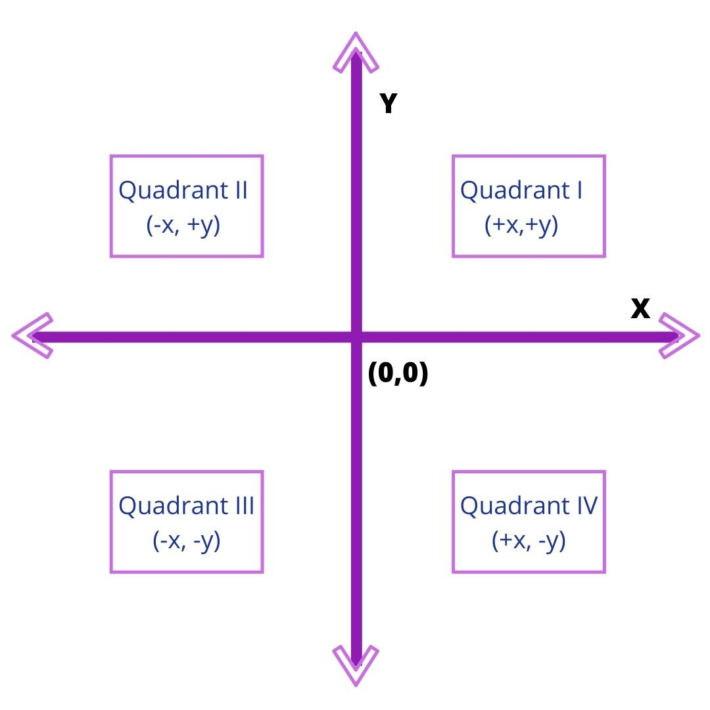
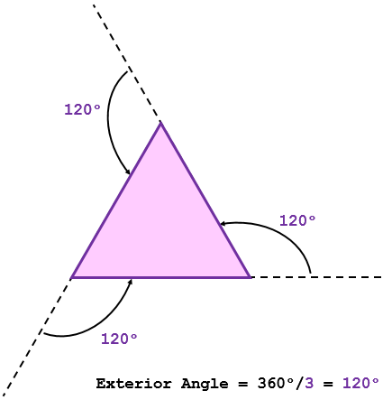
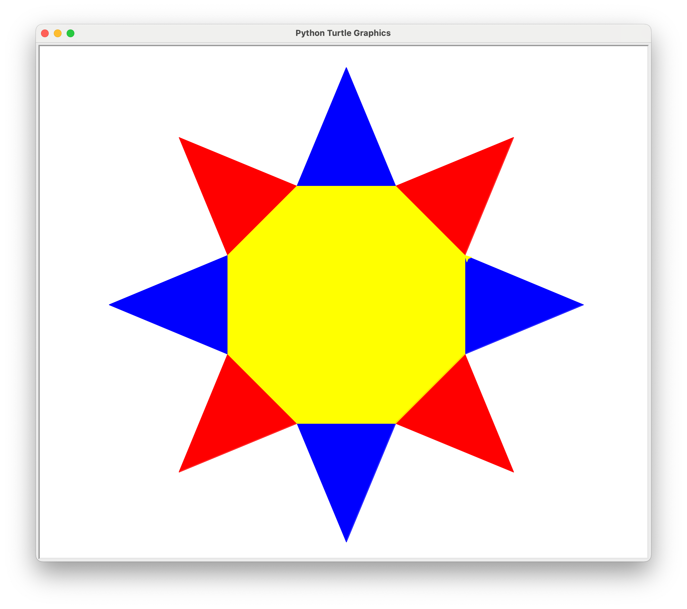

# Lecture 2. Turtle Graphics

!!! abstract

- Python modules
- Introduction to turtle graphics
    - 空间坐标体系

- Turtle functions
- Exercises
    2.   绘图窗体布局
    3.   空间坐标体系
    4.   角度坐标体系
    5.   色彩体系

- [Turtle mode @Python Sandbox](https://www.pythonsandbox.com/turtle)

## Python modules

``` python
####################################################
## 5. Modules
####################################################

# You can import modules
import math
print(math.sqrt(16))  # => 4.0

# You can get specific functions from a module
from math import ceil, floor
print(ceil(3.7))   # => 4
print(floor(3.7))  # => 3

# You can import all functions from a module.
# Warning: this is not recommended
from math import *

# You can shorten module names
import math as m
math.sqrt(16) == m.sqrt(16)  # => True

# Python modules are just ordinary Python files. You
# can write your own, and import them. The name of the
# module is the same as the name of the file.

# You can find out which functions and attributes
# are defined in a module.
import math
dir(math)

# If you have a Python script named math.py in the same
# folder as your current script, the file math.py will
# be loaded instead of the built-in Python module.
# This happens because the local folder has priority
# over Python's built-in libraries.
```

``` python
from turtle import *
```

## Introduction to turtle graphics

-   [Logo Foundation](https://el.media.mit.edu/logo-foundation/)
-   [Logo Things](https://logothings.github.io/logothings/) - This is a collection of musing by Cynthia Solomon on the history of the Logo programming language.

>   Logo began in **1967** and became widely used in schools starting around **1980** after years of research and development, primarily in the Logo Group at the Massachusetts Institute of Technology.

*参见：<https://docs.python.org/3/library/turtle.html#introduction>*

>   Turtle graphics is an implementation of [the popular geometric drawing tools introduced in Logo](https://en.wikipedia.org/wiki/Turtle_(robot)), developed by Wally Feurzeig, Seymour Papert and Cynthia Solomon in 1967.

>   In Python, turtle graphics provides a representation of a physical “turtle” (a little robot with a pen) that draws on a sheet of paper on the floor.

### 空间坐标体系

-   [ ] [Cartesian Coordinates](https://www.mathsisfun.com/data/cartesian-coordinates.html)
    -   quadrant 象限



### 角度坐标体系


## Turtle functions

``` py
# moves the sprite 100 steps forward
turtle.forward(100)
turtle.fd(100)

# moves the sprite 100 steps backward
turtle.backward(100)

# rotate to the right 45 degrees
turtle.right(45)

# rotate to the left 45 degrees
turtle.left(45)

# Pen doesn't draw when moving
turtle.penup()

# Pen draws when moving
turtle.pendown()

# Go to a coordinate (x: 130, y: -50)
# The turtle starts at the center of the stage which is at position (x: 0, y: 0)
turtle.goto(130, -50)

# Write the string "Hello World!" to the stage at the sprite's current position.
# Don't worry too much about the font=(...) part, just make sure it's there.
turtle.write("Hello World!", font=("Arial", 30, "normal"))

# clear all drawings on the stage
turtle.clear()
```

**Basic Movement:**

| Function                       | Effect                                                       | Example(s)                           |
| ------------------------------ | ------------------------------------------------------------ | ------------------------------------ |
| `fd` / `forward`               | Move the turtle forward.                                     | `fd(100)`                            |
| `bk` / `back` / `backward`     | Move the turtle backward.                                    | `bk(100)`                            |
| `lt` / `left` & `rt` & `right` | Turn the turtle left or right (in degrees).                  | `lt(90)`                             |
| `circle`                       | Moves the turtle forward in an arc curving to the left. Two arguments specify radius and how far around the circle to go (in degrees). | `circle(100)`<br />`circle(-50, 90)` |
| `speed`                        | Sets how fast the turtle moves. 1 is slowest, 10 is fastest, and 0 makes the turtle jump instantly instead of moving (which is even faster than speed 10). | `speed(3)`                           |

**Absolute Movement:**

| Function                                            | Effect                                                       | Example(s)                       |
| --------------------------------------------------- | ------------------------------------------------------------ | -------------------------------- |
| `seth` / `setheading`                               | Sets the turtle's direction. 0 is due East and positive headings are counterclockwise (so 90 is North). | `setheading(180)`                |
| `setpos` / `setposition` / `goto` / `setx` / `sety` | Move the turtle from its current position to a new absolute position. `setx` and `sety` change either the x or y coordinate without affecting the other. The turtle will still draw while moving unless the pen is retracted. (0, 0) is in the center of the window, +x is to the East, and +y is to the North. | `setpos(100, 50)`<br />`sety(0)` |

**Pen Control:**

| Function                  | Effect                                                       | Example(s)                                    |
| ------------------------- | ------------------------------------------------------------ | --------------------------------------------- |
| `up` / `pu` / `penup`     | Retracts the pen, so that the turtle no longer draws as it moves. | `penup()`                                     |
| `down` / `pd` / `pendown` | Extends the pen, so that the turtle draws as it moves. Pen is extended when the program begins. | `pendown()`                                   |
| `pencolor`                | Sets the color of the pen by name or using red, green, and blue values between 0 and 1. | `pencolor("Blue")`<br />`pencolor(0,0.3,0.7)` |
| `pensize` / `width`       | Sets the size of the pen.                                    | `pensize(3)`                                  |

**Filling Shapes:**

| Function                  | Effect                                                       | Example(s)                                                   |
| ------------------------- | ------------------------------------------------------------ | ------------------------------------------------------------ |
| `begin_fill` / `end_fill` | Call `begin_fill` when the turtle is in position to draw a shape, and `end_fill` once the shape is complete. The region enclosed by the turtle between these two calls will be filled with the current fill color when the `end_fill` happens. | `begin_fill()`<br />`fd(100)`<br />`lt(90)`<br />`fd(100)`<br />`end_fill()` |
| `fillcolor`               | Sets the color to be used when end_fill is called. Accepts same colors as pencolor. | `fillcolor("Forest Green")`<br />`fillcolor(0,0.4,0)`        |
| `color`                   | Can be used to set pen and fill color at once. With two arguments, sets pen and fill color to different values. | `color("Peach Puff")`<br />`color("Misty Rose", "Lavender")` |

**Methods specific to Screen:** 

| Function        | Effect                                                       | Example(s)                                               |
| --------------- | ------------------------------------------------------------ | -------------------------------------------------------- |
| `setup()`       | <https://docs.python.org/3/library/turtle.html#turtle.setup> | `setup(width=.75, height=0.5, startx=None, starty=None)` |
| `exitonclick()` | <https://docs.python.org/3/library/turtle.html#turtle.exitonclick> | `exitonclick()`                                          |
| `bye()`         | Shut the turtlegraphics window.                              | `bye()`                                                  |
| `title()`       | <https://docs.python.org/3/library/turtle.html#turtle.title> | `title("Welcome to the turtle zoo!")`                    |


## Exercises

**正方形**


``` python title="Square.py"
from turtle import *

forward(100)
left(90)
forward(100)
left(90)
forward(100)
left(90)
forward(100)

exitonclick()
```

``` python title="SquareDrawnUsingAForLoop.py"
from turtle import *

sides = 4
length = 200
angle = 90

for i in range(sides):
    forward(length)
    left(angle)

exitonclick()
```

**等边三角形**



``` python title="EquilateralTriangle.py"
from turtle import *
from math import sqrt

edge_length = 100

forward(edge_length)
left(120)
forward(edge_length)
left(120)
forward(edge_length)
left(120)

exitonclick()
```

``` python title="EquilateralTriangleUsingWhileLoop.py"
from turtle import *
from math import sqrt

edge_length = 100
angle = 120
count = 0

while count < 3:
    forward(edge_length)
    left(angle)
    count += 1

exitonclick()
```

**五角星**


``` python title="Penragram.py"
# Pentagram or Five-pointed Star
from turtle import *

edge_length = 100
angle = 144
count = 0

while count < 5:
    forward(edge_length)
    # try changeing `right` to `left`:
    right(144)
    count += 1
    
exitonclick()
```

**太阳花：正八棱锥展开图**

<figure markdown>
  { width="300" }
  <figcaption>Regular Octagon</figcaption>
</figure>



``` python
from turtle import *
from math import sin, pi

angle = 360 / 8
length = 200

left(22.5)
speed(0)

for i in range(8):
    if i % 2 == 0:
        color('red')
    else:
        color('blue')
    begin_fill()
    forward(length)
    left(angle)
    forward(length)
    left(180 - angle)
    forward(length)
    left(angle)
    forward(length)
    end_fill()
    left(180)

forward(length)
left(180 - (180-angle)/2)

alpha = angle * pi / 180
step = 2 * length * sin(alpha / 2)
color('yellow')

begin_fill()
for i in range(8):
    forward(step)
    left(angle)
end_fill()

exitonclick()
```

**隐藏 Turtle 画笔的箭头**

``` py title="隐藏 Turtle 画笔的箭头"
import turtle

# 创建一个Turtle对象
pen = turtle.Turtle()

# 隐藏画笔的箭头
pen.hideturtle()

# 这时候画笔箭头将不可见
# 你可以继续使用pen对象绘制图形

# 例如，绘制一个正方形
for _ in range(4):
    pen.forward(100)
    pen.right(90)

# 等待用户关闭窗口
turtle.done()
```

**风轮**

``` py
from turtle import *

radius = 150
angle = 45

left(angle)

for _ in range(4):
    forward(radius)
    left(90)
    circle(radius, angle)
    left(90)
    forward(radius)
    right(180 - angle)

done()
```

## Python Turtle Cheatsheet

-   turtle.setup(width, height, startx, starty)
-   turtle.screensize(canvwidth=400, canvheight=400, bg="red")

---

-   `turtle.up()`:	Sets the pen state to be up (not drawing).
-   `turtle.down()`:	Sets the pen state to be down (drawing). 
-   `turtle.penup()`, `turtle.pu()`
-   `turtle.pendown()`, `turtle.pd()`
-   `turtle.right(degrees)`: Turns the direction that the turtle is facing right (clockwise) by the amount indicated (in degrees).
-   `turtle.left(degrees)`: Turns the direction that the turtle is facing left (clockwise) by the amount indicated (in degrees).
-   `turtle.setheading(angle)`, `seth(angle)`: Sets the orientation of the turtle to angle. Here are some common directions	in degrees: 0 (east), 90 (north), 180 (west), 270 (south).

---

-   `turtle.goto(x,y)`: Moves the turtle to the specified coordinates, drawing a straight line to the destination (x,y)	if the pen	is down, and not drawing if the pen is up.
-   `turtle.forward(distance)`, `turtle.fd(distance)`: Moves the turtle forward	(in	the	direction	the	turtle	is	 facing)	the	distance	indicated	(in	pixels).	Draws	a	line	if	the	pen	is	down,	not	if	the	pen	is	up.
-   turtle.bk(d)
-   `turtle.circle(radius)`:	Draws	a	circle	of	the	indicated	radius.	The	turtle	draws	the	circle	 tangent	to	the	direction	the	turtle	is	facing.		
-   `turle.circle(radius, angle)`

---

-   `turtle.color(r,g,b)`,	`turtle.color(s)`	/	`turtle.fillcolor(r,g,b)`,	` turtle.fillcolor(s)`: 	Sets the	color of the line / fill color that the pen will use until the color / fill color is changed.		It takes either

    -   three	arguments,	each	a	floating-point	number	between	0.0—1.0,	where	the	first	 indicates	the	amount	of	red,	the	second,	the	amount	of	green,	and	the	third	the	amount	 of	blue;	or
    -   a	“color	string”	–	the	name	of	a	Tk	color	(e.g.,		“black”,	“red”,	“blue”,	…)
    -   The	default	pen	color	and	fill	color	is	“black”.	

    


*   坐标系
    *   绝对坐标系
    *   海龟坐标系：前后左右
*   角度坐标系
    *   绝对：0 / 360
    *   相对：上左下右


**画笔属性**

-   `turtle.pensize(width)`
-   `turtle.width(width)`
-   `turtle.pencolor(color)`
    -   color: str
    -   color: r, g, b
    -   colormode(255)
    -   colormode(1)
-   `turtle.speed(speed): speed: [0, 10]`

**画笔控制属性**

-   `turtle.fillcolor(color)`
-   `turtle.color(pencolor, fillcolor)`
-   `turtle.beginfill()`
-   `turtle.endfill()`
-   turtle.begin_fill(),	turtle.end_fill():		To	fill	a	figure,	use	turtle.begin_fill()	 before	you	start	drawing	the	figure.	Draw	the	figure.		Then	execute	turtle.end_fill().		The	figure	 drawn	between	the	two	fill	commands	will	be	filled	with	the	present	color	setting. turtle.hideturtle(),	turtle.showturtle():	Sets	the	state	to	hide	/	show	the	 turtle.		When	shown,	you	see	it	as	a	small	arrowhead	pointed	in	the	direction	of	the	heading.
-   `turtle.done()`
-   `turtle.bye()`:	Close	the	turtle	drawing	window.
-   `turtle.hideturtle()`,	`turtle.showturtle()`:	Sets	the	state	to	hide	/	show	the	 turtle.		When	shown,	you	see	it	as	a	small	arrowhead	pointed	in	the	direction	of	the	heading

**文本输出函数**

-   `write(arg, align="left", font=('arial', 8, 'normal'))`
    -   font, font-size, font-weight

---

``` python ="蟒蛇图形"
import turtle
turtle.penup()
turtle.goto(-300, 0)
turtle.pendown()
turtle.setup(0.75, 0.5, 0, 0)
turtle.pensize(20)
turtle.pencolor('purple')
turtle.seth(-40)
for i in range(4):
    turtle.circle(60, 80)
    turtle.circle(-60, 80)
turtle.seth(0)
turtle.fd(60)
turtle.circle(20, 180)
turtle.fd(40)
```

``` py title="心形"
```

## Study & Practice

-   [x] [turtle — Turtle graphics @offical](https://docs.python.org/3/library/turtle.html)

-   [ ] [The Beginner's Guide to Python Turtle @realpython.com](https://realpython.com/beginners-guide-python-turtle/)

-   [ ] [BAT GEOMETRY - turtle graphics](https://www.evl.uic.edu/insley/TURTLE/)

-   [x] [Introduction to Turtle Graphics @cs10](https://cs10.org/bjc-r/cur/programming/python/parsons/intro_to_turtle.html?topic=berkeley_bjc%2Fpython%2Fbesides-blocks-welcome-parsons.topic&course&novideo&noreading&noassignment)

-   [x] [Notes on using Python's turtle built-in commands](https://www.eg.bucknell.edu/~hyde/Python3/TurtleDirections.html)

-   [x] [Turtle Reference @cs111](https://cs111.wellesley.edu/archive/cs111_spring21T4/public_html/reference/turtle)

-   [ ] <http://opensask.ca/index.html#python-turtle-drawings-loops-and-functions>

-   [ ] <https://www.tobiaskohn.ch/jython/turtle.html>

-   [ ] [2D Shapes using Python Turtle](https://www.101computing.net/2d-shapes-using-python-turtle/)

-   [x] [Turtle color chart @cs111](https://cs111.wellesley.edu/archive/cs111_spring21T4/public_html/labs/lab01/colors)

-   [x] [Draw Heart with Python using Turtle](https://ayushirawat.com/draw-heart-with-python-using-turtle)

-   [x] 【Python】Turtle画图简介 @正月点灯笼

<iframe src="//player.bilibili.com/player.html?aid=28557201&bvid=BV17s411G7eG&cid=49431234&p=1" scrolling="no" border="0" frameborder="no" framespacing="0" allowfullscreen="true"> </iframe>

<iframe width="560" height="315" src="https://www.youtube.com/embed/pXGO8BV-L28?si=QbBI0G_VctrQAa7F" title="YouTube video player" frameborder="0" allow="accelerometer; autoplay; clipboard-write; encrypted-media; gyroscope; picture-in-picture; web-share" allowfullscreen></iframe>

---

-   [x] [Introducing Turtle Graphics For Python](https://blog.replit.com/python-turtle)
-   [ ] http://sun.csim.scu.edu.tw/~chiang/course/Python%20Basic/0Contents/3/31%20turtle%20-%20distance%20and%20angle/31c%20distance%20anglex4.pdf
-   [ ] http://sun.csim.scu.edu.tw/~chiang/course/Python%20Basic/0Contents/3/33%20turtle%20-%20state/33c%20shape%20visiblex4.pdf
-   [ ] https://eecs.wsu.edu/~schneidj/PyBook/chap13.pdf
-   [ ] http://www.cse.msu.edu/~ldillon/cse-ctl/Spring2015/Meeting07/turtleCheatSheet.pdf

-   [Logo programming language @ wikipedia](https://en.wikipedia.org/wiki/Logo_(programming_language))
-   [Turtle graphics @ wikipedia](https://en.wikipedia.org/wiki/Turtle_graphics)
