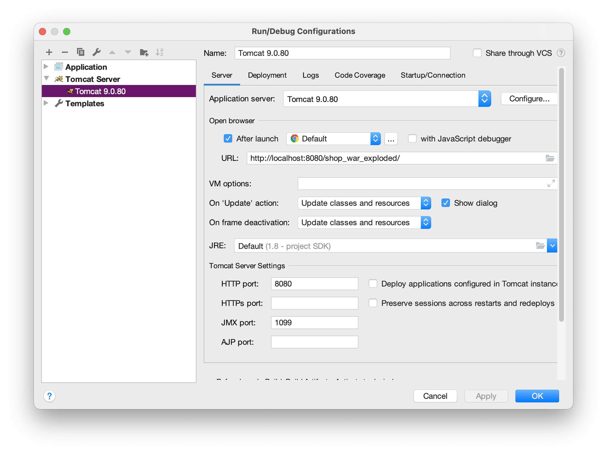

# Note 2. 网上商城管理系统的初步分析和设计

## 一、分析

**网上商城管理系统：**

-   一、分析
    -   1.   普通会员（前台功能模块）
             1.   商品展示
             2.   商品购物
             3.   用户个人信息管理
             4.   订单查询
        2.   管理员（后台功能模块）
             1.   用户管理
             2.   类别管理
             3.   商品管理
             4.   订单管理
-   二、设计
    -   1.   数据库设计
        2.   用户界面设计
-   三、编码
    -   1.   登录模块
             1.   1.1 设计首页
             2.   1.2 新建常用工具类
             3.   1.3 新建用户实体类 User
             4.   1.4 新建用户服务类 UserService
             5.   1.5 新建用户登录控制器 ServletLogin
             6.   1.6 修改首页
             7.   1.7 注销
        2.   注册模块
             1.   2.1 添加注册模态框
             2.   2.2 添加注册方法
             3.   2.3 新建用户注册控制器
             4.   2.4 修改首页
             5.   2.5 注册表单数据验证
        3.   分类模块
             1.   3.1 新建分类实体类 Category
             2.   3.2 新建分类业务类 CategoryService
             3.   3.3 修改首页
        4.   商品模块
             1.   4.1 新建商品的实体类 Product
             2.   4.2 新建商品业务类 ProductService
             3.   4.3 修改首页
             4.   4.4 新建处理分类浏览请求的 Servlet
             5.   4.5 商品搜索功能
        5.   购物车模块
             1.   5.1 新建购物项实体类
             2.   5.2 新建购物车类

## 二、设计

### 1. 数据库设计

用户表

分类表

商品表

订单表

订单项

## 三、编码

### 1. 登录模块

https://www.runoob.com/bootstrap/bootstrap-environment-setup.html

https://www.runoob.com/bootstrap/bootstrap-glyphicons.html

https://www.runoob.com/bootstrap/bootstrap-navigation-elements.html

#### 新建项目

1.   使用 IntelliJ IDEA 新建 Java Web 项目 `shop`.

2.   修改 Tomcat Server Run Configuration，配置为热部署：

     ```
     Menu Bar -> 
     Run -> 
     Edit Configurations... -> 
     Tomcat Server -> 
     Tomcat x.x.x -> 
     Server -> 
     On 'Update action': Update classes and resources && 
     On frame deactivation: Update classes and resources
     ```

     

3.   添加第三方库

     1.   将第三方 jar 包复制到 `web/WEB-INF/lib` 目录下

     2.   将第三方 jar 包添加到项目的库中：
          ```
          Menu Bar ->
          File ->
          Project Structure... -> command + ;
          Project Settings ->
          Libraries ->
          + plus icon ->
          name: lib
          classes: web/WEB-INF/lib
          ```

4.   添加 bootstrap 框架
     将解压后的 bootstrap 文件夹复制到 `web` 根目录下

#### 项目的文件结构说明

```
$ cd shop
.
├── lib
├── out
├── shop.iml
├── src
└── web
```

| File/Folder Name | Description                                                  |
| ---------------- | ------------------------------------------------------------ |
| lib              | A folder to store external libraries (JAR files) required for the project. These libraries contain Java classes and resources that the project depends on. For example, libraries for the Servlet container (such as Tomcat) can be found here. |
| out              | A folder to store the project's compiled output files and build configuration. Typically includes compiled class files, project build configuration files (e.g., generated files and directories) and more. |
| shop.iml         | The project's IDE configuration file. This file contains configuration information related to the project's development environment, such as project dependencies, module settings, and more. |
| src              | A folder to store the project's Java source code. This includes Java classes and other resource files and serves as the primary development directory for the project. |
| web              | **The root directory for the Web application.** It contains static resources for the Web application, such as HTML, JSP, CSS, JavaScript, images, and more. The entry files for the Web application (e.g., web.xml) are typically located in this directory. |

  ```
  cd shop/web
  .
  ├── WEB-INF
  ├── bootstrap
  ├── images
  └── index.jsp
  ```

| File/Folder Name | Description                                                  |
| ---------------- | ------------------------------------------------------------ |
| WEB-INF          | The "WEB-INF" directory is a standard directory in a Java web application. It contains configuration files and resources that are not directly accessible to clients (browsers). Common contents of this folder include:<br />- `web.xml`: A deployment descriptor file that configures the web application, including servlet mappings, security constraints, and initialization parameters. <br />- `lib`: A folder where you can place JAR files that contain Java libraries or dependencies used by the web application. <br />- `classes`: A folder for storing compiled Java classes, which can be used for custom servlets, filters, and other application-specific code.<br />- Other configuration files and resources that provide security, database connections, and more. |
| bootstrap        | The "bootstrap" folder likely contains resources related to the Bootstrap framework, which is a popular front-end framework for building responsive and visually appealing web applications. It may include CSS, JavaScript, and font files used to style and enhance the user interface of the web application. |
| images           | The "images" folder is typically used to store image files used in the web application. These images can be used for icons, logos, background images, or any other visual elements on the website. |
| index.jsp        | The "index.jsp" file is a JavaServer Pages (JSP) file that serves as the default landing page or homepage of the web application. JSP is a technology used in Java web development to create dynamic web pages. This file may contain HTML, JSP tags, and Java code to generate dynamic content for the homepage. It's often the starting point for users when they access the web application. |

#### JAR

TODO

```
.
├── jstl.jar
├── mysql-connector-java-5.1.39-bin.jar
├── mysql-connector-java-8.0.13.jar
└── standard.jar
```

## X. Resources

-   Zoomit, windows

---

*[JAR]: Java ARchive

*[ORM]: Object Relational Model
