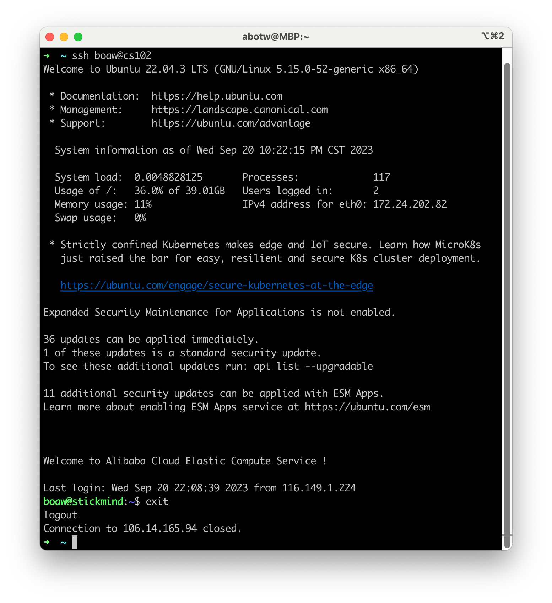
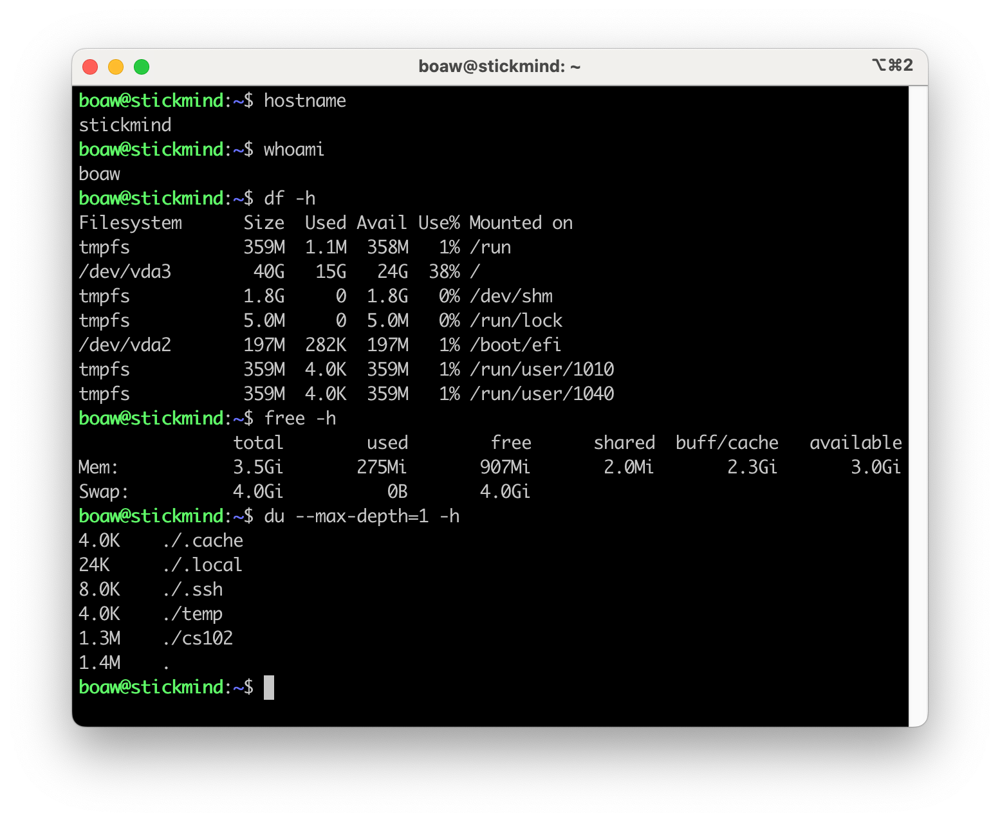
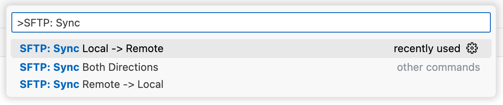

# 实验 0：上手 Linux 开发环境

## SSH



### Command commands



## SFTP

-   [SFTP](https://marketplace.visualstudio.com/items?itemName=Natizyskunk.sftp) - A VS Code Extension by [Natizyskunk](https://natan-fourie.fr/) <<https://github.com/Natizyskunk/>>
    -   [wiki](https://github.com/Natizyskunk/vscode-sftp/wiki)

**配置文件**

*备查：<https://github.com/Natizyskunk/vscode-sftp/wiki/Configuration>*

``` json title="./.vscode/sftp.json" linenums="1"
{
    "name": "CSE-CS102",
    "host": "106.14.165.94",
    "protocol": "sftp",
    "port": 22,
    "username": "boaw",
    "remotePath": "/home/boaw/cs102/labs/lab0/starter-proj",
    "uploadOnSave": true,
    "useTempFile": true,
    "openSsh": true
}
```

**Common commands**

*备查：<https://github.com/Natizyskunk/vscode-sftp/wiki/Commands>*




-   SFTP: Config
-   SFTP: Sync Local -> Remote
-   SFTP: Sync Remote -> Local

