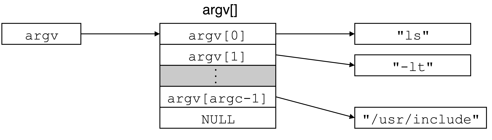

# Topic 1-6

## argc & argv

-   Command-line arguments in the C language

*参见：<https://csapp.cs.cmu.edu/3e/ics3/ecf/argv.pdf>*



*参见：<https://engineering.purdue.edu/ece264/17au/lecture/20170906/office_hours/argv.c>*

``` c title="argv.c"
/* vim: set tabstop=4 shiftwidth=4 fileencoding=utf-8 noexpandtab: */
#include <stdio.h>
#include <stdlib.h>

int main(int argc, char* argv[]) {
    if(argc >= 2) {
        for(int i = 0; argv[1][i] != '\0'; i++) {
            printf("argv[1][%d] == '%c'\n", i, argv[1][i]);
        }
    }
    return EXIT_SUCCESS;
}
```

``` sh
$ ./argv HelloWorld
argv[1][0] == 'H'
argv[1][1] == 'e'
argv[1][2] == 'l'
argv[1][3] == 'l'
argv[1][4] == 'o'
argv[1][5] == 'W'
argv[1][6] == 'o'
argv[1][7] == 'r'
argv[1][8] == 'l'
argv[1][9] == 'd'
```

