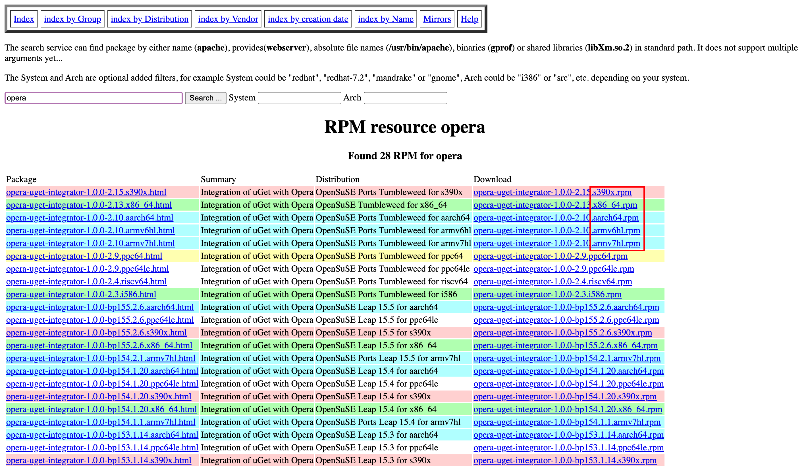

# RPM & yum

* Package Management Tool
  * RPM (Red Hat Package Manager, for Red Hat, CentOS, Fedora): yum (.rpm)
  * Debian system (like ubuntu): apt-get

## 1. RPM: Redhat Package Manager

### 1.1 RPM WHAT？

* RPM 是一种标准化的**软件包管理格式**和**<u>软件包管理</u>工具**。
* **目的**：提供一种标准的方式来打包、分发和安装软件。
* **原理**：RPM 包是一个存档文件，将软件及其相关文件、配置信息、依赖关系等打包成一个单独的RPM包，以 `.rpm` 为文件扩展名。
* **意义**：它使得在支持RPM的Linux发行版上安装、管理和分发软件变得更加方便和可靠。
* **缺点**：RPM 可以定义软件包之间的依赖关系，但不能解决**软件包依赖性问题**。

### 1.2 WHERE?

- [Rpmfind](https://www.rpmfind.net/)



??? RPM包在Linux系统中常见的架构标识
      * **x86_64：表示64位x86架构，适用于使用64位处理器的计算机。**
      * **i386、i686：表示32位x86架构，适用于使用32位处理器的计算机。**
      * armv6hl、armv7hl、aarch64：这些是ARM架构的不同变体。armv6hl适用于较旧的ARMv6架构，armv7hl适用于支持ARMv7指令集的设备，而aarch64适用于64位ARM架构。
      * ppc64le：表示IBM Power架构的64位低能耗变体，适用于POWER8和POWER9处理器。
      * s390x：表示IBM System z架构的64位变体，适用于IBM的大型机和主机系统。

      除了上述常见的架构标识外，还有一些其他特定架构的标识，如mips、mipsel、sparc等，它们在特定的硬件平台上使用。
    
      这些架构标识有助于确保选择适用于特定计算机架构的正确软件包，以确保兼容性和性能。

### 1.3 HOW?

``` sh hl_lines="6 8 10"
# rpm
# RPM Package Manager.
# tags: [ packaging ]
# ---
# Show version of httpd package:
$ rpm -q httpd # (1)
# To install a package:
$ rpm -ivh <rpm> # (2)
# To remove a package:
$ rpm -e <package> # (3)

# For equivalent commands in other package managers, see <https://wiki.archlinux.org/title/Pacman/Rosetta>.
# More information: <https://rpm.org/>.
```

1. `q` - query
2. `i` - install; `v` - verbose; `h` - hash
3. `e` - erase

## 2. yum

Yum（Yellowdog Updater, Modified）是一个在Linux系统中常用的软件包管理工具，它可以帮助用户轻松地安装、更新和删除软件包。

### 2.1 yum WHAT？

* **基于 RPM 的简化软件包管理的工具**。
* 最初是为 Fedora 发行版开发的，现在也被许多其他 Linux 发行版所采用。
* 会**自动处理软件包之间的依赖关系**，确保所需的其他软件包也会被正确地安装和配置。
* 可以从预先配置的软件仓库中获取软件包。

### 2.2 HOW?

``` sh
# yum
# Package management utility for RHEL, Fedora, and CentOS (for older versions).
# ---
# tags: [ packaging ]
# ---

# 准备工作
$ yum clean all
$ yum makecache
# Upgrade installed packages to the newest available versions:
$ yum upgrade

# To search for a package: 匹配名称和简介来搜索
$ yum search <package>

# 安装、更新、删除
# To install the latest version of a new package:
$ yum install <package> <package> <...>
# Install a new package and assume yes to all questions (also works with update, great for automated updates):
$ yum -y install package
# -y, --yes: 自动模式，对所有的提问都回答 yes
$ yum update <package>
# To remove a package:
$ yum remove <package>

# 描述和简介信息
# List packages matching <phrase>:
$ yum list <phrase>
$ yum list installed # 显示已装的软件包
$ yum list available # 显示可装（但未装）的软件包
# To find the dependencies of a package: 列出所有依赖关系
yum deplist <package>

# To find information about a package:
$ yum info <package>

# For equivalent commands in other package managers, see <https://wiki.archlinux.org/title/Pacman/Rosetta>.
# More information: <https://manned.org/yum>.
```

### 2.3 yum 的工作原理

* **软件仓库**：提供软件包索引、信息（以供查询）和软件包（以供下载）

      Yum **通过与软件仓库进行交互**来获取软件包信息。软件仓库是存储了大量软件包及其相关信息的服务器，用户可以从中获取需要的软件包。

* **依赖解决**：Yum 能够**处理软件包之间的依赖关系**。当用户安装一个软件包时，Yum 会自动检查并解决其所依赖的其他软件包。它会查找并安装所需的依赖包，以确保软件包能够正常运行。

* **本地缓存**：Yum 会在本地系统上建立一个缓存，将软件包的信息和文件保存在本地，**利用本地缓存提高性能**。这样，当用户再次需要同一软件包时，Yum 可以直接从本地缓存中获取，而无需再次从网络上下载。

* **仓库配置**：用户可以配置 Yum 以使用特定的软件仓库。配置文件中包含了软件仓库的地址、存储库的设置、软件包的优先级等信息。

### 2.4 配置 yum 的软件仓库

#### 2.4.1 yum 常用的软件仓库及其介绍

#### 2.4.2 CentOS 官方软件源特点

1. 不包括有版权争议的软件
2. 软件包比较老旧
3. 没有 eclipse、mplayer

#### 2.4.2 `/etc/yum.repos.d/`

`/etc` 目录: 存放系统配置文件。

`/etc/yum.repos.d/` 目录: 专门用于存放 Yum 软件仓库的配置文件。


**配置文件命名规则**：**每个 Yum 软件仓库都有一个对应的配置文件**，通常以 .repo 扩展名结尾。配置文件的命名规则一般为 <仓库名称>.repo，其中 <仓库名称> 是自定义的仓库标识符。

**文件内容**：每个配置文件包含仓库的名称、URL、GPG密钥、软件包信息等。这些信息定义了如何获取软件包、软件包的来源、安全验证等。配置文件使用INI格式，包括段落（section）和键值对（key-value）的形式。

**多仓库支持**：可以在 `/etc/yum.repos.d/` 目录下配置多个仓库的配置文件，每个配置文件代表一个不同的软件仓库。这样可以方便地管理和切换不同的软件源，以获取所需的软件包。

**管理方式**：可以通过创建、编辑或删除 `/etc/yum.repos.d/` 目录下的配置文件来管理 Yum 软件仓库。

``` sh
$ cd /etc/yum.repos.d/
$ yum install yum-plugin-priorities
```

*[RPM]: Redhat Package Manager
*[yum]: Yellowdog Updater, Modified