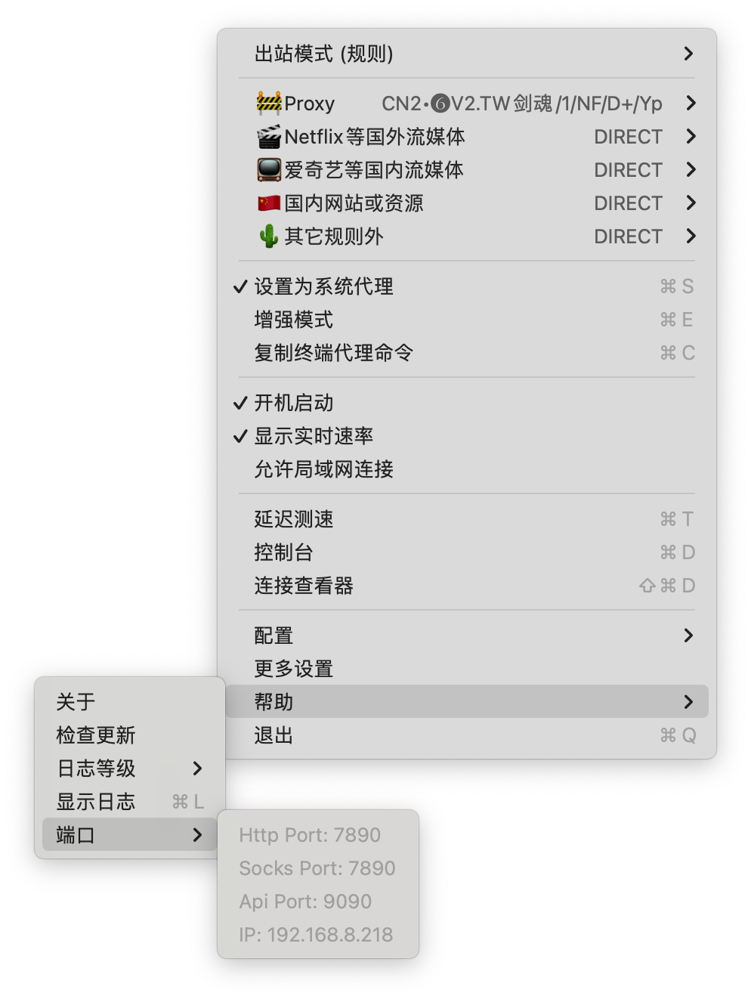

# 终端使用代理加速

## Main

``` sh
$ cat > ~/.bash_profile << EOF
function proxy_on() {
    # Enable HTTP proxy using localhost and port 7890.
    export http_proxy=http://127.0.0.1:7890
    # Set HTTPS proxy to the same value as HTTP proxy.
    export https_proxy=\$http_proxy
    # Display a message indicating that the terminal proxy is enabled.
    echo -e "Terminal proxy is now enabled."
}

function proxy_off(){
    # Unset HTTP & HTTPS proxy enviroment variables.
    unset http_proxy https_proxy
    # Display a message indicating that the terminal proxy is disabled.
    echo -e "Terminal proxy is now disabled."
}
EOF

# Source (reload) the .bash_profile file to apply the changes.
$ source ~/.bash_profile

# Call the proxy_on function to enable the proxy.
$ proxy_on
```

``` sh title="~/.zshrc"
# Define a function to enable the terminal proxy.
function proxy_on() {
    # Enable HTTP proxy using localhost and port 7890.
    export http_proxy=http://127.0.0.1:7890
    # Set HTTPS proxy to the same value as HTTP proxy.
    export https_proxy=\$http_proxy
    # Display a message indicating that the terminal proxy is enabled.
    echo -e "Terminal proxy is now enabled. 终端代理已开启。"
}

# Define a function to disable the terminal proxy.
function proxy_off(){
    # Unset HTTP & HTTPS proxy enviroment variables.
    unset http_proxy https_proxy
    # Display a message indicating that the terminal proxy is disabled.
    echo -e "Terminal proxy is now disabled. 终端代理已关闭。"
}
```

**测试**

``` sh
curl -I http://www.google.com
curl -I https://api.telegram.org
curl cip.cc
```

### heredoc

*参见：<https://wikis.utexas.edu/display/CoreNGSTools/Linux+fundamentals>*

The general form of a ***heredoc*** is:

``` sh
COMMAND << DELIMITER
..text...
..text...
DELIMITER
```

``` sh
$ cat << EOF
heredoc> This text will be output
heredoc> And this USER environment variable will be evaluated: $USER
heredoc> EOF
This text will be output
And this USER environment variable will be evaluated: xxx
$ cat > hello.txt << EOF
heredoc> Hello, world!
heredoc> EOF
$ cat 1> out.txt << EOF
This text will be output
And this USER environment variable will be evaluated: $USER
EOF
```

### `127.0.0.1` | `localhost` | `home address`

>   "localhost" is ***the standard host name*** given to a computer's [loopback](https://kb.mit.edu/confluence/display/glossary/loopback) network interface. This host name will always resolve to send traffic to the local computer. **It does not result in a [DNS](https://kb.mit.edu/confluence/display/glossary/DNS) query out to the internet.**

*参见：<https://kb.mit.edu/confluence/display/glossary/127.0.0.1>*

*参见：<https://kb.mit.edu/confluence/display/glossary/Home+address>*

*参见：<https://kb.mit.edu/confluence/display/glossary/localhost>*

*参见：<https://kb.mit.edu/confluence/display/glossary/loopback>*

### `echo`

*参见：<https://wikis.utexas.edu/display/CoreNGSTools/Linux+fundamentals>*

*参见：<https://cht.sh/echo>*

-   **echo <text>** prints the specified text on ***standard output***
    -   evaluation of ***metacharacters*** (***special characters***) inside the text may be performed first
    -   **-e** says to enable conversion of ***backslash escapes*** such as **\t** **Tab** and **\n** **newline** to their ASCII character
    -   **-n** says not to output the trailing **newline**

``` sh
# Enable interpretation of backslash escapes (special characters):
echo -e "Column 1\tColumn 2"
```

### `unset`

``` sh
# unset
# Remove shell variables or functions.
# More information: <https://manned.org/unset>.

# Remove the variable `foo`, or if the variable doesn't exist, remove the function `foo`:
$ unset foo
```

### `curl -I`

``` sh
# Fetch only the HTTP headers from a response.
curl -I http://example.com

# To fetch only the HTTP headers from a response:
curl -I <url>
```

``` sh
$ curl cip.cc
IP	: xxx
地址	: 中国  台湾  彰化县
运营商	: cht.com.tw

数据二	: 台湾省彰化县 | 中华电信

数据三	: 中国台湾省 | 中华电信

URL	: http://www.cip.cc/xxx
```

### TCP/UDP Port Numbers

*参见：<https://packetlife.net/media/library/23/common_ports.pdf>*

-   80 HTTP
-   443 HTTP over SSL
-   8080 HTTP Proxy

{ width="300" }

## Resources

-   [终端使用代理加速的正确方式（Clash）](https://weilining.github.io/294.html)
