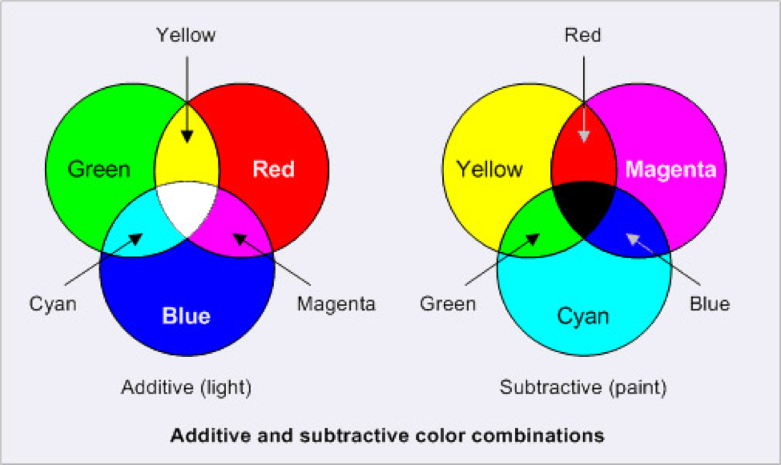

# Color

## the color wheel

## Color Modes

### Readings

-   [CMYK vs RGB: What color space should I work in?](https://intranet.mcad.edu/kb/cmyk-vs-rgb-what-color-space-should-i-work)
-   [RGB versus CMYK](http://www.printernational.org/rgb-versus-cmyk.php), <http://www.printernational.org/rgb-versus-cmyk.php>

-   [x] [CMYK & RGB – Understanding Your Color Modes](https://ux.byu.edu/cmyk-and-rgb-understanding-your-color-modes), By [Rebecca Bean](https://ux.byu.edu/rebecca-bean),  June 02, 2021 04:38 PM

    

---

>   If you understand the concept that white is the presence of the full color spectrum, and black is the absence of color, it makes a little more sense why colors get darker as you combine them.

`CMYK`

: CYMK stands for Cyan, Yellow, Magenta, and Key (Black).

`RGB`

: RGB stands for Red, Green, and Blue.

## Color codes

### Hexadecimal Codes

## Color Tools

-   Color Conventer
-   HTML Color Names

---

*[CMYK]: Cyan, Yellow, Magenta, and Key (Black)

*[RGB]: Red, Green, Blue