# Question Bank

## TODO

Files I/O

-   https://www.cs.colostate.edu/~cs156/Spring18/Lecture/FileIO
-   https://pontus.digipen.edu/~mmead/www/Courses/CS120/FileIO-1.html
-   https://user-web.icecube.wisc.edu/~dglo/c_class/stdio.html

-   https://www.dgp.toronto.edu/public_user/JamesStewart/270/9697f/notes/Sept30-tut.html

Float

-   https://www.cs.emory.edu/~cheung/Courses/255/Syllabus/5-repr/IntFloatConv.html
-   https://www.cs.yale.edu/homes/aspnes/pinewiki/C(2f)FloatingPoint.html

Ref

-   https://cplusplus.com/
-   https://en.cppreference.com/w/

## 基本要求

## 题目列表

-   [ ] 1
-   [ ] 2
-   [ ] 3
-   [ ] 4
-   [ ] 5
-   [ ] 6
-   [ ] 7
-   [ ] 8
-   [x] 9
-   [ ] 10
-   [ ] 11
-   [ ] 12
-   [ ] 13
-   [ ] 14
-   [ ] 15
-   [ ] 16
-   [ ] 17
-   [ ] 18
-   [ ] 19
-   [ ] 20

## 单项选择

### 1-10

1.   计算机程序设计员要根据自身分工的不同和形势发展的需要，掌握软件技术所需要的技能，如新的语言、D、网络技能、组件开发等。
     1.   A、新的系统设备
     2.   B、新的环境
     3.   C、新的模式
     4.   **D、新的开发工具**


2.   计算机系统是一个软、硬件结合的复杂的多层次系统，在外三层软件中，A 实现其功能。
     1.   **A、外层依赖内层**
     2.   B、内层依赖外层
     3.   C、内外层互相依赖
     4.   D、各层独立


3.   当运算结果超过了**定点数**表示范围时，则产生 C。

     1.   A、进位
     2.   B、移位
     3.   **C、溢出**
     4.   D、舍弃

     ```
     解析：溢出是指计算结果超出了所能表示的范围，通常会导致错误的结果。
     ```

4.   在典型的层次化存储系统中，B 一般位于中央处理机内。
     1.   A、高速缓存、主存储器
     2.   **B、寄存器、高速缓存**
     3.   C、寄存器、主存储器
     4.   D、主存储器、辅助存储器


5.   按存储介质的材料来分类，软盘存储器、硬盘存储器、磁带存储器属于 C。
     1.   A、半导体存储器
     2.   B、主存储器
     3.   **C、磁表面存储器**
     4.   D、光存储器


6.   计算机程序设计员的忠于职守，就是要 C。
     1.   A、忠于程序设计人员这个特定的工作岗位，不要参与其它岗位的工作
     2.   B、服从公司领导的安排，在任何情况下都要维护公司的利益
     3.   **C、忠于程序设计人员这个特定的工作岗位，自觉履行程序设计员的各项职责**
     4.   D、在完成自己工作的同时，主动分担领导的各项工作


7.   计算机程序设计员要能够围绕 B 开展各项活动，招之即来，来之能干。
     1.   A、公司总体目标
     2.   **B、软件系统开发**
     3.   C、自身工作能力
     4.   D、职业道德规范


8.   遵纪守法指的是计算机程序设计员要遵守职业纪律和与职业相关的 C。

     1.   A、刑法、民法、劳动法
     2.   B、保密法、劳动法等其他法律
     3.   **C、法律、法规、商业道德**
     4.   D、道德规范

     ```
     解析：计算机程序设计员需要遵守相关法律法规以及商业道德，确保他们的行为合法和道德。
     ```

9.   计算机程序员掌握着用户软件系统的重要信息，因此要求程序设计人员必须具备 D 的职业道德。
     1.   A、严谨务实
     2.   B、工作耐心
     3.   C、谦虚谨慎
     4.   **D、严守机密**


10.   计算机程序设计员在工作中要从客观实际出发，不懂不装懂，多向用户学习，切忌 D。
      1.   A、服务第一
      2.   B、一切向钱看
      3.   C、客户第一
      4.   **D、主观臆断**

### 11-20

11.   计算机由五部分构成，其中 C 和运算器组成一个整体，叫中央处理器，是硬件系统的核心。
      1.   A、存储器
      2.   B、寄存器
      3.   **C、控制器**
      4.   D、加法器

12.   下列关于系统总线的说法中，错误的是 C。
      1.   A、能够实现部件与部件之间的连接
      2.   B、能够实现部件与部件之间的信息传输
      3.   **C、具有存储信息的功能**
      4.   D、是计算机系统的重要组成部分

13.   主机和I/O设备通常是按照各自独立的时序工作的，因此往往需要接口进行 B 以满足各种时序的要求。
      1.   A、等待
      2.   **B、缓冲暂存**
      3.   C、组装和分解
      4.   D、检测和复位

14.   下列中断不属于外中断的是 C。
      1.   A、磁盘操作引起的中断
      2.   B、断电引起的中断
      3.   **C、数据校验错引起的中断**
      4.   D、CRT显示器引起的中断

15.   下列属于计算机输入设备的有 A。
      1.   **A、扫描仪**
      2.   B、显示器
      3.   C、绘图仪
      4.   D、打印机

16.   程序是 A。
      1.   **A、解决某个问题的计算机语言的有限命令的有序集合**
      2.   B、解决某个问题的文档资料
      3.   C、计算机语言
      4.   D、计算机的基本操作

17.   在数据类型分类中，算数类型包括：D。
      1.   A、指针、数组、类
      2.   B、结构、指针、数组
      3.   C、共用体、类、引用
      4.   **D、字符型、整型、实型**

18.   汇编语言源程序可使用的语句有三种：指令语句、B 和宏指令语句。
      1.   A、宏调用语句
      2.   **B、伪指令语句**
      3.   C、算术指令语句
      4.   D、逻辑指令语句

19.   代码优化可在 B 的不同阶段进行。
      1.   A、程序编写
      2.   **B、编译**
      3.   C、代码生成
      4.   D、代码运行


20.   从功能的角度看，操作系统是对计算机资源（包括硬件和软件等）进行 B 的程序。
      1.   A、输入和输出
      2.   **B、管理和控制**
      3.   C、汇编和执行
      4.   D、优化和保障


### 21-30


2.2.1 计算机系统基础知识

2.2.2.2 软件开发基础知识 - 数据结构基础知识


参考：https://ipads.se.sjtu.edu.cn/ospi/


21.   数据结构一般包含三个方面：B、数据的存储结构和对数据的操作。

      1.   A、数据之间的关系
      2.   **B、数据的逻辑结构**
      3.   C、数据的组织结构
      4.   D、数据元素的集合

      ```
      数据结构涉及三个方面：
      
      1. 数据的逻辑结构
      		-----从用户视图看，是面向问题的。
      2. 数据的物理结构（存储结构）
      		-----从具体实现视图看，是面向计算机的。
      3. 相关的操作及其实现。
      
      ----------
      
      Example: 
      学生表：
      1. 逻辑结构
      		-----线性表
      2. 物理结构
      		-----数组, 链表
      3. 操作
      		-----插入, 删除, 查找
      		
      ----------
      
      逻辑结构：是对数据成员之间的逻辑关系的描述，它可以用一个数据成员的集合和定义在此集合上的若干关系来表示;
      
      物理结构：是逻辑结构在计算机中的表示和实现，故又称“存储结构” 。
      
      ----------
      
      逻辑结构和物理结构的关系：
      
      - 数据的逻辑结构是从逻辑关系（某种顺序）上观察数据，它是独立于计算机的；可以在理论上、形式上进行研究、推理、运算等各种操作。
      - 数据的存储结构是逻辑结构在计算机中的实现，是依赖于计算机的；是数据的最终组织形式。
      - 任何一个算法的设计取决于选定的逻辑结构；而算法的最终实现依赖于采用的存储结构。
      
      参考：https://cs.nju.edu.cn/lwj/course/ds.html
      ```

22.   数组顺序存储的优点在于可以 D 存取或修改数组元素的值。

      1.   A、线性地
      2.   B、连续
      3.   C、顺序
      4.   **D、随机**

      ```
      参考：https://web.xidian.edu.cn/hqin/files/20111208_154154.pdf
      ```

23.   **链表**适用于数据元素个数 D、插入、删除频繁的情形。

      1.   A、较少
      2.   B、较多
      3.   C、固定
      4.   **D、不定**

      ```
      参考：http://www.tup.tsinghua.edu.cn/upload/books/yz/077573-01.pdf
      ```

24.   线性表是由 A 的数据元素组成的有限序列。
      1.   **A、相同类型**
      2.   B、不同类型
      3.   C、有序
      4.   D、无序


35.   在栈中，不允许插入和删除的一端称为 D。
      1.   A、进栈
      2.   B、出栈
      3.   C、栈顶
      4.   **D、栈底**


26.   多用户操作系统按用户与计算机的关系、CPU响应的及时性可以分为 C。

      1.   A、单任务操作系统、多任务操作系统
      2.   B、网络操作系统、非网络操作系统
      3.   **C、批处理操作系统、分时操作系统、实时操作系统**
      4.   D、分布式操作系统、非分布式操作系统

      ```
      参考：http://staff.ustc.edu.cn/~shizhu/DotNet/czxt.pdf
      ```

27.   下列有关进程的叙述，错误的是 B。
      1.   A、一个进程可以涉及到一个或几个程序的执行
      2.   **B、进程是静态的，而程序是动态的**
      3.   C、一个单一的程序可被包括在一个或几个进程的使用之中
      4.   D、进程和程序是两个不同的概念


28.   为使程序能正确执行，需对**逻辑地址**有关的**指令**进行相应调整，这一过程称为 C。

      1.   A、静态分配
      2.   B、动态分配
      3.   **C、地址重定位**
      4.   D、内存重定位

      ```
      地址重定位
      -----
      重定位
      ----
      - 在可执行文件装入时需要解决可执行文件中地址（指令和数据）和内存地址的对应。
      - 由操作系统中的装入程序loader来完成。
      
      参考：https://gr.xjtu.edu.cn/documents/15444/2785977/%E7%AC%AC%E5%9B%9B%E7%AB%A0+-+%E5%AD%98%E5%82%A8%E5%99%A8%E7%AE%A1%E7%90%86.pdf/fa00749f-acb4-9f99-9fda-5e02b85d0bad?t=1634542501024
      ```

29.   设备管理是指计算机系统除了 CPU 和内存以外的所有 A 的管理。

      1.   **A、输入、输出设备**
      2.   B、存储设备
      3.   C、系统设备
      4.   D、主机外接设备

      ```
      设备管理是指计算机系统中除了CPU和主存以外的所有输入、输出设备的管理。
      
      参考：操作系统基础，http://www.tup.tsinghua.edu.cn/upload/books/yz/044142-02.pdf
      ```

30.   一个作业从进入系统到运行结束，一般须经过提交、后备、C、完成四个状态阶段。

      1.   A、存储
      2.   B、输出
      3.   **C、执行**
      4.   D、调度

      ```
      作业的状态:
      
      作业从进入到运行结束，一般需要经历“提交”、“后备/收容”、“运行”和“完成”四个阶段。
      
      参考：处理机调度与死锁，https://gr.xjtu.edu.cn/documents/15444/2785977/%E7%AC%AC%E4%B8%89%E7%AB%A0+-+%E5%A4%84%E7%90%86%E6%9C%BA%E8%B0%83%E5%BA%A6%E4%B8%8E%E6%AD%BB%E9%94%81.pdf/6461d664-31ca-2ffa-8195-d940d766cf56?t=1633924604673
      
      参考：操作系统知识，http://www.tup.tsinghua.edu.cn/upload/books/yz/060347-01.pdf
      ```

### 31-40

31.   在队列中，A 进入队列的元素最先出队。
      1.   **A、最先**
      2.   B、最后
      3.   C、中间
      4.   D、按需


32.   数据库的管理和维护是在 B 的控制下实现，并为各种用户提供共享。
      1.   A、操作系统
      2.   **B、数据库管理系统**
      3.   C、数据库系统
      4.   D、数据结构


33.   通常一个数据库的 A 是由数据结构、数据操作和完整性约束三个部分组成的。
      1.   **A、数据模型**
      2.   B、管理系统
      3.   C、管理模型
      4.   D、数据元素


34.   网络编程是指实现网络进程 B 的编程。
      1.   A、正常运行
      2.   **B、安全通讯**
      3.   C、分层次
      4.   D、正常启动


35.   使用脚本语言的目的是与 B 语言一起实现在一个Web页面中链接多个对象，与Web客户交互作用，从而可以开发客户端的应用程序等。
      1.   A、PHP
      2.   **B、HTML**
      3.   C、C#
      4.   D、JAVA


36.   组件技术是分布式 B 的技术。
      1.   A、面向过程
      2.   **B、面向对象**
      3.   C、面向结构
      4.   D、模块化


37.   在需求分析阶段，确定系统的功能要求，就是确定 D。
      1.   A、要解决的问题是什么
      2.   B、项目的验收标准
      3.   C、系统的规模
      4.   **D、系统必须完成的所有功能**


38.   软件模块化有很多优点，下列不属于软件模块化优点的是 D。
      1.   A、降低软件开发和维护的难度
      2.   B、降低软件的开发成本
      3.   C、使软件的结构清晰
      4.   **D、提高软件的安全性**


39.   编码是把软件设计的结果转换成某种 B 的书写程序。
      1.   A、机器语言
      2.   **B、程序设计语言**
      3.   C、面向过程
      4.   D、面向对象


40.   软件测试作为软件工程的一个阶段，它的根本任务是 A。
      1.   **A、保证软件的质量**
      2.   B、保证开发进度
      3.   C、发现和纠正所有错误
      4.   D、验证软件的正确性


### 41-50


41.   软件管理按时间可划分为生产管理和 C。
      1.   A、技术管理
      2.   B、成本管理
      3.   **C、使用维护管理**
      4.   D、开发进度管理


42.   所谓坚固性是指当引入了 A 的输入时，软件仍能继续正常工作的程度。
      1.   **A、不合理**
      2.   B、大量
      3.   C、各种类型
      4.   D、连续性

43.   使用 B 开发软件时，在整个开发过程中都使用统一的软件概念：类和对象。
      1.   A、面向过程方法
      2.   **B、面向对象方法**
      3.   C、模块化设计方法
      4.   D、结构化设计方法

44.   网络适配器俗称网卡，它是提供 D 与计算机相连的接口。
      1.   A、双绞线
      2.   B、光纤
      3.   C、交换机
      4.   **D、通信网络**

45.   计算机网络按 D 可分为局域网和广域网。
      1.   A、通信介质
      2.   B、拓扑结构
      3.   C、信号频带占用方式
      4.   **D、规模和覆盖范围**

46.   域名的级数通常不超过 C。
      1.   A、3
      2.   B、4
      3.   **C、5**
      4.   D、6

47.   OSI 参考模型的每一层均有自己的一套功能集，并与 C 交互作用。
      1.   A、相邻的上层
      2.   B、相邻的下层
      3.   **C、相邻的上层和下层**
      4.   D、以下的各层


48.   TCP/IP是TCP、IP、UDP、ARP、ICMP以及其它的一些被称为 D 的协议总称。
      1.   A、网络协议
      2.   B、局域网协议
      3.   C、广域网协议
      4.   **D、子协议**

49.   文件系统安全涉及用户的验证、完整性检查和 C，还包括了对文件系统加密。
      1.   A、用户的注册
      2.   B、恢复
      3.   **C、备份**
      4.   D、文件管理


50.   下列叙述中，D 不是保证Web服务器安全的措施。
      1.   A、可以通过域名、IP地址、用户和分组来禁止访问Web服务器
      2.   B、基于目录文档的权限是分层的
      3.   C、一个文档的一部分可以根据安全规则被隐蔽
      4.   **D、通过重启服务器来修改用户访问控制列表**


### 51-60 


2.2.2.4 软件开发基础知识 - 专业外语的阅读与理解


51.   **防火墙**通过检测 D 和 Internet 之间的通信以跟踪网络漏洞或内部人员的不法行为。
      1.   A、Web服务器
      2.   B、以太网
      3.   C、内部网络
      4.   **D、外部网络**


52.   ASCII 中，S 所代表的英文单词是 D。
      1.   A、Server
      2.   B、System
      3.   C、Securty
      4.   **D、Standard**


53.   在数据库技术中，DBMS 前两个字母代表的英文单词是 C。
      1.   A、Double
      2.   B、Debug Baud
      3.   **C、Database**
      4.   D、Default Boot


54.   在软件工程中，统一建模语言的英文缩写是 C。
      1.   A、UDP
      2.   B、TCP
      3.   **C、UML**
      4.   D、LAN


55.   在计算机网络领域中，HTTP 所代表的英文是 C。
      1.   A、High Text Transfer Protocol
      2.   B、Higher Time Transmission Private
      3.   **C、Hypertext Transfer Protocol**
      4.   D、Host Structure Text Path


56.   商标是指商品的生产者、经营者或 C 的提供者用以标明自己所生产、经营的商品或提供的服务与其他人相区别的标记。
      1.   A、许可证
      2.   B、售后服务
      3.   **C、商业服务**
      4.   D、技术服务


57.   下列关于“鼠标属性”窗口的叙述，正确的是 B。
      1.   A、可初始化鼠标
      2.   **B、可设置鼠标指针的外观**
      3.   C、可设置鼠标移动的步长
      4.   D、可设置鼠标移动的角度


58.   若要使安装的打印机可供网络上其他人使用，则需要在“打印机共享”窗口中选定 C 项，并输入相应的名字。
      1.   A、本地打印机
      2.   B、网络打印机
      3.   **C、共享为**
      4.   D、打印机名


59.   详细设计也称为 A。
      1.   **A、过程设计**
      2.   B、逻辑设计
      3.   C、对象设计
      4.   D、事件设计


60.   在详细设计阶段，模块接口的细节包括 C 数据及局部数据的全部细节。
      1.   A、全局
      2.   B、特定
      3.   **C、输入、输出**
      4.   D、测试


### 61-70


2.2.3 软件工程基础知识


61.   在程序流程图中，“过程”用 D 来表示。
      1.   A、椭圆形
      2.   B、菱形
      3.   C、箭头
      4.   **D、四方形**


62.   由于在程序流程图中，代表控制流的箭头不受任何约束，容易导致随意转移，破坏结构化程序的 B。
      1.   A、过程
      2.   **B、结构**
      3.   C、算法
      4.   D、完整


63.   盒图又称N-S图，它的作用域比较明显，又不同于程序流程图那样可以随意转移控制，是一种良好的 C 设计工具。
      1.   A、管理程序
      2.   B、数据处理程序
      3.   **C、结构程序**
      4.   D、面向对象程序


64.   算法描述语言的语法并不十分严格，主要由符号、表达式、C、控制语句等组成。
      1.   A、判断语句
      2.   B、注释语句
      3.   **C、赋值语句**
      4.   D、选择结构


65.   在详细设计阶段确定模块功能要求时，主要从以下几方面来分析：A、输出、主要过程、主要算法等。
      1.   **A、输入**
      2.   B、接口
      3.   C、功能
      4.   D、数据类型


66.   编码的目的是把软件设计的、D 转换成用某种程序设计语言书写的程序。
      1.   A、过程
      2.   B、方法
      3.   C、算法
      4.   **D、结果**


67.   对源程序质量的总要求是 B、简明、清晰和较高的执行效率。
      1.   A、安全、高效
      2.   **B、正确、可靠**
      3.   C、容易理解
      4.   D、易维护


68.   编码风格是指 C。
      1.   A、书写程序的习惯和特点
      2.   B、程序的排版格式和程序的结构特点
      3.   **C、编写程序的方式和表达的格局**
      4.   D、书写规范和排版格式


69.   为了提高程序效率，应尽量避免采用多维数组和 C。
      1.   A、逻辑变量
      2.   B、构造变量
      3.   **C、复杂的表格**
      4.   D、枚举类型


70.   D 就是“从一般原理或前提出发，经过排除及精化来推导出结论”的调试策略。
      1.   A、试探法
      2.   B、回溯法
      3.   C、归纳法
      4.   **D、演绎法**


### 71-80 软件测试


-   [ ] [软件测试的基本技术](http://www.tup.tsinghua.edu.cn/upload/books/yz/049685-01.pdf)
-   [ ] [软件测试试题](https://skills.gdep.edu.cn/res/suite/dis/2020/03/30/16/5a726f2b-a033-4cfe-904f-1ea0a97b0a2b.pdf)
-   [ ] [黑盒测试技术](http://www.tup.tsinghua.edu.cn/upload/books/yz/063557-01.pdf)
-   [ ] [软件测试 黑盒测试技术](https://skills.gdep.edu.cn/res/suite/dis/2020/04/09/16/99894ae8-dea6-4f7a-9c7b-df8ff3100bc6.pdf)
-   [ ] [软件测试概述](http://staff.ustc.edu.cn/~sycheng/sst/lectures/ch09_Introduction_of_Software_Testing.pdf)


71.   以下属于“**边界测试**”中“**边界值**”的是 B。
      1.   A、函数或过程的最后一条语句
      2.   **B、刚好小于、等于或大于最小值或最大值**
      3.   C、循环的最后一条语句
      4.   D、数组的最大一个元素


72.   在**单元测试**方法中，测试软件是根据 C 的过程设计测试用例，然后按照设计好的测试用例逐一进行测试。
      1.   A、概要设计
      2.   B、算法
      3.   **C、详细设计**
      4.   D、控制流


73.   **黑盒测试**法又称**功能测试**法，它在软件 B 上进行测试。
      1.   A、算法
      2.   **B、接口**
      3.   C、结构
      4.   D、功能


74.   在软件测试方法中，**白盒测试**法把程序看成是一个透明的盒子，以程序的 C 和处理过程为依据，对程序的所有逻辑路径进行细致的检查。
      1.   A、功能
      2.   B、流程
      3.   **C、内部结构**
      4.   D、外部结构


75.   **测试用例**是由 C 和预期结果构成的。
      1.   A、测试算法
      2.   B、数据结构
      3.   **C、测试数据**
      4.   D、变量集合


76.   在白盒法的测试用例设计中，D 就是指选择足够多的测试用例，使得运行这些测试用例时，程序的每条可能执行到的**路径**都至少经过一次。
      1.   A、语句覆盖
      2.   B、判定覆盖
      3.   C、条件覆盖
      4.   **D、路径覆盖**


77.   测试用例设计时应该注意，一般情况下都应该使用 D。
      1.   A、逻辑覆盖法
      2.   B、错误推测法
      3.   C、等价类划分法
      4.   **D、边界值分析法**


78.   软件开发的每个阶段都要产生相应的文档，以下不属于基本程序文档的是 D。
      1.   A、程序维护手册
      2.   B、软件问题报告
      3.   C、软件修改报告
      4.   **D、变量一览表**


79.   在详细设计说明书中，“总体设计”部分主要包括“需求概述”和 C 两部分。
      1.   A、项目来源
      2.   B、主管部门
      3.   **C、软件结构**
      4.   D、参考资料


80.   在测试计划文档中，测试方案、测试项目、测试准备、测试机构和人员属于 C 的内容。
      1.   A、引言
      2.   B、任务概述
      3.   **C、计划**
      4.   D、测试项目说明


### 81-90

81.   按照 C 语言规定的用户标识符命名规则，不能出现在标识符中的是 B。
      1.   A、大写字母
      2.   **B、连接符**（解析：C 语言用户标示符命名规则：1. 数字 2. 字母 3. 下划线）
      3.   C、数字字符
      4.   D、下划线

82.   下列关于 C 语言程序的叙述中，不正确的是 B。
      1.   A、C 语言程序由一个或多个函数组成
      2.   **B、C 语言程序总是从第一个函数开始执行** （解析：从 `main()` 函数开始执行）
      3.   C、C 语言程序中必须含有 `main( )` 函数
      4.   D、C 语言程序中的语句必须以分号结束


83.   一个 C 语言源程序是由 C 组成。
      1.   A、若干过程
      2.   B、若干子程序       
      3.   **C、若干函数**（解析：函数作为程序的基本组成单位）
      4.   D、一个主程序和若干子程序


84.   源程序 `TEST.C` 经编译产生的目标文件和连接后产生的可执行文件是 B。

      1.   A、`TEST.bak` 和 `TEST.obj`
      2.   **B、`TEST.obj` 和 `TEST.exe`**
      3.   C、`TEST.ext` 和 `TEST.c`
      4.   D、`TEST.bak` 和 `TEST.exe`

      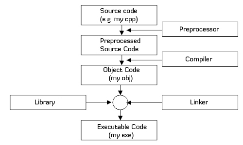

85.   整型变量 `x` 和 `y` 的值相等且为非0值，则下面表达式中结果为零的是 D。

      1.   A、 `x || y` (the logical OR operator)
      2.   B、 `x | y` (the bitwise OR operator，两个操作数必须同时为 0，按位或的结果才为 0)
      3.   C、 `x & y` (the bitwise AND operator，至少有一个操作数为 0，整个按位或操作的结果才可能为 0)
      4.   **D、 `x ^ y`** (the bitwise XOR operator，两个操作数相等则结果必然为 0，不等则结果必然为 1)

      Ref: <https://icarus.cs.weber.edu/~dab/cs1410/textbook/2.Core/bitops.html>

      | `a`  | `b`  | `a & b` |
      | ---- | ---- | ------- |
      | 0    | 0    | 0       |
      | 0    | 1    | 0       |
      | 1    | 0    | 0       |
      | 1    | 1    | 1       |

      | `a`  | `b`  | `a | b` |
      | ---- | ---- | ------- |
      | 0    | 0    | 0       |
      | 0    | 1    | 1       |
      | 1    | 0    | 1       |
      | 1    | 1    | 1       |

      | `a`  | `b`  | `a ^ b` |
      | ---- | ---- | ------- |
      | 0    | 0    | 0       |
      | 0    | 1    | 1       |
      | 1    | 0    | 1       |
      | 1    | 1    | 0       |

86.   以下定义语句中，错误的是 D。 

      1.   A、`int a[] = {1, 2};`

           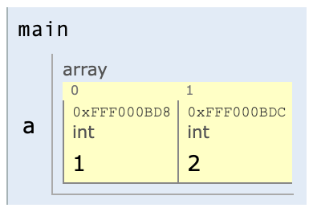

      2.   B、 `char *a[3];`
           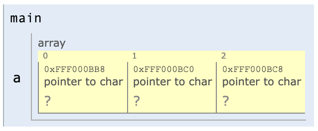

      3.   C、 `char s[10]="test"; `
           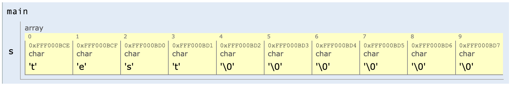

      4.   **D、 `int n = 5, a[n];`** (In standard C, the size of an array must be a constant expression known at compile time. Using a variable 'n' to specify the size of an array is not allowed in standard C. This declaration is incorrect.)

           ``` c
           int n = 5, a[n];
           
           int main() {
               return 0;
           }
           ```

           ```
           error: variably modified 'a' at file scope
           ```


87.   以下程序的输出结果是*(*　D　*)*。

      ``` c
      void main() {
        int x = 10, y = 010;
        printf("%d,%d\n", x --, -- y);
      }
      ```

      1.    A、10,10

      2.   B、9,9

      3.   C、9,7

      4.   **D、10,7**

           <iframe width="800" height="500" frameborder="0" src="https://pythontutor.com/iframe-embed.html#code=%23include%20%3Cstdio.h%3E%0A%0Aint%20main%28%29%20%7B%0A%20%20int%20x%20%3D%2010,%20y%20%3D%20010%3B%0A%20%20printf%28%22%25d,%25d%5Cn%22,%20x%20--,%20--%20y%29%3B%0A%20%20return%200%3B%0A%7D&codeDivHeight=400&codeDivWidth=350&cppShowMemAddrs=true&cumulative=false&curInstr=3&heapPrimitives=nevernest&origin=opt-frontend.js&py=c_gcc9.3.0&rawInputLstJSON=%5B%5D&textReferences=false"> </iframe>


88.   设有数组定义：`char a[] = "China";` 则数组 `a` 所占的空间是 B。
      1.   A、5个字节
      2.   **B、6个字节**
           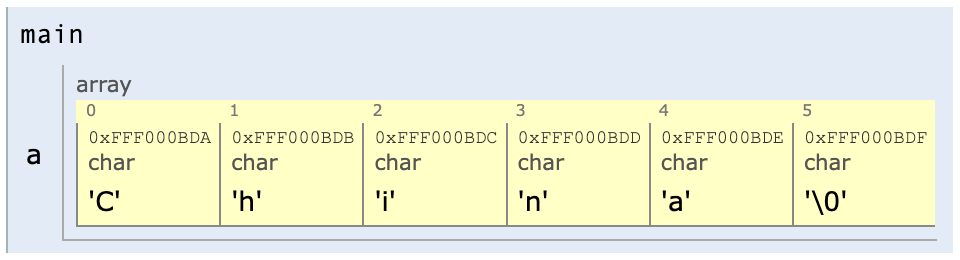
      3.   C、7个字节
      4.   D、8个字节


89.   在定义函数时，函数的返回值类型可以缺省，此时该函数返回值隐含的类型是 A。
      1.   **A、`int`**
      2.   B、`char`
      3.   C、`void`
      4.   D、不确定 


90.   若有说明语句：`int a, b, c, *d = &c;` 则能正确从键盘读入三个整数并分别赋给变量 `a`、`b`、`c` 的语句是 A。

      1.   **A、`scanf("%d%d%d", &a, &b, d);`** 

      2.   B、`scanf("%d%d%d", &a, &b, &d);`

      3.   C、 `scanf("%d%d%d", a, b, d); `

      4.   D、`scanf("%d%d%d", a, b, *d);`

           <iframe width="800" height="500" frameborder="0" src="https://pythontutor.com/iframe-embed.html#code=%23include%20%3Cstdio.h%3E%0A%0Aint%20main%28%29%20%7B%0A%20%20int%20a,%20b,%20c,%20*d%20%3D%20%26c%3B%0A%20%20scanf%28%22%25d%25d%25d%22,%20%26a,%20%26b,%20d%29%3B%0A%20%20return%200%3B%0A%7D&codeDivHeight=400&codeDivWidth=350&cppShowMemAddrs=true&cumulative=false&curInstr=4&heapPrimitives=nevernest&origin=opt-frontend.js&py=c_gcc9.3.0&rawInputLstJSON=%5B%5D&textReferences=false"> </iframe>
           
### 91-100

91.   数组定义 `char a[10] = {'0', '1', '2', '3'};` 包括了 D 个元素。 

      1.   A、4
      2.   B、5
      3.   C、9
      4.   **D、10**
           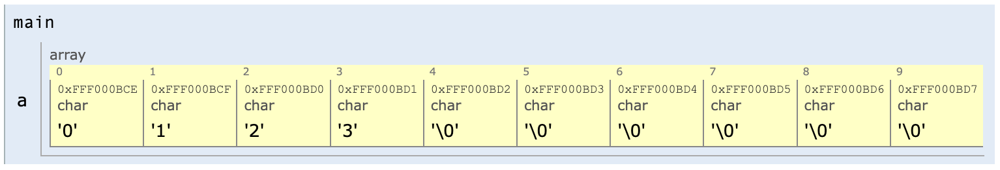

92.   判断 `char` 型变量 `ch` 是否为大写字母的正确表达式是 C。
      1.   A、`'A' <= ch <= 'Z'`
      2.   B、`(ch >= 'A') & (ch <= 'Z')`  (the bitwise AND operator)
      3.   **C、`(ch >= 'A') && (ch <= 'Z')`** 
      4.   D、 `('A' <= ch) AND ('Z' >= ch)`

93.   表达式 `16 / 5 * sqrt(4.0) / 4` 值的数据类型是*(*　C　*)*。 (`sqrt()` 为求平方根函数)
      1.   A、` int`
      2.   B、 `float`
      3.   **C、 `double`**
      4.   D、不正确


94.   下列 C 语句格式错的是 B。
      1.   A、 `int a = 10;`
      2.   **B、 `a = 2：b = 3;`**
      3.   C、 `int a, b, z;`
      4.   D、 `z = a + b;`


95.   C 语言对于嵌套 `if` 语句规定 `else` 总是 A 匹配。
      1.   **A、 与之前最近的不带 `else` 的 `if`**
      2.   B、与之前最近的 `if`
      3.   C、与最外层的 `if`
      4.   D、与最近的 `{ }` 之前的 `if`


96.   以下选项中，与 `k = ++ n` 完全等价的表达式是*(*　B　*)*。
      1.   A、 `k = n,n = n+1`
      2.   **B、 `n = n + 1,k = n`**
      3.   C、 `k = n ++`
      4.   D、 `k += n + 1`


97.   要使下面程序段输出10个整数，则在下划线处填入正确的数是 C。

      ``` c
      for (i = 0; i <=__; )
        printf("%d\n", i += 2);
      ```

      1.   A、 9
      2.   B、 10
      3.   **C、 18**
      4.   D、 20


98.   若 `a` 为 `int` 类型，且其值为5，则执行表达式 `a += a -= a * a` 后，`a` 的值是 B。
      1.   A、 -5
      2.   **B、 -40**
      3.   C、 -15
      4.   D、 不确定


99.   `t` 为 `int` 类型，在进入下面的循环之前，`t` 的值为0：`while (t = 1) { ...... } `则以下叙述中正确的是 B。
      1.   A、 循环控制表达式的值为0
      2.   **B、 循环控制表达式的值为1**
      3.   C、 循环控制表达式不合法
      4.   D、 以上说法都不对


100.   执行程序段：`int a = 1234; printf("%2d\n", a);` 则输出结果是*(*　C　*)*。

       1.   A、 12

       2.   B、 34

       3.   **C、 1234**

       4.   D、 提示出错、无结果
       
       <iframe width="800" height="500" frameborder="0" src="https://pythontutor.com/iframe-embed.html#code=%23include%20%3Cstdio.h%3E%0A//%20%23include%20%3Cmath.h%3E%0A%0Aint%20main%28%29%20%7B%0A%20%20int%20a%20%3D%201234%3B%0A%20%20printf%28%22%252d%5Cn%22,%20a%29%3B%0A%20%20printf%28%22%2520d%5Cn%22,%20a%29%3B%0A%20%20printf%28%22%25-20d%5Cn%22,%20a%29%3B%0A%20%20return%200%3B%0A%7D&codeDivHeight=400&codeDivWidth=350&cumulative=false&curInstr=6&heapPrimitives=nevernest&origin=opt-frontend.js&py=c_gcc9.3.0&rawInputLstJSON=%5B%5D&textReferences=false"> </iframe>

### 101-110

101.   有如下程序，该程序的输出结果是 B。

       ``` c
       main()
       {
         int a = 3, b = -1, c = 1;
         if (a < b)
             if (b < 0) c = 0
             else c ++;
         printf("%d\n", c);
       }
       ```

       1.   A、 0
       2.   **B、 1**
       3.   C、 2
       4.   D、 3


102.   下列可以正确表示字符常量的是(　A　)。
       1.   **A、`'\x41'`**
       2.   B、`\008`
       3.   C、a`
       4.   D、`"a"`


103.   若有如下定义：`int a = 10, *b = &a;` 则 `printf("%d\n",*b);` 的输出结果为 D。

       1.   A、 无确定值
       2.   B、 a的地址
       3.   C、 11
       4.   **D、 10**

       <iframe width="800" height="500" frameborder="0" src="https://pythontutor.com/iframe-embed.html#code=%23include%20%3Cstdio.h%3E%0A%0Aint%20main%28%29%20%7B%0A%20%20int%20a%20%3D%2010,%20*b%20%3D%20%26a%3B%0A%20%20printf%28%22%25d%5Cn%22,*b%29%3B%0A%20%20return%200%3B%0A%7D&codeDivHeight=400&codeDivWidth=350&cumulative=false&curInstr=4&heapPrimitives=nevernest&origin=opt-frontend.js&py=c_gcc9.3.0&rawInputLstJSON=%5B%5D&textReferences=false"> </iframe>

104.   运行下面程序：若从键盘输入58↙则输出结果是 B。

       ``` c
       main () {
         int x;
         scanf("%d", &x);
         if (x > 60) printf("%d", x);
         if (x > 50) printf("%d", x);
         if (x > 40) printf("%d", x);
         if (x > 30) printf("%d", x);
       }
       ```

       1.   A、 58585858
       2.   **B、585858**
       3.   C、 5858
       4.   D、 58

       <iframe width="800" height="500" frameborder="0" src="https://pythontutor.com/iframe-embed.html#code=%23include%20%3Cstdio.h%3E%0A%0Aint%20main%28%29%20%7B%0A%20%20int%20x%20%3D%2058%3B%0A%20%20if%20%28x%20%3E%2060%29%20printf%28%22%25d%22,%20x%29%3B%0A%20%20if%20%28x%20%3E%2050%29%20printf%28%22%25d%22,%20x%29%3B%0A%20%20if%20%28x%20%3E%2040%29%20printf%28%22%25d%22,%20x%29%3B%0A%20%20if%20%28x%20%3E%2030%29%20printf%28%22%25d%22,%20x%29%3B%0A%20%20return%200%3B%0A%7D&codeDivHeight=400&codeDivWidth=350&cumulative=false&curInstr=7&heapPrimitives=nevernest&origin=opt-frontend.js&py=c_gcc9.3.0&rawInputLstJSON=%5B%5D&textReferences=false"> </iframe>

105.   以下程序的输出结果是 D。

       ``` c
       #include <stdio.h>
       
       main() {
         int a = 2, b = 5;
         printf("a=%%d,b=%%d\n", a, b);
       }
       ```

       1.   A、`a=%2,b=%5`
       2.   B、`a=2,b=5`
       3.   C、`a=%%d,b=%%d`
       4.   **D、`a=%d,b=%d`**

       ```
       Compiler warnings:
       gcc-9 -std=gnu17 -Wall -Wno-unused-variable -Wno-unused-but-set-variable -Wno-main
       
        In function 'main':
       5:10: warning: too many arguments for format [-Wformat-extra-args]
           5 |   printf("a=%%d,b=%%d\n", a, b);
             |          ^~~~~~~~~~~~~~~
       
       ```

       <iframe width="800" height="500" frameborder="0" src="https://pythontutor.com/iframe-embed.html#code=%23include%20%3Cstdio.h%3E%0A%0Aint%20main%28%29%20%7B%0A%20%20int%20a%20%3D%202,%20b%20%3D%205%3B%0A%20%20printf%28%22a%3D%25%25d,b%3D%25%25d%5Cn%22,%20a,%20b%29%3B%0A%20%20return%200%3B%0A%7D&codeDivHeight=400&codeDivWidth=350&cumulative=false&curInstr=4&heapPrimitives=nevernest&origin=opt-frontend.js&py=c_gcc9.3.0&rawInputLstJSON=%5B%5D&textReferences=false"> </iframe>

106.   若有以下程序段，执行后的输出结果是 A。TODO

       ``` c
       char *s1 = "BEIJING", *s2 = "SHANGHAI";
       printf("%ld", strlen(strcpy(s1, s2)));
       ```

       1.   **A、 8**
       2.   B、 7
       3.   C、 15
       4.   D、 9

       <iframe width="800" height="500" frameborder="0" src="https://pythontutor.com/iframe-embed.html#code=%23include%20%3Cstdio.h%3E%0A%23include%20%3Cstring.h%3E%0A%0Aint%20main%28%29%20%7B%0A%20%20char%20*s1%20%3D%20%22BEIJING%22,%20*s2%20%3D%20%22SHANGHAI%22%3B%0A%20%20printf%28%22%25ld%22,%20strlen%28strcpy%28s1,%20s2%29%29%29%3B%0A%20%20return%200%3B%0A%7D&codeDivHeight=400&codeDivWidth=350&cumulative=false&curInstr=3&heapPrimitives=nevernest&origin=opt-frontend.js&py=c_gcc9.3.0&rawInputLstJSON=%5B%5D&textReferences=false"> </iframe>

107.   C 语言中，要求参加运算的数必须是整数或字符的运算符是 C。

       1.   A、`/` (**/** is the division operator and can be used for **both integers and floating-point numbers**.)
       2.   B、`!` (**!** is the logical NOT operator and is used **with Boolean operands, not integers or characters**.)
       3.   **C、`%`** (**%** is the modulo operator, used with integer operands to return the remainder of division. It specifically requires operands to be integers or characters.)
       4.   D、`=` (**=** is the assignment operator and is used for assigning values to variables, **not for arithmetic operations**.)

       <iframe width="800" height="500" frameborder="0" src="https://pythontutor.com/iframe-embed.html#code=int%20main%28%29%20%7B%0A%20%20char%20A%20%3D%20'A'%3B%0A%20%20char%20a%20%3D%20'a'%3B%0A%20%20int%20res%20%3D%20a%20%25%20A%3B%0A%20%20return%200%3B%0A%7D&codeDivHeight=400&codeDivWidth=350&cumulative=false&curInstr=3&heapPrimitives=nevernest&origin=opt-frontend.js&py=c_gcc9.3.0&rawInputLstJSON=%5B%5D&textReferences=false"> </iframe>

108.   函数 `fabs(x)` 的功能是 B。
       1.   A、对 `x` 取整
       2.   **B、对 `x` 取绝对值**
            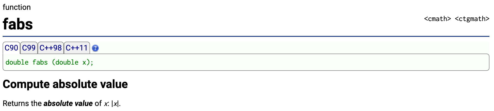
       3.   C、对 `x` 取平方根
       4.   D、计算 `x` 的平方

109.   若有程序段如下，执行该程序段后，`a` 的值是 C。

       ``` c
       int main() {
         int *p, a = 6, b = 1;
         p = &a;
         *p = 10;
         a = a + b;
         return 0;
       }
       ```

       1.   A、7
       2.   B、10
       3.   **C、11**
       4.   D、20

       <iframe width="800" height="500" frameborder="0" src="https://pythontutor.com/iframe-embed.html#code=int%20main%28%29%20%7B%0A%20%20int%20*p,%20a%20%3D%206,%20b%20%3D%201%3B%0A%20%20p%20%3D%20%26a%3B%0A%20%20*p%20%3D%2010%3B%0A%20%20a%20%3D%20a%20%2B%20b%3B%0A%20%20return%200%3B%0A%7D&codeDivHeight=400&codeDivWidth=350&cumulative=false&curInstr=5&heapPrimitives=nevernest&origin=opt-frontend.js&py=c_gcc9.3.0&rawInputLstJSON=%5B%5D&textReferences=false"> </iframe>

110.   结构化程序设计规定的 3 种基本控制结构是 D。
       1.   A、顺序、选择和转向
       2.   B、层次、网状和循环 
       3.   C、模块、选择和循环
       4.   **D、顺序、选择和循环**

### 111-120

111.   C 标准库函数中，数学函数的原型在头文件中 B。
       1.   A、stdio.h
            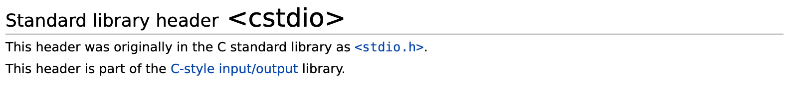
       2.   **B、math.h**
            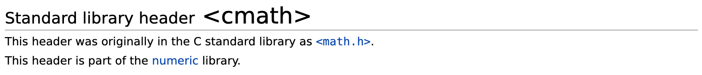
       3.   C、string.h
            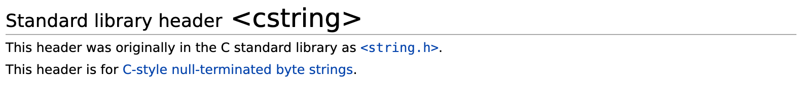
       4.   D、ctype.h
            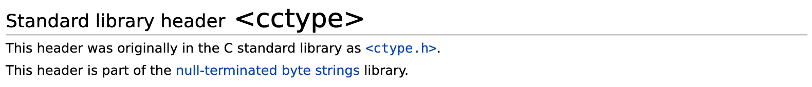


112.   设有语句 `int a[] = {3, 4, 5, 9, 8, 7};`，则表达式 `a[1] - a[4]` 的值是 A。
       1.   **A、-4**
            
       2.   B、6
       3.   C、 -6
       4.   D、2


113.   运行如下程序，则输出结果是 C。

       ``` c
       #include <stdio.h>
       
       int main () {
         int i, x[3][3] = {1, 2, 3, 4, 5, 6, 7, 8, 9};
         for (i = 0; i < 3; i ++ )
           printf("%d,", x[i][2-i]);
         return 0;
       }
       ```

       ```
       Compiler warnings:
       gcc-9 -std=gnu17 -Wall -Wno-unused-variable -Wno-unused-but-set-variable -Wno-main
       
        In function 'main':
       4:20: warning: missing braces around initializer [-Wmissing-braces]
           4 |   int i, x[3][3] = {1, 2, 3, 4, 5, 6, 7, 8, 9};
             |                    ^
             |                     {      } {      } {      }
       
       ```

       1.   A、 1,5,9,
       2.   B、 1,4,7,
       3.   **C、 3,5,7,**
       4.   D、3,6,9,

       <iframe width="800" height="500" frameborder="0" src="https://pythontutor.com/iframe-embed.html#code=%23include%20%3Cstdio.h%3E%0A%0Aint%20main%20%28%29%20%7B%0A%20%20int%20i,%20x%5B3%5D%5B3%5D%20%3D%20%7B1,%202,%203,%204,%205,%206,%207,%208,%209%7D%3B%0A%20%20for%20%28i%20%3D%200%3B%20i%20%3C%203%3B%20i%20%2B%2B%20%29%0A%20%20%20%20printf%28%22%25d,%22,%20x%5Bi%5D%5B2-i%5D%29%3B%0A%20%20return%200%3B%0A%7D&codeDivHeight=400&codeDivWidth=350&cumulative=false&curInstr=9&heapPrimitives=nevernest&origin=opt-frontend.js&py=c_gcc9.3.0&rawInputLstJSON=%5B%5D&textReferences=false"> </iframe>

114.   若定义 `union ex {int i; float f; char a[10];} x;`则 `sizeof(x)` 的值是*(*　D　*)*。
       1.   A、4
       2.   B、6
       3.   **C、10** (The `sizeof` operator returns the size in bytes of the largest member in the union. In this case, it will return the size of the largest member, which is the character array `a[10]` since it takes up more space than an integer or a float. The size of `x` will be the same as the size of the character array `a`, which is 10 bytes.)
       4.   D、18


115.   设有定义 `enum team {my, your=3, his, her = his + 5};` 则枚举元素 `my`,`your`,`her` 的值分别是 C。

       1.    A、032
       2.   B、134
       3.   **C、039**
       4.   D、035

       <iframe width="800" height="500" frameborder="0" src="https://pythontutor.com/iframe-embed.html#code=%23include%20%3Cstdio.h%3E%0A%0Aint%20main%20%28%29%20%7B%0A%20%20enum%20team%20%7Bmy,%20your%20%3D%203,%20his,%20her%20%3D%20his%20%2B%205%7D%3B%0A%20%20%0A%20%20printf%28%22my%3A%20%25d%5Cn%22,%20my%29%3B%0A%20%20printf%28%22your%3A%20%25d%5Cn%22,%20your%29%3B%0A%20%20printf%28%22his%3A%20%25d%5Cn%22,%20his%29%3B%0A%20%20printf%28%22her%3A%20%25d%5Cn%22,%20her%29%3B%0A%20%20%0A%20%20return%200%3B%0A%7D&codeDivHeight=400&codeDivWidth=350&cumulative=false&curInstr=5&heapPrimitives=nevernest&origin=opt-frontend.js&py=c_gcc9.3.0&rawInputLstJSON=%5B%5D&textReferences=false"> </iframe>

116.   已知赋值语句 `Wang.year=2015;` 判断 `Wang` 是 B 类型的变量。 

       1.   A、字符或文件
       2.   **B、共用体或结构体**
       3.   C、整型和枚举
       4.   D、实型或指针

       <iframe width="800" height="500" frameborder="0" src="https://pythontutor.com/iframe-embed.html#code=%23include%20%3Cstdio.h%3E%0A%0A//%20Define%20a%20sample%20structure%20%28assumption%29%0Astruct%20Person%20%7B%0A%20%20%20%20int%20year%3B%0A%7D%3B%0A%0Aint%20main%28%29%20%7B%0A%20%20%20%20//%20Declare%20a%20variable%20Wang%20of%20type%20assumed%20structure%0A%20%20%20%20struct%20Person%20Wang%3B%0A%0A%20%20%20%20//%20Assign%20a%20value%20to%20the%20year%20member%0A%20%20%20%20Wang.year%20%3D%202015%3B%0A%0A%20%20%20%20//%20Output%20a%20message%20indicating%20Wang's%20type%20based%20on%20the%20assumption%0A%20%20%20%20printf%28%22commonly%20used%20for%20structures%20or%20unions%5Cn%22%29%3B%0A%0A%20%20%20%20return%200%3B%0A%7D&codeDivHeight=400&codeDivWidth=350&cumulative=false&curInstr=4&heapPrimitives=nevernest&origin=opt-frontend.js&py=c_gcc9.3.0&rawInputLstJSON=%5B%5D&textReferences=false"> </iframe>

117.   有如下函数调用语句: `func(rec1, rec2 + rec3, (rec4, rec5, rec6));` 则该函数调用语句中，含有的实参个数是 A。

       1.   **A、 3**
       2.   B、 4
       3.   C、 5
       4.   D、 6

       <iframe width="800" height="500" frameborder="0" src="https://pythontutor.com/iframe-embed.html#code=%23include%20%3Cstdio.h%3E%0A%0Aint%20main%28%29%20%7B%0A%20%20%20%20int%20a%20%3D%20%281,%202,%203%29%3B%0A%20%20%20%20return%200%3B%0A%7D&codeDivHeight=400&codeDivWidth=350&cumulative=false&curInstr=2&heapPrimitives=nevernest&origin=opt-frontend.js&py=c_gcc9.3.0&rawInputLstJSON=%5B%5D&textReferences=false"> </iframe>

118.   在调用函数时，如果实参是简单变量，它与对应形参之间的数据传递方式是*(*　C　*)*。TODO
       1.   A、地址传递
       2.   **B、单向值传递**   
       3.   C、传递方式由用户指定
       4.   D、由实参传给形参，再由形参传给实参


119.   C 语言中的函数*(*　B　*)*。TODO
       1.   A、可以嵌套定义
       2.   B、不可以嵌套调用 
       3.   C、可以嵌套调用，但不能递归调用
       4.   **D、嵌套调用和递归调用均可**

120.   运行如下程序，输出是 B。

       ``` c
       #include <stdio.h>
       int fun(int n) {
         int t;
         if (n == 0 || n == 1) t = 1;
         else t = n - fun(n - 1);
         return t;
       }
       
       int main() {
         printf("%d\n", fun(3));
       }
       ```
       
       1.   A、 1
       2.   **B、 2**
       3.   C、3
       4.   D、4
       
       <iframe width="800" height="500" frameborder="0" src="https://pythontutor.com/iframe-embed.html#code=%23include%20%3Cstdio.h%3E%0Aint%20fun%28int%20n%29%20%7B%0A%20%20int%20t%3B%0A%20%20if%20%28n%20%3D%3D%200%20%7C%7C%20n%20%3D%3D%201%29%20t%20%3D%201%3B%0A%20%20else%20t%20%3D%20n%20-%20fun%28n%20-%201%29%3B%0A%20%20return%20t%3B%0A%7D%0A%0Aint%20main%28%29%20%7B%0A%20%20printf%28%22%25d%5Cn%22,%20fun%283%29%29%3B%0A%7D&codeDivHeight=400&codeDivWidth=350&cumulative=false&curInstr=0&heapPrimitives=nevernest&origin=opt-frontend.js&py=c_gcc9.3.0&rawInputLstJSON=%5B%5D&textReferences=false"> </iframe>


---

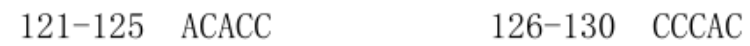

### 121-130

*参考：<https://faculty.winthrop.edu/dannellys/csci325/02_c_IO.htm>*

*参考：<https://users.cs.utah.edu/~germain/PPS/Topics/C_Language/file_IO.html>*

*参考：<https://www.sas.upenn.edu/~saul/parasite/man/man3/fclose.3.html>*

*参考：<https://www.sas.upenn.edu/~saul/parasite/man/man2/exit.2.html>*

*参考：<https://cs50.harvard.edu/ap/2020/assets/pdfs/file_io.pdf>*

121.   在 C 语言中，形参的缺省存储类型是 A。
       1.   **A、 auto**
       2.   B、 register
       3.   C、 static
       4.   D、 extern
       
       术语：存储类型（Storage Classes）
       
       在 C 语言中，形参的缺省存储类型是 **auto**。在函数定义中，如果未显式指定形参的存储类型（如 auto、register、static、extern），则形参默认为 auto 存储类型。auto 存储类型意味着形参的生命周期与函数调用的生命周期相同，并且它们在函数调用结束时被销毁。


122.   在 C 程序中，可把整型数以二进制形式存放到文件中的函数是 C。 TODO
       1.   A、 fprintf函数
       2.   B、 fread函数
       3.   **C、 fwrite函数**
       4.   D、 fputc函数


123.   下列属于 C 语言合法字符常数的是 A。
       1.   **A、`'\\'`** (**Character Constant**, **Escape Sequences**)
       2.   B、`"B"` (**String Literal**)
       3.   C、`'\xk2'` (**Numeric Escape Sequences**)
       
            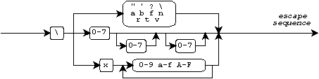
       4.   D、`"\0"` (**String Literal**)
       
124.   函数调用语句 `fseek(fp,10,1)` 的含义是 C。
       1.   A、将文件指针移到距离文件头10个字节处 
       2.   B、将文件指针移到距离文件尾10个字节处 
       3.   **C、将文件指针从当前位置后移10个字节** 
       4.   D、将文件指针从当前位置前移10个字节


125.   在 C 语言中，用 `w+`方式打开一个文件后，可以执行的文件操作是 C。

       1.   A、可任意读写
       2.   B、只读
       3.   **C、只能先写后读**
       4.   D、只写 \


126.   以下 C 符合 C 语言语法的赋值表达式。QUES
       1.   A、`d = 8 + e + f = d + a`
       2.   B、8 + e = f =d `
       3.   **C、`d = f = 8 + e ++`**
       4.   D、`d = 8 + e ++ = d + 7`


127.   下列程序执行后的输出结果是 C。
       
       ``` c
       #include <stdio.h>
       #define MA(x) x * (x + 1)
       
       int main() {
         int a = 2, b = 3;
         printf("%d \n", MA(1 + a + b)); // 1 + a + b * (1 + a + b + 1) => 3 + 3 * 7 = 3 + 21 = 24
       }
       ```
       
       1.   A、 6
       2.   B、 8
       3.   **C、 24**
       4.   D、 42
       
       *参考：<https://ld2009.scusa.lsu.edu/cppreference/preprocessor/define.html>*

128.   执行语句：`for(i = 1; i ++ < 4; );` 后，变量 `i` 的值是 C。
       1.   A、3
       2.   B、4
       3.   **C、5**
       4.   D不定

129.   当顺利执行了文件关闭操作时，`fclose` 函数的返回值是 A。
       1.   **A、0**
       2.   B、Ture
       3.   C、-1
       4.   D、1

       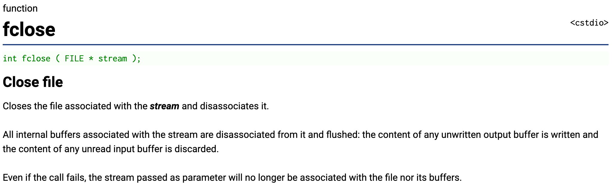
       
       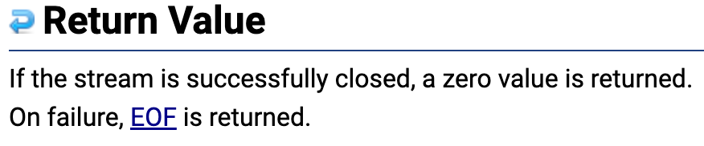
       
130.   下列语句中，不能将文件型指针 `fp` （`FILE *stream;`）指向的文件内部指针置于文件头的语句是 C。 (注：假定能正确打开文件)  TODO
       1.   A、`fp = fopen("abc.dat", "w");`
       2.   B、`rewind(fp);`
       3.   **C、`feof(fp);`**
       4.   D、`fseek(fp, 0L, 0)`

### 131-140

131.   下面程序的输出结果是 A。

       ``` c
       #include <stdio.h>
       
       int main() {
         int x = 5, y = 9, z = 1, t;
         t = (x > y || x > z); // 5 > 9 || 5 > 1
         printf("%d\n", t);
         return 0;
       }
       ```

       1.   **A、1**
       2.   B、0
       3.   C、5
       4.   D、3

132.   下列程序执行后的输出结果是 C。

       ``` c
       #include <stdio.h>
       
       int main() {
         int x = 'd';
         printf("%c\n", 'A' + (x - 'a' + 1)); // 65 + 99 - 96 + 1 = 69
         return 0;
       }
       
       //	65	66	67	68	69
       //	A		B		C		D		E
       
       //	96	97	98	99	100
       //	a		b		c		d		e
       ```

       1.   A、G
       2.   B、H
       3.   **C、E**
       4.   D、J

133.   下面能正确进行**字符串**赋值操作的语句是 C。 QUES
       1.   A、`char s[5] = {"\ABCDE"};` 
       2.   B、`char s[5] = {'A', 'B', 'C', 'D', 'E'}; `
       3.   **C、`char *s; s = {"ABCDEF"}; `**  
       4.   D、`char *s; scanf("%s",s);`

134.   下列程序执行后的输出结果是 B。

       ``` c
       #include <stdio.h>
       
       int main() {
         char arr[2][5];
         strcopy(arr, "love");
         strcpy(arr[1], "your");
         arr[0][4] = '$';
         printf("%s\n", arr);
         return 0;
       }
       ```

       1.   A、`love`
       2.   **B、`love$you`**
       3.   C、`you`
       4.   D、`$you`

       <iframe width="800" height="500" frameborder="0" src="https://pythontutor.com/iframe-embed.html#code=%23include%20%3Cstdio.h%3E%0A%23include%20%3Cstring.h%3E%0A%0Aint%20main%28%29%20%7B%0A%20%20char%20arr%5B2%5D%5B5%5D%3B%0A%20%20strcpy%28arr,%20%22love%22%29%3B%0A%20%20strcpy%28arr%5B1%5D,%20%22you%22%29%3B%0A%20%20arr%5B0%5D%5B4%5D%20%3D%20'%24'%3B%0A%20%20printf%28%22%25s%5Cn%22,%20arr%29%3B%0A%20%20return%200%3B%0A%7D&codeDivHeight=400&codeDivWidth=350&cppShowMemAddrs=true&cumulative=false&curInstr=6&heapPrimitives=nevernest&origin=opt-frontend.js&py=c_gcc9.3.0&rawInputLstJSON=%5B%5D&textReferences=false"> </iframe>

135.   设有说明语句：`char a = '\72';` 则变量 `a` B。

       1.   **A、包含1个字符**

            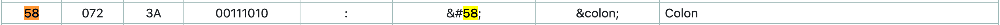

            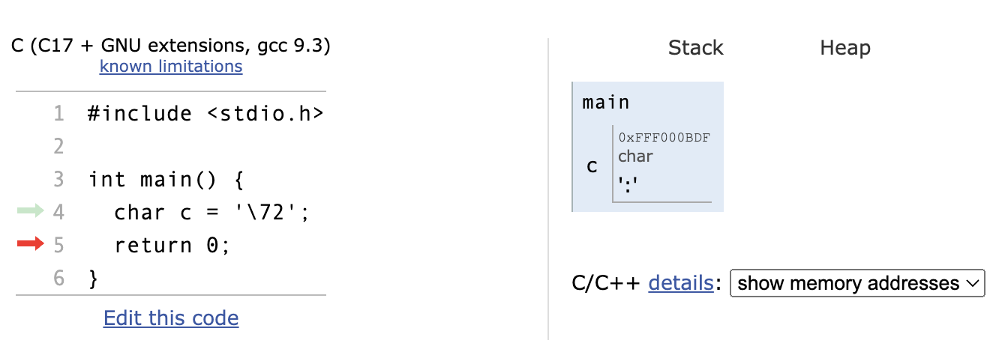

       2.   B、包含2个字符

       3.   C、包含3个字符

       4.   D、说明不合法


136.   有如下程序段，执行该程序段后，`x` 的值为 D。

       ``` c
       int a = 14, b = 15, x;
       char c = 'A';
       x = (a && b) && (c < 'B');
       ```

       1.   A、`ture`
       2.   B、`false`
       3.   C、 0
       4.   **D、 1**

137.   若变量 `a` 是 `int` 类型，执行语句：`a = 'A' + 1.6;` 后，正确的叙述是 D。 
       1.   A、`a` 的值是字符 `C`
       2.   B、`a` 的值是浮点型
       3.   C、不允许字符型和浮点型相加
       4.   **D、`a` 的值是字符 `'A'` 的 ASCII 值加 1**

138.   下面程序段的输出结果是 D。

       ``` c
       char s[] = "\\\101\111abc\0";
       printf("%s\n", s);
       
       // `\\` => `\`
       // `\101` => ``
       // `\111` => ``
       // `\0` => the null character
       
       // octal: 100 = 10 * 10 => 8 * 8 = 64
       // octal: 101 => 65
       // octal: 111 => 100 + 11 => 64 + 9 = 73
       
       // 65 66 67 68 69 70 71 72 73
       // A	B	 C  D  E  F  G  H  I
       ```

       1.   A、 `\AIabc\0`
       2.   B、 `\101\111\abc\0 `
       3.   C、` \101\111\abc`
       4.   **D、`\AIabc`**

       *参见：https://www.mers.byu.edu/docs/standardC/charset.html*

       

       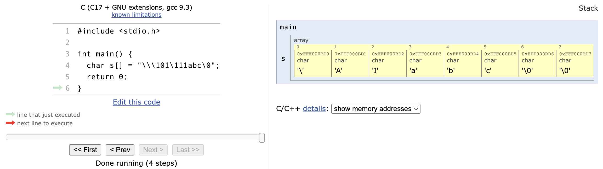

139.   运行下面程序：则输出结果是 B。

       ``` c
       #include <stdio.h>
       
       int main() {
         char c[][6] = {"AAAA", "BBB", "CCC", "DDD"};
         printf("\"%s\"\n", c[1]);
       } 
       ```

       1.   A、"AAAA"
       2.   **B、"BBB"**
       3.   C、"BBBCCC"
       4.   D、"CCCDDD"

       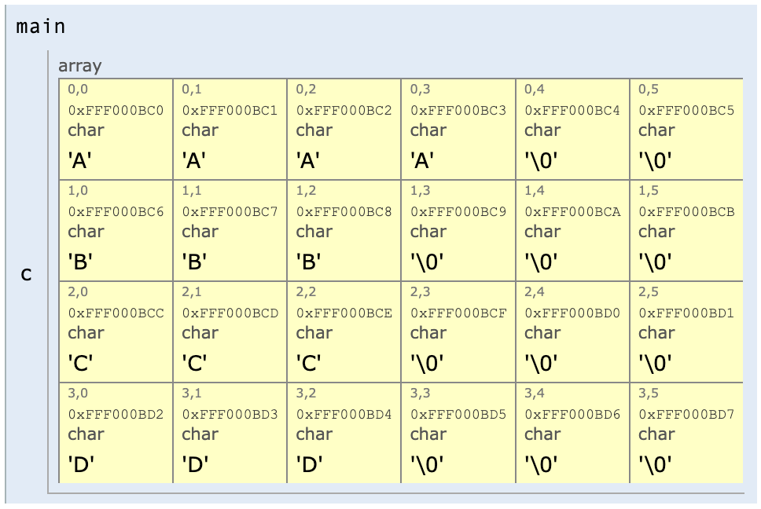

140.   下面程序的输出结果是 B。

       ``` c
       #include <stdio.h>
       
       int main() {
         int x = 177;
         printf("%o\n", x);
         return 0;
       }
       ```

       1.   A、177
       2.   **B、261** (考点：十进制转八进制)
       3.   C、-61
       4.   D、61

### 141-150

141.   下面程序的输出结果是 D。

       ``` c
       #include <stdio.h>
       
       int main() {
         int x = 10;
         x += (x = 8);
         printf("%d\n", x);
         return 0;
       }
       
       // 1. x = 10
       // 2. x = 8
       // 3. x += 8
       // 4. x = x + 8 = 8 + 8 = 16
       ```

       1.   A、 10
       2.   B、 8
       3.   C、18
       4.   **D、16**

142.   下面程序的输出结果是 C。

       ``` c
       #include <stdio.h>
       
       int main() 
       {
         int s, k;
         for (s = 1, k = 2; k < 5; k ++)
           s += k;
         printf("%d\n", s);
       }
       
       //        0		1		2		3		4
       // int s	?		1		3		6		10
       // int k	?		2		3		4		5
       ```

       1.   A、 1
       2.   B、 9
       3.   **C、10**
       4.   D、 15

143.   运行下面程序：则输出结果是 A。

       ``` c
       #include <stdio.h>
       
       int main() {
         int k = 3, i = 2, m;
         m = (k -= i *= k);
         printf("%d %d %d\n", m, k, i);
         return 0;
       }
       
       //
       // int k		3		-3
       // int i		2		6
       // int m		-3
       // 1. i = i * k = 2 * 3 = 6
       // 2. k = k - i = 3 - 6 = -3
       // 3. m = k = -3
       ```

       1.   **A、-3 -3 6**
       2.   B、-1 -1 6
       3.   C、3 3 6
       4.   D、1 1 1


144.   设 `x`、`y` 均为变量，且 `x = 5`，`y = 4`，则下面语句的输出结果是 D。

       ``` c
       printf("%d,%d\n", x --, -- y);
       
       //					0		1
       // int x		5		4
       // int y		4		3
       ```

       1.   A、`5,4`

       2.   B、`4,4`

       3.   C、`4,3`

       4.   **D、`5,3`**

145.   以下叙述正确的是 D。 

       1.   A、do-while 语句构成的循环不能用其它语句构成的循环来代替。
       2.   B、do-while 语句构成的循环只能用 break 语句退出。
       3.   C、用 do-while 语句构成的循环，在 while 后的表达式为非零时结束循环。 
       4.   D、用 do-while 语句构成的循环，在 while 后的表达式为零时结束循环。


146.   若有语句 `scanf("%d%d", &a, &b);`要使变量 `a`, `b` 分别得到10和20，正确的输入形式为 A。
       1.   **A、10 20**
       2.   B、10,20
       3.   C、1020
       4.   D、10:20


147.   若 `k` 为整型变量，则下面 `while` 循环执行的次数为 A。 

       ``` c
       k = 10;
       while(k == 0)
         	k = k - 1;
       ```

       1.   **A、0次**
       2.   B、1次
       3.   C、10次
       4.   D、无限次


148.   有如下程序，该程序的输出结果是 B。

       ``` c
       #include <stdio.h>
       
       int fib (int n) {
         if (n > 2)
           return (fib(n - 1) + fib(n - 2));
         else
           return (2);
       }
       
       int main() {
         printf("%d\n", fib(3));
         return 0;
       }
       
       // fib(3) = fib(2) + fib(1)
       
       // fib(1) = 2
       // fib(2) = 2
       
       // fib(3) = 2 + 2 = 4
       ```

       1.   A、 2
       2.   **B、 4**
       3.   C、6
       4.   D、 8


149.   设 `x`、`y`、`t` 均为 `int` 型变量，则执行语句：`x = y = 2; t = ++ x || ++ y;` 后，`y` 的值为 B。

       1.   A、 不确定
       2.   **B、 2**
       3.   C、 3
       4.   D、 1
       
       ```
       int x		2
       int y		2
       int t		1
       ```

150.   有以下程序段: `int k = 0; while(k) k ++;` 则 `while` 循环执行的次数是 C。
       1.   A、无限次
       2.   B、有语法错，不能执行 
       3.   **C、一次也不执行**
       4.   D、执行1次


### 151-160

151.   函数 `strlen("1234\0xy")` 的值为 C。 

       ``` c
       #include <string.h>
       
       int main() {
         int len = strlen("1234\0xy");
         return 0;
       }
       ```

       1.   A、7
       2.   B、8
       3.   **C、4**
       4.   D、9

       <iframe width="800" height="500" frameborder="0" src="https://pythontutor.com/iframe-embed.html#code=%23include%20%3Cstring.h%3E%0A%0Aint%20main%28%29%20%7B%0A%20%20char%20*s%20%3D%20%221234%5C0xy%22%3B%0A%20%20int%20len%20%3D%20strlen%28s%29%3B%0A%20%20return%200%3B%0A%7D&codeDivHeight=400&codeDivWidth=350&cumulative=false&curInstr=4&heapPrimitives=nevernest&origin=opt-frontend.js&py=c_gcc9.3.0&rawInputLstJSON=%5B%5D&textReferences=false"> </iframe>

152.   以下存储类型只有在使用时才为该类型变量分配内存的是 B。
       1. A、`auto` 和 `static`
       2. **B、`auto` 和 `register`**
       3. C、`register` 和 `static`
       4. D、`static` 和 `extern`

       Storage classes.

       *参考：<https://sceweb.sce.uhcl.edu/helm/WEBPAGE-C/my_files/TableContents/Module-8/module8page.html>*

153.   有以下定义 `#include char a[10], *b = a;` 不能给 `a` 数组输入字符串的语句是 B。
       1. A、`gets(a);`
       2. **B、`gets(a[0]);`**

           ```
           gets.c:9:8: warning: incompatible integer to pointer conversion passing 'char' to parameter of type 'char *'; take the address with & [-Wint-conversion]
             gets(a[0]);
                  ^~~~
                  &
           /Library/Developer/CommandLineTools/SDKs/MacOSX.sdk/usr/include/stdio.h:164:18: note: passing argument to parameter here
           char    *gets(char *);
                               ^
           ```
       3. C、`gets(&a[0]);`
       4. D、`gets(b);`

154.   下列运算符中优先级最高的是 B。
       1. A、`<` (`>`, `>=`, `<=`, 5)
       2. **B、 `+`** (`-`, 4)
       3. C、 `&&`  (AND, 7)
       4. D、 `!=` (`==`, 6)

       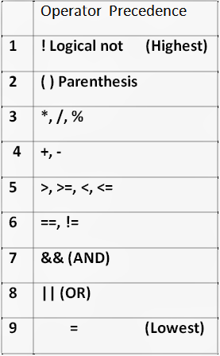

155.   已知 `x = 43, ch = 'A', y = 0;` 则表达式 `x = y && ch < 'B' && !y` 的值是 A。
       1. **A、0**
       2. B、语法错
       3. C、 1
       4. D、 "假"

       ```
       y = 0, y => 0
       ch = 'A' = 65, ch < 'B' = 66, 65 < 66 => 1
       y = 0, !y = 1 => 1
       ----
       A: 65
       Z: 90
       a: 97
       z: 122
       ---
       
       9. `=` lowest (operator precedence)
       ```

156.   若希望当 `A` 的值为奇数时，表达式的值为"真"。`A` 的值为偶数时，表达式的值为"假"。 则以下能满足要求的表达式是 。TODO QUES
       1. A、`A % 2 == 1`
       2. B、`!(A % 2 == 0)`
       3. **C、`!(A % 2)`**
       4. D、`A % 2`

157. 执行以下语句后 `b` 的值为 A。

     ``` c
     int a, b, c;
     a = b = c = 1;
     ++ a || ++ b && ++ c;
     ```

     1. **A、1**
     2. B、2
     3. C、 错误
     4. D、0
158.   不合法的常量是 B。
       1.   A、 `'\2'`
            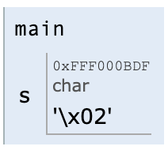
       2.   **B、 `'""'`(外面是单引号)**
       3.   C、 `" "`
       4.   D、`"\483"`

159.   若有以下定义 `char s = '\092';` ，则该语句 B。
       1. A、使 `s` 的值包含一个字符
       2. **B、定义不合法，`s` 的值不确定**
       3. C、使 `s` 的值包含4个字符
       4. D、使 `s` 的值包含3个字符

       ```
       Compiler warnings:
       gcc-9 -std=gnu17 -Wall -Wno-unused-variable -Wno-unused-but-set-variable -Wno-main
       
        In function 'main':
       4:15: warning: multi-character character constant [-Wmultichar]
           4 |     char ch = '\092';
             |               ^~~~~~
       4:15: warning: overflow in conversion from 'int' to 'char' changes value from '14642' to '50' [-Woverflow]
       ```
       
160.   执行下列语句后 `f` 的值是 B。

       ``` c
       float f = 3.9;
       int a = 4;
       f = (int) f + a;
       // (int)f = 3
       ```

       1.   A、 7.9
       2.   **B、 7.0**
       3.   C、 7
       4.   D、 出错

       *参考：<https://sceweb.sce.uhcl.edu/helm/WEBPAGE-C/my_files/TableContents/Module-25/module25page.html>*

       ```c
       // the cast operator:
       (type_name) expression
       ```

## 判断


### 161-170


-   [ ] **文件**是一个具有符号名的一组相关联元素的集合，<u>可以有序，也可以无序</u>。

>   所谓“文件”是指一组相关数据的**有序集合**。这个数据集有一个名称，叫做文件名。实际上在前面的各章中我们已经多次使用了文件，例如源程序文件、目标文件、可执行文件、 库文件 (头文件)等。
>
>
>   参考：http://course.sdu.edu.cn/Download/304d780b-c355-4abf-a217-b0813b22cabf.pdf

-   [x] 软件项目可行性分析的研究内容包括：技术可行性、经济可行性、运行可行性以及法律可行性等。

>   1.  **技术可行性**
>   2.  **经济可行性**
>   3.  运行可行性（用户使用可行性，操作可行性）
>   4.  法律可行性

-   [ ] 计算机网络中，每台计算机是相互依赖的。TODO
-   [ ] 计算机网络的主要目的是突破地域范围的限制，<u>实现集中管理</u>。

>   计算机网络是根据应用的需要发展而来的，从本质上说，它应是以**资源共享**为其主要目的， 发挥分散的、各不相连的计算机之间的协同功能。
>
>
>   参考：http://www.tup.tsinghua.edu.cn/upload/books/yz/022139-01.pdf

-   [x] 知识产权包括著作权和工业产权两部分。

>   **知识产权**（英语：intellectual property），是人类用智慧创造出来的无形的[财产](https://zh.wikipedia.org/wiki/财产)，主要涉及[著作权](https://zh.wikipedia.org/wiki/著作權)、[专利](https://zh.wikipedia.org/wiki/专利)、[商标](https://zh.wikipedia.org/wiki/商标)等领域。[[1\]](https://zh.wikipedia.org/zh-hans/知识产权#cite_note-1) [音乐](https://zh.wikipedia.org/wiki/音乐)和[文学](https://zh.wikipedia.org/wiki/文学)等形式的[艺术](https://zh.wikipedia.org/wiki/艺术)作品，以及一些发现、[发明](https://zh.wikipedia.org/wiki/发明)、[词语](https://zh.wikipedia.org/wiki/词语)、词组、[符号](https://zh.wikipedia.org/wiki/符号)、设计都能被当作知识财产而受到保护。[[2\]](https://zh.wikipedia.org/zh-hans/知识产权#cite_note-2)[[3\]](https://zh.wikipedia.org/zh-hans/知识产权#cite_note-3) **知识产权可以分为[工业产权](https://zh.wikipedia.org/wiki/工業產權)与[版权](https://zh.wikipedia.org/wiki/版权)两类**，工业产权包括[专利](https://zh.wikipedia.org/wiki/专利)、[商标](https://zh.wikipedia.org/wiki/商标)、[工业外观设计](https://zh.wikipedia.org/wiki/工业设计)和[地理标志](https://zh.wikipedia.org/wiki/地理标志)，版权则包括文学和艺术作品等。
>
>   -   知识产权
>       -   ©️ 版权（著作权）
>       -   共产产权
>
>   
>
>   参考：https://zh.wikipedia.org/zh-hans/%E7%9F%A5%E8%AF%86%E4%BA%A7%E6%9D%83

-   [ ] 计算机程序设计员的职业道德是计算机程序设计员在社会生活中的行为规范。

>   职业道德 ≠ 社会生活中的行为规范

-   [ ] 计算机程序设计员的<u>职业道德修养</u>，主要是指职业活动、职业规范、职业资格以及职业能力的修养。

>   这个表述部分正确，但没有详细描述计算机程序设计员的职业道德修养。计算机程序设计员的职业道德修养涉及更多方面，不仅仅局限于职业活动、规范、资格和能力。
>
>   计算机程序设计员的职业道德修养包括以下方面：
>
>   1. **职业活动：** 包括在工作中诚实、勤奋、负责任，对工作任务和客户/雇主充满责任感。这还包括保守客户的机密信息和数据隐私。
>
>   2. **职业规范：** 涵盖了遵守专业行业的规范和准则，如遵守软件许可协议、知识产权法律、网络安全标准等。计算机程序设计员应该遵守行业标准，确保他们的工作合法合规。
>
>   3. **职业资格：** 这包括获得适当的教育和培训，以满足特定职业的要求。通常，计算机程序设计员需要不断学习和更新自己的技能，以适应行业的变化。
>
>   4. **职业能力：** 这是指计算机程序设计员需要不断提高自己的技术和职业能力，以便提供高质量的解决方案，并在不断变化的技术领域中取得成功。
>
>   此外，计算机程序设计员的职业道德修养还包括了如避免冲突利益、诚信处理工作、遵守法律法规、尊重多样性和文化差异等方面的行为准则。综合来说，计算机程序设计员需要在职业中表现出道德和职业操守，以建立可信赖的声誉并为客户和社会创造价值。

-   [x] 计算机程序设计员要谦虚谨慎、严格按照工作程序及相关文档的规范开展工作。
-   [ ] 计算机程序设计员<u>不需要做“通才”和“杂家”</u>，那样会影响计算机程序设计员的本职工作。
-   [ ] **指令系统**<u>属于</u>**计算机软件**的范畴。

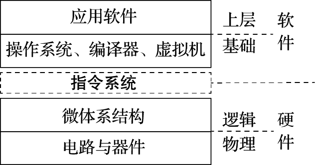

>   软件以指令形式运行在CPU硬件上，而指令系统介于软件和硬件之间，是软硬件交互的接口，有着非常关键的作用。


### 171-180


-   [x] 著作权是指作者及其他著作权人对其文学、艺术、科学作品所享有的人身权利和财产权利的总称。
-   [ ] **专利权人**具有转让专利和许可他人实施其专利的<u>义务</u>。

>   专利权人具有转让专利和许可他人实施其专利的**权利**，而不是义务。专利权是一种独占性的权利，授予专利权人对其发明或创新的独家控制权，以鼓励创新和保护发明者的权益。因此，专利权人通常有权决定如何使用或处置其专利权。
>
>   专利权人可以行使以下权利：
>
>   1. **专利权转让权利：** 专利权人有权将其专利权转让给其他人或实体。这意味着专利权人可以将专利权出售给第三方，通常以一定的费用或合同约定的方式。专利权转让是私人财产权的一种体现，专利权人可以根据自己的需要来选择是否出售专利权。
>
>   2. **专利许可权利：** 专利权人可以许可其他人使用其专利，通常以一种合同协议的形式。这种许可允许他人在特定条件下使用专利技术，通常会涉及许可费用或特定的使用条件。专利权人可以根据自己的商业策略来授予许可，从中获得收入或推广其技术。
>
>   虽然专利权人通常具有这些权利，但也需要遵守相关法律法规和合同约定。例如，专利权人不能滥用其专利权以垄断市场或进行反竞争行为。此外，专利转让和许可通常需要明确的书面协议和注册手续，以确保合法有效。

-   [ ] **商标权**的取得有两种方式，即<u>原始取得</u>和注册取得。

>   在中国，商标权的取得方式主要有以下几种：
>
>   1.  **商标注册取得商标权：** 这是最常见的方式，通过向中国国家知识产权局（CNIPA）或其下属的商标局提交商标注册申请，经审查并注册成功，获得商标权。商标注册可以保护你的商标免受他人侵权。
>   2.  **使用取得商标权：** 在中国，商标权可以通过在市场上实际使用商标来取得。如果你可以证明在一定时间内在一定地区内持续使用了某个商标，并且该商标已经具有了一定的知名度，你可以通过“使用取得商标权”的方式获得权利。这是相对不常见的方式，通常需要满足一定的法律要求。
>   3.  **购买商标权：** 有时，你可以通过购买已经注册的商标来获得商标权。这通常是在商标持有人愿意出售商标的情况下发生的。购买商标权需要签订相应的合同，并确保在商标权转移后进行合法的注册。
>   4.  **继承商标权：** 商标权可以根据继承法律规定而继承下来。如果商标持有人去世，商标权可以根据法定继承顺序传给其继承人。
>   5.  **许可使用商标权：** 你也可以获得商标权的有限许可，即允许他人在一定条件下使用你的商标。这通常需要签订商标许可协议，并按协议规定执行。

-   [ ] **劳动关系**主要是指劳动者和<u>公司管理人员<u>在实现劳动的过程中</u>发生的社会关系。

>   这个表述并不完全准确。劳动关系主要是指劳动者与**雇主**之间**在工作环境中**建立的社会关系，而不仅仅限于公司管理人员。劳动关系涵盖了雇主和员工之间的权利、责任、义务和互动。
>
>   劳动关系的主要元素包括：
>
>   1. **雇主与员工之间的合同关系：** 劳动关系通常是建立在雇佣合同或劳动合同的基础上的。这些合同规定了工资、工作职责、工作时间、福利待遇等方面的权益和责任。
>
>   2. **员工权利和保护：** 劳动关系涉及到员工的权利，包括工资、工时、工作条件、工会组织权利、安全和健康保护等。政府法律和法规通常对这些权利提供了一定程度的保护。
>
>   3. **雇主责任：** 雇主有责任提供合理的工作条件、支付工资、提供福利和保护员工的权益。他们还需要遵守法律法规，确保员工的权利得到尊重。
>
>   4. **劳动争议解决：** 当雇主和员工之间发生争议时，劳动关系也包括了解决这些争议的机制，通常包括谈判、仲裁、调解或法律诉讼等方式。
>
>   虽然公司管理人员在组织内起着重要作用，但劳动关系不仅仅局限于他们与员工之间的关系。劳动关系适用于所有员工，包括管理层、中层管理人员和基层员工。因此，正确的表述应该是劳动关系主要是指雇主与员工之间在工作环境中建立的社会关系，而不仅仅限于公司管理人员。

-   [x] 在 Windows 系统中，通过单击“控制面板”中的“日期和时间”选项卡，可进行日期、时间和时区等设置。
-   [ ] 打印时间、优先级、驱动程序、是否后台打印等设置，需要在“打印机属性”的<u>“常规”选项卡</u>界面中来完成。

>   这个表述部分正确，但有一些细节需要澄清。
>
>   在Windows操作系统中，确实可以通过"打印机属性"来进行一些设置，如打印时间、优先级、是否后台打印等。通常情况下，这些设置可以在“打印机属性”的**“高级”选项卡**或其他相关选项卡中找到，而不是“常规”选项卡。
>
>   通常的步骤是：
>
>   1. 右键单击你想要配置的打印机，然后选择“打印机属性”。
>
>   2. 在弹出的属性窗口中，你可以找到多个选项卡，其中包括“常规”、 “高级”、 “共享” 等选项。
>
>   3. 在“高级”选项卡中，你可以找到设置打印时间、优先级、驱动程序等选项。
>
>   4. 有时，“后台打印”或“后台处理”等设置也可以在“高级”选项卡中找到。
>
>   因此，需要根据具体的Windows操作系统版本和打印机型号来查找和配置这些选项，但一般来说，这些设置不太可能在“常规”选项卡中找到。

-   [x] 在安装**调制解调器**时，若计算机不能自动识别其型号，可插入厂商提供的软盘或光盘，单击“从磁盘安装”按纽，进行手动安装驱动程序。
-   [x] 版本控制是一种对软件开发过程中产生的变更进行标识、组织、管理和控制的管理方法。
-   [ ] PDL 也称伪码，用来具体描述程序编码的细节。

>   这个表述并不完全正确。PDL（Program Design Language，程序设计语言）通常不被称为“伪码”，也不是用来描述程序编码的细节的语言。
>
>   PDL通常是一种高级的、可读性强的编程语言，用于描述程序的设计和算法。它通常用来帮助程序员在编写代码之前规划和设计程序的结构、逻辑和流程。PDL的目的是提供一种清晰的方式来表达程序的逻辑和算法，以便于编程人员理解和沟通。
>
>   与PDL不同，"伪码"是一种更加抽象和非正式的描述方法，用来描述算法和程序逻辑，而不涉及特定的编程语言或编码细节。伪码通常用自然语言和一些符号来描述算法的思路，而不关注具体的编程细节。它的目的是帮助程序员和其他人理解算法的工作原理，而不是直接转化为可执行的计算机程序。
>
>   因此，PDL和伪码是两个不同的概念，PDL更接近于一种高级的程序设计语言，而伪码是一种用于算法描述的抽象方法。

-   [x] 在测试分析报告文档中，“测试计划执行情况”包括三项内容：测试项目、测试机构和人员、测试结果。

>   -   测试分析报告文档
>       -   测试计划执行情况
>           1.   测试项目
>           2.   测试机构和人员
>           3.   测试结果


### 181-190


-   [x] 以“学生成绩管理系统”界面设计为例，“成绩查询”模块可分为多个子模块，则应该为这些子模块分别设计界面。
-   [ ] 源程序文档化设计是指正确的代码书写规范。

>   这句话是不太准确或者说有些混淆的表述，因为它似乎将两个概念混为一谈。让我来解释一下：
>
>   1.  **源程序文档化**：这通常指的是在编程过程中添加注释和文档，以解释代码的功能、逻辑和使用方法。良好的源代码文档化是一种良好的编程实践，它有助于其他开发人员（包括你自己未来的自己）更容易地理解和维护代码。文档化通常包括注释、文档注释、代码风格规范等。文档化的目标是使代码变得更加可读和易于维护。
>   2.  **正确的代码书写规范**：这是指编写代码时应遵循的规则和标准，以确保代码的质量、可读性和可维护性。这些规范可以包括缩进风格、命名约定、代码结构、错误处理等方面的规则。正确的代码书写规范有助于减少潜在的错误，使代码更易于理解和维护。
>
>   因此，源程序文档化和正确的代码书写规范虽然都是编程中重要的方面，但它们是不同的概念。前者关注于如何将代码文档化以增加可理解性，后者关注于如何编写规范且不容易出错的代码。在实际编程中，两者通常是一起考虑的，以确保代码的质量和可维护性。

-   [x] 数据说明的次序应该规范，当多个变量名在一个语句中定义时，应该按照字母顺序排列这些变量。

>   这句话是在描述一种规范的编码风格或编程实践，特别是在定义多个变量时。让我解释一下：
>
>   1.  **数据说明的次序应该规范**：这意味着在你的程序或代码中，当你在某处定义或声明多个变量时，应该按照一定的规则或约定来组织这些声明的次序，以使代码更加清晰和易于阅读。
>
>   2.  **当多个变量名在一个语句中定义时**：这指的是在同一行或同一语句中定义了多个变量，例如：
>
>       ```c
>       int age, height, weight;
>       ```
>
>       这里，`age`、`height`和`weight`都在同一语句中定义了。
>
>   3.  **应该按照字母顺序排列这些变量**：这意味着你应该按照变量名的字母顺序对它们进行排列，使它们按字母的顺序递增排列。这有助于代码的一致性和可读性。
>
>       例如，按照字母顺序排列变量名：
>
>       ```c
>       int age, height, weight;
>       ```
>
>       或者按照字母顺序排列变量名后的代码：
>
>       ```c
>       int age;
>       int height;
>       int weight;
>       ```
>
>   按照这个规范，变量名的排列不会因为变量名的数量增多而变得混乱。这种规范的好处是，当你需要查找或浏览变量名列表时，能够更快速地找到特定的变量，从而提高了代码的可维护性和可读性。这是一种良好的编程实践，有助于编写高质量的代码。

-   [ ] 输入输出程序应具有复杂、美观且功能丰富的输入图形界面。
-   [x] 在C语言中，枚举元素表中的元素有先后次序，可以进行比较。

``` c
#include <stdio.h>

// Define an enumeration named 'Weekdays'
enum Weekdays {
    Monday,    // 0
    Tuesday,   // 1
    Wednesday, // 2
    Thursday,  // 3
    Friday,    // 4
    Saturday,  // 5
    Sunday     // 6
};

int main() {
    // Declare two variables of type 'Weekdays'
    enum Weekdays today = Tuesday;
    enum Weekdays tomorrow = Wednesday;

    // Compare the values of 'today' and 'tomorrow'
    if (today < tomorrow) {
        printf("Today is earlier in the week than tomorrow.\n");
    } else if (today > tomorrow) {
        printf("Today is later in the week than tomorrow.\n");
    } else {
        printf("Today and tomorrow are the same day of the week.\n");
    }

    return 0;
}
```

-   [x] `switch`，`typedef`，`continue` 均是C语言关键字。

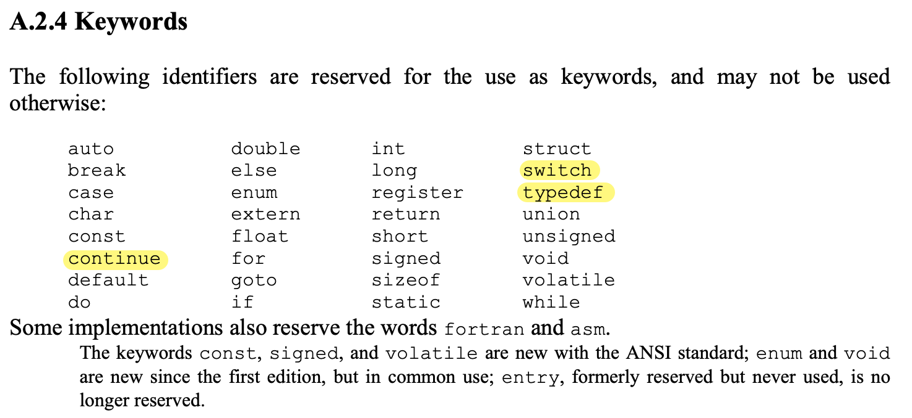

-   [x] 在C 程序中，逗号运算符的优先级最低。

*参见：<https://bytes.usc.edu/ee109/resources/operator-precedence/>*

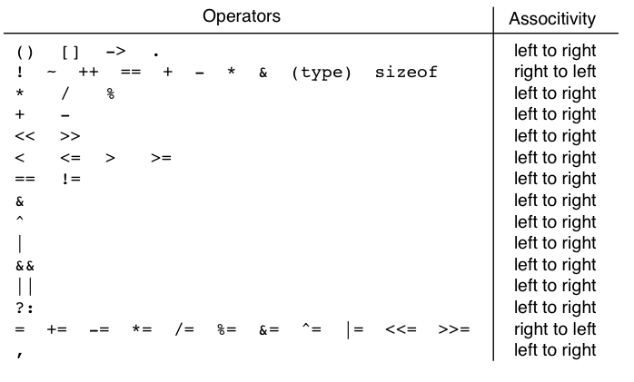

-   [ ] 在C程序中，每行只能写一条语句。
-   [x] 在C程序中，`APH` 和 `aph`是两个不同的变量。

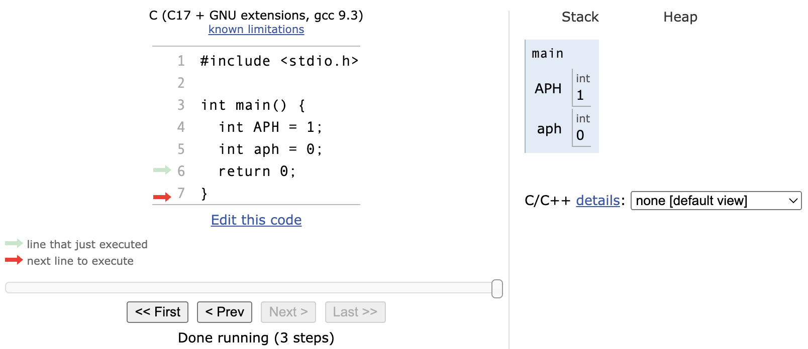

-   [ ] 输入项可以是一个实型常量，如：`scanf ("%f", 3.5) `。

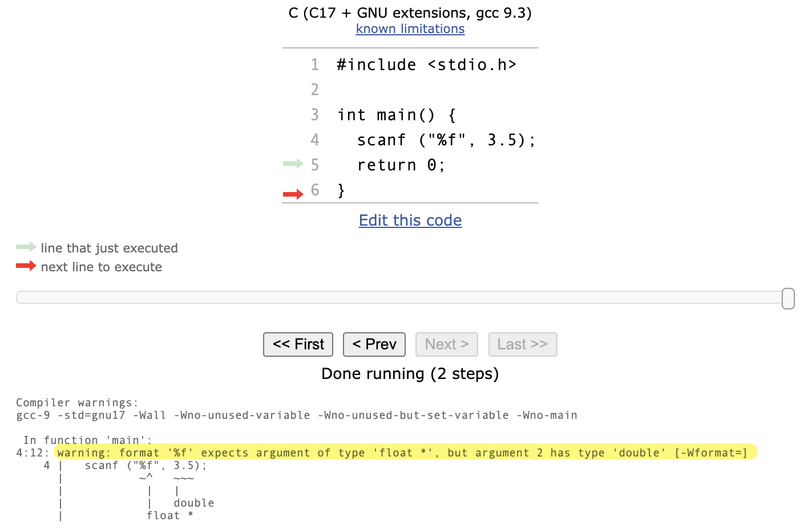

---

### 191-200

-   [x] 字符 `'\0'` 是字符串的结束标记，其 ASCII 代码为 `0`。


-   [ ] 算术运算 `*`、`/`、`+` 和 `-` 具有相同的优先级。


-   [ ] 若有说明：`int a[2][4] = {0};` 表示数组 `a` 中只有数组元素 `a[0][0]` 可以得到初值 0。

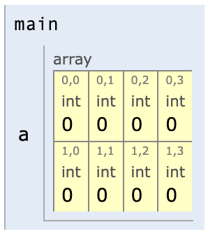

-   [ ] 打印三行输出的 C 语言程序必须用三条 `printf` 语句。
-   [ ] 在 C 程序中，`main` 函数必须位于程序的最前面。
-   [x] 在 C 程序中，`%` 是只能用于整数运算的运算符。(字符运算  -> 整数运算)
-   [ ] 若有`int x;` ,则 `(x + 1) ++` 是一个合法的 C 语言表达式。

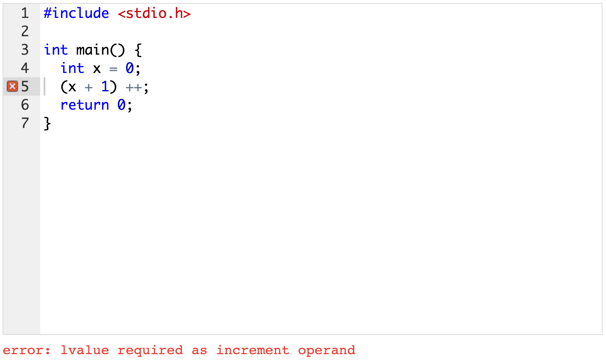

-   [x] 若 `a` 和 `b` 类型相同，在执行了语句 `a = b` 后，`b` 中的值将放入 `a` 中，`b` 中的值不变。
-   [x] `(a = 3) > (b = 5)` 是合法的关系表达式。

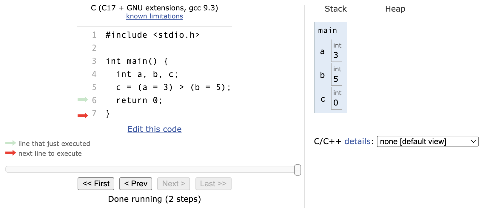

-   [ ] 关系表达式 `a = b > c` 等价于 `a = (b > c)` ，同时也等价于 `a == b > c`。


---


-   [ ] 文件是一个具有符号名的一组相关联元素的集合，可以有序，也可以无序。
-   [ ] 软件项目可行性分析的研究内容包括：技术可行性、经济可行性、运行可行性以及法律可行性等。
-   [ ] 计算机网络中，每台计算机是相互依赖的。
-   [ ] 计算机网络的主要目的是突破地域范围的限制，实现集中管理。
-   [ ] 知识产权包括著作权和工业产权两部分。
-   [ ] 计算机程序设计员的职业道德是计算机程序设计员在社会生活中的行为规范。
-   [ ] 计算机程序设计员的职业道德修养，主要是指职业活动、职业规范、职业资格以及职业能力的修养。
-   [ ] 计算机程序设计员要谦虚谨慎、严格按照工作程序及相关文档的规范开展工作。
-   [ ] 计算机程序设计员不需要做“通才”和“杂家”，那样会影响计算机程序设计员的本职工作。
-   [ ] 指令系统属于计算机软件的范畴。
-   [ ] 著作权是指作者及其他著作权人对其文学、艺术、科学作品所享有的人身权利和财产权利的总称。
-   [ ] 专利权人具有转让专利和许可他人实施其专利的义务。
-   [ ] 商标权的取得有两种方式，即原始取得和注册取得。
-   [ ] 劳动关系主要是指劳动者和公司管理人员在实现劳动的过程中发生的社会关系。
-   [ ] 在Windows系统中，通过单击“控制面板”中的“日期和时间”选项卡，可进行日期、时间和时区等设置。
-   [ ] 打印时间、优先级、驱动程序、是否后台打印等设置，需要在“打印机属性”的“常规”选项卡界面中来完成。
-   [ ] 在安装调制解调器时，若计算机不能自动识别其型号，可插入厂商提供的软盘或光盘，单击“从磁盘安装”按纽，进行手动安装驱动程序。
-   [ ] 版本控制是一种对软件开发过程中产生的变更进行标识、组织、管理和控制的管理方法。
-   [ ] PDL也称伪码，用来具体描述程序编码的细节。
-   [ ] 在测试分析报告文档中，“测试计划执行情况”包括三项内容：测试项目、测试机构和人员、测试结果。
-   [ ] 以“学生成绩管理系统”界面设计为例，“成绩查询”模块可分为多个子模块，则应该为这些子模块分别设计界面。
-   [ ] 源程序文档化设计是指正确的代码书写规范。
-   [ ] 数据说明的次序应该规范，当多个变量名在一个语句中定义时，应该按照字母顺序排列这些变量。
-   [ ] 输入输出程序应具有复杂、美观且功能丰富的输入图形界面。。
-   [ ] 在C语言中，枚举元素表中的元素有先后次序，可以进行比较。
-   [ ] switch，typedef，continue均是C语言关键字。
-   [ ] 在C 程序中，逗号运算符的优先级最低。
-   [ ] 在C程序中，每行只能写一条语句。
-   [ ] 在C程序中，APH和aph是两个不同的变量
-   [ ] 输入项可以是一个实型常量，如：scanf ("%f",3.5) 。
-   [ ] 字符‘\0’是字符串的结束标记，其ASCII代码为0。
-   [ ] 算述运算*、/、+和一具有相同的优先级。
-   [ ] 若有说明：int a[2][4]={0}；表示数组a中只有数组元素a[0][0]可以得到初值0
-   [ ] 打印三行输出的C语言程序必须用三条printf语句。
-   [ ] 在C程序中，main函数必须位于程序的最前面。
-   [ ] 在C程序中，%是只能用于整数运算的运算符。
-   [ ] 若有int x,则(x+1)++是一个合法的c语言表达式。
-   [ ] 若a和b类型相同，在执行了语句a=b后，b中的值将放入a中，b中的值不变。
-   [ ] (a=3)>(b=5) 是合法的关系表达式。
-   [ ] 关系表达式 a=b>c 等价于 a=(b>c) ，同时也等价于 a==b>c。

 

 
