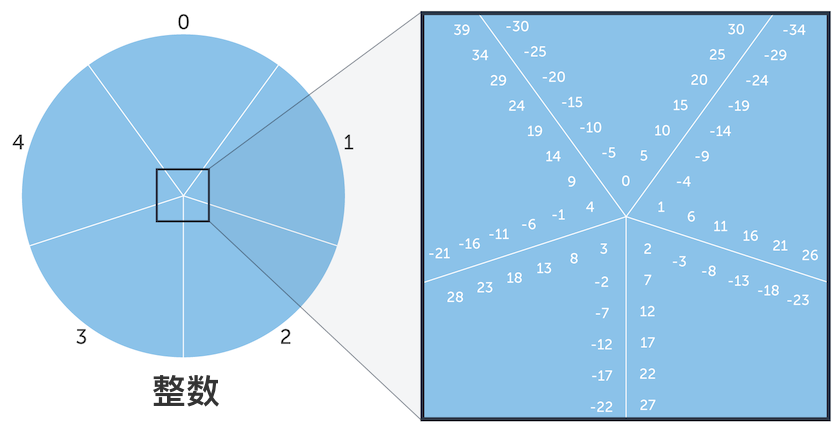
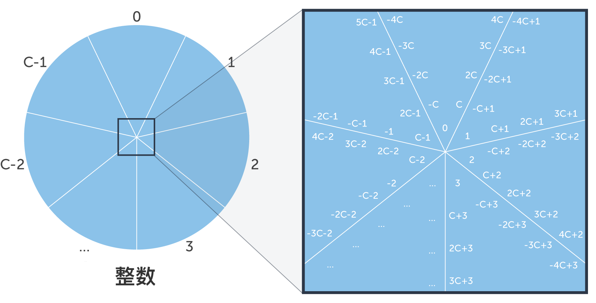

# 同余

<figure markdown>
  
  <figcaption>所有整数模 5 的结果</figcaption>
</figure>

<figure markdown>
  
  <figcaption>所有整数模 C 的结果</figcaption>
</figure>

## References

* [同余 - Khan Academy](https://zh.khanacademy.org/computing/computer-science/cryptography/modarithmetic/a/congruence-modulo)

- [同余的观念和性质一 - PengTitus](https://www.youtube.com/watch?v=SVCbahPo2hU)
- [CH3. 數字根的故事—中國餘數定理 Part1 / 徐惠莉](https://www.youtube.com/watch?v=PGX76M2PRwQ)

## 概念

### 数值同余

* **同余数**：如果两个整数同时除以某个整数 N，会有相同的余数，则称这两个数对 N 是 *同余数*。而 N 称为 *模数*。
  * 举例：12 和 61 是 模数 7 的 同余数。
    * 12 ÷ 7 = 1 ... 5
    * 61 ÷ 7 = 8 ... 5

| 算式                                   | 记作            | 解释                         |
| -------------------------------------- | --------------- | ---------------------------- |
| 12 ÷ 7 = 1 ... 5                       | 12 mod 7 ≡ 5    |                              |
| 61 ÷ 7 = 8 ... 5                       | 61 mod 7 ≡ 5    |                              |
| 12 ÷ 7 = 1 ... 5 61 ÷ 7 = 8 ... 5 | 12 ≡ 61 (mod 7) | 12 和 61 是模数 7 的 同余数  |
| 12 ÷ 7 = 1 ... 5 5 ÷ 7 = 0 ... 5  | 12 ≡ 5 (mod 7)  | 对 模数 7 来说，12 和 5 同余 |
| 61 ÷ 7 = 8 ... 5 5 ÷ 7 = 0 ... 5  | 61 ≡ 5 (mod 7)  | 对 模数 7 来说，61 和 5 同余 |

### 数字根

#### 举例

* 6925
  * **6925 mod 9 ≡ 4**
  * 6 + 9 + 2 + 5 = 22
    * **22 mod 9 ≡ 4**
  * 2 + 2 = 4
    * **4 mod 9 ≡ 4**
* 数字 4 称为 6925 的 *数字根*

#### 结论

1. 每个整数和它的 数字和 对 模数 9 而言，都是模数 9 的同余数。
2. 一个整数 N 和它的 数字根 n 都是 模数 9 的 同余数。
   1. **N ≡ n (mod 9)**

#### 特例

* 若一个数对 模数 9 的余数为 0 时，我们称它的数字根是 9（而不是 0）。

#### 证明

*[数值同余]: congruence
*[模数]: modulus
*[数字根]: Digital Root : 将一组数字相加到剩一位数，此数字称为数字根。
*[同余数]: 如果两个整数同时除以某个整数 N，会有相同的余数，则称这两个数对 N 是同余数。