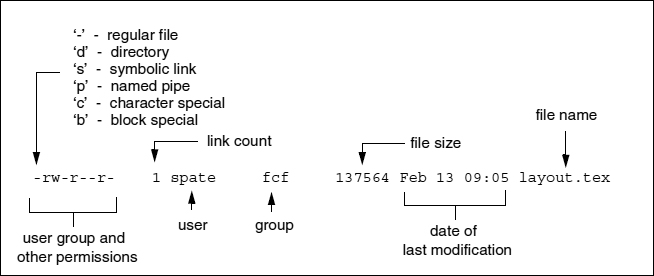

# Permissions

- [ ] [Unix Permissions](https://networking.ringofsaturn.com/Unix/unixpermissions.php)

<figure markdown>
  
  <figcaption>File properties shown by typing `ls -l`</figcaption>
</figure>

- file properties/attributes
    - file type: 1 character
    - file modes/permission attributes: 9 characters
        - file owner
        - file group owner
        - everybody else

??? umask
    ``` sh linenums="1" hl_lines="1"
    $ curl cheat.sh/
    umask
    cheat.sheets:umask 
    # umask
    # Display or set file mode mask

    # Unless configured otherwise, this will set the umask ("user mask" or "file
    # mode creation mask") for only the current user, and only his or her current
    # session. The (one) leading zero is optional, unless you otherwise need it.
    #
    # This umask setting is actually recommended for security by major Linux distributions
    # like RHEL, Debian and Arch Linux.
    #
    # The result of '0077' being -- and I'll use standard octal with which we're
    # all probably familiar -- that all new files are created using the '600'
    # permissions, and directories are '700'.
    #
    # Remember, the standard format means 4=read, 2=write, and 1=execute.
    # However, the umask uses the same, but is inverted, so a umask of '077' would
    # be 700, and correctly lowers to 600 when it's just a file.
    umask 0077
    
    # Akin to above, but instead, output the current umask setting.
    umask
    
    tldr:umask 
    # umask
    # Manage the read/write/execute permissions that are masked out (i.e. restricted) for newly created files by the user.
    # More information: <https://manned.org/umask>.
    
    # Display the current mask in octal notation:
    umask
    
    # Display the current mask in symbolic (human-readable) mode:
    umask -S
    
    # Change the mask symbolically to allow read permission for all users (the rest of the mask bits are unchanged):
    umask a+r
    
    # Set the mask (using octal) to restrict no permissions for the file's owner, and restrict all permissions for everyone else:
    umask 077
    
    $
    ```

??? chown
    ``` sh linenums="1" hl_lines="1"
    $ curl cheat.sh/
    chown
    cheat:chown 
    # Change a file's owner:
    chown <user> <file>

    # Change a file's owner and group:
    chown <user>:<group> <file>
    
    # Set user to match group value
    chown <user>: <file>
    
    # Set group to match user value
    chown :<group> <file>
    
    # Change a directory's owner recursively:
    chown -R <user> <directory>
    
    # Change ownership to match another file:
    chown --reference=<reference-file> <file>
    
    tldr:chown 
    # chown
    # Change user and group ownership of files and directories.
    # More information: <https://www.gnu.org/software/coreutils/chown>.
    
    # Change the owner user of a file/directory:
    chown user path/to/file_or_directory
    
    # Change the owner user and group of a file/directory:
    chown user:group path/to/file_or_directory
    
    # Recursively change the owner of a directory and its contents:
    chown -R user path/to/directory
    
    # Change the owner of a symbolic link:
    chown -h user path/to/symlink
    
    # Change the owner of a file/directory to match a reference file:
    chown --reference=path/to/reference_file path/to/file_or_directory
    
    $
    ```

??? chgrp
    ``` sh linenums="1" hl_lines="1"
    $ curl cheat.sh/
    chgrp
    # chgrp
    # Change group ownership of files and directories.
    # More information: <https://www.gnu.org/software/coreutils/chgrp>.

    # Change the owner group of a file/directory:
    chgrp group path/to/file_or_directory
    
    # Recursively change the owner group of a directory and its contents:
    chgrp -R group path/to/directory
    
    # Change the owner group of a symbolic link:
    chgrp -h group path/to/symlink
    
    # Change the owner group of a file/directory to match a reference file:
    chgrp --reference=path/to/reference_file path/to/file_or_directory
    
    $
    ```