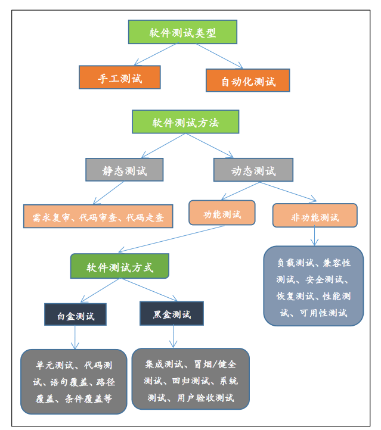

# Chapter 5 - 软件工程中的测试

## 5.0 References

* [测试结构体系](https://zhangyuyu.github.io/test-theory-structure/)

## 5.1 编码风格与测试的目的

**24****、软件开发常使用的两种基本方法是结构化和原型化方法****,****在实际的应用中****,****它们之间的关系表现为** **( B )** 

A、 相互排斥 

B、 相互补充 

C、 独立使用 

D、 交替使用 

代码应逻辑简明清晰、易读易懂。表现在以下方面：程序内部的文档(标识符、注解视觉组织)，数据说明，语句构造，输入输出，效率。

测试是为了**发现程序中的错误**而执行程序的过程。成功的测试是发现了至今为止尚未发现的错误的测试。

测试方法：**黑盒测试**(又称**功能测试**)把程序看作一个黑盒子，完全不考虑程序的内部结构和处理过程；**白盒测试**(又称**结构测试**)是把程序看成装在一个透明的白盒子里，测试者完全知道程序的结构和处理算法。

!!! question
    18、软件测试是为了( **发现错误** )而执行程序的过程。

    A. 纠正错误
    
    <u>**B. 发现错误**</u>
    
    C. 避免错误
    
    D. 证明正确
    
        测试是为了发现程序中的错误而执行程序的过程。成功的测试是发现了至今为止尚未发现的错误的测试。

## 5.2 白盒测试

!!! question
    13、在白盒测试技术测试用例的设计中，( **条件组合覆盖** )是最强的覆盖标准。

    A. 语句覆盖
    
    B. 路径覆盖
    
    <u>**C. 条件组合覆盖**</u>
    
    D. 判定覆盖
    
        条件组合覆盖：每个判定表达式中条件的各种可能组合都至少出现一次。条件组合覆盖是前述几种覆盖标准中最强的。

**测试用例**：**测试数据和预期输出结果**。设计测试方案的基本目标是，确定一组最可能发现某个错误或某类错误的测试数据。

逻辑覆盖：**语句覆盖**、**判定覆盖**、**条件覆盖**、**判定/条件覆盖**、**条件组合覆盖**、点覆盖、 边覆盖、路径覆盖。

* **语句覆盖**：每个语句至少执行一次。
* **判定覆盖**：又叫分支覆盖，不仅每个语句必须至少执行一次，而且每个判定的每个分支都至少执行一次。
* **条件覆盖**：不仅每个语句至少执行一次，而且使判定表达式中的每个条件都取到各种可能的结果。条件覆盖通常比判定覆盖强，但满足条件覆盖的测试数据不一定满足判定覆盖。
* **判定/条件覆盖**：能同时满足判定覆盖和条件覆盖的逻辑覆盖。
* **条件组合覆盖**：每个判定表达式中条件的各种可能组合都至少出现一次。条件组合覆盖是前述几种覆盖标准中最强的。

点覆盖：程序执行路径至少经过流图的每个结点一次，点覆盖标准和语句覆盖标准是相同的。

边覆盖：程序执行路径至少经过流图中每条边一次。通常边覆盖和判定覆盖是一致的。

路径覆盖:程序的每条可能路径都至少执行一次。路径覆盖相对来说是比较强的逻辑覆盖标准。但路径覆盖并没有检验表达式中条件的各种组合情况，而只考虑每个判定表达式的取值。

## 5.3 黑盒测试

## 5.4 单元测试 <- 详细设计

!!! question
    17、单元测试的测试用例主要根据( **详细设计** )的结果来设计。

    A. 需求分析
    
    B. 源程序
    
    C. 概要设计
    
    <u>**D. 详细设计**</u>
    
    https://www.nowcoder.com/questionTerminal/1acb085248124d21ad4226e474e95168
    
        单元测试是指对软件中最小可测试单元进行检查和验证。在 C 语言中指函数，在 C++ 或 Java 中指类。所以单元测试中的测试人员准定要看代码的，只是代码本身是检验的对象，不是设计用例的依据，依据是详细设计。

单元测试**集中检测软件设计的最小单元——模块**。单元测试主要使用白盒测试技术，辅以黑盒测试，而且对多个模块的测试可以并行地进行。可用人工测试和计算机测试两种不同类型的测试方法。

测试重点：模块接口、局部数据结构、重要的执行通路、出错处理通路、边界条件。

代码审查：由审查小组正式对源程序进行人工测试。审查小组的任务是发现错误而不是改正错误。

计算机测试：模块不是一个独立的程序，因此必须为每个单元测试开发驱动程序和(或)存根程序。驱动程序是一个“主程序”，它接收测试数据，启动被测模块，输出测试结
果。存根程序代替被测试的模块所调用的模块，接收被测试模块的调用和输出数据。

## 5.5 集成测试 <- 概要设计

## 5.6 确认测试 <- 需求文档

## 5.7 验收测试 <- 用户需求

## 其他

### *软件测试分类

TODO:

!!! question
    63、软件测试可以分为静态测试和动态测试，动态测试又可以分为**功能测试**和**非功能测试**。 

### *测试模型

