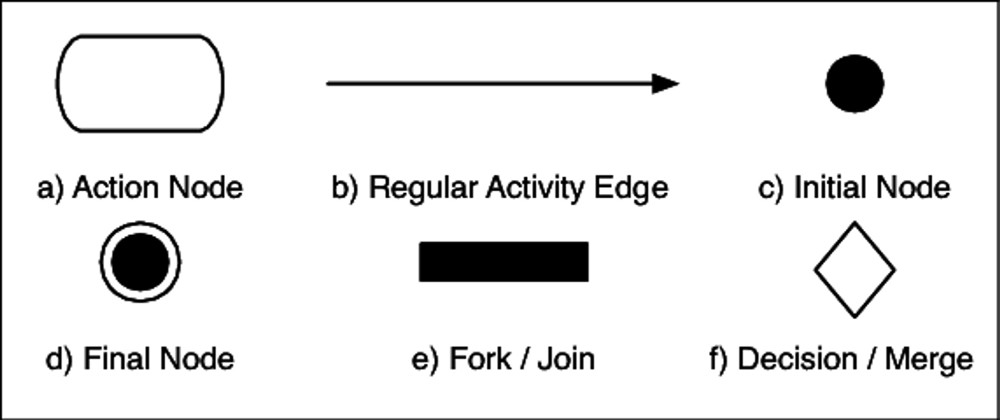
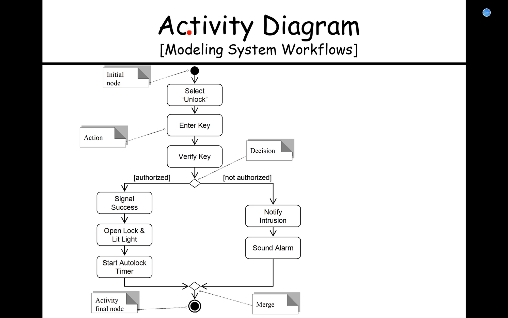
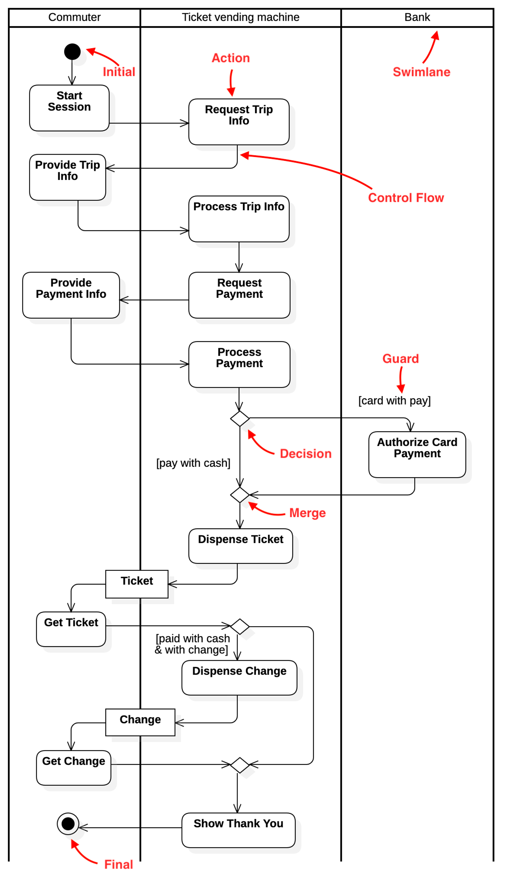

# Activity Diagram 活动图

## 概述

- 活动图，是针对**多对象**而言的，即**多对象控制流**。
- 优点在于*泳道*的设计
- *水平同步* / *垂直同步*

### Activity Diagram vs. Sequence Diagram

- 活动图展示一个过程中的**控制流**，即为了完成该活动，所有操作的执行顺序。
- 序列图/时序图展示对象之间的**信息流**。也即**信息传递的时间线**。

## Notations/Symbols

## Activity Diagram Example 1

- Initial Node

   solid circle

  - Select “Unlock”

  - Enter Key *Action*

  - Verify Key

    - [authorized] 

      Decison

      - Signal Success
      - Open Lock & Lit Light
      - Start Autolock Timer

    - [not authorized]

      - Notify Intrusion
      - Sound Alarm

  - *Merge*

- *Activity Final Node* solid circle inside another circle

## Activity Diagram Example 2 with swim lanes

* *swim lane* 
  *通过对象来划分*

## 题库

### 远程网络教学系统

对于“远程网络教学系统”，学生登录后可以下载课件。在登录时，系统需要验证用户的登录 信息，如果验证通过系统会显示所有可选服务。如果验证失败，则登录失败。当用户看到系统显示的所有可选服务后，可以选择下载服务，然后下载需要的课件。下载完成后用户退出系统，系统则会注销相应的用户信息。画出学生下载课件的活动图。

* 远程网络教学系统
  * 学生登录
    * 系统：验证用户的登录信息
      * 验证通过：显示所有可选服务
        * 用户：选择下载服务
        * 用户：下载所需课件
        * 用户：退出系统
          * 系统：注销响应的用户信息
      * 验证失败：登录失败
  * 下载课件

## References

* [ ] [Create UML activity diagrams in draw.io](https://drawio-app.com/blog/create-uml-activity-diagrams-in-draw-io/)

* [ ] [Draw UML activity diagrams - draw.io](https://www.drawio.com/blog/uml-activity-diagrams)

