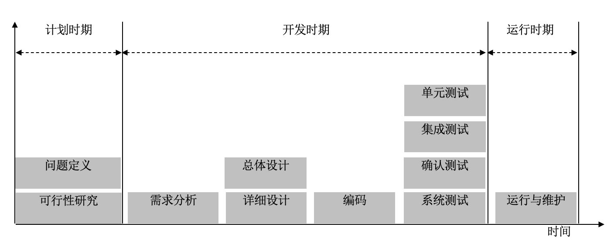
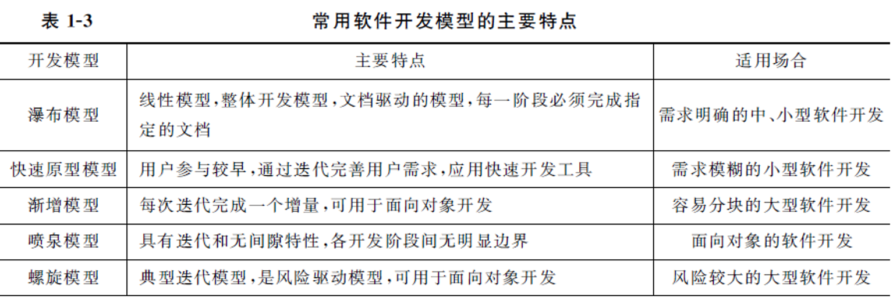

# 软件工程 - 期末复习- 230605

## 第 1 章 - 软件工程概述

软件是一种**逻辑产品**。

### 1.1 软件危机 的概念 P4

软件危机会造成严重后果。

> 软件危机 是指在计算机软件开发和维护过程中遇到的一系列严重问题。这些问题主要体现在如何开发软件以满足用户日益增长的需求和如何对已有的软件进行维护。

**软件危机 是一系列严重问题，发生在计算机软件的开发、维护过程中。**

### 1.2 软件危机 的主要表现 P4

1. 软件不能满足用户的**需求**。
2. 软件开发**成本**严重超标，开发**周期**大大超过规定日期。
3. 软件**质量**难于保证，可靠性差。
4. 软件难于**维护**。
5. 软件开发**速度**跟不上计算机发展速度。

### 1.3 软件工程的思想 P5

为什么会出现软件工程？

是为了解决软件危机。

软件工程 => 软件危机。

工程化的开发思想：分阶段、阶段评审。

### 1.4 软件生存/生命周期 Software Development Life Cycle, SDLC —— 分阶段 P6

三大时期：**计划** ⇒ **开发** ⇒ **运行**。

1. 计划时期 Analysis
   1. 问题定义
   2. 可行性研究
      可行性任务的研究不包括环境政治可行性。
2. 开发时期 Design & Implementation & Testing
   1. 需求分析
   2. 软件/系统设计 Design
      1. 总体设计
      2. 详细设计
   3. 编码 Implementation
   4. 软件测试 Testing
      1. 单元测试
      2. 集成测试
      3. 确认测试
      4. 系统测试
3. 运行时期 Maintenance
   1. 运行与维护

###  1.5 软件开发模型 P7

## 第 2 章

### P20 可行性研究的任务

主要做什么？

确定问题能否被解决，是否值得被解决。

1. 技术可行性
2. 经济可行性
3. 运行可行性（用户使用可行性）
4. 法律可行性

### P22 系统流程图

## 第 3 章

### P38 需求分析的步骤

1. 需求获取
2. 分析建模
3. 需求描述
4. 需求验证

### P40 结构化需求分析方法

**核心思想**：自顶向下，逐步求精。

### P42 数据流图

### 数据词典

P46 图 3-2

## 第 4 章

### 概要设计的原则 P67

### 模块的独立性 P69

内聚、耦合（7种类型，知道）

好的模块独立性：高内聚（最高的内聚是什么？）、低耦合（最低的耦合是什么？）

### 结构图 SC P77

DFD => SC

数据流图的类型：

1. 变换型数据流图
2. 事务型数据流图

## 第 5 章

### 详细设计的工具 P93 - 大题 - 15分

流程图、N-S 图 PAD 图

P113 应用题

## 第 6 章

### P118 面向对象的特点、基本概念

继承、封装、多态 概念，是否理解

给了一段描述，是属于哪个特性

### UML P123 应用题 - 15 分

## 第 7 章

### 7.1 面向对象分析的三种模型 P142

1. **对象模型**
2. 动态模型
3. 功能模型

> 其中，**对象模型**是最重要、最基本、最核心的，无论解决什么问题，首先要在问题域中提取和定义出对象模型。

### 7.2 OOA 和 OOD 的关系 P148

OOD 是对 OOA 的补充和优化

面向对象设计（Object Oriented Design，OOD）是根据面向对象分析中确定的类和对象设计软件系统。

从OOA到OOD是**一个逐步建立和扩充对象模型**的过程。

OOA是分析用户需求并建立问题域模型的过程，是解决系统“做什么”问题的；OOD则是根据OOA得到的需求模型，建立求解域模型的过程，是解决系统“怎么做”问题的。

OOA主要是模拟问题域和系统任务，而OOD则是对OOA的扩充，主要是增加各种组成部分。具体来说，OOA识别和定义类和对象。这些类和对象直接反映问题域和系统任务。而OOD识别和定义其他附加类和对象，它们反映需求的一种实现，当然，也可以交替进行这两个阶段的工作。

**从 OOA 到 OOD 是一个逐渐扩充模型的过程**，分析和设计活动是一个多次反复迭代的过程。

## 应用题（60分）

## 1. 数据流图

订货报表题目等等。。。

P42-43，15分

绘制数据流图：顶层、0层

实体、数据流向；加工是整体

P62 应用题 2. 录取统分子系统

实体：无，可以不写

数据流向：

考生原始分 （流向） -> 录取统分子系统 -> 录取分（流向） + ｜录取分文件｜

## 2. 详细设计的工具

## 3. UML 静态建模

2 选 1

* 用例图
  * 参与者
  * 用例
  * 关系
    * 参与者 - 用例
    * 用例 - 用例
  * 关系之间的类型
    * 关联
    * 泛化
    * 依赖
    * 实现
* 类图
  * 类
  * 类和类之间的关系

## 4. UML 动态建模

2 选 1

* 时序图
  * 对象（矩形、生命周期）
  * 信息交互（请求消息 - 实线，返回消息 - 虚线）
  * 次序
* 状态图
  * 针对单个对象
    * 初始状态
    * 中间状态
    * 最终状态
    * 状态和状态之间发生的事件

---

*[OOA]: Object Oriented Analysis
*[OOD]: Object Oriented Design
*[软件危机]: 软件危机是一系列严重问题，发生在计算机软件的开发、维护过程中。
*[SDLC]: Software Development Life Cycle, 软件生存/生命周期