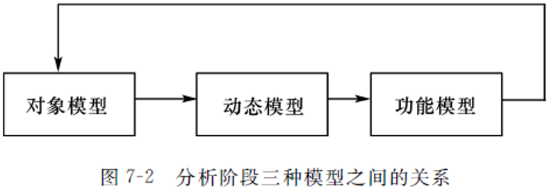

# 软件工程 - 期末复习- 230605

## 备注

选择题 15 * 3 = 45

填空题 5 * 2 = 10

应用题 10 10 10 15 / 10 10 12 13

2 题简答 + 2 题画图

1. 数据流图
2. 流程图 / PAD图 / N-S图
3. 用例图 / 类图
4. 状态图 / 活动图

## 第 2 章

### P20 可行性研究的任务

主要做什么？

确定问题能否被解决，是否值得被解决。

1. **技术可行性**
2. **经济可行性**
3. 运行可行性（用户使用可行性）
4. 法律可行性

!!! question
    67、可行性研究的目的是什么?可以从哪些方面来考虑软件开发的可行性?

??? question
    27、可行性研究主要从以下几个方面进行研究:( )

    A. 技术可行性,经济可行性,操作可行性

    B. 技术可行性,经济可行性,系统可行性

    C. 经济可行性,系统可行性,操作可行性

    D. 经济可行性,系统可行性,时间可行性

??? question
    29、可行性分析研究的目的( )

    A. 争取项目

    B. 项目值得开发否

    C. 开发项目

    D. 规划项目

??? question
    36、可行性研究要进行一次( )需求分析。

    A. 深入的

    B. 详尽的

    C. 彻底的

    D. 简化的、压缩了的

??? question
    42、可行性研究的任务不包括( )。

    A. 技术可行性

    B. 经济可行性

    C. 用户使用可行性

    D. 社会可行性

### P22 系统流程图

??? question
    69、某算法设计程序流程图如下所示，试将该图转换为PAD图

??? question
    33、程序流程图 (PDF) 中的箭头代表的是 ( )

    A. 数据流

    B. 控制流

    C. 调用关系

    D. 组成关系

## 第 3 章

### P38 需求分析的步骤

1. 需求获取
2. 分析建模
3. 需求描述
4. 需求验证

!!! question
    7、需求分析中开发人员要从用户那里了解( )。

    A. 软件做什么

    B. 用户使用界面

    C. 输入的信息

    D. 软件的规模

!!! question
    12、需求分析是( )。

    A. 软件开发工作的基础

    B. 软件生存周期的开始

    C. 由系统分析员单独完成的

    D. 由用户自己单独完成的

!!! question
53、概要设计与需求分析衔接的图形工具是( )。

A. DFD

B. SC

C. PFD

D. PAD

!!! question
    66、需求分析与系统设计阶段任务的主要区别是什么?

### P40 结构化需求分析方法

**核心思想**：自顶向下，逐步求精。

!!! question
    57、结构化设计方法的核心思想是**自顶向下，逐步求精**。

!!! question
    65、结构化程序设计的主要思想是什么?

!!! question
    4、在结构化分析方法中,( )表达系统数据流向的图形化技术。

    A. 数据字典

    B. 实体关系图

    C. 数据流图

    D. 状态转换图

!!! question
    26、结构化分析方法是一种预先严格定义需求的方法，它在实施时强调的是分析对象的(**B. 数据流**)

    A. 控制流

    **<u>B. 数据流</u>**

    C. 程序流

    D. 指令流

!!! question
    35、结构化分析方法采用的基本手段是( ) 。

    A. 分解与抽象

    B. 分解与综合

    C. 归纳与推导

    D. 试探与回溯

### P42 数据流图

!!! question
    32、通过 ( ) 可以完成数据流图的细化。

    A. 结构分解

    B. 功能分解

    C. 数据分解

    D. 系统分解

!!! question
    40、面向数据流软件设计方法一般是把数据流图中的数据流化分为 ( ) 两种流,再将数据流图映射为软件结构。

    A. 数据流与事务流

    B. 交换流和事务流

    C. 信息流与控制流

    D. 交换流和数据流

!!! question
    70、假设一家工厂的采购部每天需要一张定货报表，报表按零件编号排序，表中列出所有需要再次定货的
    零件。对于每个需要再次定货的零件应该列出下述数据:零件编号，零件名称，定货数量，目前价格，主要供应者，次要供应者。零件入库或出库称为事务，通过放在仓库中的惇CRT终端把事务报告给定货系统。当某种零件的库存数量少于库存量临界值时就应该再次定货。请在下列系统的数据流图中填入空白处E1/D1/G1/G2/S1内容。

### 数据词典

P46 图 3-2

!!! question
    30、数据字典是用来定义( )中的各个成分的具体含义

    A. 流程图

    B. 功能结构图

    C. 系统结构图

    D. 数据流图

!!! question
    43、在数据词典中表示0个或多个a组成( )。

    A. 0、、a

    B. {a}

    C. (a)

    D. {0-a}

## 第 4 章

### 概要设计的原则 P67

!!! question
    38、软件设计一般分为概要设计和详细设计,它们之间的关系是 ( )。

    A. 全局和局部

    B. 抽象和具体

    C. 总体和层次

    D. 功能和结构

!!! question
    48、概要设计的目的是确定整个系统的( )。

    A. 规模

    B. 功能及模块结构

    C. 费用

    D. 测试方案

!!! question
    53、概要设计与需求分析衔接的图形工具是( )。

    A. DFD

    B. SC

    C. PFD

    D. PAD

!!! question
47、下面不属于软件设计原则的是( )。 
A. 抽象 
B. 模块化 
C. 自底向上 
D. 信息隐蔽 

### 模块的独立性 P69

内聚、耦合（7种类型，知道）

好的模块独立性：高内聚（最高的内聚是什么？）、低耦合（最低的耦合是什么？）

!!! question
    61、模块独立性指标有耦合和____,耦合度最低的耦合是____,内聚度最高的内聚是____。 

!!! question
    9、为了提高模块的独立性,模块内部最好是( )。

    A. 逻辑内聚

    B. 时间内聚

    C. 功能内聚

    D. 通信内聚

!!! question
    10、一个模块的( )太大一般是因为缺乏中间层次,应当适当增加中间层次的控制模块。

    A. 深度

    B. 宽度

    C. 扇出

    D. 扇入

!!! question
    11、模块的内聚性最高的是( )。

    A. 逻辑内聚

    B. 时间内聚

    C. 偶然内聚

    D. 功能内聚

!!! question
    28、耦合是对软件不同模块之间互连程度的度量。各种耦合按从强到弱排列如下: ( )

    A. 内容耦合,控制耦合,数据耦合,公共环境耦合。

    B. 内容耦合,控制耦合,公共环境耦合,数据耦合。

    C. 内容耦合,公共环境耦合,控制耦合,数据耦合。

    D. 控制耦合,内容耦合,数据耦合,公共环境耦合。

!!! question
    52、模块独立性高要求( )。

    A. 高内聚低耦合

    B. 低内聚高耦合

    C. 高内聚高耦合

    D. 低内聚低耦合

### 结构图 SC P77

DFD => SC

数据流图的类型：

1. 变换型数据流图
2. 事务型数据流图

!!! question
    概要设计与需求分析衔接的图形工具是( )。 

    A. DFD

    B. SC

    C. PFD

    D. PAD

## 第 5 章

### 详细设计的工具 P93 - 大题 - 15分

流程图、N-S 图 PAD 图

P113 应用题

!!! question
    8、软件详细设计的主要任务是确定每个模块的( )。

    A. 算法和使用的数据结构

    B. 外部接口

    C. 功能

    D. 编程

!!! question
    38、软件设计一般分为概要设计和详细设计,它们之间的关系是 ( )。

    A. 全局和局部

    B. 抽象和具体

    C. 总体和层次

    D. 功能和结构

## 第 6 章

### P118 面向对象的特点、基本概念

继承、封装、多态 概念，是否理解

给了一段描述，是属于哪个特性

!!! question
    58、不同对象对同一操作产生不同的结果，是指面向对象的**多态性**。

!!! question
    14、(**C. 封装**)是把对象的属性和操作结合在一起，构成一个独立的对象，其内部信息对外界是隐蔽的，外界只能通过有限的接口与对象发生联系。

    A. 多态性

    B. 继承

    **<u>C. 封装</u>**

    D. 消息

!!! question
    15、面向对象的开发方法中，(**C. UML语言**)将是面向对象技术领域内占主导地位的标准建模语言。

    A. Booch方法

    B. Coad方法

    **<u>C. UML语言</u>**

    D. OMT方法

TODO:

!!! question
    19、支持面向对象技术的软件生存周期模型是(**A. 喷泉模型**)。

    **<u>A. 喷泉模型</u>**

    B. 螺旋模型

    C. 增量模型

    D. 瀑布模型

!!! question
    下列软件开发模型中，以面向对象的软件开发方法为基础，以用户的需求为动力，以对象来驱动的模型是（**A. 喷泉模型**）。

    A. 喷泉模型

    B. 螺旋模型

    C. 瀑布模型

    D. 原型模型

### UML P123 应用题 - 15 分

!!! question
    25、UML 是软件开发中的一个重要工具，它主要应用于哪种软件开发方法(**C. 基于对象的面向对象的方法**)

    A. 基于瀑布模型的结构化方法

    B. 基于需求动态定义的原型化方法

    **<u>C. 基于对象的面向对象的方法</u>**

    D. 基于数据的数据流开发方法

!!! question
51、侧重说明哪些对象之间有消息传递的图是( )。

A. 对象图

B. 时序图

C. 协作图

D. 状态图

## 第 7 章

### 7.1 面向对象分析的三种模型 P142

1. **对象模型**
2. 动态模型
3. 功能模型

> 其中，**对象模型**是最重要、最基本、最核心的，无论解决什么问题，首先要在问题域中提取和定义出对象模型。

!!! question
    50、面向对象分析阶段建立的三个模型中,核心模型是(**C. 对象**)模型。

    A. 功能

    B. 动态

    **<u>C. 对象</u>**

    D. 分析

### 7.2 OOA 和 OOD 的关系 P148

OOD 是对 OOA 的补充和优化

面向对象设计（Object Oriented Design，OOD）是根据面向对象分析中确定的类和对象设计软件系统。

从OOA到OOD是**一个逐步建立和扩充对象模型**的过程。

OOA是分析用户需求并建立问题域模型的过程，是解决系统“做什么”问题的；OOD则是根据OOA得到的需求模型，建立求解域模型的过程，是解决系统“怎么做”问题的。

OOA主要是模拟问题域和系统任务，而OOD则是对OOA的扩充，主要是增加各种组成部分。具体来说，OOA识别和定义类和对象。这些类和对象直接反映问题域和系统任务。而OOD识别和定义其他附加类和对象，它们反映需求的一种实现，当然，也可以交替进行这两个阶段的工作。

**从 OOA 到 OOD 是一个逐渐扩充模型的过程**，分析和设计活动是一个多次反复迭代的过程。

## 应用题（60分）

## 1. 数据流图

订货报表题目等等。。。

P42-43，15分

绘制数据流图：顶层、0层

实体、数据流向；加工是整体

P62 应用题 2. 录取统分子系统

实体：无，可以不写

数据流向：

考生原始分 （流向） -> 录取统分子系统 -> 录取分（流向） + ｜录取分文件｜

## 2. 详细设计的工具

## 3. UML 静态建模

2 选 1

* 用例图
  * 参与者
  * 用例
  * 关系
    * 参与者 - 用例
    * 用例 - 用例
  * 关系之间的类型
    * 关联
    * 泛化
    * 依赖
    * 实现
* 类图
  * 类
  * 类和类之间的关系

!!! question
    44、类图的要素不包括(**D. 对象**)。

    A. 类名称

    B. 操作

    C. 属性

    **<u>D. 对象</u>**

!!! question
    45、有关类与对象的描述不正确的是(**A. 一个类只能有一个对象**)。

    **<u>A. 一个类只能有一个对象</u>**

    B. 对象是类的具体实例

    C. 类是某一类对象的抽象

    D. 类和对象的关系是数据类型和变量的关系

!!! question
55、类图中关系包括关联、依赖、____和____,其中关联关系又可以划分 
为一般关联、____和____。 

!!! question
56、用例图的三要素包括____、____和关联。 

!!! question
60、用例图中用例与参与者的关系是关联,用例与用例的关系是____或____。 

## 4. UML 动态建模

2 选 1

* 时序图
  * 对象（矩形、生命周期）
  * 信息交互（请求消息 - 实线，返回消息 - 虚线）
  * 次序
* 状态图
  * 针对单个对象
    * 初始状态
    * 中间状态
    * 最终状态
    * 状态和状态之间发生的事件

---

*[OOA]: Object Oriented Analysis
*[OOD]: Object Oriented Design
*[软件危机]: 软件危机是一系列严重问题，发生在计算机软件的开发、维护过程中。
*[SDLC]: Software Development Life Cycle, 软件生存/生命周期