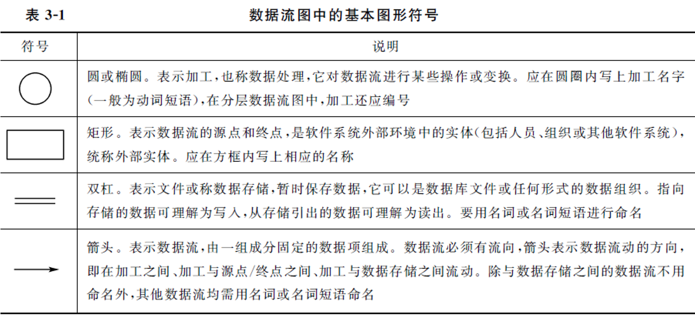
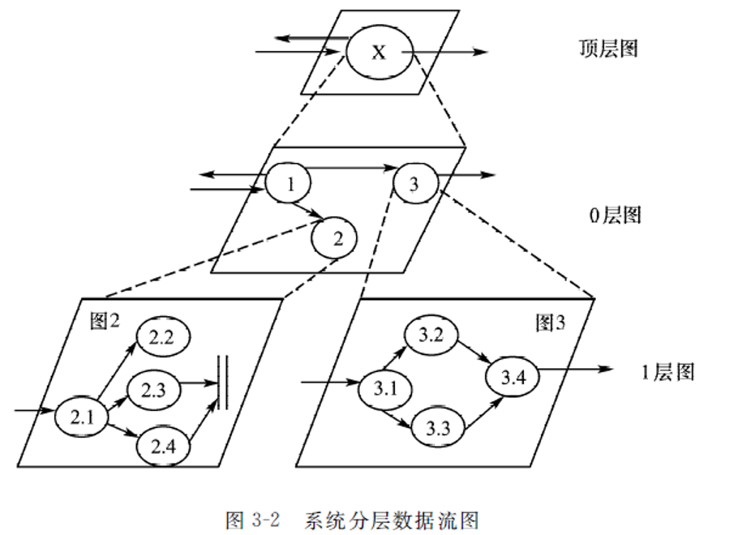
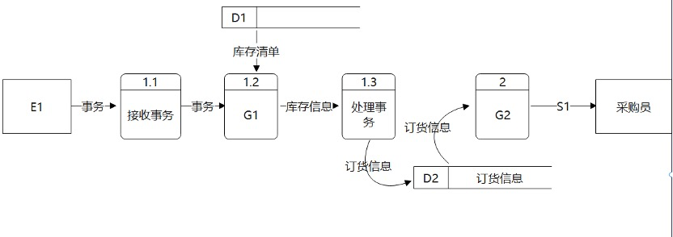
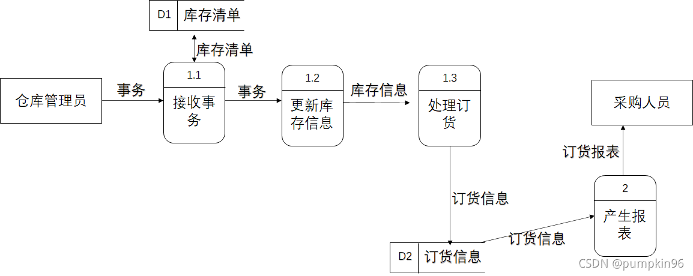
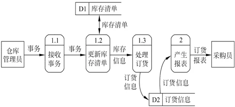
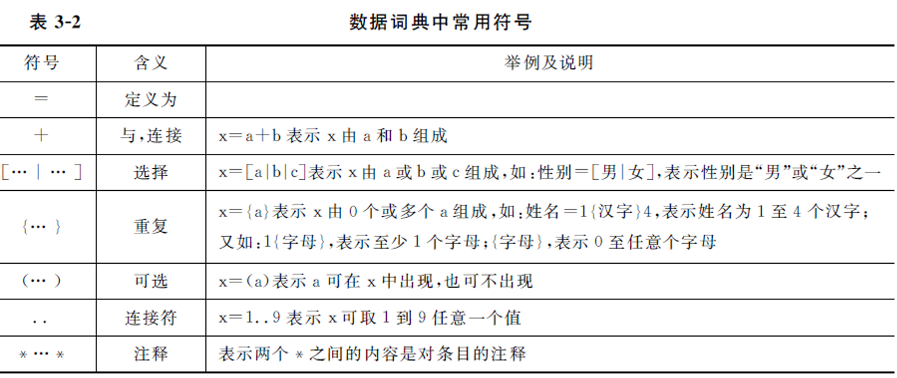
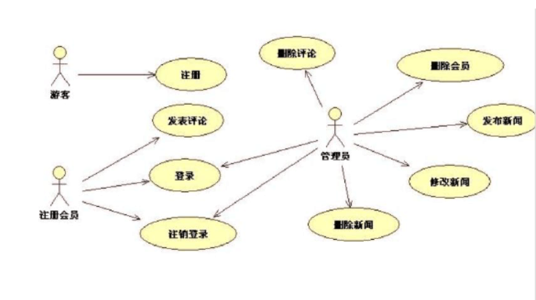
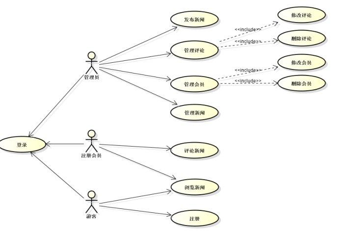
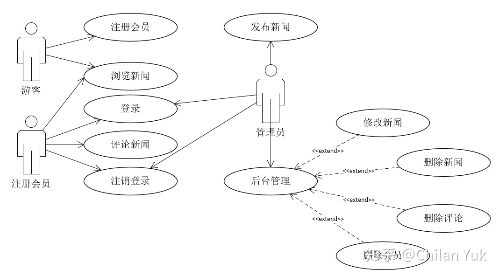

# Chapter 2 - 需求分析

## 2.0 复习内容

1. 了解面向过程和面向对象分析模型有哪些描述工具
2. 掌握数据流图
3. 掌握数组字典的定义、作用和组成条目
4. 掌握用例图
5. 了解类图的组成和类与类之间的关系
6. 了解其他需求分析阶段的图形工具
7. 掌握验证软件需求的正确性的四个方面

### 需求分析

!!! question
    **需求分析与系统设计阶段任务的主要区别是什么?**
    
    需求分析：定义软件的用户需求，即定义待开发软件能做什么。
    
    软件设计：定义软件的实现细节以满足用户需求，即研究如何实现软件。

??? question
    **需求分析中开发人员要从用户那里了解 ( {++软件做什么++} )。**

    {++A. 软件做什么++}
    
    B. 用户使用界面
    
    C. 输入的信息
    
    D. 软件的规模

??? question
    **需求分析是 ( {++软件开发工作的基础++} )。**

    {++A. 软件开发工作的基础++}
    
    B. 软件生存周期的开始
    
    C. 由系统分析员单独完成的
    
    D. 由用户自己单独完成的

## 可行性研究 P20

1. **技术可行性**
2. **经济可行性**
3. 运行可行性（用户使用可行性，操作可行性）
4. 法律可行性

!!! question
    **可行性研究的目的是什么?可以从哪些方面来考虑软件开发的可行性?**

    **目的**：确定问题能否被解决，是否值得被解决。
    
    **可行性研究的任务**：
    
    首先看，合不合法？即法律可行性。
    
    合法了之后就要考虑钱的问题，有没有钱来做，即经济可行性。
    
    有了钱之后，就要考虑更加实际的问题，即技术上能不能实现，即技术可行性。
    
    到最后，再来考虑运行可行性，也即用户使用可行性、操作可行性。

??? question
    **可行性研究主要从以下几个方面进行研究：( {++技术可行性，经济可行性，操作可行性++} )**

    {++A. 技术可行性，经济可行性，操作可行性++}
    
    B. 技术可行性，经济可行性，系统可行性
    
    C. 经济可行性，系统可行性，操作可行性
    
    D. 经济可行性，系统可行性，时间可行性
    
    https://www.nowcoder.com/questionTerminal/e57441f307ab4d3d838de018c94a28a9

??? question
    **可行性研究的任务不包括 ( {--社会可行性--} )。**

    A. 技术可行性
    
    B. 经济可行性
    
    C. 用户使用可行性
    
    {--D. 社会可行性--} {++法律可行性++}

??? question
    **可行性分析研究的目的 ( {++项目值得开发否++} )**

    A. 争取项目
    
    {++B. 项目值得开发否++}
    
    C. 开发项目
    
    D. 规划项目

??? question
    **可行性研究要进行一次( {++简化的、压缩了的++} )需求分析。**

    A. 深入的
    
    B. 详尽的
    
    C. 彻底的
    
    {++D. 简化的、压缩了的++}

### 可行性研究题库

1. 系统流程图用于可行性分析中的 {++当前运行系统++} 的描述。
2. 需求规格说明书的作用不应包括 ( {++软件可行性研究的依据++} )。

## 需求分析的步骤 P38

1. 需求获取
2. 分析建模
3. 需求描述
4. 需求验证

## 结构化需求分析方法 P40

??? question
    **软件开发常使用的两种基本方法是结构化和原型化方法，在实际的应用中，它们之间的关系表现为 ( {++相互补充++} ) **
    
    A. 相互排斥
    
    {++B. 相互补充++}
    
    C. 独立使用
    
    D. 交替使用 

> **结构化分析方法总的指导思想是“{==自顶向下，逐步求精==}”，它的两个基本原则是“{==抽象==}”和“{==分解==}”**，即按照功能分解的原则，对系统进行逐层分解，直到找到所有满足功能要求的可实现软件元素为止。

??? question
    **结构化分析方法采用的基本手段是 ( {++分解与抽象++} ) 。**

    {++A. 分解与抽象++}
    
    B. 分解与综合
    
    C. 归纳与推导
    
    D. 试探与回溯

> 结构化分析（Structured Analysis，简称 SA）方法是20世纪70年代由 E·Yourdon 等人提出的一种{==**面向数据流**==}的分析方法，适用于大型的数据处理系统。由于利用图形来表达需求会使文档清晰、简明、易于学习和掌握，所以软件分析人员仍在广泛使用这种传统的分析方法。

??? question
    **结构化分析方法是一种预先严格定义需求的方法，它在实施时强调的是分析对象的 ( {++数据流++} )**

    A. 控制流
    
    {++B. 数据流++}
    
    C. 程序流
    
    D. 指令流

> **结构化分析的描述工具**

> 结构化分析方法利用图形等半形式化的描述表达需求，用它们形成需求规格说明书的主要部分，主要工具有：

>（1）{==数据流图（DFD）==}。描述系统的分解，即描述系统由哪几部分组成，各部分之间有什么联系等。

>（2）数据词典（DD）。明确定义数据流图中的数据和加工。它是数据流条目、数据存储条目、数据项条目和基本加工条目的汇集。

>（3）结构化语言、判定表和判定树。用于详细描述数据流图中不能再分解的每一个基本加工的处理逻辑。

??? question
    **结构化分析方法使用什么描述工具？**

    1. 数据流图
    2. 数据字典
    3. 描述加工逻辑的结构化语言、判定表、判定树
    
    	结构化的分析方法是面向数据流的方法，因此，此方法研究的核心是数据的组成和数据流向和对数据的加工处理。结构化分析方法用抽象模型的概念，按照软件内部数据传递、变换的关系，自顶向下逐层分解，直至找到满足功能要求的所有可实现的软件元素为止。 描述工具： ①系统流程图 ②数据流程图 ③数据字典 ④IPO图 ⑤层次方框图 ⑥实体—关系图 ⑦状态—变迁图

## 2.1 分析模型的描述工具

|          | 面向过程的需求分析            | 面向对象的需求分析     |
| -------- | ----------------------------- | ---------------------- |
| 数据模型 | 实体-联系图 (E-R图)、数据字典 | 类图、类关系图         |
| {==功能模型==} | 数据流图 (DFD)                | 用例图                 |
| 行为模型 | 状态变迁图 (STD)              | 活动图、时序图、状态图 |

## 2.2 数据流图 P42

数据流图是从数据传递和加工的角度，以图形的方式刻画数据流从输入到输出的移动变换过程。

**数据流**是数据在系统中的传送通道，数据流符号的箭头指明了数据的流动方向，由 一组固定成分的数据组成。数据流可从加工流向加工，也可在加工与数据存储或外部项之间流动；两个加工之间可有多股数据流。

**加工**表示对数据进行的操作，如“处理选课单”等。每个加工至少有一个输入数据流和一个输出数据流。加工的编号是这个加工在层次分解中的位置。

**数据存储**是用于保存数据的数据文件，它可以是数据库文件或任何其他形式的数据组织。

**外部实体**（数据源点 / 终点）是反映数据流图与外部实体之间的联系，表示图中的输 入数据来自哪里或处理结果送向何处。

??? question
    **在结构化分析方法中，( {++数据流图++} ) 表达系统数据流向的图形化技术。**

    A. 数据字典
    
    B. 实体关系图
    
    {++C. 数据流图++}
    
    D. 状态转换图

??? question
    **通过 ( {++功能分解++} ) 可以完成数据流图的细化。**

    A. 结构分解
    
    {++B. 功能分解++}
    
    C. 数据分解
    
    D. 系统分解
    
    *数据流建模是功能域建模，逐层进行功能分解得到不同层次的功能级数据流图。*

!!! question
    **面向数据流软件设计方法一般是把数据流图中的数据流化分为 ( {++交换流和事务流++} ) 两种流，再将数据流图映射为软件结构。**

    A. 数据流与事务流
    
    {++B. 交换流和事务流++}
    
    C. 信息流与控制流
    
    D. 交换流和数据流
    
    *[解析] 结构化设计方法采用结构图(SC)来描述程序的结构。结构图的基本成分由模块、调用和输入/输出数据组成。通常在需求分析阶段，用结构化分析方法产生了数据流图。*
    
    *面向数据流的设计能方便地将数据流图(DFD)转换成程序结构图，数据流图中从系统的输入数据到系统的输出数据流的一连串连续变换将形成一条信息流。*
    
    *数据流图的信息流可划分为变换流和事务流两种类型：*
    
    *信息沿着输入通路进入系统，同时将信息的外部形式转换成内部表示，然后通过变换中心处理，再沿着输出通路转换成外部形式化离开系统。具有这种特性的信息流称为变换流。*
    
    *信息沿着输入通路到达一个事务中心，事务中心根据输入信息的类型在若干个动作序列中选择一个来执行，这种信息流称为事务流。*

??? question
    假设一家工厂的采购部每天需要一张定货报表，报表按零件编号排序，表中列出所有需要再次定货的零件。对于每个需要再次定货的零件应该列出下述数据:零件编号，零件名称，定货数量，目前价格，主要供应者，次要供应者。零件入库或出库称为事务，通过放在仓库中的惇CRT终端把事务报告给定货系统。当某种零件的库存数量少于库存量临界值时就应该再次定货。请在下列系统的数据流图中填入空白处E1/D1/G1/G2/S1内容。
    

    
    
    
    
    
    
    E1: 仓库管理员
    
    D1: 库存清单
    
    G1: 更新库存清单
    
    G2: 产生报表
    
    S1: 订货报单

### 题库

1. 分层数据流图是一种比较严格又易于理解的描述方式，它的顶层图描述了系统的（ {++输入与输出++} ）
2. 在数据流图中，○（椭圆）代表（ {++加工++} ）。
3. 结构化分析方法 SA、结构化设计方法 SD，和J ACKSON 方法，是在软件开发过程中常用的方法，人们使用 SA 方法时可以得到（ {++分层数据流图++} ），使用SD方法时可以得到（ {++分层数据流图++} ）。
4. 进行需求分析可使用多种工具 ( {++数据流图++} {++数据字典++} {++判定表++} )，但( {--PAD图--} )是不适用的。
5. 在数据流图中，有名字及方向的成分是 ( {++数据流++} )。
6. 在结构化分析方法中，用以表达系统内数据的运动情况的工具有 ( {++数据流图++} {++数据词典++})
7. 描述结构化系统分析方法的工具不包括 ( {--组织结构图--} )，包括：{++数据流图++} {++数据词典++} {++结构化语言++}
8. 结构化分析方法使用的描述工具( {++数据流图++} )描述系统由哪几部分组成，各部分之间有什么联系等等。
9. 数据流图和( {++PDL 图++} )共同构成系统的逻辑模型。
10. 数据流图是用于软件需求分析的工具，下列元素( {++①数据流 ②加工 ③数据存储 ④外部实体++} )是其基本元素。
11. 作为软件开发结构化方法的工具，数据流图描述数据在软件流动和被处理变换的过程，它是以图示的方法来表示( {++软件结构++} )。
12. 数据流图的正确性是保证软件逻辑模型正确性的基础，以下( {--文件操作--} {++数据守恒++} {++均匀分解++} {++图形层次++} )项内容与它的正确性、相关性最弱。
13. SA方法中使用半形式化的描述方式表达需求，采用的主要描述工具是（ {++数据流图和数据字典++} ）。
14. 数据流图中有四种符号元素，他们是（ {++数据流，加工，数据存储，实体++} ）。
15. 在画分层数据流图时，父图与子图的输入输出要（ {++守恒++} ）。
16. 当数据流图中的某个加工的一组动作存在着多个条件复杂组合的判断时，其加工逻辑使用（ {++判定表或判定树++} ）。
17. 数据流图中的箭头表示( {++数据流++} )。
18. 数据流图的基本符号包括（ {++数据输入的源点和数据输出的汇点++} ）（ {++加工++} ）（ {++数据流++} ）（ {++数据存储文件++} ）。
19. 数据流图和（ {++数据字典++} ）共同构成系统的{==逻辑模型==}。
20. 结构化分析方法(SA)最为常见的图形工具是( {++数据流图++} )。
21. 数据流程图(DFD)是用于描述结构化方法中( {++需求分析++} {--可行性分析--} {--详细设计--} {--程序编码--} )阶段的工具。
22. SA方法用DFD描述( {++系统的功能++} {--系统的基本加工--} {--系统的控制流程--} {--系统的数据结构--})。

## 2.3 数据字典 P46

### 重复 `{}`

`x={a}`

:   `x={a}` 表示 x 由 0 个或多个 a 组成

`姓名=1{汉字}4`

:   表示姓名为 1 至 4 个汉字

`1{字母}`

:   表示至少 1 个字母

`{字母}`

:   表示 0 至任意个字母

??? question
    **数据字典是用来定义( {++数据流图++} )中的各个成分的具体含义。**

    A. 流程图
    
    B. 功能结构图
    
    C. 系统结构图
    
    {++D. 数据流图++}

??? question
    **在数据词典中表示 0 个或多个 a 组成( {++{a}++} )。**

    A. 0、、a
    
    {++B. {a}++}
    
    C. (a)
    
    D. {0-a}
    
### 连接符 `..`

`..`

:	`x=1..9` 表示 x 可取 1 到 9 任意一个值
    
??? question "在数据词典中表示取 1 到 9 的任意一个值的符号为"
    **在数据词典中表示取 1 到 9 的任意一个值的符号为（ {++1..9++} ）。**

    A. 1+9

    {++B. 1..9++} {==使用双点号表示的是一个范围，表示的是从 1 到 9 的连续序列，其中的每个数字都可以作为取值。==}

    C. (1-9) {==使用括号表示的是一个范围，但使用了减号，表示的是从 1 到 9 的连续序列，而不是单独的取值。==}

    D. {1-9} {==使用花括号表示的是一个集合，同样表示的是从 1 到 9 的连续序列。==}

### 题库

1. 数据字典的任务是对于数据流图中出现的所有被命名的数据元素，在数据字典中作为一个词条加以定义，使得每一个图形元素的名字都有一个确切的 ( {++描述++} )。
2. 结构化分析方法使用的描述工具 ( {++数据字典++} ) 定义了数据流图中每一个图形元素。
3. 在结构化分析方法(SA)中，与数据流图配合使用的是( {++数据字典++} )。
4. 结构化分析方法以数据流图、( {++数据字典++} )和加工说明等描述工具，即用直观的图和简洁语言来描述软件系统模型。
5. 数据字典是对数据定义信息的集合，它所定义的对象都包含于( {++数据流图++} )。
6. 需求分析中，对算法的简单描述记录在( {++数据字典++} )中。
7. 数据字典(DD)是定义( {++数据流程图++} {--系统流程图--} {--程序流程图--} {--软件结构图--} )系统描述工具中的数据的工具。
8. 数据字典中，一般不包括下列选项中的( {--源点与终点--} {++数据流++} {++数据存储++} {++加工++} )条目。

## 2.4 用例图

??? question
		用例图的三要素包括{++Actor 参与者++}、{++Use Case 用例++} 和关联 (Association)。

??? question
		用例图中用例与参与者的关系是关联，用例与用例的关系是 {++扩展 extend++} 或 {++包含 include++}。 

!!! question
    某一新闻管理系统主要用来发布新闻，管理员只需要一个，登录后可以在后台发布新闻。任何人可以浏览新闻，浏览者可以注册成为系统会员，注册后可对新闻进行评论。管理员在后台可以对新闻、评论、注册会员进行管理，如修改、删除等。请画出该新闻管理系统的用例图。

    
    
    
    
    
    
    参见：https://www.cnblogs.com/yakniu/p/16501746.html

## 2.5 类图

??? question
    **( {++多态性++} ) 意味着一个操作在不同的类中可以有不同的实现方式。**

    {++A. 多态性++}
    
    B. 多继承 
    
    C. 类的可复用 
    
    D. 信息隐藏
    
    *多态性是指用同一个名字定义功能相近的不同函数。这就意味着即使操作的特定动作互有区别仍可用同样的接口访问。多态性是对象的一种能力，它可以在运行时刻根据传递的对象参数，决定调用哪一个对象的方法。这样就可以不去考虑所有对象的类型，而可以在不同的类中按不同的方法实现。*

??? question
    **在一个课程注册系统中，定义了类 `CourseSchedule` 和类 `Course` , 并在类 `CourseSchedule` 中定义了方法 `add (c:Course)` 和方法 `remove (c:Course)`，则类 `CourseSchedule` 和类 `Course` 之间的关系是 ( {++依赖关系++} )。 ** 

    A. 泛化关系
    
    B. 组合关系
    
    {++C. 依赖关系++}
    
    D. 包含关系
    
    *在面向对象方法中，在类图上包含的关系有：① 泛化 (Generalization)、② 实现 (Realization)、③ 关联 (Association)、④ 聚集、聚合 (Aggregation)、⑤ 组合、组装(Composition)、⑥ 依赖(Dependency)等。其中，依赖关系是指类与类之间的连接，并且依赖总是单向的，是类间最弱的一种关系；泛化关系是表示类与类、接口与接口之间的特殊关系，它是继承关系的反关系；实现关系是用于指定两个实体之间的一个合同。依题意，由于在类 `CourseSchedule` 中定义了方法`Add(c:Course)` 和方法 `Remove(c:Course)`，使之与类 `Course` 建立了连接关系，因此这两个类之间的是一种依赖关系。*
    
    *类和类之间的关系主要有关联关系、依赖关系、泛化关系、共享聚集、组合聚集、实现关系。
    
    (1) 关联关系 (Association):描述了给定类的单独对象之间语义上的连接。关联提供了不同类之间的对象可以相互作用的连接。
    
    (2)泛化关系 (generalization)。泛化关系描述了一般事物与该事物中的特殊种类之间的关系，也就是父类与子类之间的关系。继承关系是泛化关系的反关系，也就是说子类是从父类继承的，而父类则是子类的泛化。
    
    (3)聚合关系 (Aggregation)。聚合是一种特殊形式的关联，它是传递和反对称的。聚合表示类之间的关系是整体与部分的关系。例如，汽车和车轮就是聚合关系，车子坏了，车轮还还可以用；车轮坏了，可以再换一个。
    
    (4)组合关系 (Composition)。如果聚合关系中的表示部分的类的存在与否，与表示整体的类有着紧密的关系。例如,一个公司包含多个部门，它们之间的关系就是组合关系，公司一旦倒闭，也就没有部门了。
    
    (5) 依赖关系 (Dependency)。有两个元素 X、Y，如果修改元素 X 的定义可能会引起对另一个元素 Y的定义的修改，则称元素 Y 依赖于元素 X 。
    
    根据题意，类 `CourseSchedule` 和类 `Course` 之间的关系为依赖关系，依赖可以由各种原因引起，例如，一个类向另一个类发送消息、一个类是另一个类的数据成员、一个类是另一个类的某个操作参数等。在 `CourseSchedule` 中，类 `Course` 是类 `CourseSchedule` 的操作参数，这时当类 `Course` 变化时类 `CourseSchedule也会发生变化`*

??? question
    **类图的要素不包括 ( {++对象++} )。**

    A. 类名称
    
    B. 操作
    
    C. 属性
    
    {++D. 对象++}

??? question
    45、有关类与对象的描述不正确的是 ( {++一个类只能有一个对象++} )。

    {++A. 一个类只能有一个对象++}
    
    B. 对象是类的具体实例
    
    C. 类是某一类对象的抽象
    
    D. 类和对象的关系是数据类型和变量的关系
    
    *从语言的角度来说，类是一种用户自己定义的数据类型，可以定义一个对象。也就是说一个类可以有许多个对象。*

??? question
    类图中关系包括关联、依赖、{++泛化++} 和 {++实现++}，其中关联关系又可以划分为一般关联、{++聚合++} 和 {++组合++}。 

## 2.6 其他图形工具

## 2.7 验证软件需求

*[数据流图]: Data Flow Diagram，简称 DFD，是 SA(结构化分析)方法中用于表示系统逻辑模型的一种工具，是一种功能模型。
*[数据字典]: Data Dictionary，简称 DD，就是用来定义数据流图中的各个成分具体含义的，它以一种准确的、无二义性的说明方式为系统的分析、设计及维护提供了有关元素的一致的定义和详细的描述。
