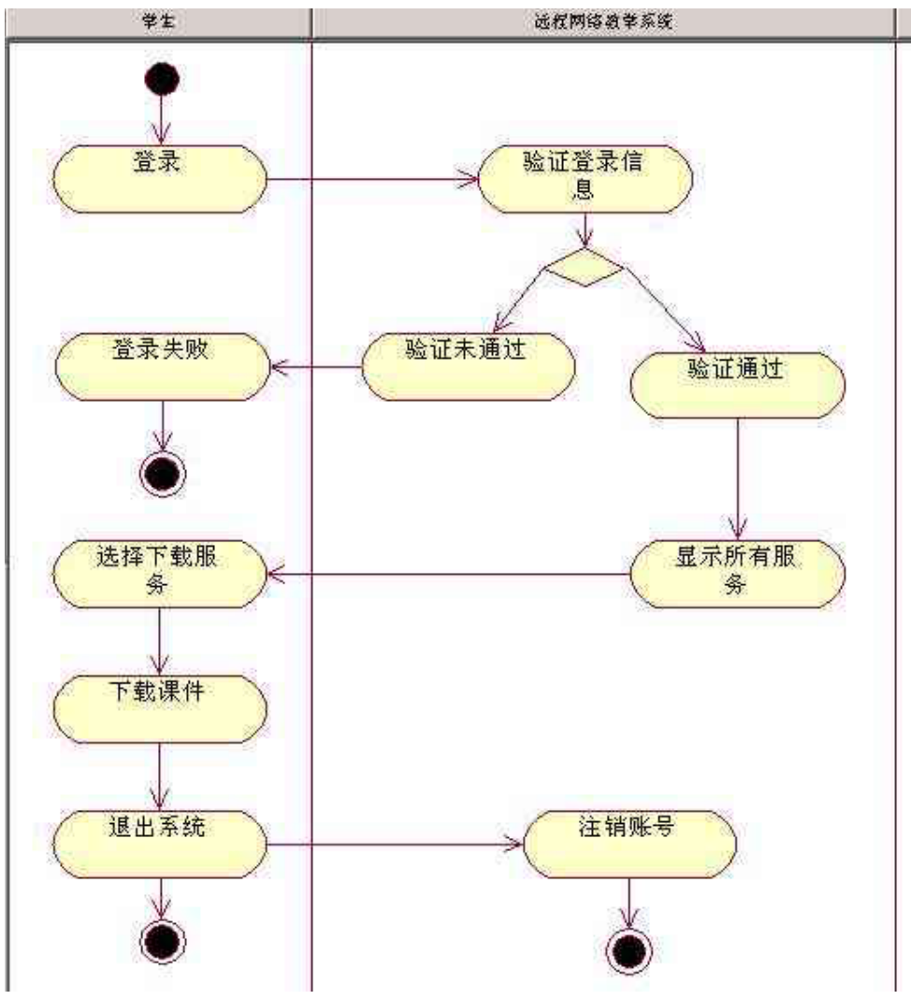
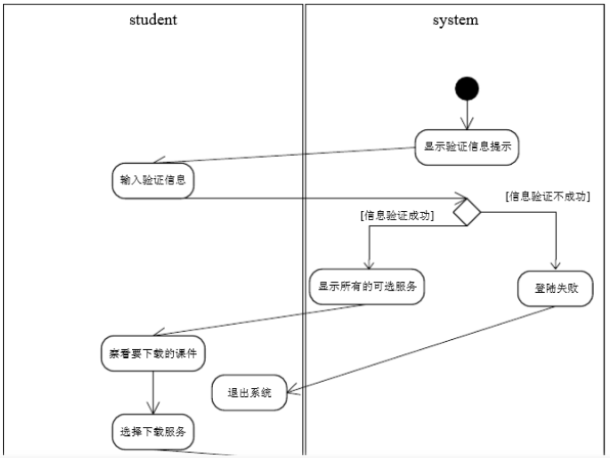

# Chapter 6 - 活动图

对于“**远程网络教学系统**”，学生登录后可以下载课件。

在登录时，系统需要验证用户的登录信息，如果验证通过系统会显示所有可选服务。如果验证失败，则登录失败。当用户看到系统显示的所有可选服务后，可以选择下载服务，然后下载需要的课件。下载完成后用户退出系统，系统则会注销相应的用户信息。

画出学生下载课件的活动图。

* 活动图：学生下载课件

	  * 开始（黑色实心圆）
  	* 登录（学生）（圆角矩形）
    * 验证用户的登录信息（远程网络教学系统）
        * 验证失败（远程网络教学系统）
      	* 登录失败（学生）
        * 结束（黑色实心外层实线圆）
    * 验证通过（远程网络教学系统）
    * 显示所有可选服务（远程网络教学系统）
    * 选择下载服务（学生）
  	* 下载需要的课件（学生）
    * 给用户下载课件（远程网络教学系统）
  	* 下载完成（远程网络教学系统）
    * 退出系统（学生）
  	* 注销相应用户信息（远程网络教学系统）

