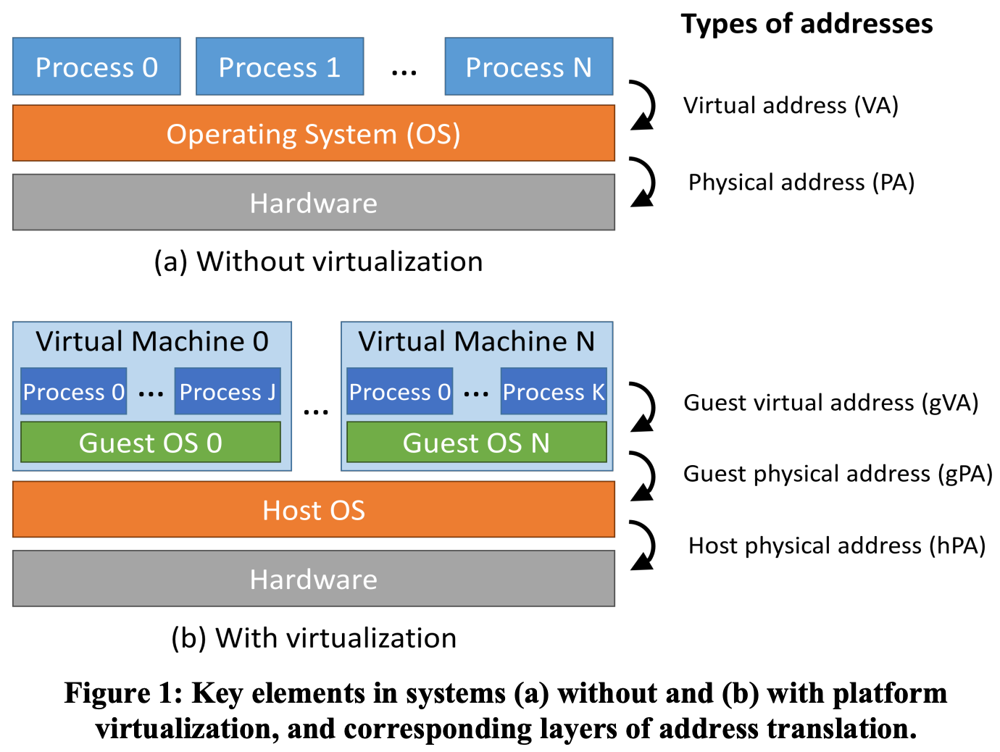

# 虚拟机

## 概念

-   **虚拟机** aka. 模拟器

    -   [Virtual machine @wikipedia](https://en.wikipedia.org/wiki/Virtual_machine)

    -   分类

        1.   **硬件虚拟机** aka. 系统虚拟机，操作系统虚拟机 —— 模拟硬件环境

        2.   **软件虚拟机** aka. 进程虚拟机，应用程序虚拟机 —— 模拟软件环境
             -   JVM

-   **Host OS** aka. 真实系统，宿主系统

-   **Guest OS** aka. 虚拟系统 访客系统

![](data:image/jpeg;base64,/9j/4AAQSkZJRgABAQAAAQABAAD/2wCEAAkGBxASEhMSEhASFhUVGBUZGBcWFRcXFxcdGh0eFhoeGhYYICggGhslIB8YIzEtJSorLy4uGx8zODMtOCgtLisBCgoKDg0OGxAQGi0lICYuLS0tLS0vLS0tLS0tLS8rLy0tLS0vLS0tLy0tLS0tLS0tLS0tLS0tLS0tLS0tLS0tLf/AABEIAPsAyQMBIgACEQEDEQH/xAAbAAADAAMBAQAAAAAAAAAAAAAABQYDBAcCAf/EAE8QAAIBAwIBBAwLBQYFAwUAAAECAwAEEQUSIQYTMVQUFRYiQVFSkZSj0tMHIzRTYXFygZPR4jJCVXOzNXShsbTDJDOCkrJig/BDY2Si8f/EABoBAQADAQEBAAAAAAAAAAAAAAABAgMEBQb/xAA7EQABAwEDCAkCBgICAwAAAAABAAIRAxIhUQQTMUFSkaHRBRQVYXGBosHwU9IiMoKxssLh8UJiBjNy/9oADAMBAAIRAxEAPwDo3wlzOmnyGOSSNjJbLujdkcBp41bDLgjIJH31i7ioeuan6fce1Xv4Uf7Pf+dZ/wCoiqiJosariIhTXcVD1zU/T7j2qO4qHrmp+n3HtVSZozRZW3Yqb7ioeuan6fce1R3FQ9c1P0+49qqTNGaJbdipvuKh65qfp9x7VHcVD1zU/T7j2qpM0Zolt2Km+4qHrmp+n3HtUdxUPXNT9PuPaqkzRmiW3Yqb7ioeuan6fce1R3FQ9c1P0+49qqTNGaJbdipvuKh65qfp9x7VHcVD1zU/T7j2qpM0Zolt2Km+4qHrmp+n3HtUdxUPXNT9PuPaqkzRmiW3Yqb7ioeuan6fce1R3FQ9c1P0+49qqTNGaJbdipvuKh65qfp9x7VHcVD1zU/T7j2qpM0Zolt2Km+4qHrmp+n3HtUdxUPXNT9PuPaqkzRmiW3Yqb7ioeuan6fce1R3FQ9c1P0+49qqTNGaJbdionUNI7EutOaK6vm5y55t1lu5pEZeakbBRmweKjzV0Ko7lb8o0r++f7E1WNF0UyS2SpL4Uf7Pf+dZ/wCoiqgzU/8ACj/Zz/zrP/URU+zRY5QdC+5rFPcIgBd1UEgAsQBknAGT4SeArJmpD4TT/wANB/e7T+qtFzgqwzWG2uo5BujdXGWXKsGGVO1hkeEEEHxEVkJqF5CapBbaa888qxxdkXJ3NwBzK2MePPgopF4lXmaM1MaJy2tbu47HiScEoZFeSIxo4Bwdu/DHGR4Mca0Lr4S7NJGVYbuWNCQ88UJeFSOBy4OTj6AaJZdMQrbNGantY5X2ts8CSFz2QjvGUUtu27e9AHfFm3DGB4D0Vn0HlAl00yczNE8JUMkqqGww3KRtY8CPHx+iiQYlOs0Zqa5V8sIdPktlmRis/Od+uTt2BcDaASzMWAA+ujkzyygvXeNYriGVAGMc8fNuVPAMBk5GeFEgxKpc0ZqMb4RrQxNNHDcyJHnnSkYxEASCWYsFPRnCknBHCt7lFyztrQxqVmmlkXcsMCc5IV8rbkYH1miWXTEKlzRmkWlcq7We1a7DlI03c4JBtaIr+0rjwMKT2Xwk2ckqJzF4iSMqpPJAVhcsQFAbOeJPhFEsuwVrmjNS8/La3Wae2SK4lnhYKY40DFsqH3A5CheOMsRxBr5dcurOO2huX5z48fFxBd0zEdKhFJ4g8OnH00Sy5VOaM1Jafy9tpYLmbmbmM2qF5YpY9kgGCwwCcEkDhx8IrWuPhP09HVGMuCoJkCZjViocRlgeMmD0DNEsuwVtmjNTnJblhb35lVI5oni27kmTY21hlWAye9P01oXnwk6chwjSzAOqM0UZaNCxC99IcKBkjw0Sy6YhWWaM15DZr7mirKnOVnyjSv75/sTVZVGcqvlGlf3z/Ymqzou2h+RSPwpf2c/860/1EVPc0i+FP+zn/nWn+oip4TRYZUbx5r7mp3l5pUt1ZyJD/wA1Cksf0tGwcD78YqgzRmoXMHwZXOrj4SGkhaCKyuxfsm0QmFgEcjG4k470E5444V71bTray02ztrqC4kSMqzS24JaCRVLb+HRxLDPR466HmjNTKvnANA4rnHJXU5Lya4EXPSwi3ZYrm5gVJY3fIZFkVRuTgp8eR9VT2ianbQwRWd/b6k80QCi1EZELFfFHFgSg9OX3Z6a7RmjNEzowUOjSS6hpkktvzTdjXRMfTzZzHgZxgHFWEFjEkkkqoA8u3e3HLbRgeYVsZr5moVS/55qF+Em/S3uNLnkVmWOeXIRdzYMZ6F8PgP3V50LUe2Goi8ghlW3ht5IuckQoZGdlOFB6Qu0085Q6VLNdafKgG23lkeQk4IBjKDA8PE1Q5qVa2LPepHkPpsUmmLDLECkhlDoQV3Zds5xg5pVqeoLpmp3FzcQTNBPFCsUscZcRc2NpjOP2cnvvp3fRXQ80ZpKjOXmda5VfabczWN5ci1kAnu4bjscr8Y0UZQEFPKbbuxW1q3KRL9rBIYZUg7MiDNIhTLRhpAiL4cFRk9A4Dw1ccoJLtYSbRInmBGFlJVWHhGR0H66l9N0zVLq7guNQSCGO23GOGJi5ZyNu5jxGACR0/dRXDgRJTHklDi81Ulf2riPiR0jmU8PhFIdb5rTNRhuXtpDaC2MSNGhkEL84zN9ncGHHPHj4q6RmjNJWdu+9col1UXK646W9yguLYPHzsbLzgWLmiVB8HAUz1DS44LXRuZhAWO5gLKFP78bhmb6dxHE+OuiZozRTnL/mEKK1NzBqskgheQS2DEogyXMLk7R42IcAfVUlZazAvNWmnx3z9+gezuYBJCqFgXyXG9duQQScA4rsWaM0lBUA1L6KM15zRmoVJU9yo+U6X/fP9iarSorlR8p0v++f7M1WtSu/J/yKR+FP+zn/AJ1p/qIqck0k+FWQLpsrHoEtoTwJ4C4iPQOJrTPLzT/Ln9EuvdUWOVgyIGKp80ZqY7vNP8uf0S691R3eaf5c/ol17qoXHZdgdyp80ZqY7vNP8uf0S691R3eaf5c/ol17qiWXYHcqfNGamO7zT/Ln9EuvdUd3mn+XP6Jde6oll2B3KnzRmpju80/y5/RLr3VHd5p/lz+iXXuqJZdgdyp80ZqY7vNP8uf0S691R3eaf5c/ol17qiWXYHcqfNGamO7zT/Ln9EuvdUd3mn+XP6Jde6oll2B3KnzRmpju80/y5/RLr3VHd5p/lz+iXXuqJZdgdyp80ZqY7vNP8uf0S691R3eaf5c/ol17qiWXYHcqfNGamO7zT/Ln9EuvdUd3mn+XP6Jde6oll2B3KnzRmpju80/y5/RLr3VHd5p/lz+iXXuqJZdgdyp80ZqY7vNP8uf0S691R3eaf5c/ol17qiWXYHcsvKf5TpX98/2Zqt65jfco7a5vNNSFnLC73HfDNGMczKP2pEUE8Rw6a6dUr0cmBFO9SPwp/wBnv/OtP9RFTbNKfhT/ALOf+daf6iKmeaLmy8wW+a9ZozXzNGahefK+5ozXzNGaJK+5pbqmv2lsyrPcxRs/7IZgCfu8Ve9Y1BbeCWd/2YkZz9O0Zx99c9sV0uKM3GsSW73VyokdZV5xo0f9hY48FlAHiGfNUrWm0G88Na6dFKrAMrAgjIIOQR9BFe81C6Lyn0u3sz2AWlijlRNgEikNM/ADnQOGSao9X1tbeS2jKMxuZebXBHe96Wyc+DhRQ5jgYjem+aM1H6zy4EUzwwWVzdNFjnTCuVjJ44LePFbycsLTsNLx2dI3O0KyEyb9xTbsXJJyD0UhLDsFRZozUhpvLgTzNCtldI3MvNHzqCMy7SAVUHw8al9I5XXY1G6btXekyrbgxeGIAbQzZGADxPgHTSFIpOM9y6vmtPUtVgtk3zzJGvjdgM/V462SaguTukR6lNNqF4glXnHitonAaOOOM7Sdh4FmYN056KKGAEEnQFW6RyhtLrPY9zFIR0hWyR93Tit26u44lLyOqKOlmIAH3moTllottayWNzawxQyi6gj+KRU3q+VZSFAB4Vi+ERtt5ayXVrLcWKI2VjBcCYnGZI+hgFxjPjaisGBxFnXOE3alaaRyhs7rIt7mKUjpCtkj7ummWahuRup6NPOTaW6QXKoQUMIhfYTx71e9YcB4yKuM0VHiyYjevuaM18zRmoVJX3NGa+ZozRJSDlIf+J0v++f7M1XNQvKP5Tpf98/2Zquqletkf/q8ypH4U/7Of+baf6iKmOaWfCq4XTpCSABLakknAAFxESSa1+6zTf4hZ+kRe1Rc3SJvb5+yd5ozSTus03+IWfpEXtUd1mm/xCz9Ii9qi820neaM0k7rNN/iFn6RF7VHdZpv8Qs/SIvaolpeuV2mtdWVxboRukjIXPRnpHnIxUanKBn2r2ina8CIhaSJBECowPjjnKgnOMeE1Yd1mm/xCz9Ii9qjus03+IWfpEXtUWjasCCPnkpa65Kzw6W6qokummS6kCDAZ1dW2L4gFAUfUT4a8z67JfXenFdPvYkinJd5otoGY2HgJOPpOBVX3Wab/ELP0iL2qO6zTf4hZ+kRe1RTn9ZGPFQzh7Oa4ju7K+uY5J5JIzAd0TB/A8aleI6O+J+6mmo3cjWi9k6PJzHOHZFAfjoUUd4+FI78nJ70jGR09Jpe6zTf4hZ+kRe1R3Wab/ELP0iL2qIa86uJSHkTe3M1zI3MXaWoj703gHPLJuGQh/a2EZJyTxAphp1u41e7k2Nsa3twGwdpILcAegkCt7us03+IWfpEXtUd1mm/xCz9Ii9qiqaum7VH7ck6PGufWWoXek85BJZT3FtzjvDLbqHcCRi5V4yRxBJ41T91mm/xCz9Ii9qjus03+IWfpEXtURtSARikWnJdaldQ3M9u9va2x3wxyY5yWQjAd1/dC54Dxis+p8t1s7iWK9ieOHvTDMqO6uCOIYjOGB/z87bus03+IWfpEXtV8PKrTT039l6RF7VSrZ0E3i7Cff5rU5Y3K6jqFtdW8DpDbiQtcOmznt6lVVQeJXjuyfFV/mkY5V6b/ELP0iL2q+91mm/xCz9Ii9qoVX1LWgQAneaM0k7rNN/iFn6RF7VHdZpv8Qs/SIvaoqWk7zRmkndZpv8AELP0iL2qO6zTf4hZ+kRe1RLSx8oflOl/3z/Zmq8rmeo63aT3emLBdQSsLvJWOVHIHMyjJCknGSPPXTKL2shnM34lI+WMStaShlBGAcEAjgQRwNeDpNr1aD8JPyrPys+Sy/VXsmuPLnQ1n6v6r0qI0rV7U2vVoPwk/KjtTa9Wg/CT8q2S1L+T+sx3cXPIGA3yIQ2MgoxQ5x9VefbMStoWftTa9Wg/CT8qO1Nr1aD8JPypaeVMPO3ce2QizQPK4Ulckbyq44swXB4eOmtldrLGkqZ2uoYZGDgjIyD0VJc4JcvHam16tB+En5UdqbXq0H4SflW1mtezv4pd/NuG2MyNj91l4EH6RUWykLz2pterQfhJ+VHam16tB+En5VtZozUZwpZWr2pterQfhJ+VHam16tB+En5VsSPgE+IE0q5Ka0by1iuSmzfv73O7G12TpwM/s5q1p0T8+XJC3e1Nr1aD8JPyo7U2vVoPwk/KvOr6kltDLPJnZErM2OnA48PprVsuUEMlmt9xWIxGU56QACSDjwjBFLTtKQtztTa9Wg/CT8qO1Nr1aD8JPyrW5O61He28dzGCFkGcNjI8BBxTPNQXkGCgErV7U2vVoPwk/KjtTa9Wg/CT8q2s0q5S6ubSAzCPfh41K7tvB3CE5+gHP04qWvJMBCIW32pterQfhJ+VHam16tB+En5Vshq0k1aI3DWo3c4sYkPenbtJ2jv+jOfBUB5OhIWTtTa9Wg/CT8qO1Nr1aD8JPyrazRmozhSFq9qbXq0H4SflR2pterQfhJ+VbWaM0zhSEqn06BZ7UpBEpEjcVjUH/lv4QKqqnbo/H238xv6b1RV7GTmaTT3H+RXNU/MUn5W/JZfqr4TRyt+SS/ZrGTXD0m6G0/1f1W2TjT5LLuqG0G9SyuNVhfvUQi7XwDbIvf4/6l87VaZqL5Zck5ru6t5YnVYypiugTxeLcHVQMccncD0dNedTe0khxuP+1s9p0hY9GaWz0i4vTgXEyzXZ3A8Gky6Aj6Bt4fXW/r/KG8iXThBFHJJdHDKx2r/y9/7QztAPHw8BTLlXprXFlcW8eN0kbIuTgZ8GT4BWre6PK0mmsNuLZjznHwc1s73x8asKrSbRjXd5XclUtIuHctNbnWDLcW/OWxkEMcsUhhdYlZmZWQnJLYA6enj0Uh+DyLVxcXIaWz5pbqTsgAPvZyAx5vvcbTkdOK6XmkXJvSpIJL1324nuDImDnvdirx8RyDQVhZNw1fPfxUmneEcltaluFvGkC4huZY0AGO9RUYbvpyTU7Zctbya1s1hhjkvLpXfj3sUaIxBZvo6BXs6Pq9vNcrZmzNvcytKWmD70LqFYAKwB/ZFatnyS1G2hspLZ7fsq3jkidJMmJ1dt37QweHA+Doq4cy8mO7cbt6r+L54pxya1bUDNd2l8bZmhiR98G8D4zdgYYDwA1tfBiMaZbf8AunzyuR/nS/Q9J1QXM9xdG2PZEHNsItwEbJnYBuyWHfNk58VPOR+nPbWVvBJjfGmG2nIySScH76q94DSBH/HR3Aypa0/ulnwnSbrRLYE7rqeGEY6cFtz/AP6q1SdtO0ejyaah+N7Lksl/9yTfnx42sc/Uasdf0yabUNPkC5gg593ORgOQoTh0k9OPvpTFySmGtPdn5NgSgZ4c8U5o9748bjn/ANQq7Kga0An/ALeYMAcFBaZ4L7yPvYtOsr5GyUsp5hgftEMQ6AZ8JDKPrrDJyg1yM29xNFZxwTywxiHLmZedYKCWAx4fH91bOp8mJpp9Ri/Zgu4YmWTgdsyHA73OfAp/6a0r7StfnjSOU2AEDxSIVD7pWiYMu4kkLnAzgeGottJmROud/wC8z/tLJjX8+BOtd1q/luWtNNSANEqtNNPu5tS3FUAUEliOPRwGK0eWt3cjSXe8jRZEliLiJtysqyqcqTjpA6DWfVNK1SC5muNPe2YXBQyRXAbCsq7NyshB6Aowazato19cWPMzywvM0sTsVXYiosiuVHTnAB6emjKjQW6IkePfx8sEIJnT7LQtOUWrCa0luIbeO1upFjWLLGdN+dhc4xno4f4CqKw1iR9QurY7ebhigZeHHc+7dk/cKw8rdIluFtuaK7obm3l744GEbLffiix0iRL68uCV2TxwIvHjlN27I8A4iszUaWm4C73HspDTKkIeWerz201xBFbqlqZjNJKCBKEZjsiUZ4hAuSccc0+13lZPsto7QQrNPDzzPO22KFMDix8J3EACsmj8m5U0qWxcqJJEulyDkZlZypz9TL5qW3vJS9C2VxAbc3NvAInjmXfE2B4DwIIPh4Vo6owuOgCTHt5KsOATXkPrN9OZkuhA4QKVngEgictnKjeo3YGOI4cemq7NSvJ+31VpBLfSwIqqwEFup2En95mYknAHD6zVLurGo8TdHl8/wtGi5YJz8fbfzG/pvVJUzIfjrb+Y/wDTeqavcyIzQZ5/ycuSt+dJuV3ySX7NYCaz8rvkkv2a1C1cHTDoFP8AV/Rb5KNPl7r3mtXUdTgt1VppAgZ1RSc8WY4UcBWfdXM/hhWWc29vEcNGk9yfH8UFC+Hh0vXk0Ie8NJga/DSul/4Wyuh6rqsFtHzs8gRAVXcQTxY7RwAJ6fzrcDVy/wCEO5a+tbSGA5M0TXJ+zHFvHiwSxVfvqoTlPDBp9vcyEtvSJVVeLSOwwFUeEnB/xq1j8DSNJOj9v2duVbV5wVRmjNSmg8rJZZxb3VlJayOrPHucOJFXGeIAwwz0Uuk+ENmMqQWMs0sLyrIiuAqJGxTezleBbBIXHgPGozb5iOIiMZmI1adKm21W9xdxx7d7qu5gq7iBlj0AZ6Saylx4+mpa/wBct5Y9PkMAlW5lj2b8ZjO0yBsEHiMfRU3y41u9W8tAunsViuPimEyjsglCu0Db3nAnpzSmwvMC7TpIGjxI13f4UOcBeum5ozUxd8qmgtY5ri1dJpW2JbKwkctk4AYADo4nxV85O8qpJ5Wt7mze1mC71RnDh06CQwA4g9Ix4RUFjg0u1cvDT5SrWhMKozRmobu9ka3kuYrJ2ji3c4zSBFAUkHYSpMjDA4YA49NWcUu5Qw8IB8/GoqNdT/MI8x7SjSHaFq6hrcMMsMLFjJMcIiKWOB0scfsoPCTWaw1KGcOYnDc27RtgEbXXGQcj6R5xU1yU+Ou767biRIbeP/0pFwbHiy+fMK88nDzGo6hb9Cyc3cp/1jY/+K/4VY2YIGkAH9p3A8FAm5Ux1SETi25wc8UMgTjnaCATnGBxI6aIdVgeaS3WQGWNVZ045UN0HOMebo4eMVNciPj5LrUD/wDXkKRH/wC1F3q4+hjlvvqY5KTv24e5Zu8vGuo0/wDYKD/PPm+mr2B+IT+UcdY8hO4qsm7vXTF1WAzm2Eg54IJCnHO0nAOcY6aNT1SC3VXmkCKzqgJycsxwowB//OmuZ6PcM+s9m5+KnlntUH0RJ058RKf41s/DCss5t7aI98qz3B8fxSgL9WctVm025xrSbiJJw0zuhRa/CSuharqsFtGZp5AkYKgsckZY4HQCemseta1DaxiWYtzZZVLKpYLu6GbHQn0/SKgPhBuGvrSzt4TkzxNcHh+7HHvH1ZYqv31aaBItzYwF8MskKBs8c5XBrMhrGNc7WTI7vgKtJLiB8+XJ0kgIBBBB4gjoNfc1KfB5cN2PJAxJNrNLBk9JVSGTzKwH3VUbqyebLiJlXbeJWNj8fbfzH/ptVRUqD/xFv9t/6bVVV9L0eZyZh8f5OXBXuqFJuV/ySb7NLd9MeV/ySb7JpPvryv8AyB9kUv1/0XTkLZDvL3WxvqOs7Uz6pfPIp2JBFCpI4YfLNjPT0f41U76N9fPsyiyHDER4Xg+0ecrtNOYUF8GulziSc3KnEANpFuGO8VmY4z0jiBnwgLWvYWNybGFY4i8unXb4jYFedVNyjaW4E7WBBHDga6Lvo31u7Ly5xdAvIMarucneqCgAIlS2lXN1e3cU8lnJbRW6vgS8JHd+94L4FAzx8Oa98j9MeO2uw8TJJLPdE7lwWyxCnj0gjoqm30b6zdlciAIF2OqTrxJlWFKNah7LT7jsbRlMMgaGUc4pU5QBHXLeIdHnp1yytpZHsDGjNsu4WbaP2VGdxY+AY/8AnGn2+jfUOyuXT48Z5qBSgR4cFPcs7WfnLS7giMzWryFogQCyuACVz++MDH1msGhvc3d2LyW1kt444njjSXhI5cgsSvSoG0Yz05qo30b6nrf4LMDQROuCZPdrN+m9Mz+KZSbkhZEWKQzxdPOBkkXgQWPSp6QaoA1YN9G+qVMotuLjrJO+9WbTgQpzkZJzc1/bNwZbh5QD0lJu/BHjGSw+6tP4QrK7MkM9mhaVlkt3xnCpL0MxHQFOePgzTu90WKSeK5y6Sx8NyNjevhRx0MtNN9anKwHh4vuvB0aIPkdPdMaRKpmpaQUumjFnp7pECeYgYKBxLFEP+JP+dRGraZPBpFlLArdkW5WTABZsygq/AcTxbP3V0jfRvqKWWWCJE3gnvgRB8iR5qXUZ3QobWNLe006wZUJktJYJXCgkks3xvRxwSxH1UwtLUz6reSOrbI7eOFCQQPjMs2M9J4f41U76N9DlktMi8zfOJB57+69mb1A/Bppc4knNwpxbg2sW4fuBmc4z09IGfEF8VO/g8kaO0aCQMvY0ssWWBGVU5U5PSNuOI4VR760Nb0xbqPmneRUJBYI23eB0qx6dp8OMdFWflmcJm4EjRqjDxk4cFAo2QI1SlXweZMVxP4Lm5mkT6V4ID9R2k/URVZvrTt41RVRFCqoAAHQAOAArJvrGpXDnEjQrtpwIWWJv+It/tv8A02qtqNtT8fb/AG3/APBqsq+w6JdORsP/ANfzcvLyoRUKS8sfkc3DPenh46QlJuqz+q95VBys+Sy/VXsvVelKFGq2nnWzFqLyNnBTk1RzJs93upvZN1af1XvKNk3Vp/Ve8qk30b68nqOR7HqdzXVn6mPBTeybq0/qveUbJurT+q95VJvo306jkex6nc0z9THgpvZN1af1XvKNk3Vp/Ve8qk318aUDGSBngMnpP0U6hkex6nc1GfqY8FObJurT+q95Rsm6tP6r3lUm+viyg8QQfqOadRyPY9TuanP1ceCnNk3Vp/Ve8o2TdWn9V7yqTfRvp1HI9j1O5pn6mPBTeybq0/qveUbJurT+q95VJvo306jkex6nc0z9THgpvZN1af1XvKNk3VZ/Ve8qk31iF3GTtDpu8W4Z81OoZHsep3NM/Vx4JBsm6tP6r3lGybq0/qveVSb6xm5TO3eu7xZGfN006jkex6nc0z9XHgp/ZN1af1XvKNk3Vp/Ve8qk30b6dRyPY9TuaZ+pjwU3sm6rP6r3lGybq0/qveVSb6N9Oo5Hsep3NM/Ux4Kb2TdVn9V7yjZN1Wf1XvKpN9G+nUcj2PU7mmfqY8FPWQkFzb7opUG9+LbMHvG4d6xq2qduj8fbfzG/pvVFX0GRU2U8nY2mIF+J/wCTsVw1nFzySk3K35JL9VeC1e+V3ySX7NaxeuPpV9kU/wBX9VrkwmfL3WbdRurDvo3142eXVZWbdRurDvo30zyWVm3VK8szm40of/l5/wC2NyKpN9RfL635+fTLffIm+eQlo2KsAkZJww4g4Na0akvicf2JVHtuVneX8UQ3Syog8bsq/wDkajuQmrw22jwz3EgRe/JZulizt52Jr2fg90wK5NvzjkN30ru7E+Mkniak7WRUsdEuZo2a2gZzKAu7aSGVHKjpAbBram5jm2Wkm8agNToAF950KjgQZPzQujcm+V1lf7uxpdxTG5SpVgD0HB8Fa2q8vdNt22SXSFwQCqZcg5xx20gsdYgvL9r22WRoILWRJJRGy84zNlVUMAWKgN56m4tZ0+GI29nI1wJXG+zltnDkOw3LzwUHI6Rkt4vFi7adp0WXarsMZMXXX3gDGFBdA0j53Km5f8vYraSGBJZEkWaJ5MIcNEQS2D+8Dw6Kr+T+vQXsIngLGMllBZSpJHTwPgqf+EXhbQY4bbq0wP8ArAqsL1zOrMsCBf4+GqP9LQMNo3qY5Z3k80sGnW0hiacM80o/ajhTg23xMxIGa15Pgw03adiTJMRwnE8vOZ8Z77afNWPlRO9nfQ6hzTyQGF4JebG548srq23wjK//ADhWDUvhCgnQw6dzlxcSd6oEbqsZPDc7OAABWzX1bIzcxrI0T/28O/ViqEMk2vngvVryku+0Jugd1wkZXeBuPBxGZMdBKrlvpxSbStN5O3ITN7I104HxzXEiTbj04ydgOegYqmjvIdHs7SKUMYwViklUd6hIJLsOnaW4ffSPlne6FLbyKotZZnBEYt1VpS56P+XxHHx1ZtaXfhBAJMEYaI8tOnRpVXNgXxcNa6YhwAOPDhxr7upVoCSpa26THMqxRhznPfBQG4+Hjmt/fXGaq3DVm3Ubqw76N9RnlNlZt1G6sO+jfTPJZXiY/HW38xv6b1S1LE/H2323/ptVTX0eQOnJ2Hx/kVwVhDyk3K/5JN9mlfO0y5YsRZzYGTtPCpkvddXP4n6a4+l8jynKG0zQbMW5vaNNiPzEYHQt8lqMZNsxo90052jnaV77rq/rP00b7rq/rP014vZHSX0vXT+9dfWKG1wPJNOdo52le+66v6z9NG+66v6z9NOyOkvpeun96dYobXA8k052vhYEgkDI6D4vqpZvuur+s/TRvuur+s/TTsnpL6Xrp/enWKG1wPJNOdryNuNu0bfFgY81Ld911f1n6aN911f1n6adkdJfS9dP706xQ2uB5JlGVUYUADxAYHmFeVRAdwRQ3jCjPnpfvuur+s/TRvuur+s/TTsjpL6Xrp/enWKG1wPJM2YHpAP18a+87SvfddX9Z+mjfddX9Z+mnZHSX0vXT+9OsUNrgeSaGSscSov7KKuenAAz5qX77rq/rP00b7rq/rP007I6S+l66f3p1ihtcDyTGba6lWUMp6QRkH7jWjYaNZwMXhtoY2PSVRQfOPrNeN911f1n6aN911f1n6ansrpPRm/XT+5Rn6G1wPJNOdo52le+66v6z9NG+66v6z9NR2R0l9L10/vU9YobXA8k052jnaV77rq/rP00b7rq/rP007I6S+l66f3p1ihtcDyTTnaOdpXvuur+s/TRvuur+s/TTsjpL6Xrp/enWKG1wPJMYXzcW/23/ptVhUHprzG5g5yHYNz4O7dx2N4MCryvpuj6FWjkzGVhDr7pB0udrBI4rzsoc11QlpuSbld8km+zWAvWblf8km+ya0DJXr5OJZ5n2XOdK2d9G+tXnK8XEpCsQcHacHxcK2sqFu76N9ct5M2mqPaJeW+pSyOxkJhuO/jbY7JtDHioO3wEVacnNcW6t0n27Cch1P7jKdrA58RBqjTaRPt9G+ldlq9vMSIZ4ZCv7QjkRyPrCk4r7e6pBCAZpoowTgGR1QE+IbiMmrwiZ76N9R/Lm5+KtSj8Gu7Xip6QZB4R0iqbfSyi2t9G+lt1qcMRUSTRIW4KHdVLfZDHj91ZJ7pEUu7qqgZLMQqgeMseAFLKLe30b6XW+oRSJzkcsbpx79XVl4dPfA4ryuqQExgTREyDdGBIuZB05QZ74fSKWUTPfRvpba6nDLu5qaJ9hw2x1bafE208D9da8fKC0YIwuYcOSqZdV3FSVIUMQScgjh4qQidb6N9aMl4isqs6hnyFUsAWwMnaDxOBx4eCvE+owpkPLGhVd53Oq4XONxyeC54Z6KWUTHfRvqO0XllBNcXMTXFqAkiJARKmZQyjo77vzuJHe/VT291WCHHPTxR7uA5yRUz9W4jNQIIlE030b60XvIwFJdAGICksAGLfsgHwk+DHTWOLU4WdolmiaRRlkV1LqOjJUHIFTZRMt9G+tXnKOcqbKL07fH2v23/ptVRUkjZuLb7b/wBNqra5MoEOHh7lWCS8sPkc32TScvTflj8jn+yanTLXTkYmmfH2Cq7StrfWtqMh5qXHTsfH/aa887Xx2BBB6CCD99dZYoXMdOudXisrY7wLNkGXt0Dzxock5DY49PEZ++m+vzW6adaRWzb7aWZVkbnNm4EM5DyY73cwG7I8Y8NWNjBHDGkUa7UQbVXJOB4skkn761Y9HtVSSMQJslYu6EZVmOMnB4DoHRWHV3RE6klT+nabZ208Fw72kLZ2RxW2W3GTvAGkPF+kfuqPDWvpVnZ3bXlxemN5llmjCytwiVCQgVSeHDjT/SuS9hbPzkNsiv5RLOR9kuTt+7FGocl9Pnl56W1RpPCcsN32lBw33g1OZdgPD5yRTtoV7WaWqkEdkQdByMrIWb/EGukb6QwaLaoiRrCFRJOdVQWwr9OQM8Pq6PopnztaMpkC9JUXpFlY3b3Vxe828vOvHtkbHMohKqFB6Mjvs/TRqkFpJPp1szg2IidowXzHKy4VAWPTgZPT4KdalyYsLiQSzWyM4/e74Z+0FIDffmtjUNHtZ4hDLAjRr+yuNu3wd6VwV+6ssw6Igc0lTthDbxT6lHa4EHY6FlQ5RZO+6PADt6fupC3JyJdPsriVneSR7QM+SCkTEKETB70BTj6Tk10Ow0u2giMEUKpGc5UZ454HJJyT9Zr5Jpdu0KW5jzEmzau5uGwgrxznhgeGhyckaBr8ElJbLS4LLVI0gQRpPbSKVGcFkZWB+vGf8aQ6No2mNY3MtwIzJuuhuZu+Tazbdozw8B++r6e0ieWOZkzJFv2Nk97vGG4A4OR46jOSXJixmj5+a2V5Oen4sWwQJGAymdrfeP8AKjqJmABr9lIKzWl02/Q5JmwebkBLHHfGEgEk+E8PPTACGfV5lbZIhskVhwZTmQ5B89ONW0u2uoxFPEroDkA5GD0cCpBH3Vg0nQLO1bfbwLGxXYSCxyM545Jyc+Hpq2ZdPdM8IUSknJvk/ZC/vh2NF8TJCYuH7GY1bvfv40thtlvLm8MyWpkWRk3XLljGi/sc3AMcPDksOJNXNvaxJJJKqYeUqXbJ77aAo4E4HADopfq3JqxunDz2yO4/eyyk/WUI3ffUZggXYqZU7qUFr2DBaQTmRI72GN2UkYLyb2CkcBjdwx0Y8YqstuTsEVxFPCqRiOOSPYqAbt5U5LfRg9OemgaRaiOOIQoscbrIirlQGU7ge9xk548enw0w52rNoRpGHBQStrfRvrU52jna1sItq2bNzbfbf/warSoXT3zc2/2n/wDBquq83LBDx4e5VmpHyzP/AAU/2DUabpPLXziuh6lErRurAEHwGpXtRb/Mp5qnJsrbRbBbMmdP+EcJSbspPLXzijspPLXzinPai3+ZTzUdqLf5lPNW/adPYO8clWykvZSeWvnFHZSeWvnFOu1Fv8ynmo7UW/zKeanadPYO8ckspN2Unlr5xR2Unlr5xTntRb/Mp5qO1Fv8ynmp2nT2DvHJLKS9lJ5a+cUdlJ5a+cU67UW/zKeajtRb/Mp5qdp09g7xySykvZSeWvnFHZSeWvnFOu1Fv8ynmo7UW/zKeanadPYO8ckspL2Unlr5xR2Unlr5xTrtRb/Mp5qO1Fv8ynmp2nT2DvHJLKTdlJ5a+cUdlp5a/wDcKc9qLf5lPNR2ot/mU81O02bB3jkllJeyk8tfOKOyk8tfOKddqLf5lPNR2ot/mU81O06ewd45JZSbspPLXzijspPLXzinPai3+ZTzUdqLf5lPNTtOnsHeOSWUl7KTy184o7KTy184p12ot/mU81Hai3+ZTzU7Tp7B3jkllJuyk8tfOKOyk8tfOKc9qLf5lPNR2ot/mU81O06ewd45JZWhok6td24DA8X6CD+4a6JUxomnwo4ZY1B8YHGqeuTKKwqvtARdH7q4EL//2Q==)

## 虚拟机软件的功能

### **虚拟 CPU**

1.   虚拟同种类型的 CPU
2.   虚拟异种类型的 CPU
     -   ARM
     -   SPARC
     -   MIPS
     -   PowerPC

### **虚拟内存**

### **虚拟硬盘**

### **虚拟网卡**

1.   **Bridge** 模式：在这种模式下，虚拟系统的网卡跟你物理系统的网卡几乎一样。外部网络对虚拟系统的网卡是可见的；虚拟系统的网卡对外部网络也是可见的。
2.   **NAT** 模式：外部网络对虚拟系统的网卡是可见的；虚拟系统的网卡对外部网络是**不可见**的。换句话说，NAT 模式可以起到【**单向**】防火墙的效果。这种模式用得最多。
3.   **Host-Only** 模式：外部网络对虚拟系统的网卡是【**不可见**】的；虚拟系统的网卡对外部网络也是**不可见**的。这种模式相当于【**双向**】防火墙的效果。相对而言，这种模式用得较少。当你想搭建一个跟外界隔离的虚拟内部网络，可以使用这种模式。

### **虚拟光驱**

1.   把虚拟光驱直接映射到你电脑的物理光驱
2.   把虚拟光驱映射到某个光盘镜像（比如 ISO 文件）

## 使用场景

1.   可以在一台电脑上运行不同的操作系统；
2.   简化系统管理
     -   便于硬件迁移
     -   便于系统备份
     -   便于灾难恢复
     -   无需清理系统垃圾
3.   用于信息安全领域
     -   防范黑客入侵
     -   试用危险的软件
     -   搭建蜜罐
         -   [Honeypot (computing) @ wikipedia](https://en.wikipedia.org/wiki/Honeypot_%28computing%29)
4.   用于隐私保护
     -   防范流氓软件偷窥
     -   用于多人共用的电脑
     -   用于隐匿自己的 IP
5.   用于软件开发和测试
     -   搭建开发环境
     -   搭建测试环境
         -   搭建多样化的测试环境
         -   确保测试环境的一致性
         -   确保测试环境的纯洁性

## 虚拟机软件的选择

-   VMware 系列
    -   VMware: VMware Workstation

-   VBox: VirtualBox
-   KVM
-   Parallels
-   Virtual PC 系列
-   Xen

!!! question

    【正宗的做法】如下：
      装2个虚拟机系统（简称 A 系统 和 B 系统）。A 系统装翻墙软件，配置双网卡，分别用 NAT 模式和 Host-Only 模式。B 系统装 QQ，单网卡，配置为 Host-Only 模式。然后配置 QQ 的代理，让 QQ 的代理指向 A 系统的翻墙软件。由于 B 系统的网卡是 Host-Only 模式，QQ 客户端即使想偷偷地直连服务器，也办不到。所以，QQ 只能老老实实地通过 A 系统中转。由于 A 系统的中转是通过翻墙代理，最终 QQ 服务器看到的是翻墙代理的 IP，看不到你本人的真实 IP。
      顺便说一下，如果你对安全性的要求比较高，可以在 A 系统中使用多重代理，具体的操作请看[俺之前的博文](https://program-think.blogspot.com/2012/03/howto-cover-your-tracks-5.html)。用了多重代理，朝廷几乎没可能从网络层面追踪你的真实 IP。
      光这么说，可能比较抽象，某些网友未必能搞懂。所有俺后来又在《[如何隐藏你的踪迹，避免跨省追捕](https://program-think.blogspot.com/2010/04/howto-cover-your-tracks-0.html)》系列中，补充了2篇博文，详细介绍“双虚拟机”的招数。

---

**x86**, aka 80x86 or 8086 family

: >   **x86** (also known as **80x86**[[2\]](https://en.wikipedia.org/wiki/X86#cite_note-2) or the **8086 family**[[3\]](https://en.wikipedia.org/wiki/X86#cite_note-3)) is a family of [complex instruction set computer](https://en.wikipedia.org/wiki/Complex_instruction_set_computer) (CISC) [instruction set architectures](https://en.wikipedia.org/wiki/Instruction_set_architecture)[[a\]](https://en.wikipedia.org/wiki/X86#cite_note-4) initially developed by [Intel](https://en.wikipedia.org/wiki/Intel) based on the [Intel 8086](https://en.wikipedia.org/wiki/Intel_8086) [microprocessor](https://en.wikipedia.org/wiki/Microprocessor) and its [8088](https://en.wikipedia.org/wiki/Intel_8088) variant. The 8086 was introduced in 1978 as a fully [16-bit](https://en.wikipedia.org/wiki/16-bit_computing) extension of Intel's [8-bit](https://en.wikipedia.org/wiki/8-bit_computing) [8080](https://en.wikipedia.org/wiki/Intel_8080) microprocessor, with [memory segmentation](https://en.wikipedia.org/wiki/X86_memory_segmentation) as a solution for addressing more memory than can be covered by a plain 16-bit address. The term "x86" came into being because the names of several successors to Intel's 8086 processor end in "86", including the [80186](https://en.wikipedia.org/wiki/Intel_80186), [80286](https://en.wikipedia.org/wiki/Intel_80286), [80386](https://en.wikipedia.org/wiki/Intel_80386) and [80486](https://en.wikipedia.org/wiki/Intel_80486) processors. Colloquially, their names were "186", "286", "386" and "486".

**ISO Image**

-   ISO: International Standards Organization
-   Virtual Image of Optical Disk
-   Content & File System (Archive)
-   Software Installation / Entertainment
-   Cross Platforms (OS Support)
-   Content can be extracted or mounted

-   光驱
-   光盘镜像
-   软驱
-   声卡
-   虚拟化技术
-   Hypervisor

<iframe width="560" height="315" src="https://www.youtube.com/embed/H-jxTzFrnpg?si=xYMjryxYdzS0W4jR" title="YouTube video player" frameborder="0" allow="accelerometer; autoplay; clipboard-write; encrypted-media; gyroscope; picture-in-picture; web-share" allowfullscreen></iframe>