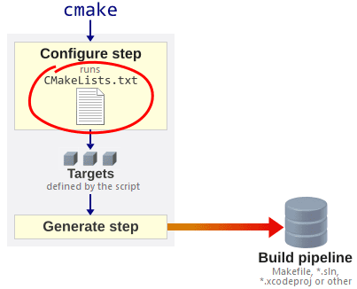

# Topic 1.4 从 C++ 到 C

!!! abstract

    1.   学会使用 CMake 打包程序库
    2.   完成实验 0，能够使用 SFTP 进行远程编辑
    3.   阅读 from_cxx_to_c 中的程序，体会 C++ 和 C 的异同

## CMake

>   CMake is a family of tools designed to build, test and package software. CMake is used to control the software compilation process using simple platform and compiler independent configuration files, and generate makefiles and workspaces that can be used in the compiler environment of your choice. 

**阅读材料**

-   [x] BUILD WITH CMAKE <<https://vnav.mit.edu/labs/lab1/cmake.html>>

---

-   `CMakeLists.txt`

>   With CMake, we write `CMakeLists.txt` files to inform it where to find source code and header files.

---

<figure markdown>
  
  <figcaption>参见：https://preshing.com/20170522/learn-cmakes-scripting-language-in-15-minutes/</figcaption>
</figure>

>   We then call CMake to generate **makefiles**, which are then used to compile and generate libraries and executables.

---

**目录结构**

-   `starter-proj`

```
.
├── CMakeLists.txt
├── SimpleCSLib
├── String_Length
└── build
```

**相关文件**

-   `starter-proj/CMakeLists.txt`

    ``` linenums="1"
    cmake_minimum_required(VERSION 3.20)
    
    # Set project information
    project(
        From_Cxx_To_C
        LANGUAGES C
    )
    
    # Add library
    add_subdirectory(SimpleCSLib)
    
    # Test example
    add_subdirectory(String_Length)
    ```

-   `starter-proj/SimpleCSLib/CMakeLists.txt`

    ```linenums="1"
    # 1. Minimum Version
    cmake_minimum_required(VERSION 3.20)
    
    # 2. Setting a project: project information
    project(
        SimpleCSLib
        VERSION 0.1
        DESCRIPTION "A Simple C Library for Introductory CS"
        LANGUAGES C)
    
    # 3. Making a library: add a library target
    add_library(${PROJECT_NAME} STATIC)
    
    # 4. Properties: define C standard ...
    set_target_properties( ${PROJECT_NAME} PROPERTIES
        C_STANDARD 17
        C_STANDARD_REQUIRED ON
        C_EXTENSIONS ON)
    
    # 5. Reading files
    file(GLOB_RECURSE SOURCE_FILES CONFIGURE_DEPENDS
        ${CMAKE_CURRENT_SOURCE_DIR}/src/*.c)
    
    file(GLOB_RECURSE HEADER_FILES CONFIGURE_DEPENDS
        ${CMAKE_CURRENT_SOURCE_DIR}/include/*.h)
    
    # 6. Add source and header files to the library target
    target_sources(${PROJECT_NAME} PRIVATE ${SOURCE_FILES} ${HEADER_FILES})
    
    # 7. Add include directories
    target_include_directories(${PROJECT_NAME} PUBLIC ${CMAKE_CURRENT_SOURCE_DIR}/include)
    ```

    