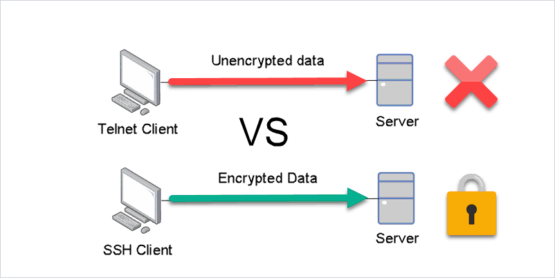

# Network

## telnet

??? telnet
    ``` sh title="telnet" linenums="1" hl_lines="1"
    $ curl cheat.sh/telnet
    # telnet
    # Connect to a specified port of a host using the telnet protocol.
    # More information: <https://manned.org/telnet>.

    # Telnet to the default port of a host:
    telnet host
    
    # Telnet to a specific port of a host:
    telnet ip_address port
    
    # Exit a telnet session:
    quit
    
    # Emit the default escape character combination for terminating the session:
    Ctrl + ]
    
    # Start telnet with "x" as the session termination character:
    telnet -e x ip_address port
    
    # Telnet to Star Wars animation:
    telnet towel.blinkenlights.nl
    
    $
    ```

## ssh

```title="目录结构"
~/.ssh
├── config
├── id_ed25519
├── id_ed25519.pub
├── known_hosts
└── known_hosts.old
```

``` sh
# 1. Generate private key on your machine
$ ssh-keygen
# 2. Copy your public key that was generated alongside the private key
$ more ~/.ssh/id_rsa.pub
```

??? SSH-Config-模版文件
    ``` linenums="1" hl_lines="24-29"
    # 默认配置
    Host *
       # 服务器的IP地址或主机名
       #HostName <server_ip_or_hostname>

       # SSH端口号（如果不是默认的22）
       #Port <port_number>
    
       # 用于连接的用户名
       #User <username>
    
       # 用于身份验证的私钥文件路径
       #IdentityFile /path/to/private/key
    
       # 可以启用或禁用SSH连接的压缩功能
       #Compression yes
    
       # 可以启用或禁用SSH连接的端口转发功能
       #ForwardAgent no
    
       # 可以配置要使用的SSH密码
       #PasswordAuthentication yes
    
    # 配置样例
    Host github.com
       HostName ssh.github.com
       User git
       IdentityFile /path/to/private/key
       Port 443
    ```

### Quicklinks

- [x] [Steps for using Public Key Authentication for accessing your GitHub repositories](https://sbme-tutorials.github.io/2019/data-structures/notes/public_key.html)
- [x] [SSH Keys for GitHub -  2014-09-18](https://jdblischak.github.io/2014-09-18-chicago/novice/git/05-sshkeys.html)
- [ ] [What is SSH Public Key Authentication? - Official](https://www.ssh.com/academy/ssh/public-key-authentication)
- [ ] [Connecting to GitHub with SSH - Official](https://docs.github.com/en/authentication/connecting-to-github-with-ssh)


### `ssh-keygen`

- `~/.ssh/id_rsa` & `~/.ssh/id_rsa.pub` - 生成的 SSH 密钥对
- `~/.ssh/id_ed25519` & `~/.ssh/id_ed25519.pub` - ed25519

??? ssh-keygen
    ``` sh title="ssh_keygen" linenums="1" hl_lines="42 45-46 54-55"
    $ curl cheat.sh/ssh-keygen
     cheat:ssh-keygen 
    ---
    tags: [ ssh ]
    ---
    # To generate an SSH key:
    ssh-keygen -t rsa

    # To generate a 4096-bit SSH key:
    ssh-keygen -t rsa -b 4096
    
    # To generate a FIDO/U2F token-backed key:
    ssh-keygen -t ed25519-sk
    
    # To generate a FIDO2 resident key:
    ssh-keygen -t ed25519-sk -O resident
    
    # To update a passphrase on a key:
    ssh-keygen -p -P <old-passphrase> -N <new-passphrase> -f <keyfile>
    
    # To remove a passphrase on a key:
    ssh-keygen -p -P <old-passphrase> -N '' -f <keyfile>
    
    # To generate a 4096 bit RSA key with a passphase and comment containing the user and hostname:
    ssh-keygen -t rsa -b 4096 -C "$USER@$HOSTNAME" -P <passphrase>
    
    # To print the fingerprint of a public key:
    ssh-keygen -lf <keyfile>
    
    # To print the Github-style (MD5) fingerprint of a public key:
    ssh-keygen -E md5 -lf <keyfile>
    
    # To download resident keys from a FIDO2 authenticator to the current directory:
    ssh-keygen -K
    
    # To view the public key associated with a private key:
    ssh-keygen -y -f <private-key-file> > <public-key-file>
    ssh-keygen -y -f ~/.ssh/private-key > ~/.ssh/public-key.pub
    
     tldr:ssh-keygen 
    # ssh-keygen
    # Generate ssh keys used for authentication, password-less logins, and other things. (1)
    # More information: <https://man.openbsd.org/ssh-keygen>.
    
    # Generate a key interactively:
    ssh-keygen
    
    # Specify file in which to save the key:
    ssh-keygen -f ~/.ssh/filename
    
    # Generate an ed25519 key with 100 key derivation function rounds:
    ssh-keygen -t ed25519 -a 100
    
    # Generate an RSA 4096-bit key with email as a comment:
    ssh-keygen -t dsa|ecdsa|ed25519|rsa -b 4096 -C "comment|email"
    
    # Remove the keys of a host from the known_hosts file (useful when a known host has a new key):
    ssh-keygen -R remote_host
    
    # Retrieve the fingerprint of a key in MD5 Hex:
    ssh-keygen -l -E md5 -f ~/.ssh/filename
    
    # Change the password of a key:
    ssh-keygen -p -f ~/.ssh/filename
    
    # Change the type of the key format (for example from OPENSSH format to PEM), the file will be rewritten in-place:
    ssh-keygen -p -N "" -m PEM -f ~/.ssh/OpenSSH_private_key
    
    $
    ```
    
    1. <ul><li>authentication 认证</li><li>password-less logins 免密登录</li></ul>

### `ssh-copy-id`

- [ ] [SSH Copy ID for Copying SSH Keys to Servers - Official](https://www.ssh.com/academy/ssh/copy-id)

??? ssh-copy-id
    ``` sh title="ssh-copy-id" linenums="1" hl_lines="17 23-24"
    $ curl cheat.sh/ssh-copy-id
     cheat:ssh-copy-id 
    ---
    tags: [ ssh ]
    ---
    # To copy your keys listed in `ssh-add -L` to a remote host:
    ssh-copy-id <user>@<host>

    # To copy the keys to a remote host on a non-standard port:
    ssh-copy-id <user>@<host> -p 2222
    
    # To copy one single public key to a remote host on a non-standard port:
    ssh-copy-id -i ~/.ssh/a_public_key.pub "username@host -p 2222"
    
     tldr:ssh-copy-id 
    # ssh-copy-id
    # Install your public key in a remote machine's authorized_keys.
    # More information: <https://manned.org/ssh-copy-id>.
    
    # Copy your keys to the remote machine:
    ssh-copy-id username@remote_host
    
    # Copy the given public key to the remote:
    ssh-copy-id -i path/to/certificate username@remote_host
    
    # Copy the given public key to the remote with specific port:
    ssh-copy-id -i path/to/certificate -p port username@remote_host
    
    $
    ```

## ssh v.s telnet

