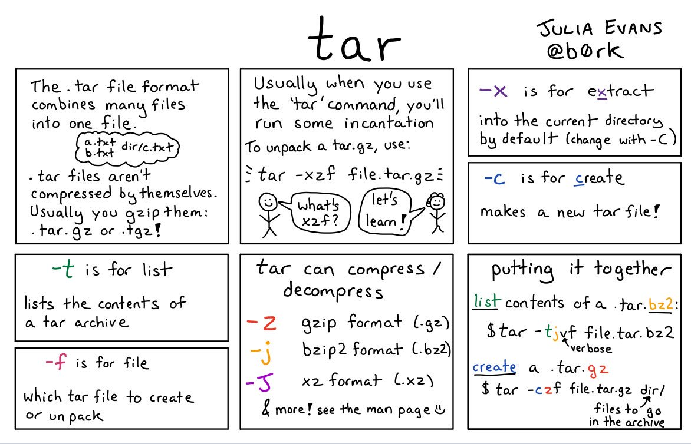
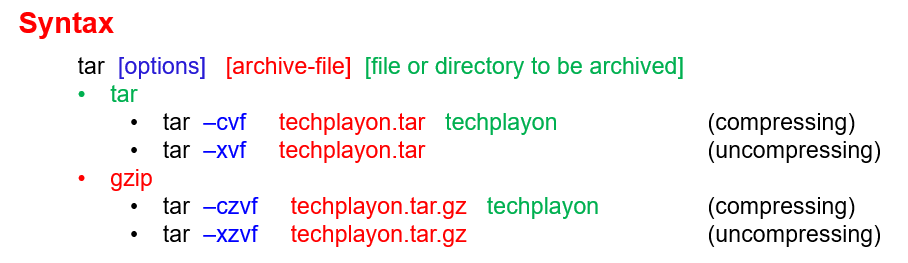

# Storage Commands

Archiving Utility & Compression Program

## tar - tape archiver

- [Linux Tutorial for Beginners - 10 - Compress and Extract tar and gz Files](https://www.youtube.com/watch?v=EWONqLqSxYc)
- [【Linux常用命令】01_tar - 萌马工作室](https://www.bilibili.com/video/BV1fN41197bs/)

<figure markdown>
  
  <figcaption>`tar` comic from https://xkcd.com/1168</figcaption>
</figure>

<figure markdown>
  { width="300" }
  <figcaption></figcaption>
</figure>

<figure markdown>
  { width="500" }
  <figcaption>Linux `tar` command</figcaption>
</figure>

<figure markdown>
  
  <figcaption>`tar` command - from: https://twitter.com/b0rk/status/993682480069824512</figcaption>
</figure>


### Options

- [Which tar option should you use?](http://tarbz2.com/)

- `-t`, `--list`: `-t` is for list, list the contents of a tar archive
- `-c`, `--create`: `-c` is for [c]reate an archive, makes a new tar file
    - `-cf`
    - `-czf`: `-z` is for g[z]ip format (.gz)
    - `-cjf`: `-j` is for bzip2 format (.bz2)
- `-x`, `--extract`: `-x` if for extract, into the current directory by default (change with `-c`)
    - `-xf`
    - `-xzf`: `-z` is for g[z]ip format (.gz)
    - `-xjf`: `-j` is for bzip2 format (.bz2)
- `-f`, `--file`: which tar file to create or unpack 这个参数必须是最后一个参数，后面只能接归档名

### 常用命令

#### .tar

``` sh
# 创建 tar 包
$ tar -cf filename.tar file1 file2
$ tar -cf filename.tar *.txt
# tar包 解包
$ tar -xvf filename.tar
$ tar -xvf filename.tar -C TargetDir/
# 向已存在的 tar 包中添加文件
$ tar -rvf filename.tar newfile
$ tar -rvf filename.tar @tarpkg.tar newfile
# 查看包文件
$ tar -tf filename.tar
$ tar -tvf filename.tar
```

#### .tgz / .tar.gz

``` sh
# 创建
tar -czvf files.tar.gz dir/ # `-c`: [c]reate
# 解包
tat -xzvf files.tar.gz # `-x`: e[x]tract
tar -xzvf files.tar.gz -C TargetDir/ # `-x`: e[x]tract; `-C`: [C]hange dir
```

#### .tar.bz2

``` sh
# 创建
tar -cjvf files.tar.gz dir/ # `-c`: [c]reate
# 解包
tat -xjvf files.tar.gz # `-x`: e[x]tract
tar -xjvf files.tar.gz -C TargetDir/ # `-x`: e[x]tract; `-C`: [C]hange dir
```

#### .tar.xz

``` sh
# 创建
tar -cJvf files.tar.gz dir/ # `-c`: [c]reate
# 解包
tat -xJvf files.tar.gz # `-x`: e[x]tract
tar -xJvf files.tar.gz -C TargetDir/ # `-x`: e[x]tract; `-C`: [C]hange dir
```

??? tar
    ``` sh linenums="1" hl_lines="30-31 63-66 68-69 92-93"
    $ curl cheat.sh/tar
    cheat.sheets:tar 
    # tar
    # GNU version of the tar archiving utility

    # An approach to backing up the current user's HOME, using tar(1) and Gzip
    # compression. Permissions (modes) will be preserved. The filename format will
    # be: UID:GID_DATE.tgz
    #
    # Replace 'DEVICE' with whichever device is applicable to you, but note that it
    # must be in the '/media/USER' (where USER is the username) directory, else
    # this won't work, unless you edit the formatting section of `printf`.
    tar -czvpf "$(printf '/media/%s/%s/%d:%d_%(%F)T.tgz' "$USER" 'DEVICE' ${UID:-`id -u`} ${GID:-`id -g`} -1)" "$HOME"
    
    # Delete file 'xdm' from the archive given to the `-f` flag. This only works on
    # non-compressed archives, unfortunately, but those can always be uncompressed
    # first, then altered with the `--delete` flag, after which you can recompress.
    tar --delete -f xdm_edited.tar.gz xdm
    
    # Extract the contents of the given archive (which is not compressed) to the
    # destination given to the `-C` flag; not many seem to know of this flag.
    #
    # If a destination (path given to `-C`) is not provided, the CWD will be used.
    tar -C /mnt -xvf Tarball.tar
    
    cheat:tar 
    ---
    tags: [ compression ]
    ---
    # To extract an uncompressed archive:
    tar -xvf /path/to/foo.tar # (1)
    
    # To extract a .tar in specified directory:
    tar -xvf /path/to/foo.tar -C /path/to/destination/
    
    # To create an uncompressed archive:
    tar -cvf /path/to/foo.tar /path/to/foo/
    
    # To extract a .tgz or .tar.gz archive:
    tar -xzvf /path/to/foo.tgz
    tar -xzvf /path/to/foo.tar.gz
    
    # To create a .tgz or .tar.gz archive:
    tar -czvf /path/to/foo.tgz /path/to/foo/
    tar -czvf /path/to/foo.tar.gz /path/to/foo/
    
    # To list the content of an .tgz or .tar.gz archive:
    tar -tzvf /path/to/foo.tgz
    tar -tzvf /path/to/foo.tar.gz
    
    # To extract a .tar.bz2 archive:
    tar -xjvf /path/to/foo.tar.bz2
    
    # To create a .tar.bz2 archive:
    tar -cjvf /path/to/foo.tar.bz2 /path/to/foo/
    
    # To list the content of an .tar.bz2 archive:
    tar -tjvf /path/to/foo.tar.bz2
    
    # To create a .tgz archive and exclude all jpg,gif,... from the tgz:
    tar -czvf /path/to/foo.tgz --exclude=\*.{jpg,gif,png,wmv,flv,tar.gz,zip} /path/to/foo/
    
    # To use parallel (multi-threaded) implementation of compression algorithms:
    tar -z ... -> tar -Ipigz ... # g[z]ip format (.gz)
    tar -j ... -> tar -Ipbzip2 ... # bzip2 format (.bz2)
    tar -J ... -> tar -Ipixz ... # xz format (.xz)
    
    # To append a new file to an old tar archive:
    tar -rf <archive.tar> <new-file-to-append> # (3)
    
    tldr:tar 
    # tar
    # Archiving utility.
    # Often combined with a compression method, such as gzip or bzip2.
    # More information: <https://www.gnu.org/software/tar>.
    
    # [c]reate an archive and write it to a [f]ile:
    tar cf path/to/target.tar path/to/file1 path/to/file2 ...
    
    # [c]reate a g[z]ipped archive and write it to a [f]ile:
    tar czf path/to/target.tar.gz path/to/file1 path/to/file2 ...
    
    # [c]reate a g[z]ipped archive from a directory using relative paths:
    tar czf path/to/target.tar.gz --directory=path/to/directory .
    
    # E[x]tract a (compressed) archive [f]ile into the current directory [v]erbosely:
    tar xvf path/to/source.tar[.gz|.bz2|.xz]
    
    # E[x]tract a (compressed) archive [f]ile into the target directory:
    tar xf path/to/source.tar[.gz|.bz2|.xz] --directory=path/to/directory
    
    # [c]reate a compressed archive and write it to a [f]ile, using [a]rchive suffix to determine the compression program:
    tar caf path/to/target.tar.xz path/to/file1 path/to/file2 ... # (2)
    
    # Lis[t] the contents of a tar [f]ile [v]erbosely:
    tar tvf path/to/source.tar
    
    # E[x]tract files matching a pattern from an archive [f]ile:
    tar xf path/to/source.tar --wildcards "*.html"
    
    $
    ```
    
    1. `-x` is for e[x]tract; `-v` is for [v]erbose; `-f` is for [f]ile
    2. `-a`, `--auto-compress` 使用归档后缀名来决定压缩程序
    3. `-r`, `—-append` 追加文件至归档结尾

## Others

``` sh
$ gzip Grocery\ List
$ gunzip Grocery\ List.gz
$ tar cvf Bucky.tar Grocery\ List Favorite\ Movies # (1)
$ tar xvf Bucky.tar # (2)
```
1. `c`: **c**reate; `v`: **v**erbose; `f`: **f**ile
2. `x`: e**x**tract; `v`: **v**erbose; `f`: **f**ile

??? gzip
    ``` sh linenums="1" hl_lines="6-7 12-13 44-45 68-69"
    $ curl cheat.sh/gzip
    cheat:gzip 
    ---
    tags: [ compression ]
    ---
    # To create a *.gz compressed file
    gzip test.txt # => test.gz

    # To create a *.gz compressed file to a specific location using -c option (standard out)
    gzip -c test.txt > test_custom.txt.gz
    
    # To uncompress a *.gz file
    gzip -d test.txt.gz # [d]ecompress, uncompress 解压缩
    
    # Display compression ratio of the compressed file using gzip -l
    gzip -l *.gz
    
    # Recursively compress all the files under a specified directory
    gzip -r documents_directory
    
    # To create a *.gz compressed file and keep the original
    gzip < test.txt > test.txt.gz
    
    tldr:gzip 
    # gzip
    # Compress/uncompress files with gzip compression (LZ77).
    # More information: <https://www.gnu.org/software/gzip/manual/gzip.html>.
    
    # Compress a file, replacing it with a gzipped compressed version:
    gzip file.ext
    
    # Decompress a file, replacing it with the original uncompressed version:
    gzip -d file.ext.gz
    
    # Compress a file, keeping the original file:
    gzip --keep file.ext
    
    # Compress a file specifying the output filename:
    gzip -c file.ext > compressed_file.ext.gz
    
    # Decompress a gzipped file specifying the output filename:
    gzip -c -d file.ext.gz > uncompressed_file.ext
    
    # Specify the compression level. 1=Fastest (Worst), 9=Slowest (Best), Default level is 6:
    gzip -9 -c file.ext > compressed_file.ext.gz # (1)
    
    $
    
    ```
    
    1. **compression level 压缩比**：9 (最高压缩比，压缩最慢), 1 (最低压缩比，压缩最快), 6 (默认压缩比)

??? gunzip
    ``` sh linenums="1" hl_lines="3 6-7"
    $ curl cheat.sh/gunzip
    # gunzip
    # Extract file(s) from a gzip (.gz) archive.
    # More information: <https://manned.org/gunzip>.

    # Extract a file from an archive, replacing the original file if it exists:
    gunzip archive.tar.gz
    
    # Extract a file to a target destination:
    gunzip --stdout archive.tar.gz > archive.tar
    
    # Extract a file and keep the archive file:
    gunzip --keep archive.tar.gz
    
    # List the contents of a compressed file:
    gunzip --list file.txt.gz
    
    # Decompress an archive from `stdin`:
    cat path/to/archive.gz | gunzip
    
    $
    ```

??? zip
    ``` sh linenums="1" hl_lines="1"
    $ curl cheat.sh/zip
    cheat:zip 
    # To create zip file:
    zip archive.zip file1 directory/

    # To create zip file from directory:
    zip -r archive.zip directory/
    
    # To create zip file with password:
    zip -P password archive.zip file1
    
    # To join a split zip file (.zip, .z01, .z02, etc):
    zip -FF splitZipfile.zip --out joined.zip
    
    # To list, test and extract zip archives, see unzip:
    cheat unzip
    
    tldr:zip 
    # zip
    # Package and compress (archive) files into zip file.
    # See also: `unzip`.
    # More information: <https://manned.org/zip>.
    
    # Add files/directories to a specific archive ([r]ecursively):
    zip -r path/to/compressed.zip path/to/file_or_directory1 path/to/file_or_directory2 ...
    
    # Remove files/directories from a specific archive ([d]elete):
    zip -d path/to/compressed.zip path/to/file_or_directory1 path/to/file_or_directory2 ...
    
    # Archive files/directories e[x]cluding specified ones:
    zip -r path/to/compressed.zip path/to/file_or_directory1 path/to/file_or_directory2 ... -x path/to/excluded_files_or_directories
    
    # Archive files/directories with a specific compression level (`0` - the lowest, `9` - the highest):
    zip -r -0-9 path/to/compressed.zip path/to/file_or_directory1 path/to/file_or_directory2 ...
    
    # Create an [e]ncrypted archive with a specific password:
    zip -r -e path/to/compressed.zip path/to/file_or_directory1 path/to/file_or_directory2 ...
    
    # Archive files/directories to a multi-part [s]plit zip file (e.g. 3 GB parts):
    zip -r -s 3g path/to/compressed.zip path/to/file_or_directory1 path/to/file_or_directory2 ...
    
    # Print a specific archive contents:
    zip -sf path/to/compressed.zip
    
    $
    ```

??? bzip2
    ``` sh linenums="1" hl_lines="1"
    $ curl cheat.sh/
    bzip2
    cheat:bzip2 
    ---
    tags: [ compression ]
    ---
    # To compress a file (foo -> foo.bz2):
    bzip2 -z foo

    # To decompress a file (foo.bz2 -> foo)
    bzip2 -d foo.bz2
    
    # To compress foo to stdout:
    bzip2 -zc foo > foo.bz2
    
    # To decompress foo.bz2 to stdout:
    bzip2 -dc foo.bz2
    
    tldr:bzip2 
    # bzip2
    # A block-sorting file compressor.
    # More information: <https://manned.org/bzip2>.
    
    # Compress a file:
    bzip2 path/to/file_to_compress
    
    # Decompress a file:
    bzip2 -d path/to/compressed_file.bz2
    
    # Decompress a file to standard output:
    bzip2 -dc path/to/compressed_file.bz2
    
    # Test the integrity of each file inside the archive file:
    bzip2 --test path/to/compressed_file.bz2
    
    # Show the compression ratio for each file processed with detailed information:
    bzip2 --verbose path/to/compressed_files.bz2
    
    # Decompress a file overwriting existing files:
    bzip2 --force path/to/compressed_file.bz2
    
    # Display help:
    bzip2 -h
    
    $
    ```

## Windows 上的压缩软件

- WinRAR
- 7-zip
- bandizip