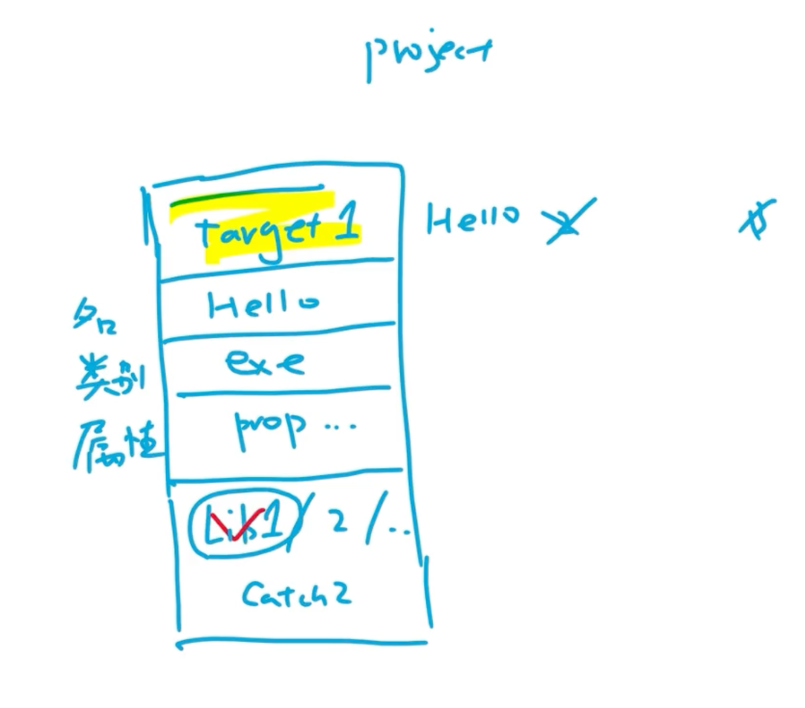
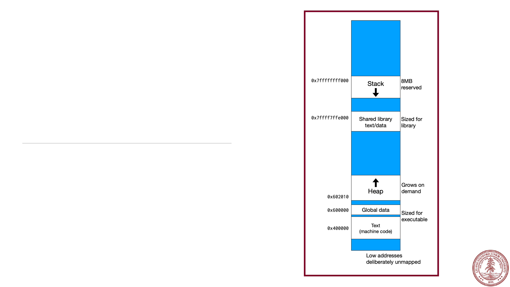

# Lecture 2. Variables, Expressions and Graphics

## Variable

-   Name
-   Type
-   Value

### Types

-   Primitive Types
    -   `int`
    -   `double`
    -   `bool`
    -   `char`
    -   ...

### Name

-   Identifier

| C                     | C++                |
| --------------------- | ------------------ |
| `lots_of_underscores` | `noOrdinaryRabbit` |

## Expression

-   operand
-   operator

### Operator

-   logical operator
-   comparison operator

#### `=`

-   初始化器
-   赋值运算符

## Class & Object

-   Primitive Types
-   Customized Types 自定义数据类型 --> Class 类

| Primitive Types | Customized Types    |
| --------------- | ------------------- |
| Name            | Class Name          |
| Type            | Class               |
| Value           | Object 对象或者实例 |
| `int num = 0`   | `Gwindow gwindow`   |

### Expression

-   `object.method(parameters)`
    -   parameters == operand
    -   method == operator

## Stack & Heap

