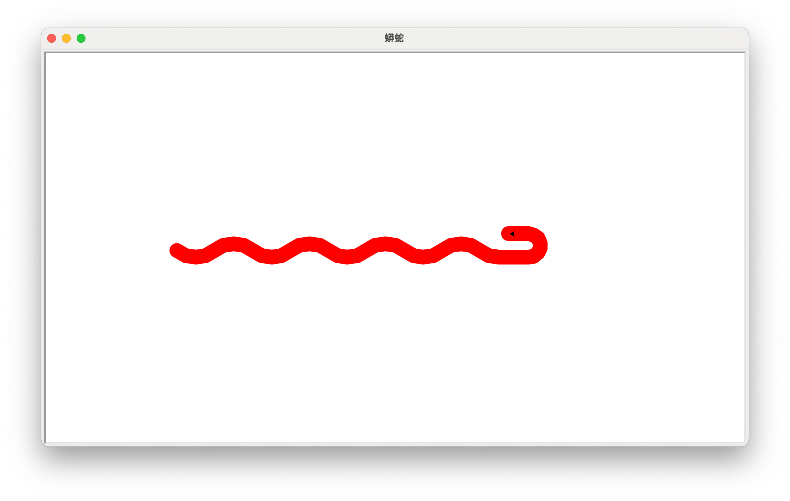
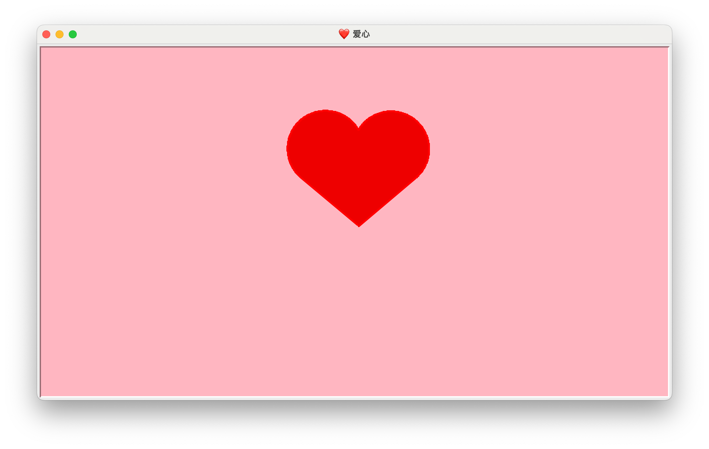
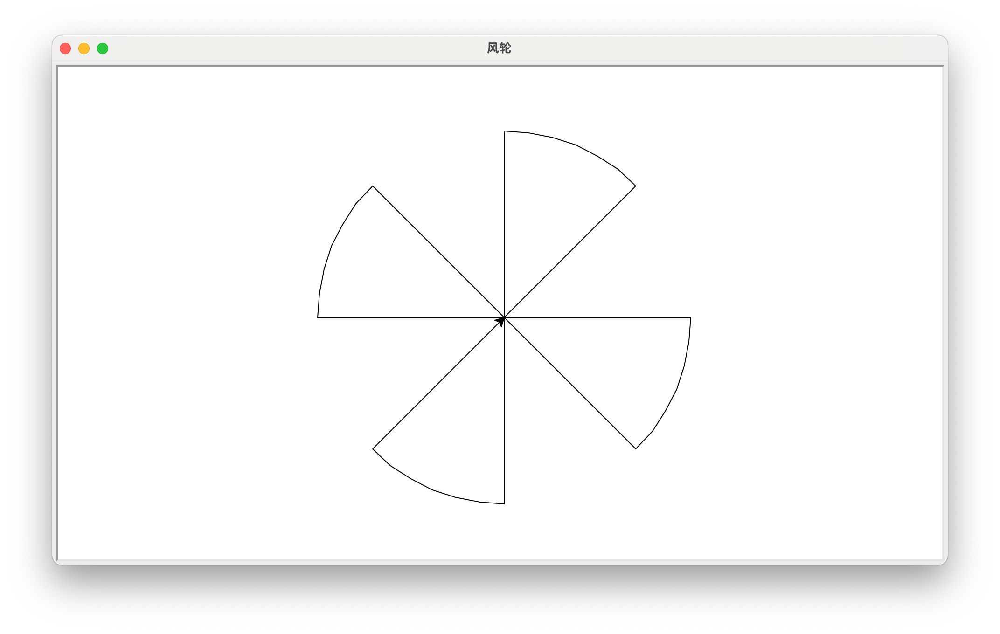
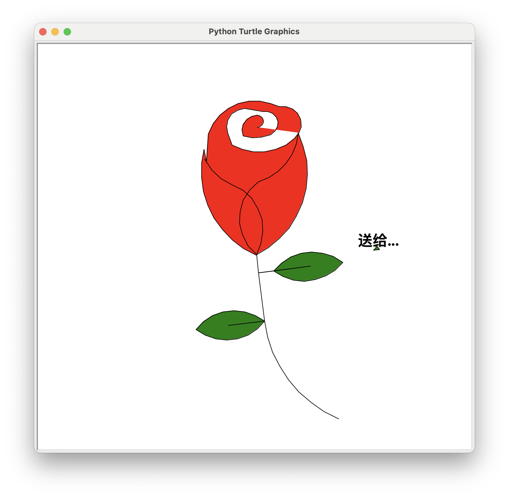

# Assign 2. 通关攻略

## 1. 🐍 蟒蛇

``` python title="python.py" linenums="1"
import turtle as t
t.setup(.5, .5, None, None)
t.title("蟒蛇")
t.pensize(20)
t.pencolor("red")
t.pu()
t.bk(300)
t.pd()
t.seth(-40)
for _ in range(4):
    t.circle(40, 80)
    t.circle(-40, 80)
t.circle(40, 40)
t.fd(40)
t.circle(16, 180)
t.fd(40 * 2/3)
t.done()
```



## 2. 🌞 太阳花 🌻

``` python title="star.py" linenums="1"
from turtle import *

length = 400
angle = 170
speed(0)

setup(.5, .5, None, None)
title("🌻 太阳花 | 🌞 | ✨ 星星")
color("green", "red")
begin_fill()
while True:
    fd(length)
    lt(angle)
    if abs(pos()) < 1:
        break
end_fill()
done()
```


## 3. ❤️ 爱心

``` python title="heart.py" linenums="1"
from turtle import *

setup(.5, .5, None, None)
title("❤️ 爱心")
speed(0)
bgcolor('lightpink')
pensize(3)

def curve():
    for _ in range(200):
        rt(1)
        fd(1)
        
color('red', 'red2')
begin_fill()

lt(140)
fd(111.65)
curve()
lt(120)
curve()
fd(111.65)
end_fill()

hideturtle()
done()
```



## 4. 风轮

使用 turtle 库，绘制一个风轮效果，其中，每个风轮内角为 45 度，风轮边长 150 像素。

---

``` python title="WindMill.py" linenums="1"
from turtle import *

radius = 200
angle = 45

setup(.5, .5, None, None)
title("风轮")

lt(angle)

for _ in range(4):
    fd(radius)
    lt(90)
    circle(radius, angle)
    lt(90)
    fd(radius)
    rt(180 - angle)

done()

```



## 5. 🌹 玫瑰花



``` py title="rose.py" linenums="1"
import turtle

# 设置画笔初始状态
turtle.speed(8)
turtle.penup()
turtle.left(90)
turtle.forward(200)
turtle.pendown()
turtle.right(90)

# 绘制花蕊
turtle.fillcolor("red")
turtle.begin_fill()
turtle.circle(10, 180)
turtle.circle(25, 110)
turtle.left(50)
turtle.circle(60, 45)
turtle.circle(20, 170)
turtle.right(24)
turtle.forward(30)
turtle.left(10)
turtle.circle(30, 110)
turtle.forward(20)
turtle.left(40)
turtle.circle(90, 70)
turtle.circle(30, 150)
turtle.right(30)
turtle.forward(15)
turtle.circle(80, 90)
turtle.left(15)
turtle.forward(45)
turtle.right(165)
turtle.forward(20)
turtle.left(155)
turtle.circle(150, 80)
turtle.left(50)
turtle.circle(150, 90)
turtle.end_fill()

# 绘制花瓣1
turtle.begin_fill()
turtle.left(150)
turtle.circle(-90, 70)
turtle.left(20)
turtle.circle(75, 105)
turtle.setheading(60)
turtle.circle(80, 98)
turtle.circle(-90, 40)
turtle.end_fill()

# 绘制花瓣2
turtle.begin_fill()
turtle.left(180)
turtle.circle(90, 40)
turtle.circle(-80, 98)
turtle.setheading(-83)
turtle.end_fill()

# 绘制叶子1
turtle.forward(30)
turtle.left(90)
turtle.forward(25)
turtle.left(45)
turtle.fillcolor("green")
turtle.begin_fill()
turtle.circle(-80, 90)
turtle.right(90)
turtle.circle(-80, 90)
turtle.end_fill()
turtle.right(135)
turtle.forward(60)
turtle.left(180)
turtle.forward(85)
turtle.left(90)
turtle.forward(80)

# 绘制叶子2
turtle.right(90)
turtle.right(45)
turtle.fillcolor("green")
turtle.begin_fill()
turtle.circle(80, 90)
turtle.left(90)
turtle.circle(80, 90)
turtle.end_fill()
turtle.left(135)
turtle.forward(60)
turtle.left(180)
turtle.forward(60)
turtle.right(90)
turtle.circle(200, 60)

# 写字
turtle.penup()
turtle.goto(200, 0)
turtle.write("送给...", align='center', font=('楷书', 24, 'bold'))
turtle.done()
```

