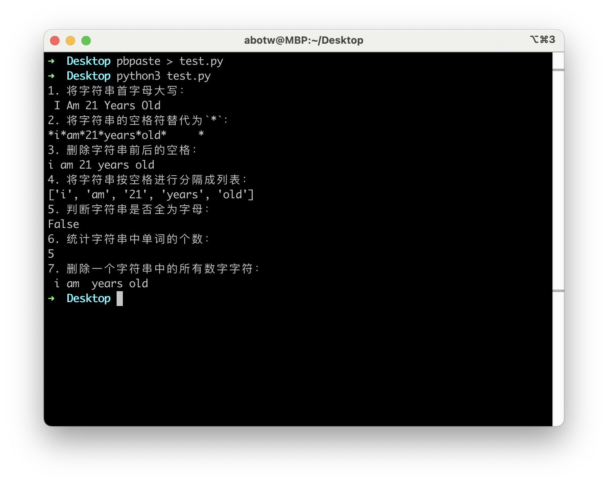
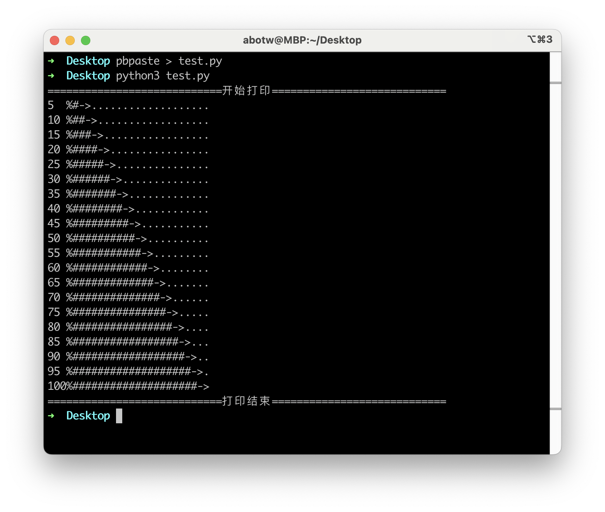
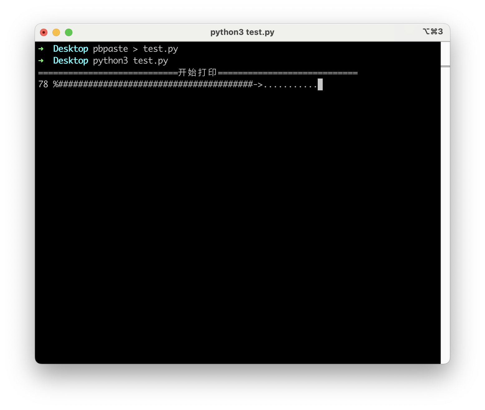
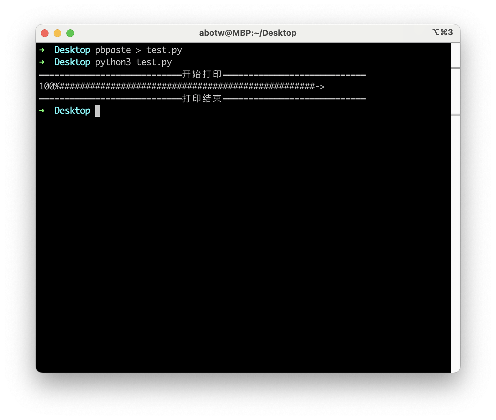

# Assign 4: 通关攻略

## H1 字符串的操作方法练习

对字符串 `s=" i am 21 years old \t "` 进行如下操作：

1.   ``str.title()`` 将字符串首字母大写
2.   ``str.replace()` 将字符串的空格符替代为 `*`
3.   ``str.strip()` 删除字符串前后的空格
4.   `str.split()` 将字符串按空格进行分隔成列表

5.   `str.isalpha()` 判断字符串是否全为字母
6.   统计字符串中单词的个数

7.   `s.isdigit()` 删除一个字符串中的所有数字字符

``` python linenums="1"
def count_words(input_string):
    words = input_string.split()
    word_count = len(words)
    return word_count
  
def del_digit(input_string):
    res = ""
    for c in input_string:
        if c.isdigit() == False:
            res += c
    return res

input_string = " i am 21 years old \t "
print("1. 将字符串首字母大写：\n{0}".format(input_string.title()))
print("2. 将字符串的空格符替代为`*`：\n{0}".format(input_string.replace(' ', '*')))
print("3. 删除字符串前后的空格：\n{0}".format(input_string.strip()))
print("4. 将字符串按空格进行分隔成列表：\n{0}".format(input_string.split()))
print("5. 判断字符串是否全为字母：\n{0}".format(input_string.isalpha()))
print("6. 统计字符串中单词的个数：\n{0}".format(count_words(input_string)))
print("7. 删除一个字符串中的所有数字字符：\n{0}".format(del_digit(input_string)))
```



## H2 "文本进度条"简单的开始

首先考虑如何输出表示进度的字符，并用 `time.sleep()` 模拟进度条变化的时间（程序的执行时间）。

``` python linenums="1"
import time

upper = 20
print("{:=^60}".format("开始打印"))
for i in range(1, upper + 1):
    a = '#' * i
    b = '.' * (upper - i)
    c = i / upper * 100;
    print(f"{c:<3.0f}%{a}->{b}")
    time.sleep(0.1)
print("{:=^60}".format("打印结束"))
```



### 改进一：单行动态刷新

``` python linenums="1"
import time

upper = 50
print("{:=^60}".format("开始打印"))
for i in range(1, upper + 1):
    a = '#' * i
    b = '.' * (upper - i)
    c = i / upper * 100;
    print(f"\r{c:<3.0f}%{a}->{b}", end="")
    time.sleep(0.1)
print("\n{:=^60}".format("打印结束"))
```





### 改进二：利用 `time` 库记录程序的时间变化

``` python linenums="1"
import time

upper = 50
print("{:=^60}".format("开始打印"))
start = time.perf_counter()
for i in range(1, upper + 1):
    a = '#' * i
    b = '.' * (upper - i)
    c = i / upper * 100;
    end = time.perf_counter()
    duration = end - start
    print(f"\r{c:<3.0f}%{a}->{b} {duration:.2f}s", end="")
    time.sleep(0.1)
print("\n{:=^60}".format("打印结束"))
```

