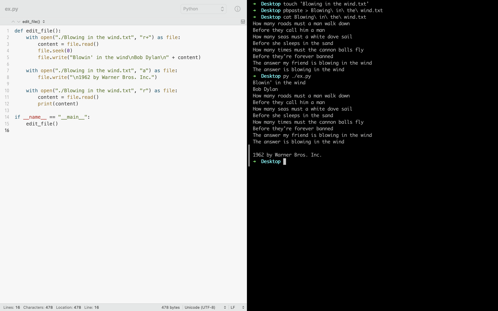
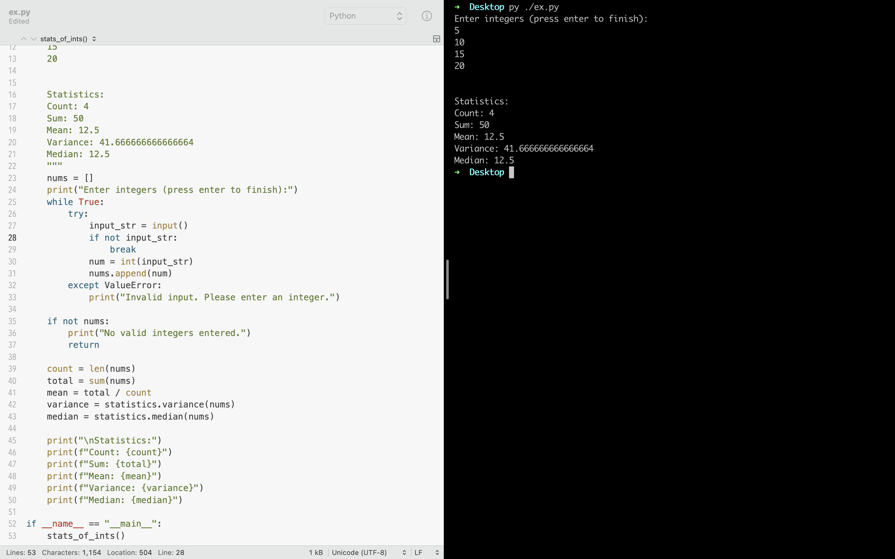

# Assign 6. 序列类型的应用

**实训目的**

1.   了解集合数据类型及其应用
2.   了解序列数据类型特点
3.   掌握序列类型的定义和操作
4.   利用列表类型解决实际应用问题

## 1. Sum of unique digits

获得用户输入的一个整数 N，输出 N 中所出现不同数字的和。

``` python
>>> sum_of_unique_digits(123123123)
6
```


``` python title="sum_of_unique_digits" linenums="1"
def sum_of_unique_digits(n):
    """
    Calculate the sum of unique digits in the integer n.
    
    Args:
        n (int): The integer for which unique digits need to be calculated.

    Returns:
        sum_unique_digits (int): The sum of unique digits in n.
    
    >>> sum_of_unique_digits(123123123)
    6
    >>> sum_of_unique_digits(1122334455)
    15
    """
    
    unique_digits = set() # Initialize an empty set to store unique digits
    n_str = str(n) # Convert `n` to a string to iterate through its digits
    
    for digit in n_str: # Iterate through each digit in n
        if digit not in unique_digits: # Add the digit to the set if it's not already in it
            unique_digits.add(digit)
    
    sum_unique_digits = sum(int(digit) for digit in unique_digits) # Calculate the sum of unique digits
    
    return sum_unique_digits
```


## 2. Operations on `list`

1.   定义空列表 `lt`
2.   向 `lt` 新增 5 个元素
3.   改 `lt` 中第 2 个元素的值
4.   向 `lt` 中第 2 个位置增加一个元素
5.   从 `lt` 中第 1 个位置删除一个元素
6.   删除 `lt` 中第 1-3 位置元素
7.   判断 `lt` 中是否包含数字 0
8.    向 `lt` 新增数字 0
9.   返回数字 0 所在 `lt` 中的索引
10.   返回 `lt` 的长度
11.   `lt` 中最大元素
12.   清空 `lt`


## 3. File I/O using `list`

**要求：**

1.   创建一个内容如下的文件：

```title="Blowing in the wind.txt"
How many roads must a man walk down
Before they call him a man
How many seas must a white dove sail
Before she sleeps in the sand
How many times must the cannon balls fly
Before they're forever banned
The answer my friend is blowing in the wind
The answer is blowing in the wind

```

2.   在文件头部插入歌名 "Blowin' in the wind"
3.   在歌名后插入歌手名 "Bob Dylan"
4.   在文件末尾加上字符串 "1962 by Warner Bros. Inc."
5.   在屏幕上打印文件内容

**方式一：**

```shell
$ touch 'Blowing in the wind.txt'
$ pbpaste > Blowing\ in\ the\ wind.txt
$ cat Blowing\ in\ the\ wind.txt
```

``` python title="file_io_using_list.py" linenums="1"
def edit_file():
    with open("./Blowing in the wind.txt", "r+") as file:
        content = file.read()
        file.seek(0)
        file.write("Blowin' in the wind\nBob Dylan\n" + content)
        
    with open("./Blowing in the wind.txt", "a") as file:
        file.write("\n1962 by Warner Bros. Inc.")
        
    with open("./Blowing in the wind.txt", "r") as file:
        content = file.read()
        print(content)
        
if __name__ == "__main__":
    edit_file()

```



**方式二：**

``` python
file = open("./Blowing in the wind.txt", "r+", encoding="utf-8")
lines_of_file = file.readlines()
lines_of_file
lines_of_file.insert(0, "Blowin' in the wind\n")
lines_of_file.insert(1, "Bob Dylan\n")
lines_of_file.append("1962 by Warner Bros. Inc.\n")
lines_of_file
for line in lines_of_file:
    print(r"{}".format(line), end='')
```


## 4. Calculate various statistics for a list of integers

要求用户从键盘输入任意个整数，以回车结束，编程输出这列数的个数、总和、平均值、方差和中位数等，可采用模块化程序设计。

- **方差**：各数据与平均数差的平方和的平均数。

- **中位数**：一列数据排序后取中间的值。若是奇数个数据直接取中间数的值， 若是偶数个取中间两个数据的平均值。

``` python title="stats_of_ints.py" linenums="1"
import statistics

def stats_of_ints():
    """
    Calculate various statistics for a list of integers entered by the user.
    
    Example:
        
    Enter integers (press enter to finish):
    5
    10
    15
    20
    
    
    Statistics:
    Count: 4
    Sum: 50
    Mean: 12.5
    Variance: 41.666666666666664
    Median: 12.5
    """
    nums = [] # Initialize an empty list to store the entered integers
    print("Enter integers (press enter to finish):")
    while True:
        try:
            input_str = input()
            if not input_str:
                break
            num = int(input_str)
            nums.append(num)
        except ValueError:
            print("Invalid input. Please enter an integer.")
            
    if not nums:
        print("No valid integers entered.")
        return
    
    # Calculate statistics
    count = len(nums)
    total = sum(nums)
    mean = total / count
    variance = statistics.variance(nums)
    median = statistics.median(nums)
    
    # Print the results
    print("\nStatistics:")
    print(f"Count: {count}")
    print(f"Sum: {total}")
    print(f"Mean: {mean}")
    print(f"Variance: {variance}")
    print(f"Median: {median}")
    
if __name__ == "__main__":
    stats_of_ints()
```



