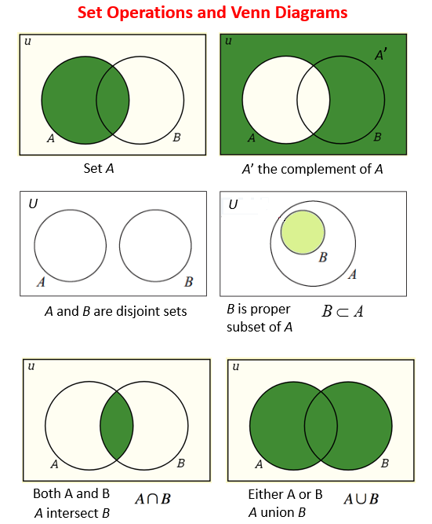

# Note 4 组合数据类型

-   集合
-   序列
-   字典
-   jieba
-   worldcloud

## Set

-   [x] [**Set @CS50P**](https://cs50.harvard.edu/python/2022/notes/9/#set), <<https://cs50.harvard.edu/python/2022/notes/9/#set>>
-   [x] [**Sets @GEOG489**](https://www.e-education.psu.edu/geog489/node/2351), <<https://www.e-education.psu.edu/geog489/node/2351>>
-   [x] **[Sets @pyfss](https://gawron.sdsu.edu/python_for_ss/course_core/book_draft/Python_introduction/sets.html)**, <<https://gawron.sdsu.edu/python_for_ss/course_core/book_draft/Python_introduction/sets.html>>

---

-   **集合元素的特点**：1. 无序 2. 唯一
-   **Type**: 1. `set` 2. `frozenset`
-   **应用场景**：数据去重
-   集合作为数学概念的操作集

``` python title="a cheatsheet on how to use the `set` object in Python" linenums="1"
# Creating a set
my_set = set()  # Create an empty set
my_set = {1, 2, 3}  # Create a set with initial values

# Adding elements to a set
my_set.add(4)  # Add a single element
my_set.update([5, 6, 7])  # Add multiple elements from an iterable

# Removing elements from a set
my_set.remove(3)  # Remove an element (raises KeyError if not found)
my_set.discard(2)  # Remove an element (no error if not found)
my_set.pop()  # Remove and return an arbitrary element
my_set.clear()  # Remove all elements, leaving an empty set

# Set operations
set1 = {1, 2, 3}
set2 = {3, 4, 5}

# Union of two sets
union_set = set1.union(set2)  # or use set1 | set2

# Intersection of two sets
intersection_set = set1.intersection(set2)  # or use set1 & set2

# Difference of two sets
difference_set = set1.difference(set2)  # or use set1 - set2

# Symmetric difference (elements not in common)
symmetric_difference_set = set1.symmetric_difference(set2)  # or use set1 ^ set2

# Checking membership
element_exists = 4 in set1  # Check if an element exists in the set

# Set size
set_size = len(set1)  # Get the number of elements in the set

# Iterating through a set
for item in set1:
    print(item)

# Converting a list to a set (removing duplicates)
my_list = [1, 2, 2, 3, 3, 4]
unique_set = set(my_list)

# Converting a set to a list
my_list = list(my_set)

# Frozenset (immutable set)
frozen_set = frozenset([1, 2, 3])

# Copying a set
copy_set = set1.copy()

# Subset and Superset
is_subset = set1.issubset(set2)
is_superset = set1.issuperset(set2)
```

### CS50P

使用 `list` (`houses = []`)：

<iframe width="800" height="500" frameborder="0" src="https://pythontutor.com/iframe-embed.html#code=students%20%3D%20%5B%0A%20%20%20%20%7B%22name%22%3A%20%22Hermione%22,%20%22house%22%3A%20%22Gryffindor%22%7D,%0A%20%20%20%20%7B%22name%22%3A%20%22Harry%22,%20%22house%22%3A%20%22Gryffindor%22%7D,%0A%20%20%20%20%7B%22name%22%3A%20%22Ron%22,%20%22house%22%3A%20%22Gryffindor%22%7D,%0A%20%20%20%20%7B%22name%22%3A%20%22Draco%22,%20%22house%22%3A%20%22Slytherin%22%7D,%0A%20%20%20%20%7B%22name%22%3A%20%22Padma%22,%20%22house%22%3A%20%22Ravenclaw%22%7D,%0A%5D%0A%0Ahouses%20%3D%20%5B%5D%0Afor%20student%20in%20students%3A%0A%20%20%20%20if%20student%5B%22house%22%5D%20not%20in%20houses%3A%0A%20%20%20%20%20%20%20%20houses.append%28student%5B%22house%22%5D%29%0A%0Afor%20house%20in%20sorted%28houses%29%3A%0A%20%20%20%20print%28house%29&codeDivHeight=400&codeDivWidth=350&cumulative=true&curInstr=27&origin=composingprograms.js&py=3&rawInputLstJSON=%5B%5D"> </iframe>

使用 `set` (`houses = set()`)：

<iframe width="800" height="500" frameborder="0" src="https://pythontutor.com/iframe-embed.html#code=students%20%3D%20%5B%0A%20%20%20%20%7B%22name%22%3A%20%22Hermione%22,%20%22house%22%3A%20%22Gryffindor%22%7D,%0A%20%20%20%20%7B%22name%22%3A%20%22Harry%22,%20%22house%22%3A%20%22Gryffindor%22%7D,%0A%20%20%20%20%7B%22name%22%3A%20%22Ron%22,%20%22house%22%3A%20%22Gryffindor%22%7D,%0A%20%20%20%20%7B%22name%22%3A%20%22Draco%22,%20%22house%22%3A%20%22Slytherin%22%7D,%0A%20%20%20%20%7B%22name%22%3A%20%22Padma%22,%20%22house%22%3A%20%22Ravenclaw%22%7D,%0A%5D%0A%0Ahouses%20%3D%20set%28%29%0Afor%20student%20in%20students%3A%0A%20%20%20%20houses.add%28student%5B%22house%22%5D%29%0A%20%20%20%20%0Afor%20house%20in%20sorted%28houses%29%3A%0A%20%20%20%20print%28house%29&codeDivHeight=400&codeDivWidth=350&cumulative=true&curInstr=24&origin=composingprograms.js&py=3&rawInputLstJSON=%5B%5D"> </iframe>

### GEOG484

<iframe width="800" height="500" frameborder="0" src="https://pythontutor.com/iframe-embed.html#code=s%20%3D%20%7B3,4,1,3,4,1%7D%20%23%20create%20set%20%0Aprint%28s%29%0A%0Ax%20%3D%203%0Aif%20x%20in%20s%3A%20%0A%20%20%20%20print%28%22already%20contained%22%29%20%0A%20%0Afor%20e%20in%20s%3A%0A%20%20%20%20print%28e%29&codeDivHeight=400&codeDivWidth=350&cumulative=true&curInstr=12&origin=composingprograms.js&py=3&rawInputLstJSON=%5B%5D"> </iframe>

**The standard set theoretical operations:**



<iframe width="800" height="500" frameborder="0" src="https://pythontutor.com/iframe-embed.html#code=group1%20%3D%20%7B%20%22Jim%22,%20%22Maria%22,%20%22Frank%22,%20%22Susan%22%7D%20%0Agroup2%20%3D%20%7B%20%22Sam%22,%20%22Steve%22,%20%22Jim%22%20%7D%0A%20%0Aprint%28%20group1%20%7C%20group2%20%29%20%20%23%20or%20group1.union%28group2%29%20%0A%20%0Aprint%28%20group1%20%26%20group2%20%29%20%20%23%20or%20group1.intersection%28group2%29%20%0A%20%0Aprint%28%20group1%20-%20group2%20%29%20%20%23%20or%20group1.difference%28group2%29%20%20%0A%20%0Aprint%28%20group1%20%5E%20group2%20%29%20%20%23%20or%20group1.symmetric_difference%28group2%29&codeDivHeight=400&codeDivWidth=350&cumulative=true&curInstr=6&origin=composingprograms.js&py=3&rawInputLstJSON=%5B%5D"> </iframe>

### pyfss

>   The immutable version of a list is a tuple. Mutability is the only reason we have a distinction between lists and tuples.

## 序列类型

-   特点：有序性
-   强调其序列特点，而不强调其中每个元素的数据类型
-   数组强调其中所有元素的数据类型相同
-   numpy

``` python
# tuple
()
tuple()
```


https://cs.stanford.edu/people/nick/py/python-tuple.html


-   in not in 在与不在
-   索引和切片
-   连接，1次或者多次

``` python
len(s)
min(s)
max(s)
s.index(x)
s.index(x, i, j)
s.count(x)
```

-   为什么强调元组的不可修改性质？
-   元组具有不可修改性
    -   一般用来保护一些数据

### string

-   [ ] [**Python Strings @CS106A**](https://cs.stanford.edu/people/nick/py/python-string.html), <<https://cs.stanford.edu/people/nick/py/python-string.html>>
-   [ ] [**Python Strings @CS21**](https://www.cs.swarthmore.edu/pyref/#_strings), <<https://www.cs.swarthmore.edu/pyref/#_strings>>
-   [ ] [**Sequences String**](https://ww2.cs.fsu.edu/~nienaber/teaching/python/lectures/sequence-string.html), <<https://ww2.cs.fsu.edu/~nienaber/teaching/python/lectures/sequence-string.html>>

### `<class 'list'>`


![alt: list of ['a', 'b', 'c']](https://cs.stanford.edu/people/nick/py/img/python-listabc.png)

-   [x] [**Python Lists**](https://cs.stanford.edu/people/nick/py/python-list.html), <https://cs.stanford.edu/people/nick/py/python-list.html>

-   [x] [**Python Lists**](https://ww2.cs.fsu.edu/~nienaber/teaching/python/lectures/sequence-list.html), <https://ww2.cs.fsu.edu/~nienaber/teaching/python/lectures/sequence-list.html>
-   [x] [**Python Strings and Lists -- Quick Reference**](https://www.cs.swarthmore.edu/courses/CS21Labs/f17/docs/strlist.html), <https://www.cs.swarthmore.edu/courses/CS21Labs/f17/docs/strlist.html>

### 排序

https://cs.stanford.edu/people/nick/py/python-sort.html

``` python
# method
list.sort(key=None, reverse=False)
# free function
sorted(iterable, key=None, reverse=False)
```

### Random

https://discovery.cs.illinois.edu/learn/Prediction-and-Probability/Random-Numbers-in-Python/

``` python
import random
random.randint(1, 100)
```

### 序列封包 & 解包

### 推导式

快速生成

-   列表推导式
-   元组推导式

``` python
n = x for x in range(1, 100) if x % 6 == 0
```

## 字典 dict


https://cs.stanford.edu/people/nick/py/python-dict.html

https://gawron.sdsu.edu/compling/course_core/assignments/dictionary_discussion.htm

https://textbooks.cs.ksu.edu/cs-zero/x-cis115-labs/14-dictionaries/01-python-dictionaries/

-   字典的 index 是用户自定义的，自由的键值对集合
-   键值对集合，键值对之间是无序的

``` python
dic = {}
dic = dict()
dic = {key1:val1, key2:val2, key3:val3}
```

-   键的唯一性
-   键具有不可变性
    -   数字、字符串、元组常量
    -   列表不可以，列表本身具有可变性

``` python
dic1.update(dic2)
dic.popitem()
dic.keys()
dic.values()
dic.items()
dic.fromkeys(list, val)
dic.get(k, <default>)
```

## Random

-   [ ] [Random Numbers in Python](https://discovery.cs.illinois.edu/learn/Simulation-and-Distributions/Random-Numbers-in-Python/), <<https://discovery.cs.illinois.edu/learn/Simulation-and-Distributions/Random-Numbers-in-Python/>>
