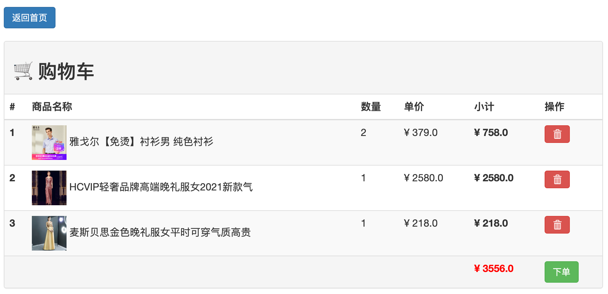
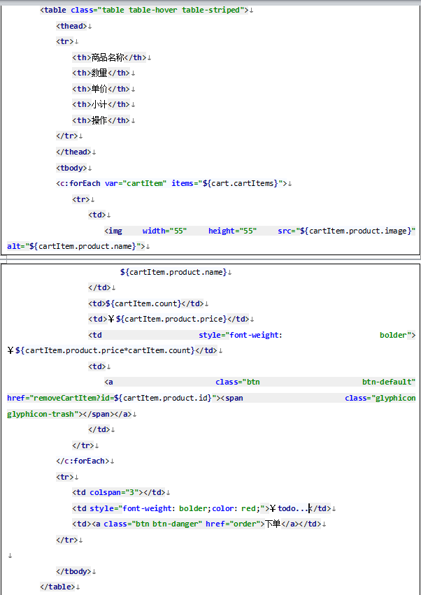

# Note 8. 🛒 购物车模块

-   cart
    -   cartList
        -   cartItem 1
            -   product
            -   quantity / count / number
        -   cartItem 2
        -   ...

## 1. 新建购物项实体类 `CartItem`

```java title="src/cn/network/shop/cart/CartItem.java" linenums="1"
package cn.network.shop.cart;

import cn.network.shop.product.Product;

public class CartItem {
    private Product product;  // 商品对象
    private int quantity;     // 商品数量

    // 无参构造函数
    public CartItem() {
    }

    // 带参数的构造函数，用于初始化 CartItem 对象
    public CartItem(Product product, int quantity) {
        this.product = product;    // 初始化商品对象
        this.quantity = quantity;  // 初始化商品数量
    }

    // 获取商品对象
    public Product getProduct() {
        return product;
    }

    // 设置商品对象
    public void setProduct(Product product) {
        this.product = product;
    }

    // 获取商品数量
    public int getQuantity() {
        return quantity;
    }

    // 设置商品数量
    public void setQuantity(int quantity) {
        this.quantity = quantity;
    }
}

```

## 2. 新建购物车类 `Cart`

```java title="src/cn/network/shop/cart/Cart.java" linenums="1"
package cn.network.shop.cart;

import java.util.ArrayList;
import java.util.List;

public class Cart {
    private List<CartItem> cartItems;  // 购物车中的商品项列表

    // 获取购物车中的商品项列表
    public List<CartItem> getCartItems() {
        return cartItems;
    }

    // 设置购物车中的商品项列表
    public void setCartItems(List<CartItem> cartItems) {
        this.cartItems = cartItems;
    }

    /**
     * 向购物车添加商品项。
     * Add a new cart item to the shopping cart.
     *
     * @param newCartItem 要添加的新商品项
     */
    public void add(CartItem newCartItem) {
        if (cartItems == null) {
            cartItems = new ArrayList<>();
        }

        // 遍历购物车中的商品项
        for (CartItem oldCartItem : cartItems) {
            // 检查是否已经存在相同的商品
            if (newCartItem.getProduct().getId() == oldCartItem.getProduct().getId()) {
                // 如果存在相同的商品，增加其数量
                oldCartItem.setQuantity(oldCartItem.getQuantity() + 1);
                return;
            }
        }

        // 如果购物车中没有相同的商品，将新商品项添加到购物车
        cartItems.add(newCartItem);
    }


    /**
     * 从购物车中移除指定商品ID的商品项。
     * Remove the cart item with the specified product ID from the cart.
     *
     * @param productId 要移除的商品的ID
     */
    public void remove(int productId) {
        // 使用迭代器遍历购物车中的商品项

        // 使用迭代器的remove方法移除元素
        cartItems.removeIf(cartItem -> cartItem.getProduct().getId() == productId);
    }

    /**
     * 计算购物车中所有商品项的总价格。
     * Calculate the total price of all cart items in the cart.
     *
     * @return totalPrice 购物车中商品的总价格
     */
    public double getTotalPrice() {
        double totalPrice = 0;

        // 遍历购物车中的每个商品项并计算总价格
        for (CartItem item : cartItems) {
            int quantity = item.getQuantity();
            double itemPrice = item.getProduct().getPrice();
            totalPrice += (quantity * itemPrice);
        }
        return totalPrice;
    }
}

```

## 3. 新建处理“添加购物项”请求的 Servlet

```java title="src/cn/network/shop/cart/ServletAddCartItem.java" linenums="1"
package cn.network.shop.cart;

import cn.network.shop.product.Product;
import cn.network.shop.product.ProductService;

import javax.servlet.ServletException;
import javax.servlet.annotation.WebServlet;
import javax.servlet.http.HttpServlet;
import javax.servlet.http.HttpServletRequest;
import javax.servlet.http.HttpServletResponse;
import javax.servlet.http.HttpSession;
import java.io.IOException;
import java.util.logging.Logger;

@WebServlet(name = "ServletAddCartItem", value = "/addCartItem")
public class ServletAddCartItem extends HttpServlet {
    protected void doGet(HttpServletRequest request, HttpServletResponse response) throws ServletException, IOException {
        try {
            // 1. 获取请求中的商品ID
            String productIdStr = request.getParameter("productId");
            int productId = Integer.parseInt(productIdStr);

            // 2. 根据商品ID从 ProductService 获取商品对象
            Product product = ProductService.getProductById(productId);

            if (product == null) {
                // 处理商品不存在的情况
                throw new Exception("未找到对应的商品");
            }

            // 3. 创建购物项对象并设置数量
            CartItem cartItem = new CartItem(product, 1);

            // 4. 获取或创建购物车对象，并将购物项添加到购物车中
            HttpSession session = request.getSession();
            Cart cart = (Cart) session.getAttribute("cart");

            if (cart == null) {
                cart = new Cart();
            }

            cart.add(cartItem);

            // 5. 将购物车对象存入 session
            session.setAttribute("cart", cart);

            // 6. 重定向到 `cart.jsp` 页面
            response.sendRedirect("cart.jsp");
        } catch (Exception e) {
            Logger.getLogger(ServletAddCartItem.class.getName()).severe("Error in adding item to cart: " + e.getMessage());
            // response.sendRedirect("error.jsp");
        }
    }
}

```

```java title="src/cn/network/shop/product/ProductService.java" linenums="1"
/**
 * 根据商品ID获取商品信息。
 * Retrieve product information based on its ID.
 *
 * @param productId 商品ID
 * @return 商品对象，如果未找到则返回 null。
 * A product object, or null if the product is not found.
 */
public static Product getProductById(int productId) {
    Product product = null;  // 初始化商品对象
    Connection connection = null;  // 数据库连接
    ResultSet resultSet = null;  // 查询结果集
    Statement statement = null;  // SQL语句执行对象

    try {
        // 1. 建立数据库连接
        connection = DB.getConnection();

        // 2. 创建SQL查询语句
        String sql = "SELECT c.id as cid, c.name as cname, p.id as pid, p.name as pname, price, image FROM category c JOIN product p ON c.id = p.categoryid WHERE p.id = " + productId;

        // 3. 执行SQL查询
        statement = connection.createStatement();
        resultSet = statement.executeQuery(sql);

        // 4. 遍历查询结果
        if (resultSet.next()) {
            // 4.1 创建分类对象并填充数据
            Category category = new Category();
            category.setId(resultSet.getInt("cid"));
            category.setName(resultSet.getString("cname"));

            // 4.2 创建商品对象并填充数据
            product = new Product();  // 初始化商品对象
            product.setId(resultSet.getInt("pid"));
            product.setName(resultSet.getString("pname"));
            product.setPrice(resultSet.getDouble("price"));
            product.setImage(resultSet.getString("image"));
            product.setCategory(category);
        }
    } catch (Exception e) {
        Logger.getLogger(ProductService.class.getName()).severe("Error in getProductById: " + e.getMessage());
    } finally {
        // 5. 释放数据库资源
        closeResources(resultSet, statement, connection);
    }

    return product;
}
```

## 4. 新建购物车页面

-   购物车界面设计：table
    -   <https://getbootstrap.com/docs/3.4/css/#tables>
    -   <https://getbootstrap.com/docs/3.4/components/#panels-tables>
-   购物车数据存储：session



### 界面设计参考：表格



```jsp title="web/cart.jsp" linenums="1"
<%--
  Created by IntelliJ IDEA.
  User: abotw
  Date: 2023/11/6
  Time: 08:57
  To change this template use File | Settings | File Templates.
--%>
<%@ page contentType="text/html;charset=UTF-8" language="java" %>
<%@ taglib prefix="c" uri="http://java.sun.com/jsp/jstl/core" %>
<html>
<head>
    <title>🛒 我的购物车</title>
    <!-- Set the viewport meta tag to ensure proper scaling on mobile devices -->
    <meta name="viewport" content="width=device-width, initial-scale=1.0">
    <!-- Link to the Bootstrap CSS stylesheet -->
    <link href="bootstrap/css/bootstrap.min.css" rel="stylesheet">
    <!-- Include jQuery library from a content delivery network (CDN) -->
    <script src="https://cdn.staticfile.org/jquery/2.1.1/jquery.min.js"></script>
    <!-- Include Bootstrap JavaScript library -->
    <script src="bootstrap/js/bootstrap.min.js"></script>
</head>
<body>

<div class="row">
    &nbsp;
</div>

<div class="row">
    <div class="col-md-2"></div>
    <div class="col-md-8">
        <a href="index.jsp" class="btn btn-primary" role="button">返回首页</a>
    </div>
    <div class="col-md-2"></div>
</div>

<div class="row">
    &nbsp;
</div>

<div class="row">
    <div class="col-md-2"></div>
    <div class="col-md-8">
        <!-- 显示成功删除消息 -->
        <c:if test="${deleteSuccess == true}">
            <div class="alert alert-success">成功删除购物项！</div>
            <%-- 重置 deleteSuccess 为 false，以便下次进入页面时消息不再显示 --%>
            <c:set var="deleteSuccess" value="false" scope="session" />
        </c:if>
        <c:choose>
            <c:when test="${empty cart.cartItems}">
                <div class="alert alert-info">购物车为空，请添加一些商品 : )</div>
            </c:when>
            <c:otherwise>
                <!-- 开始：购物车 -->
                <div class="panel panel-default">
                    <!-- Default panel contents -->
                    <div class="panel-heading">
                        <h2>🛒 购物车</h2>
                    </div>

                    <!-- Table -->
                    <table class="table table-striped table-hover">
                        <thead>
                        <tr>
                            <th xt-marked="ok">#</th>
                            <th xt-marked="ok">商品名称</th>
                            <th xt-marked="ok">数量</th>
                            <th xt-marked="ok">单价</th>
                            <th xt-marked="ok">小计</th>
                            <th xt-marked="ok">操作</th>
                        </tr>
                        </thead>
                        <tbody>
                        <c:forEach var="cartItem" items="${cart.cartItems}" varStatus="status">
                            <tr>
                                <th scope="row" xt-marked="ok">${status.index + 1}</th>
                                <td xt-marked="ok">
                                    
                                        ${cartItem.product.name}
                                </td>
                                <td xt-marked="ok">${cartItem.quantity}</td>
                                <td xt-marked="ok">¥ ${cartItem.product.price}</td>
                                <td xt-marked="ok" style="font-weight: bold;">¥ ${cartItem.product.price * cartItem.quantity}</td>
                                <td xt-marked="ok">
                                    <a href="removeCartItem?productId=${cartItem.product.id}" class="btn btn-danger">
                                        <span class="glyphicon glyphicon-trash"></span>
                                    </a>
                                </td>
                            </tr>
                        </c:forEach>
                        <tr class="active">
                            <td colspan="4"></td>
                            <td style="color: red; font-weight: bold;">¥ ${cart.totalPrice}</td>
                            <td>
                                <a href="order" class="btn btn-success">下单</a>
                            </td>
                        </tr>
                        </tbody>
                    </table>
                </div>
                <!-- 结束：购物车 -->
            </c:otherwise>
        </c:choose>
    </div>
    <div class="col-md-2"></div>
</div>

</body>
</html>

```

## 5. 修改首页

### 5.1 商品列表卡片：添加“加入购物车”按钮

```html title="web/index.jsp" linenums="1"
<!-- 加入购物车按钮 -->
<a href="addCartItem?productId=${product.id}" class="btn btn-primary" role="button" target="cart">
    <span class="glyphicon glyphicon-shopping-cart"></span> 加入购物车
</a>
```

### 5.2 导航栏：用户下拉列表中添加“我的购物车”导航链接

```html title="web/index.jsp" linenums="1"
<!-- 导航：我的购物车 -->
<li>
    <a href="cart.jsp" target="cart">
        <span class="glyphicon glyphicon-shopping-cart"></span>
        我的购物车
    </a>
</li>
```

## 6. 新建处理“移除购物项”请求的 Servlet

```java title="src/cn/network/shop/cart/ServletRemoveCartItem.java" linenums="1"
package cn.network.shop.cart;

import javax.servlet.ServletException;
import javax.servlet.annotation.WebServlet;
import javax.servlet.http.HttpServlet;
import javax.servlet.http.HttpServletRequest;
import javax.servlet.http.HttpServletResponse;
import javax.servlet.http.HttpSession;
import java.io.IOException;
import java.util.logging.Logger;

@WebServlet(name = "ServletRemoveCartItem", value = "/removeCartItem")
public class ServletRemoveCartItem extends HttpServlet {
    protected void doGet(HttpServletRequest request, HttpServletResponse response) throws ServletException, IOException {
        try {
            // 1. 从 session 中获取购物车对象 cart
            HttpSession session = request.getSession();
            Cart cart = (Cart) session.getAttribute("cart");

            if (cart == null) {
                throw new Exception("购物车为空");
            }

            // 2. 获取请求中的商品ID
            String productIdStr = request.getParameter("productId");
            int productId = Integer.parseInt(productIdStr);

            // 3. 从购物车对象 cart 中移除指定商品
            cart.remove(productId);

            // 4. 将更新后的购物车对象重新存入 session
            session.setAttribute("cart", cart);

            // 5. 设置 deleteSuccess 属性以提示用户成功删除购物项
            session.setAttribute("deleteSuccess", true);

            // 6. 重定向到 `cart.jsp` 页面
            response.sendRedirect("cart.jsp");
        } catch (Exception e) {
            Logger.getLogger(ServletRemoveCartItem.class.getName()).severe("Error in removing cart item: " + e.getMessage());
            // response.sendRedirect("error.jsp");
        }
    }
}

```

-   Servlet 路径
-   Servlet 路由映射
-   Servlet 方法
    -   `doGet()`