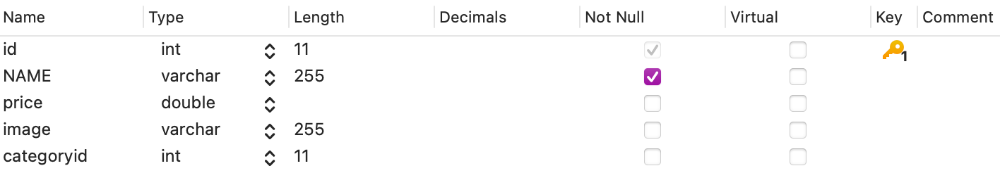

# Note 7. 商品模块-1

-   全部浏览
-   分类浏览
-   搜索浏览

## 1. 新建商品实体类 `Product`

对象关系映射（英语：Object Relational Mapping，简称ORM，或O/RM，或O/R mapping）。

### 1.1 数据表

**product@shop**




### 1.2 成员变量及其 getter & setter 方法

| 成员变量   | 数据类型        | 描述         |
| ---------- | --------------- | ------------ |
| `id`       | 整型            | 商品编号     |
| `name`     | 字符串          | 商品名称     |
| `price`    | 双精度          | 价格         |
| `image`    | 字符串          | 商品图片地址 |
| `category` | `Category` 类型 | 分类         |

### 1.3 代码实现

```java title="src/cn/network/shop/product/Product.java"
package cn.network.shop.product;

import cn.network.shop.category.Category;

/**
 * 商品实体模型，用于表示商城中的商品信息。
 * This class represents a product in the online shop.
 *
 * @author Monty
 * @version 1.0
 * @since 2023-10-30
 */
public class Product {
    private int id;             // 商品编号 (Product ID)
    private String name;        // 商品名称 (Product Name)
    private double price;       // 价格 (Price)
    private String image;       // 商品图片地址 (Image URL)
    private Category category;  // 分类 (Category)

    // 获取商品编号
    public int getId() {
        return id;
    }

    // 设置商品编号
    public void setId(int id) {
        this.id = id;
    }

    // 获取商品名称
    public String getName() {
        return name;
    }

    // 设置商品名称
    public void setName(String name) {
        this.name = name;
    }

    // 获取商品价格
    public double getPrice() {
        return price;
    }

    // 设置商品价格
    public void setPrice(double price) {
        this.price = price;
    }

    // 获取商品图片地址
    public String getImage() {
        return image;
    }

    // 设置商品图片地址
    public void setImage(String image) {
        this.image = image;
    }

    // 获取商品分类
    public Category getCategory() {
        return category;
    }

    // 设置商品分类
    public void setCategory(Category category) {
        this.category = category;
    }
}

```

## 2. 新建商品业务类 `ProductService`

*DAO*（Data Access Object）

### 2.1 方法一览

```java
/**
 * 获取所有商品信息。
 * Retrieve all product information.
 *
 * @return 包含商品对象的列表，如果没有商品则返回 null。
 * A list containing product objects, or null if no products are found.
 */
public static List<Product> getProducts()
  
/**
 * 关闭数据库连接和资源。
 * Close the database connection and resources.
 *
 * @param resultSet  ResultSet to be closed
 * @param statement  Statement to be closed
 * @param connection Connection to be closed
 */
private static void closeResources(ResultSet resultSet, Statement statement, Connection connection)

/**
 * 获取指定分类下的商品信息。
 * Retrieve product information for a specific category.
 *
 * @param categoryid 分类的ID
 * @return 包含商品对象的列表，如果没有商品则返回 null。
 * A list containing product objects, or null if no products are found.
 */
public static List<Product> getProducts(int categoryid)
```

### 2.3 代码实现

```java title="src/cn/network/shop/product/ProductService.java"
package cn.network.shop.product;

import cn.network.shop.category.Category;
import cn.network.shop.util.DB;

import java.sql.Connection;
import java.sql.PreparedStatement;
import java.sql.ResultSet;
import java.sql.Statement;
import java.util.ArrayList;
import java.util.List;
import java.util.logging.Logger;

/**
 * 商品服务类，用于管理商品信息的数据库操作。
 * This class provides services to manage product information in the database.
 *
 * @author Monty
 * @version 1.0
 * @since 2023-10-30
 */
public class ProductService {
    /**
     * 获取所有商品信息。
     * Retrieve all product information.
     *
     * @return 包含商品对象的列表，如果没有商品则返回 null。
     * A list containing product objects, or null if no products are found.
     */
    public static List<Product> getProducts() {
        List<Product> products = null;
        Connection connection = null;
        ResultSet resultSet = null;
        Statement statement = null;

        try {
            // 1. 建立数据库连接
            connection = DB.getConnection();

            // 2. 创建SQL查询语句
            String sql = "SELECT c.id as cid, c.name as cname, p.id as pid, p.name as pname, price, image FROM category c JOIN product p ON c.id = p.categoryid";
            statement = connection.createStatement();

            // 3. 执行SQL查询
            resultSet = statement.executeQuery(sql);

            // 4. 遍历查询结果
            while (resultSet.next()) {
                // 4.0 初始化商品列表
                if (products == null) {
                    products = new ArrayList<>();
                }

                // 4.1 创建分类对象并填充数据
                Category category = new Category();
                category.setId(resultSet.getInt("cid"));
                category.setName(resultSet.getString("cname"));

                // 4.2 创建商品对象并填充数据
                Product product = new Product();
                product.setId(resultSet.getInt("pid"));
                product.setName(resultSet.getString("pname"));
                product.setPrice(resultSet.getDouble("price"));
                product.setImage(resultSet.getString("image"));
                product.setCategory(category);

                // 4.3 添加到商品列表
                products.add(product);
            }
        } catch (Exception e) {
            Logger.getLogger(ProductService.class.getName()).severe("Error in getProducts: " + e.getMessage());
        } finally {
            // 5. 释放数据库资源
            closeResources(resultSet, statement, connection);
        }
        return products;
    }

    /**
     * 关闭数据库连接和资源。
     * Close the database connection and resources.
     *
     * @param resultSet  ResultSet to be closed
     * @param statement  Statement to be closed
     * @param connection Connection to be closed
     */
    private static void closeResources(ResultSet resultSet, Statement statement, Connection connection) {
        try {
            if (resultSet != null) {
                resultSet.close();
            }
            if (statement != null) {
                statement.close();
            }
            if (connection != null) {
                connection.close();
            }
        } catch (Exception e) {
            Logger.getLogger(ProductService.class.getName()).severe("Error while closing resources: " + e.getMessage());
        }
    }
}

```

## 3. 修改首页商品模块

**商品列表效果图**


### 3.1 获取商品列表并存储在请求属性中

```jsp title="web/index.jsp"
<%-- 开始：获取商品列表并存储在请求属性中 --%>
<%
    try {
        // 调用 ProductService 类的 getProducts 方法获取商品列表
        List<Product> products = ProductService.getProducts();

        // 将商品列表存储在请求属性中，以便在页面中访问
        request.setAttribute("products", products);
    } catch (Exception e) {
        // 处理异常
        out.println("获取商品列表时出现错误：" + e.getMessage());
    }
%>
<%-- 结束：获取商品列表并存储在请求属性中 --%>
```

---

#### 补充：JSP

*Ref: <https://www.cheat-sheets.org/saved-copy/JSP%20Quick%20Reference%20Card.pdf>*

**Writing comments for the JSP**

A JSP comment is not output to the client as part of the JSP page's output. 

```jsp
<%-- Comment string... --%>
```

**scriptlet**

Contains a block of scripting code. A JSP page can contain multiple blocks of scripting code. 

```jsp
<% script code %>
```

Example: 

```jsp
<%
    String greeting = request.getParameter("Greeting");
    out.println(greeting);
%>
```

### 3.2 设计商品列表

```html title="web/index.jsp"
<!-- 开始：商品列表 -->
<div class="row product-container">
    <c:forEach var="product" items="${products}">
        <div class="col-sm-6 col-md-3">
            <div class="thumbnail">
                
                <div class="caption">
                    <h5 class="text-ellipsis">${product.name}</h5>
                    <p>¥ ${product.price}</p>
                    <p>
                        <!-- 加入购物车按钮 -->
                        <a href="#" class="btn btn-primary" role="button">
                            <span class="glyphicon glyphicon-shopping-cart"></span> 加入购物车
                        </a>
                    </p>
                </div>
            </div>
        </div>
    </c:forEach>
</div>
<!-- 结束：商品列表 -->
```

### 3.3 设计商品列表样式

```css
/* 商品模块 */

/* 商品 & 搜索容器 */
.main-container {
    width: 1000px;
    margin: 20px auto;
}

/* 商品卡片价格 */
.price {
    color: red;
    font-weight: bold;
}

/* 文本溢出省略号 */
.text-ellipsis {
    white-space: nowrap; /* 防止文本换行 */
    overflow: hidden; /* 隐藏超出容器的文本 */
    text-overflow: ellipsis; /* 显示省略号以表示截断文本 */
}
```

## 4. 新建处理分类浏览

### 4.1 商品分类查询服务

```java title="src/cn/network/shop/product/ProductService.java"
/**
 * 获取指定分类下的商品信息。
 * Retrieve product information for a specific category.
 *
 * @param categoryid 分类的ID
 * @return 包含商品对象的列表，如果没有商品则返回 null。
 * A list containing product objects, or null if no products are found.
 */
public static List<Product> getProducts(int categoryid) {
    List<Product> products = null;
    Connection connection = null;
    ResultSet resultSet = null;
    PreparedStatement preparedStatement = null;

    try {
        // 1. 建立数据库连接
        connection = DB.getConnection();

        // 2. 创建SQL查询语句，使用参数化查询以避免SQL注入
        String sql = "SELECT c.id as cid, c.name as cname, p.id as pid, p.name as pname, price, image FROM category c JOIN product p ON c.id = p.categoryid WHERE c.id = ?";
        preparedStatement = connection.prepareStatement(sql);
        preparedStatement.setInt(1, categoryid);

        // 3. 执行SQL查询
        resultSet = preparedStatement.executeQuery();

        // 4. 遍历查询结果
        while (resultSet.next()) {
            // 4.0 初始化商品列表
            if (products == null) {
                products = new ArrayList<>();
            }

            // 4.1 创建分类对象并填充数据
            Category category = new Category();
            category.setId(resultSet.getInt("cid"));
            category.setName(resultSet.getString("cname"));

            // 4.2 创建商品对象并填充数据
            Product product = new Product();
            product.setId(resultSet.getInt("pid"));
            product.setName(resultSet.getString("pname"));
            product.setPrice(resultSet.getDouble("price"));
            product.setImage(resultSet.getString("image"));
            product.setCategory(category);

            // 4.3 添加到商品列表
            products.add(product);
        }
    } catch (Exception e) {
        Logger.getLogger(ProductService.class.getName()).severe("Error in getProducts: " + e.getMessage());
    } finally {
        // 5. 释放数据库资源
        closeResources(resultSet, preparedStatement, connection);
    }
    return products;
}
```

### 4.2 Servlet

```java title="src/cn/network/shop/product/ServletGetProductsByCategoryId.java"
package cn.network.shop.product;

import java.io.IOException;
import java.util.List;

// 使用Servlet注解定义一个名为ServletGetProductsByCategoryId的Servlet，映射到URL路径"/getProductsByCategoryId"
@javax.servlet.annotation.WebServlet(name = "ServletGetProductsByCategoryId", value = "/getProductsByCategoryId")
public class ServletGetProductsByCategoryId extends javax.servlet.http.HttpServlet {

    // 处理HTTP POST请求的方法
    protected void doPost(javax.servlet.http.HttpServletRequest request, javax.servlet.http.HttpServletResponse response) throws javax.servlet.ServletException, IOException {
    }

    // 处理HTTP GET请求的方法
    protected void doGet(javax.servlet.http.HttpServletRequest request, javax.servlet.http.HttpServletResponse response) throws javax.servlet.ServletException, IOException {
        // 从请求中获取名为"categoryId"的参数，该参数用于指定商品分类的ID
        String categoryId = request.getParameter("categoryId");

        // 使用 ProductService 类的 getProducts 方法获取指定分类ID下的商品列表
        List<Product> products = ProductService.getProducts(Integer.parseInt(categoryId));

        // 将获取到的商品列表存储在请求属性中，以便在首页访问
        request.setAttribute("products", products);

        // 将请求转发到首页，以便显示商品列表
        request.getRequestDispatcher("index.jsp").forward(request, response);
    }
}

```

### 4.3 更新商品列表的获取逻辑

```jsp
<%-- 开始：获取商品列表并存储在请求属性中 --%>
<%
    try {
        // 从请求属性中获取商品列表
        Object oProducts = request.getAttribute("products");
        // 判断请求属性中是否已经存在商品列表，若不存在则获取默认全部商品列表
        if (oProducts == null) {
            // 调用 ProductService 类的 getProducts 方法获取商品列表
            List<Product> products = ProductService.getProducts();
            // 将商品列表存储在请求属性中，以便在页面中访问
            request.setAttribute("products", products);
        }
    } catch (Exception e) {
        // 处理异常
        out.println("获取商品列表时出现错误：" + e.getMessage());
    }
%>
<%-- 结束：获取商品列表并存储在请求属性中 --%>
```

## 5. 商品搜索功能

### 5.1 设计搜索框

```html title="web/index.jsp"
<!-- 开始：搜索 -->
<form action="search" method="post">
    <div class="row main-container">
        <div class="col-lg-6">
            <div class="input-group">
                <input type="text" name="productName" class="form-control" placeholder="请输入商品名称...">
                <span class="input-group-btn">
        <button class="btn btn-success" type="submit"><span class="glyphicon glyphicon-search"></span> 搜索</button>
      </span>
            </div><!-- /input-group -->
        </div><!-- /.col-lg-6 -->
    </div><!-- /.row -->
</form>
<!-- 开始：搜索 -->
```

### 5.2 模糊查询服务

```java title="src/cn/network/shop/product/ProductService.java"
/**
 * 根据商品名称模糊查询商品。
 * Retrieve products based on a partial product name.
 *
 * @param productName 商品名称的部分匹配字符串
 * @return 包含商品对象的列表，如果没有匹配的商品则返回 null。
 * A list containing product objects, or null if no matching products are found.
 */
public static List<Product> getProducts(String productName) {
    List<Product> products = null;
    Connection connection = null;
    ResultSet resultSet = null;
    PreparedStatement preparedStatement = null;

    try {
        // 1. 建立数据库连接
        connection = DB.getConnection();

        // 2. 创建SQL查询语句，使用参数化查询以避免SQL注入
        String sql = "SELECT c.id as cid, c.name as cname, p.id as pid, p.name as pname, price, image FROM category c JOIN product p ON c.id = p.categoryid WHERE p.name LIKE ?";
        preparedStatement = connection.prepareStatement(sql);
        preparedStatement.setString(1, "%" + productName + "%");

        // 3. 执行SQL查询
        resultSet = preparedStatement.executeQuery();

        // 4. 遍历查询结果
        while (resultSet.next()) {
            // 4.0 初始化商品列表
            if (products == null) {
                products = new ArrayList<>();
            }

            // 4.1 创建分类对象并填充数据
            Category category = new Category();
            category.setId(resultSet.getInt("cid"));
            category.setName(resultSet.getString("cname"));

            // 4.2 创建商品对象并填充数据
            Product product = new Product();
            product.setId(resultSet.getInt("pid"));
            product.setName(resultSet.getString("pname"));
            product.setPrice(resultSet.getDouble("price"));
            product.setImage(resultSet.getString("image"));
            product.setCategory(category);

            // 4.3 添加到商品列表
            products.add(product);
        }
    } catch (Exception e) {
        Logger.getLogger(ProductService.class.getName()).severe("Error in getProducts: " + e.getMessage());
    } finally {
        // 5. 释放数据库资源
        closeResources(resultSet, preparedStatement, connection);
    }
    return products;
}

```

### 5.3 Servlet

```java title="src/cn/network/shop/product/ServletGetProductsByName.java"
package cn.network.shop.product;

import java.io.IOException;
import java.util.List;

// 使用Servlet注解定义一个名为ServletGetProductsByName的Servlet，映射到URL路径"/search"
@javax.servlet.annotation.WebServlet(name = "ServletGetProductsByName", value = "/search")
public class ServletGetProductsByName extends javax.servlet.http.HttpServlet {

    // 处理HTTP POST请求的方法
    protected void doPost(javax.servlet.http.HttpServletRequest request, javax.servlet.http.HttpServletResponse response) throws javax.servlet.ServletException, IOException {
        request.setCharacterEncoding("utf8");

        // 从请求中获取名为"productName"的参数，该参数用于指定商品名称
        String productName = request.getParameter("productName");

        // 使用 ProductService 类的 getProducts 方法获取指定商品名称下的商品列表
        List<Product> products = ProductService.getProducts(productName);

        // 将获取到的商品列表存储在请求属性中，以便在首页访问
        request.setAttribute("products", products);

        // 将请求转发到首页，以便显示商品列表
        request.getRequestDispatcher("index.jsp").forward(request, response);
    }

    // 处理HTTP GET请求的方法
    protected void doGet(javax.servlet.http.HttpServletRequest request, javax.servlet.http.HttpServletResponse response) throws javax.servlet.ServletException, IOException {
    }
}

```

