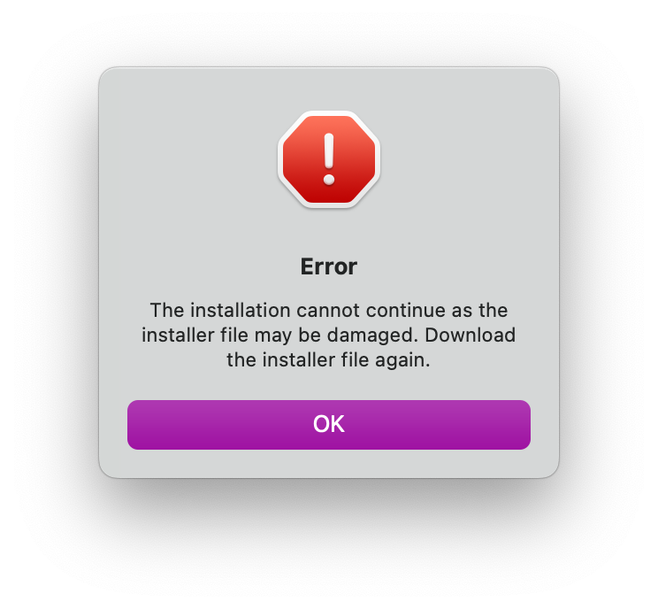
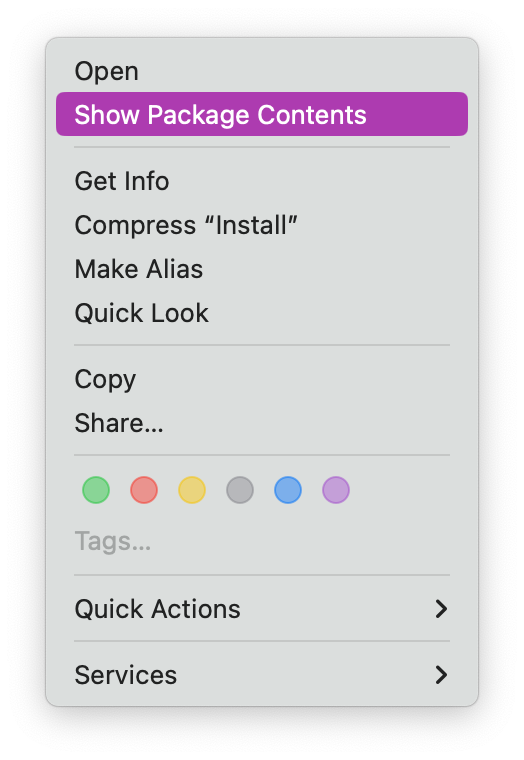
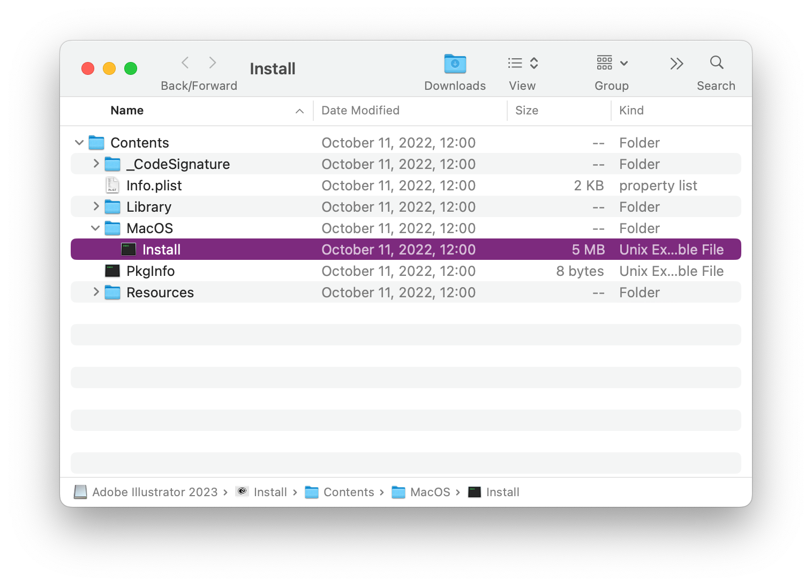
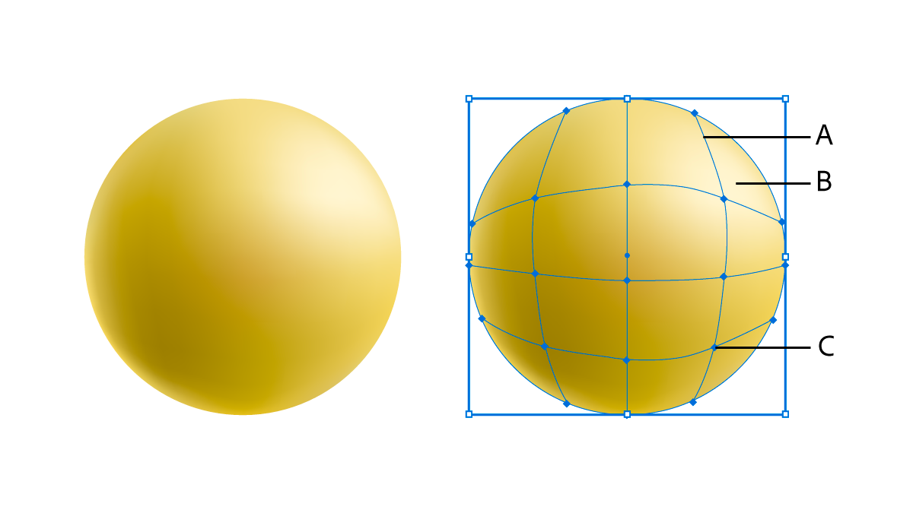

# Ai

## 0. 下载安装

-   *参考：[Adobe Illustrator 2023 永久啟用 Win/Mac 免費下載安裝完整教學](https://crackedresource.com/illustrator-2023/)*
-   下载地址：<https://crackedresource.com/illustrator-2023/#download>
-   解压密码：`@crackedresource1111`

### 0.1 注意事项

⚠️ 在安装过程中如果出现如下警告：

```
Error

The installation cannot continue as the installer file may be damaged.
Download the installer file again.
```

{ width="300" }

则应该右键选择 Show Package Contens -> 使用 `/Volumes/Adobe Illustrator 2023/Install.app/Contents/MacOS/Install` 安装脚本进行安装。

{ width="300" }



## 1. illustrator User Guide

https://helpx.adobe.com/mena_en/illustrator/user-guide.html

### 1.1 Get to know illustrator

#### 1.1.1 Tools in illustrator

0.   tools at a glance
1.   select tools
2.   navigate tools
3.   paint tools
4.   text tools
5.   draw tools
6.   modify tools

Mesh

https://helpx.adobe.com/illustrator/using/meshes.html



**A.** Mesh line **B.** Mesh patch **C.** Mesh point

## Ref

-   https://guides.himmelfarb.gwu.edu/illustrator
-   https://guides.ou.edu/adobe-illustrator-basics/home