# 01-英文信息处理 v0.1 230223

### 零、需求分析

#### 1. 查词

#### 2. 翻译

#### 3. 背词

### Quicklinks

* [Test Your Vocab](https://preply.com/en/learn/english/test-your-vocab)
* [Anki](https://apps.ankiweb.net/)
* [Vocabulary](https://www.vocabulary.com/learner/)

### 教程：通过配置“在线词典助手”和 Anki 来实现英文阅读工作流（查词、翻译、背词）

#### 0. 工具清单

* Chrome 浏览器
* Anki
* [在线词典助手 Online Dictionary Helper](https://chrome.google.com/webstore/detail/online-dictionary-helper/lppjdajkacanlmpbbcdkccjkdbpllajb) Chrome 扩展程序

#### 1. 下载 Anki 并添加 AnkiConnect

下载 Anki 并登录账号后，找到 `Tools => Add-ons` 并点击。

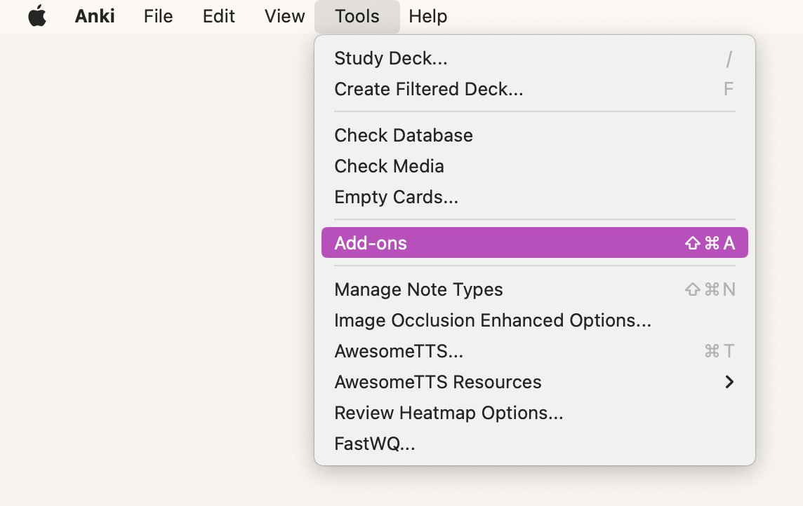

然后点击 `Get Add-ons` 。

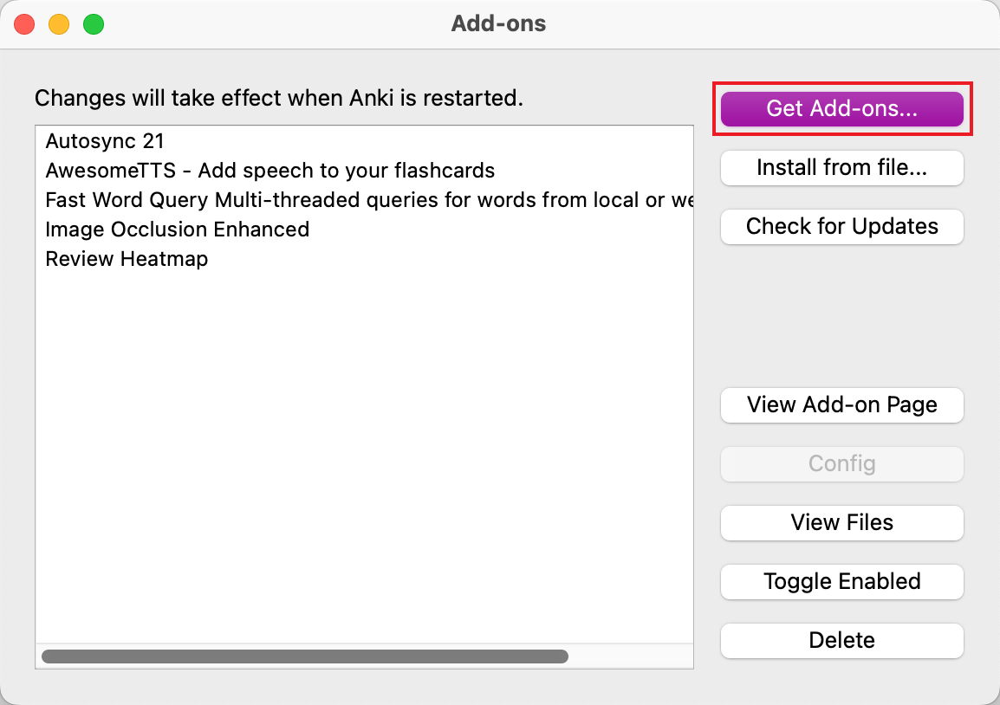

点击 `Browse Add-ons` 跳转到 ankiweb，然后找到 AnkiConnect 点击进入。

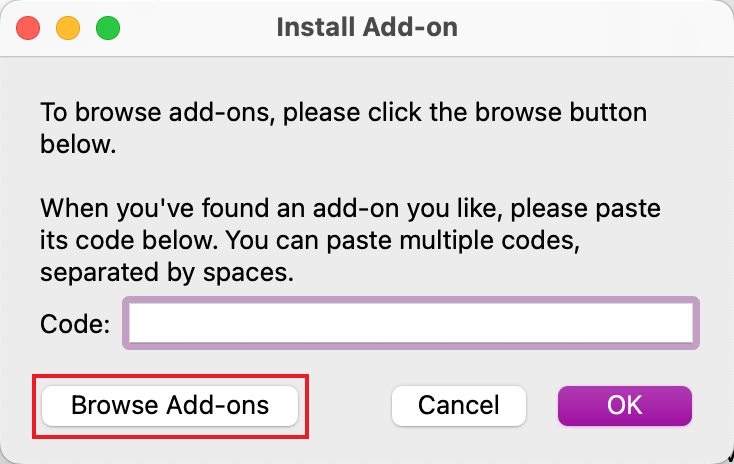

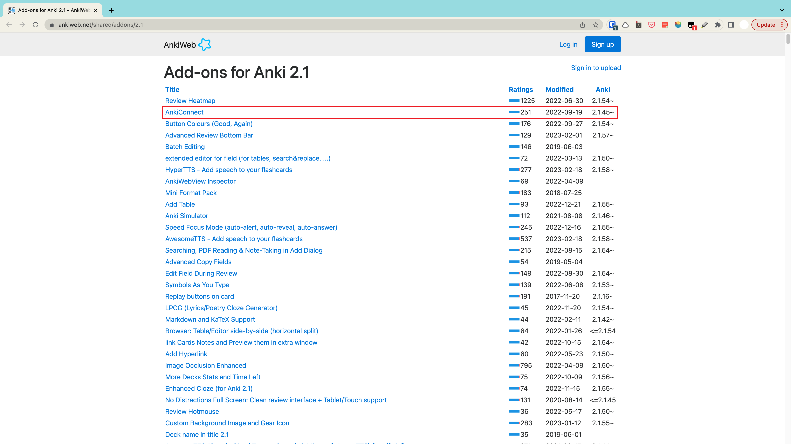

复制下图中的代码到刚才的 Code 输入框里，然后点击 OK 进行下载，下载完成后进行重启。

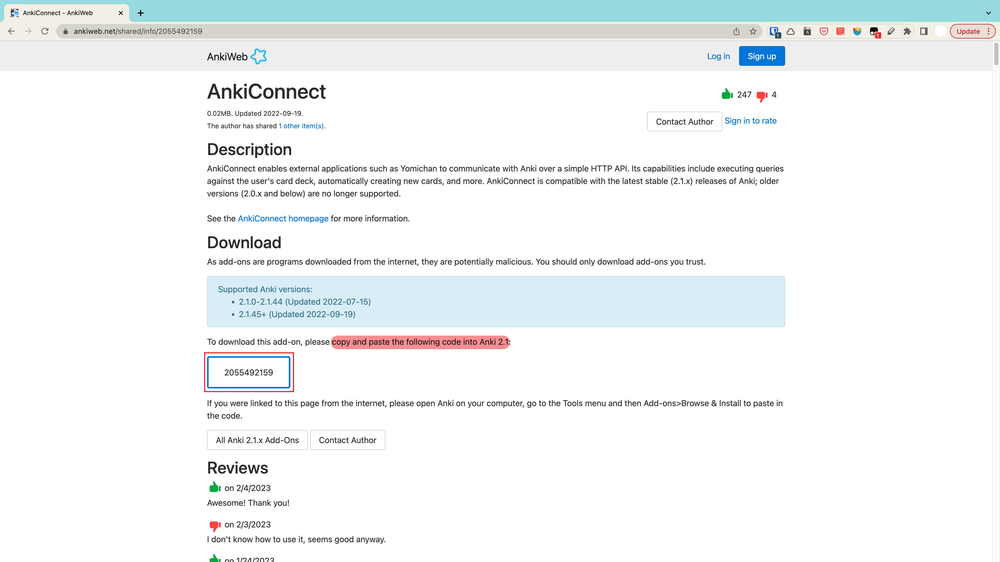

#### 2. 配置 Chrome 扩展程序 “在线词典助手”

访问 https://chrome.google.com/webstore/category/extensions 搜索并下载“在线词典助手”。

点击图中的三点图标，或者下载完成后会自动跳转到配置页面。

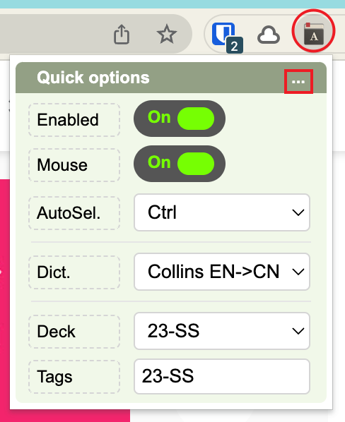

配置页面如下：

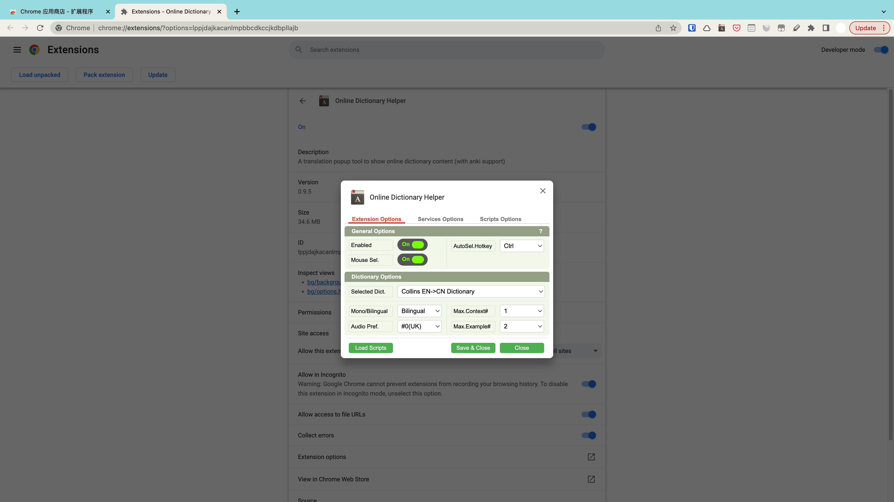

有三个选项卡需要配置，可参考图片：

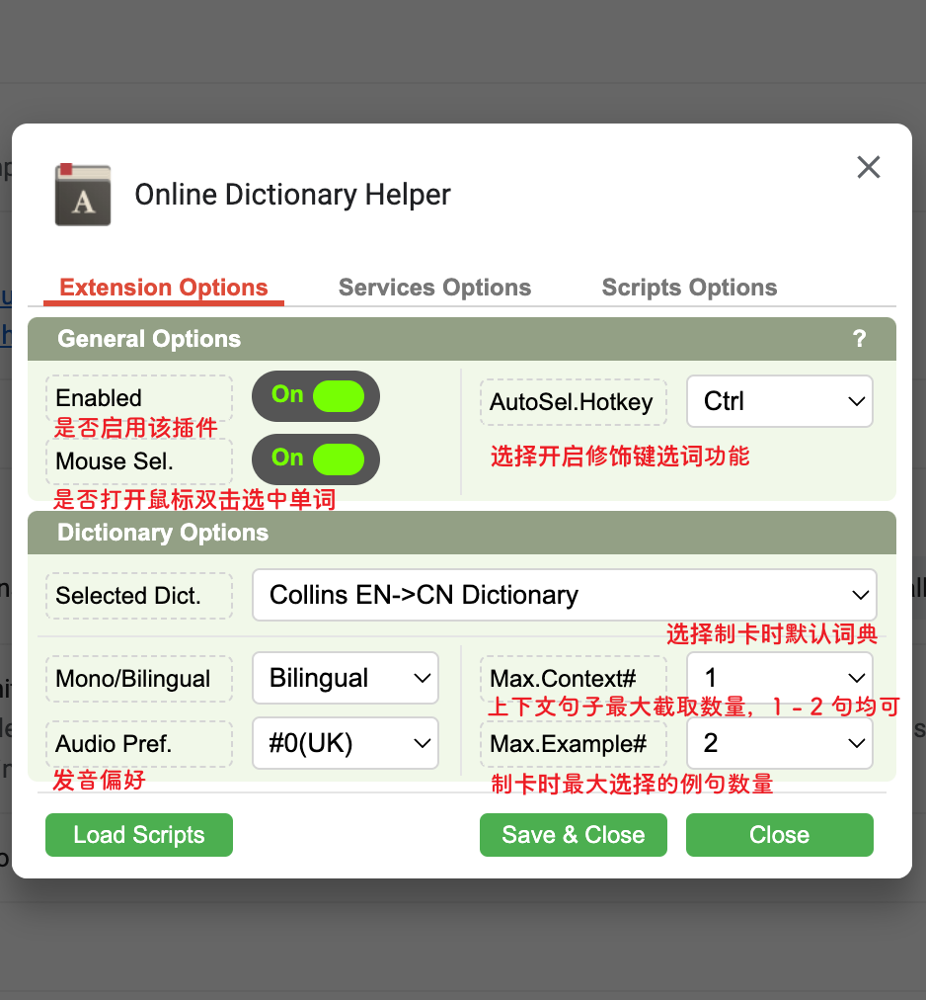

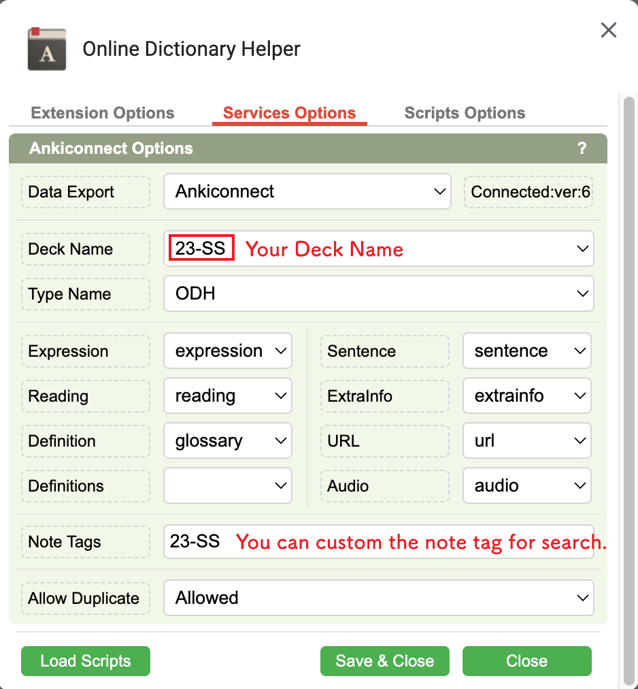

在下面这张选项卡中选择需要的词典，建议选择 encn_Collins。

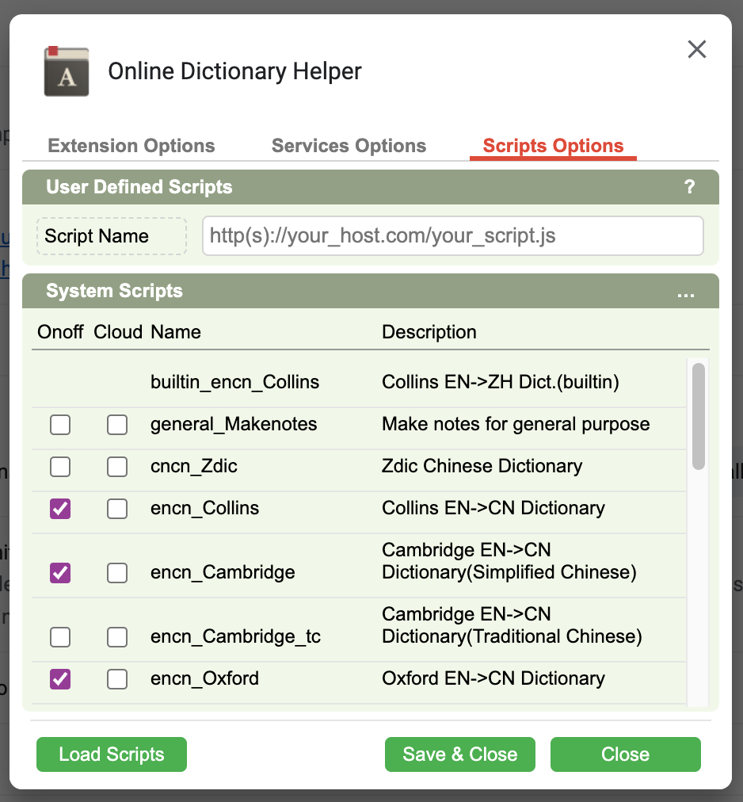

#### 3. 制卡

阅读选词：

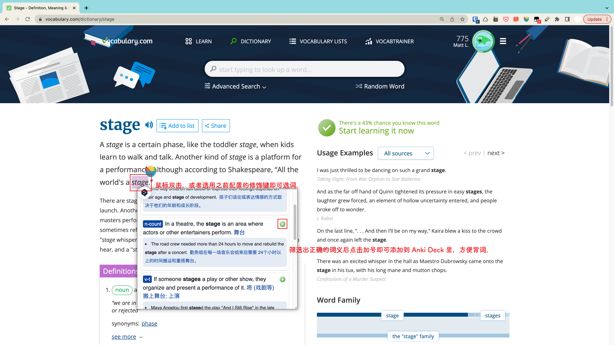

制卡：

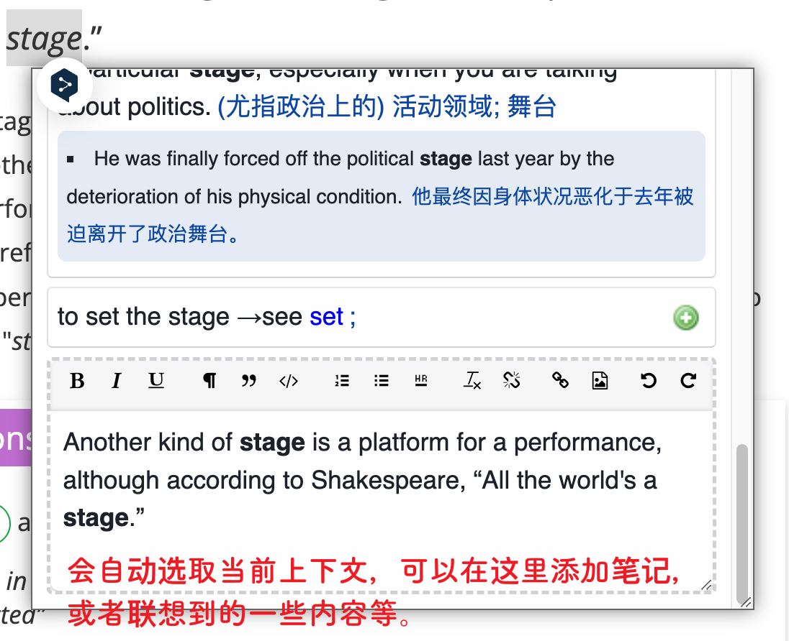

完结，撒花～🎉🎉🎉🎉